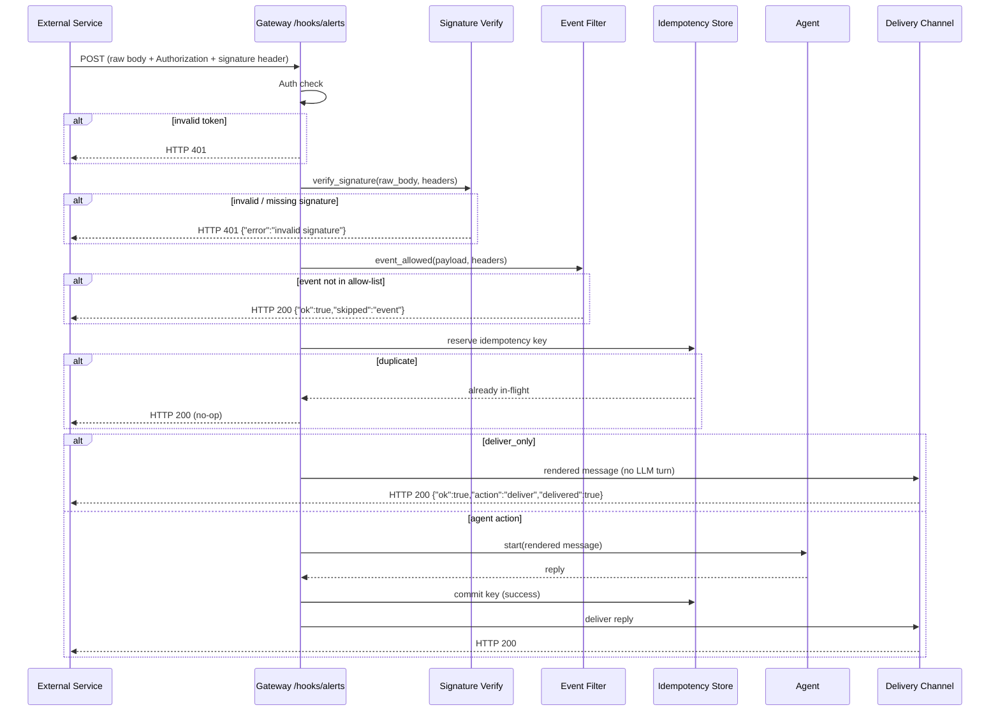
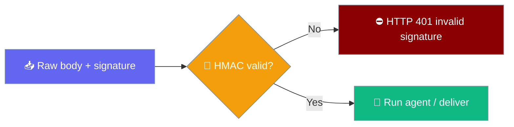

<Note>
The gateway now ships in the `praisonai-bot` package. `praisonai serve gateway` still works exactly as documented here; for a standalone install see [praisonai-bot Migration](/docs/guides/praisonai-bot-migration).
</Note>


Inbound hooks expose a `POST /hooks/<path>` endpoint on the gateway — point any external service (GitHub Actions, Linear, Gmail push, Sentry alerts) at it and the gateway runs an agent and delivers the reply to a configured channel.

```python
from praisonaiagents import Agent
from praisonai.gateway import Gateway

agent = Agent(name="triage", instructions="Triage inbound alerts and summarise the action needed.")
gw = Gateway(agents=[agent])
gw.register_hook({"path": "alerts", "agent": "triage", "auth": "my-shared-secret"})
gw.start()
```


The user POSTs JSON to `/hooks/<path>`; the gateway authenticates the payload, runs the mapped agent, and delivers the reply to the configured channel.


## Quick Start

<Steps>
<Step title="Define a hook and start the gateway">
```python
from praisonai.gateway import Gateway
from praisonaiagents import Agent

agent = Agent(
    name="triage",
    instructions="Triage the inbound alert and summarise the action needed."
)

gw = Gateway(agents=[agent])
gw.register_hook({
    "path": "alerts",
    "agent": "triage",
    "auth": "my-shared-secret",
    "deliver_to": "telegram:123456789",
    "message": "Alert from {{ payload.source }}: {{ payload.title }}",
})
gw.start()
```
</Step>

<Step title="Point your external service at the hook URL">
```bash
curl -X POST https://your-gateway/hooks/alerts \
  -H "Authorization: Bearer my-shared-secret" \
  -H "Content-Type: application/json" \
  -d '{"source": "Sentry", "title": "NullPointerException in prod"}'
```
</Step>

<Step title="The agent replies to Telegram automatically">
No polling, no webhook handler code — the gateway does it all.
</Step>
</Steps>

---

## How It Works



---

## Three Ways to Register a Hook

<Tabs>
<Tab title="Python">
```python
from praisonai.gateway import Gateway
from praisonaiagents import Agent

agent = Agent(
    name="email-triager",
    instructions="Triage the email and decide on an action."
)

gw = Gateway(agents=[agent])

gw.register_hook({
    "path": "gmail",
    "agent": "email-triager",
    "action": "agent",
    "auth": "shared-secret",
    "session_key": "hook:gmail:{from}",
    "idempotency_key": "{message_id}",
    "deliver_to": "telegram:123456789",
    "message": "New mail from {{ payload.from }}: {{ payload.subject }}",
})

gw.start()
```
</Tab>

<Tab title="YAML (gateway.yaml)">
```yaml
hooks:
  - path: gmail
    agent: email-triager
    action: agent
    auth: shared-secret
    session_key: "hook:gmail:{from}"
    idempotency_key: "{message_id}"
    deliver_to: telegram:123456789
    message: "New mail from {{ payload.from }}: {{ payload.subject }}"
```

Start the gateway pointing at the config:

```bash
praisonai gateway start --config gateway.yaml
```
</Tab>

<Tab title="CLI">
```bash
praisonai gateway hooks add \
  --path gmail \
  --agent email-triager \
  --deliver-to telegram:123456789 \
  --message "New mail from {from}: {subject}"

praisonai gateway hooks list

praisonai gateway hooks remove gmail
```
</Tab>
</Tabs>

---

## HookConfig Options

| Option | Type | Default | Description |
|---|---|---|---|
| `path` | `str` | required | URL segment after `/hooks/`. `"gmail"` exposes `POST /hooks/gmail`. Must be non-empty. |
| `agent` | `str` | `None` | Agent name/id to run. Falls back to the gateway's first registered agent. |
| `action` | `str` | `"agent"` | `"agent"` runs a new turn; `"wake"` nudges an existing session without a new message. |
| `auth` | `str` | `None` | Bearer token required on inbound requests. Falls back to the gateway's global `auth_token`. |
| `session_key` | `str` | `None` | Template for the session id, e.g. `"hook:gmail:{message_id}"`. Defaults to `"hook:{path}"`. |
| `idempotency_key` | `str` | `None` | Template for the dedup key. When unset, hashes the entire payload. |
| `deliver_to` | `str` | `None` | `platform:target` delivery spec, e.g. `"telegram:123456789"`. Omit to skip outbound delivery. |
| `message` | `str` | `None` | Template for the message built from the payload and sent to the agent. |
| `enabled` | `bool` | `True` | Whether the hook is active. `false` returns 404. |
| `metadata` | `dict` | `{}` | Free-form key/value pairs passed to the agent context. |
| `secret` | `str` | `None` | HMAC signing secret. When set, the gateway verifies the provider signature over the **raw** body before any agent runs and rejects (401) a missing/invalid signature — fail-closed. |
| `signature_header` | `str` | `None` | Header carrying the signature. Auto-defaults to `"X-Hub-Signature-256"` when `secret` is set with no explicit header. |
| `signature_algo` | `str` | `"sha256"` | Digest for the HMAC. Any name `hashlib.new` accepts (e.g. `"sha1"`, `"sha512"`). |
| `signature_prefix` | `str` | `None` | Optional signature prefix, e.g. `"sha256="`. |
| `events` | `list[str]` | `None` | Allow-list of event types. Unmatched deliveries are ack'd (200) with no LLM turn. A string is coerced to a single-element list. |
| `event_header` | `str` | `None` | Header carrying the event type, e.g. `"X-GitHub-Event"`. When omitted the event is read from the payload as a dotted path (defaulting to `"event"`). |
| `deliver_only` | `bool` | `False` | When `True` the rendered `message` **is** the delivered content, routed straight through `deliver_to` with **no LLM turn**. |

---

## Templating

Both `{{ payload.x }}` (Jinja-style) and `{x}` (format-string style) are accepted:

```yaml
message: "New mail from {{ payload.from }}: {{ payload.subject }}"
session_key: "hook:gmail:{message_id}"
```

Rules:
- The leading `payload.` is optional — `{{ payload.from }}` and `{from}` resolve identically.
- Missing keys render as empty strings — the template never raises on partial payloads.
- Single-pass substitution — a payload value containing `{...}` is never re-expanded (injection-safe).

---

## Actions

**`"agent"` (default)** — runs a full agent turn with the rendered message as the user input:

```yaml
action: agent
message: "Triage: {{ payload.title }}"
```

**`"wake"`** — nudges an existing session (triggers proactive delivery or a scheduled check-in) without injecting a new user message:

```yaml
action: wake
session_key: "daily:{{ payload.user_id }}"
```

---

## Idempotency & Retries

The gateway deduplicates concurrent and retried deliveries:

1. When `idempotency_key` is set, the key is rendered from the payload and hashed as `SHA-256(path + "\x00" + rendered_key)`.
2. When unset, the entire payload is JSON-canonicalized and hashed.
3. The key is **reserved in-flight** atomically — concurrent identical POSTs dedup across the await boundary.
4. The key is **committed only after a successful agent run** — transient failures remain retryable.

<Note>
External services that retry on timeout (e.g. GitHub webhooks, Linear) are safe to point directly at inbound hooks without additional dedup logic on your side.
</Note>

---

## Security

<Warning>
`Authorization: Bearer <token>` is the only accepted form. The `?token=` query-parameter path was removed because it leaks the shared secret into access logs.
</Warning>

| Behaviour | Detail |
|---|---|
| Auth required | 401 on missing or invalid `Authorization: Bearer` header |
| Per-hook auth | `auth` field on the hook overrides the gateway's global `auth_token` |
| Malformed JSON | 400 response, no agent run |
| Missing agent | 500 when the hook names an agent that isn't registered (no silent fallback to another agent) |
| Disabled hook | 404 when `enabled: false` |

---

## Verifying Provider Signatures (HMAC)

Set `secret` to have the gateway verify the provider's HMAC signature over the raw request body — a missing or invalid signature is rejected with `401` before any agent runs.



Verification is **fail-closed** and **opt-in**: with no `secret` set, nothing changes. When `secret` is set without an explicit `signature_header`, the header defaults to `X-Hub-Signature-256` (the GitHub/webhook convention) so a bare `secret` is a working config, not a 401 trap.

<Tabs>
<Tab title="GitHub (Python)">
```python
from praisonaiagents import Agent
from praisonai.gateway import Gateway

triager = Agent(
    name="triager",
    instructions="Triage this GitHub issue and post a one-line action."
)

gw = Gateway(agents=[triager])
gw.register_hook({
    "path": "github",
    "agent": "triager",
    "secret": "${GITHUB_WEBHOOK_SECRET}",
    "signature_prefix": "sha256=",          # X-Hub-Signature-256 is auto-defaulted
    "deliver_to": "slack:#triage",
    "message": "New {{ payload.action }} on #{{ payload.issue.number }}: {{ payload.issue.title }}",
})
gw.start()
```
</Tab>

<Tab title="GitHub (YAML)">
```yaml
hooks:
  - path: github
    agent: triager
    secret: "${GITHUB_WEBHOOK_SECRET}"
    signature_prefix: "sha256="            # signature_header defaults to X-Hub-Signature-256
    deliver_to: "slack:#triage"
    message: "New {{ payload.action }} on #{{ payload.issue.number }}: {{ payload.issue.title }}"
```
</Tab>

<Tab title="Stripe (YAML)">
```yaml
hooks:
  - path: stripe
    agent: billing-support
    secret: "${STRIPE_WEBHOOK_SECRET}"
    signature_header: "Stripe-Signature"
    signature_algo: "sha256"
    deliver_to: "slack:#billing"
    message: "Stripe event {{ payload.type }} for {{ payload.data.object.customer }}"
```
</Tab>
</Tabs>

Test locally by signing the exact body you POST:

```bash
SECRET="my-signing-secret"
BODY='{"action":"opened","issue":{"number":42,"title":"Bug"}}'
SIG="sha256=$(printf '%s' "$BODY" | openssl dgst -sha256 -hmac "$SECRET" | sed 's/^.* //')"

curl -X POST http://localhost:8765/hooks/github \
  -H "Content-Type: application/json" \
  -H "X-Hub-Signature-256: $SIG" \
  -H "X-GitHub-Event: issues" \
  -d "$BODY"
```

<Warning>
The signature is computed over the **raw bytes** the provider signed. Do not re-serialize the payload before signing — sign the exact body you send.
</Warning>

---

## Event Filtering

Set `events` to an allow-list so only matching deliveries run a turn — everything else is a cheap `200 {"ok": true, "skipped": "event"}` with no LLM cost.

The event type is read from `event_header` (a request header) or, when that header is absent, from the payload as a dotted path (defaulting to `"event"`).

```yaml
hooks:
  - path: github
    agent: triager
    event_header: "X-GitHub-Event"
    events: ["issues.opened", "pull_request.opened"]
    deliver_to: "slack:#triage"
    message: "New {{ payload.action }} on #{{ payload.issue.number }}"
```

GitHub sends the base event (`issues`) in the header and the sub-type in the payload's `action`. A namespaced filter like `issues.opened` matches only when `action == "opened"` — **fail-closed**: a delivery that omits `action` is never admitted, so a bare `issues` event cannot slip through a filter that only allows `issues.opened`.

Read the event from a payload field instead of a header by pointing `event_header` at a dotted path:

```yaml
hooks:
  - path: stripe
    deliver_only: true
    deliver_to: "slack:#billing"
    event_header: "type"                    # read payload["type"]
    events: ["invoice.payment_failed"]
    message: "⚠️ Payment failed for {{ payload.data.object.customer }}"
```

---

## Deliver-Only Mode (no LLM turn)

Set `deliver_only: true` to route the rendered `message` straight to `deliver_to` — no agent, no LLM cost, sub-second forwarding.

```yaml
hooks:
  - path: sentry
    deliver_only: true
    deliver_to: "telegram:${OPS_CHAT_ID}"
    secret: "${SENTRY_WEBHOOK_SECRET}"
    signature_header: "Sentry-Signature"
    message: "🚨 {{ payload.project }}: {{ payload.event.title }}\n{{ payload.url }}"
```

```python
gw.register_hook({
    "path": "sentry",
    "deliver_only": True,                   # zero LLM cost, sub-second forwarding
    "deliver_to": "telegram:${OPS_CHAT_ID}",
    "secret": "${SENTRY_WEBHOOK_SECRET}",
    "signature_header": "Sentry-Signature",
    "signature_algo": "sha256",
    "message": "🚨 {{ payload.project }}: {{ payload.event.title }}\n{{ payload.url }}",
})
```

`deliver_only` composes with signature verification and event filtering and requires `deliver_to`. Response shapes:

| Outcome | Response |
|---|---|
| Delivered | `{"ok": true, "action": "deliver", "delivered": true}` |
| Empty rendered message | `{"ok": true, "action": "deliver", "delivered": false, "skipped": "empty message"}` |
| Missing `deliver_to` | `{"ok": false, "error": "deliver_only hook requires 'deliver_to'"}` |
| Delivery failed | `{"ok": false, "error": "hook delivery failed", "delivered": false}` |

<Tip>
Use `deliver_only` for notification forwarding — Sentry → Telegram, CI → Slack — where the payload already contains the exact text to send. No agent turn means zero LLM cost and near-instant delivery.
</Tip>

---

## End-to-End Example: Gmail → Triage Agent → Telegram

```yaml
hooks:
  - path: gmail
    agent: email-triager
    action: agent
    auth: ${GMAIL_HOOK_SECRET}
    session_key: "gmail:{message_id}"
    idempotency_key: "{message_id}"
    deliver_to: telegram:123456789
    message: |
      From: {{ payload.from }}
      Subject: {{ payload.subject }}
      Snippet: {{ payload.snippet }}
      
      Triage this email and suggest a one-line action.
```

1. Gmail push subscription fires `POST /hooks/gmail` with the email payload.
2. Gateway verifies the bearer token from `$GMAIL_HOOK_SECRET`.
3. Session key `gmail:<message_id>` scopes the conversation to this email thread.
4. The rendered message is sent to the `email-triager` agent.
5. The agent's reply is delivered to Telegram chat `123456789`.

---

## Best Practices

<AccordionGroup>
<Accordion title="Always set an idempotency_key for event-driven sources">
External webhooks retry on timeout. Without an `idempotency_key`, a slow agent run followed by a timeout retry will run the agent twice. Use a message or event id from the payload.
</Accordion>

<Accordion title="Use per-hook auth tokens, not the global token">
Set a distinct `auth` secret per hook so you can rotate individual secrets without restarting the gateway or changing the global token.
</Accordion>

<Accordion title="Set session_key to scope conversations">
Without `session_key`, all deliveries to a hook share the same session (`hook:<path>`). Use a payload field like `{user_id}` or `{message_id}` to isolate conversations by sender or thread.
</Accordion>

<Accordion title="Test locally with curl before connecting a real service">
```bash
curl -X POST http://localhost:8765/hooks/gmail \
  -H "Authorization: Bearer my-shared-secret" \
  -H "Content-Type: application/json" \
  -d '{"from": "alice@example.com", "subject": "Hello", "message_id": "test-001"}'
```
</Accordion>
</AccordionGroup>

---

## Related

<CardGroup cols={2}>
<Card title="Webhook Verification" icon="shield-check" href="/docs/features/webhook-verification">
  HMAC signature verification for outbound bot webhooks (different surface)
</Card>
<Card title="Proactive Delivery" icon="send" href="/docs/features/proactive-delivery">
  Delivery routing — the channel:target format used in deliver_to
</Card>
<Card title="Gateway Overview" icon="server" href="/docs/features/gateway-overview">
  Gateway configuration, channels, and multi-bot mode
</Card>
<Card title="Gateway CLI" icon="terminal" href="/docs/features/gateway-cli">
  All gateway CLI commands including hooks add / list / remove
</Card>
</CardGroup>
