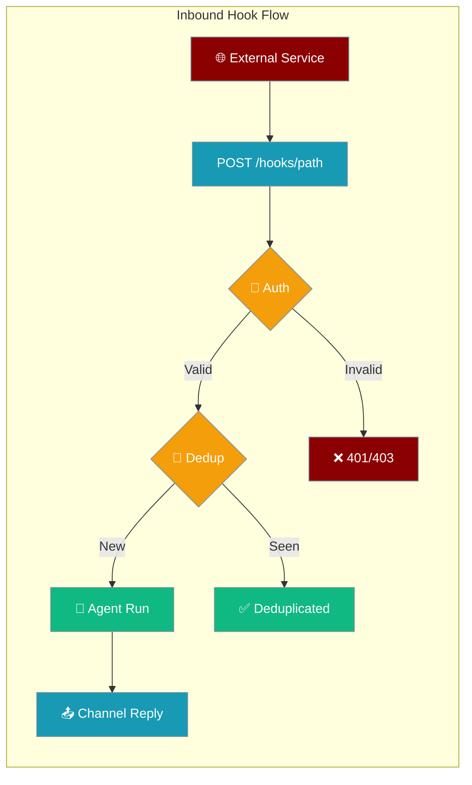
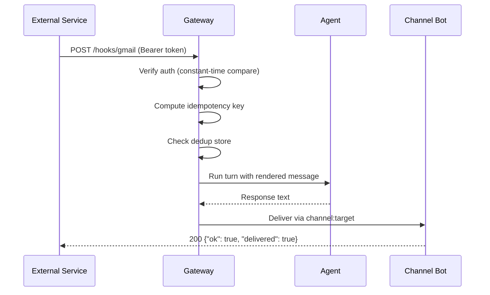
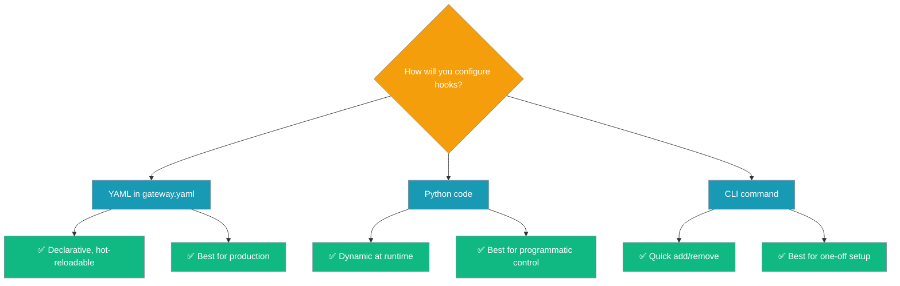
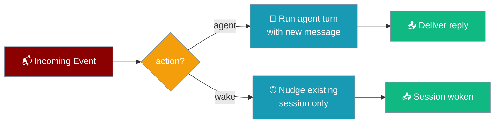

Inbound hooks turn the gateway into a webhook receiver — any external service can `POST` an event and start an agent run, delivering the reply through Telegram, Discord, Slack, or any configured channel.



## Quick Start

<Steps>
<Step title="Add a hook to gateway.yaml">

Add a `hooks:` section to your existing `gateway.yaml`:

```yaml
agents:
  assistant:
    model: gpt-4o-mini
    instructions: "You are a helpful assistant."

channels:
  telegram:
    platform: telegram
    token: ${TELEGRAM_BOT_TOKEN}
    routes:
      default: assistant

hooks:
  - path: gmail
    auth: "${GATEWAY_HOOK_TOKEN}"
    agent: assistant
    session_key: "hook:gmail:{{ payload.message_id }}"
    idempotency_key: "{{ payload.message_id }}"
    deliver_to: "telegram:123456789"
    message: "New email from {{ payload.from }}: {{ payload.subject }}"
```

</Step>

<Step title="Start (or reload) the gateway">

```bash
praisonai gateway start --config gateway.yaml
```

</Step>

<Step title="Send an event and see the reply">

```bash
curl -X POST https://gateway.example.com/hooks/gmail \
  -H "Authorization: Bearer $GATEWAY_HOOK_TOKEN" \
  -H "Content-Type: application/json" \
  -d '{
        "message_id": "abc-123",
        "from": "alice@example.com",
        "subject": "Quarterly numbers"
      }'
```

The assistant processes the event and the reply arrives in Telegram.

</Step>
</Steps>

---

## How It Works



| Step | What happens |
|------|-------------|
| **Auth** | Bearer token checked per-hook, falls back to gateway token |
| **Dedup** | Idempotency key prevents duplicate runs on retried deliveries |
| **Session** | `session_key` template groups related events in one context |
| **Run** | Agent receives the rendered `message` and produces a reply |
| **Deliver** | Reply is sent to `deliver_to` channel target |

---

## Choose Your Surface



---

## Three Ways to Configure

<Tabs>
<Tab title="YAML (gateway.yaml)">

The primary surface — declarative, hot-reloadable, no code required:

```yaml
hooks:
  - path: gmail
    auth: "${GATEWAY_HOOK_TOKEN}"
    agent: assistant
    action: agent
    session_key: "hook:gmail:{{ payload.message_id }}"
    idempotency_key: "{{ payload.message_id }}"
    deliver_to: "telegram:123456789"
    message: "New email from {{ payload.from }}: {{ payload.subject }}"
```

Hooks may also be nested under a `gateway:` block — both forms parse identically:

```yaml
gateway:
  hooks:
    - path: github
      agent: reviewer
      deliver_to: "slack:C0123456"
      message: "PR opened by {{ payload.sender.login }}: {{ payload.pull_request.title }}"
```

</Tab>
<Tab title="Python">

Register hooks programmatically at runtime:

```python
from praisonai.gateway.server import WebSocketGateway
from praisonaiagents.gateway import GatewayConfig

config = GatewayConfig(host="127.0.0.1", port=8765)
gateway = WebSocketGateway(config=config)

gateway.register_hook(
    path="gmail",
    agent="assistant",
    session_key="hook:gmail:{message_id}",
    idempotency_key="{message_id}",
    deliver_to="telegram:123456789",
    message_template="New email from {from}: {subject}",
)
```

Pass a pre-built `HookConfig` or a dict:

```python
from praisonaiagents.gateway import HookConfig

hook = HookConfig(
    path="gmail",
    agent="assistant",
    session_key="hook:gmail:{message_id}",
    idempotency_key="{message_id}",
    deliver_to="telegram:123456789",
    message="New email from {from}: {subject}",
)
gateway.register_hook(hook)
```

Management API:

```python
hooks = gateway.list_hooks()          # ["gmail", "github"]
hook  = gateway.get_hook("gmail")     # HookConfig object
gateway.unregister_hook("gmail")      # removes the hook
```

</Tab>
<Tab title="CLI">

Edit `gateway.yaml` in place from the terminal:

```bash
praisonai gateway hooks add gmail \
  --agent assistant \
  --session-key "hook:gmail:{message_id}" \
  --idempotency-key "{message_id}" \
  --deliver-to telegram:123456789 \
  --message "New email from {from}: {subject}" \
  --auth "$GATEWAY_HOOK_TOKEN"

praisonai gateway hooks list

praisonai gateway hooks remove gmail
```

Point at a non-default config file with `--config <path>`.

</Tab>
</Tabs>

---

## Templating

Templates resolve payload values in both syntaxes — use whichever feels natural:

| Syntax | Example | Notes |
|--------|---------|-------|
| Jinja-ish | `{{ payload.from }}` | Double-brace, optional `payload.` prefix |
| Format-ish | `{from}` | Single-brace shorthand |
| Dotted path | `{{ payload.user.email }}` | Nested keys supported |

All three fields support templates: `session_key`, `idempotency_key`, and `message`.

```yaml
message: "{{ payload.sender.login }} opened PR #{{ payload.number }}: {{ payload.pull_request.title }}"
session_key: "hook:github:pr:{{ payload.number }}"
idempotency_key: "{{ payload.pull_request.head.sha }}"
```

<Note>
Missing keys render as **empty strings** — templates never raise on a partial payload.
A payload value containing `{...}` is never re-expanded (single-pass substitution).
</Note>

---

## Configuration Options

All options for a hook entry:

| Option | Type | Default | Description |
|--------|------|---------|-------------|
| `path` | `str` | *(required)* | URL segment — `"gmail"` → `POST /hooks/gmail` |
| `agent` | `str` | `None` | Agent id to run. Defaults to the gateway's first registered agent |
| `action` | `str` | `"agent"` | `"agent"` runs a turn; `"wake"` nudges an existing session |
| `auth` | `str` | `None` | Bearer token required on the request. When omitted, the gateway's own token is used |
| `session_key` | `str` | `None` | Template for the session id — groups related events in one context |
| `idempotency_key` | `str` | `None` | Template for the dedup key. When omitted, the whole payload is hashed |
| `deliver_to` | `str` | `None` | `channel:target` for the reply (e.g. `"telegram:123456789"`). Omit to skip delivery |
| `message` | `str` | `None` | Template for the agent message built from the payload |
| `enabled` | `bool` | `True` | Whether the hook is active |
| `metadata` | `dict` | `{}` | Free-form extra settings |

---

## Actions: agent vs wake



**`action: agent`** — the default. Builds a message from the `message` template and runs a full agent turn. The reply is delivered via `deliver_to`.

```yaml
hooks:
  - path: stripe
    action: agent
    message: "Charge {{ payload.amount }} from {{ payload.customer.email }} — handle it."
    deliver_to: "slack:C0123456"
```

**`action: wake`** — does not send a new user message; it wakes an existing session so the agent can check its state and continue. Use for "something changed, check again" pings.

```yaml
hooks:
  - path: ci-done
    action: wake
    session_key: "deploy:{{ payload.run_id }}"
```

---

## Authentication

<Warning>
Auth is via `Authorization: Bearer <token>` **only**. The `?token=` query-param fallback was removed because it leaks secrets into access logs.
</Warning>

| Scenario | Behaviour |
|----------|-----------|
| Hook has `auth:` set | That token is required; the gateway's own token is **bypassed** |
| Hook has no `auth:` | The gateway's global `auth_token` applies |
| No auth configured anywhere | The hook is unauthenticated (fine for internal networks only) |

Comparison is constant-time to prevent timing attacks. The `auth` value is masked as `"***"` in all log-safe outputs (`to_dict()`).

---

## Idempotency

Retry-safe by design — calling the same hook twice with the same payload is harmless:

1. The idempotency key is computed from the `idempotency_key` template (or a full payload hash).
2. The key is **only recorded after a successful run** — transient failures remain retryable.
3. A separate in-flight set deduplicates *concurrent* identical deliveries during the await.
4. Store holds up to **10,000 entries** with a **24-hour TTL** and LRU eviction.

```yaml
hooks:
  - path: gmail
    idempotency_key: "{{ payload.message_id }}"
```

If `message_id` is the same across retries, only the first delivery runs.

---

## Response Shapes

| Outcome | HTTP | Body |
|---------|------|------|
| Success (`action: agent`) | 200 | `{"ok": true, "action": "agent", "agent": "assistant", "session": "hook:gmail:abc-123", "delivered": true}` |
| Success (`action: wake`) | 200 | `{"ok": true, "action": "wake", "session": "hook:gmail:abc-123"}` |
| Deduplicated | 200 | `{"ok": true, "deduplicated": true}` |
| Hook not found / disabled | 404 | `{"error": "hook not found"}` |
| Missing/invalid auth | 401/403 | `{"error": "..."}` |
| Malformed JSON | 400 | `{"error": "Invalid JSON. Send a JSON object payload."}` |
| Agent missing / run failed | 500 | `{"ok": false, "error": "..."}` |

---

## Delivery

The `deliver_to` field uses a `channel:target` format that mirrors the gateway's scheduled delivery path:

| Example | Meaning |
|---------|---------|
| `telegram:123456789` | Send to Telegram chat id 123456789 |
| `discord:987654321` | Send to Discord channel id 987654321 |
| `slack:C0123456` | Send to Slack channel C0123456 |

Omit `deliver_to` entirely to run the agent and capture the reply programmatically without outbound delivery.

---

## Common Patterns

<AccordionGroup>

<Accordion title="Gmail → assistant → Telegram">

```yaml
hooks:
  - path: gmail
    auth: "${GMAIL_HOOK_TOKEN}"
    agent: assistant
    session_key: "hook:gmail:{{ payload.message_id }}"
    idempotency_key: "{{ payload.message_id }}"
    deliver_to: "telegram:123456789"
    message: "New email from {{ payload.from }}: {{ payload.subject }}\n\n{{ payload.snippet }}"
```

</Accordion>

<Accordion title="GitHub PR opened → reviewer agent → Slack">

```yaml
hooks:
  - path: github-pr
    auth: "${GITHUB_HOOK_TOKEN}"
    agent: reviewer
    session_key: "hook:github:pr:{{ payload.number }}"
    idempotency_key: "{{ payload.pull_request.head.sha }}"
    deliver_to: "slack:C0123456"
    message: "PR #{{ payload.number }} by {{ payload.sender.login }}: {{ payload.pull_request.title }}\n{{ payload.pull_request.html_url }}"
```

</Accordion>

<Accordion title="Stripe charge → support agent → Discord">

```yaml
hooks:
  - path: stripe
    auth: "${STRIPE_HOOK_TOKEN}"
    agent: support
    session_key: "hook:stripe:{{ payload.id }}"
    idempotency_key: "{{ payload.id }}"
    deliver_to: "discord:987654321"
    message: "Stripe charge {{ payload.id }}: ${{ payload.amount }} from {{ payload.customer }}"
```

</Accordion>

<Accordion title="CI complete → wake a monitoring session">

```yaml
hooks:
  - path: ci-done
    action: wake
    session_key: "deploy:{{ payload.run_id }}"
    idempotency_key: "{{ payload.run_id }}:{{ payload.conclusion }}"
```

Use `action: wake` when the agent session is already running a deploy loop and needs a nudge to check status.

</Accordion>

<Accordion title="Form submission → default agent">

```yaml
hooks:
  - path: contact-form
    auth: "${FORM_HOOK_TOKEN}"
    deliver_to: "telegram:123456789"
    message: "Contact form: {{ payload.name }} <{{ payload.email }}> — {{ payload.message }}"
```

No `agent:` needed — defaults to the first registered agent.

</Accordion>

</AccordionGroup>

---

## CLI Management

Full reference for the `hooks` subcommand:

```bash
praisonai gateway hooks add <path> [OPTIONS]

  --agent TEXT            Agent id to run (default: first agent)
  --action [agent|wake]   Run a turn or wake a session (default: agent)
  --auth TEXT             Bearer token for this hook
  --session-key TEXT      Session key template
  --idempotency-key TEXT  Idempotency key template
  --deliver-to TEXT       channel:target for the reply
  --message TEXT          Message template from the payload
  --config TEXT           Path to gateway.yaml (default: gateway.yaml)

praisonai gateway hooks list [--config TEXT]

praisonai gateway hooks remove <path> [--config TEXT]
```

---

## Best Practices

<AccordionGroup>

<Accordion title="Always set per-hook auth: in production">

Every public-facing hook should have its own `auth:` token. Sharing one token across all hooks means rotating it affects everything at once.

```yaml
hooks:
  - path: gmail
    auth: "${GMAIL_HOOK_TOKEN}"   # rotate independently
  - path: stripe
    auth: "${STRIPE_HOOK_TOKEN}"  # rotate independently
```

</Accordion>

<Accordion title="Pick a stable idempotency_key per event source">

Use the event source's own unique id — never a timestamp or random value:

```yaml
idempotency_key: "{{ payload.message_id }}"   # Gmail
idempotency_key: "{{ payload.id }}"           # Stripe
idempotency_key: "{{ payload.pull_request.head.sha }}"  # GitHub
```

</Accordion>

<Accordion title="Use session_key to thread related events">

Group events from the same source entity so the agent has full context:

```yaml
session_key: "hook:gmail:thread:{{ payload.thread_id }}"
```

Without a `session_key`, all events on a hook share a single session (`hook:<path>`).

</Accordion>

<Accordion title="Use action: wake for 'something changed' pings">

When an external system signals a state change and your agent is already monitoring that entity, use `wake` instead of `agent` to avoid injecting a duplicate user message:

```yaml
- path: deploy-status
  action: wake
  session_key: "deploy:{{ payload.deployment_id }}"
```

</Accordion>

<Accordion title="Hot-reload without restarting">

Edit the `hooks:` section in `gateway.yaml` while the gateway is running. The gateway diffs the config and applies removals, additions, and rotated secrets automatically — no process restart needed.

</Accordion>

</AccordionGroup>

---

## Related

<CardGroup cols={2}>
<Card title="Gateway Overview" icon="broadcast-tower" href="/docs/features/gateway-overview">
  WebSocket gateway architecture and multi-channel setup
</Card>
<Card title="Gateway CLI" icon="tower-broadcast" href="/docs/features/gateway-cli">
  Full command reference for managing the gateway daemon
</Card>
<Card title="Webhook Verification" icon="shield-check" href="/docs/features/webhook-verification">
  Verify signatures from GitHub, Stripe, and other platforms
</Card>
<Card title="Messaging Bots" icon="message-circle" href="/docs/features/messaging-bots">
  Telegram, Discord, Slack channel configuration for deliver_to
</Card>
</CardGroup>
