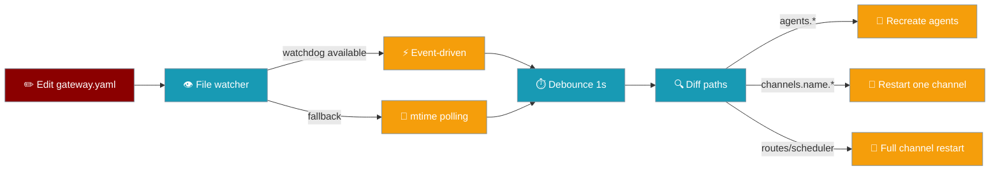
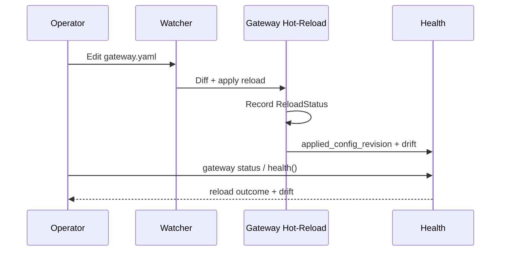
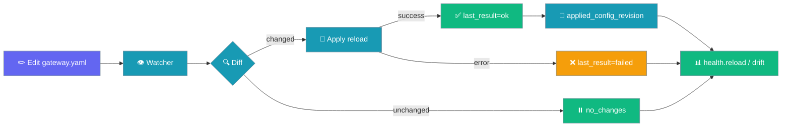
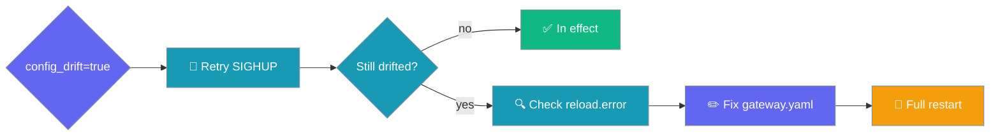

<Note>
The gateway now ships in the `praisonai-bot` package. `praisonai serve gateway` still works exactly as documented here; for a standalone install see [praisonai-bot Migration](/docs/guides/praisonai-bot-migration).
</Note>


```python
from praisonaiagents import Agent

agent = Agent(name="reload-agent", instructions="Hot-reload gateway configuration without downtime.")
agent.start("Reload the gateway configuration without restarting the service.")
```


The gateway diffs `gateway.yaml` against the running config and restarts only affected agents or channels. The WebSocket server keeps running.

```yaml
# gateway.yaml
agents:
  assistant:
    instructions: "You are a helpful assistant."
```

```bash
praisonai gateway run gateway.yaml
# Edit agents.assistant.instructions and save — only agents reload (~5s)
```


The user edits `gateway.yaml` on disk; the watcher diffs changes and reloads only affected agents or channels while the WebSocket server stays up.



## How It Works




## Quick Start

<Steps>
<Step title="Run the gateway">

```bash
praisonai gateway run gateway.yaml
```

</Step>

<Step title="Edit live">

Change agent instructions or a single channel token in `gateway.yaml` and save. The watcher applies a selective reload within ~5 seconds (1s debounce). Credential fields can also be [secret references](/docs/features/gateway-secret-references) (`{source, id}`) instead of plaintext.

</Step>

<Step title="Trigger reload manually with SIGHUP">

Send `SIGHUP` to reload without editing a file — useful for orchestration scripts and systemd:

```bash
# Find the gateway pid, then:
kill -HUP $(pgrep -f "praisonai gateway")

# Or under systemd:
systemctl reload praisonai-gateway
```

</Step>
</Steps>

---

## Event-driven vs Polling

The watcher **prefers** event-driven file notifications via the optional `watchdog` package and **falls back gracefully** to mtime polling when `watchdog` is unavailable or an observer cannot start.

| Mode | How it works | When used |
|---|---|---|
| Event-driven | OS file-system events via `watchdog` | `watchdog>=3.0.0` installed |
| mtime polling | Periodic stat check every 5s | `watchdog` not installed or observer fails |

Both modes apply the same 1s debounce to coalesce rapid saves.

**Install `watchdog` for faster reload detection:**

```bash
pip install "praisonai[gateway]"
# or
pip install "praisonai[all]"
```

<Note>
`watchdog` is **optional** — without it, polling continues exactly as before. Install it only when faster reaction times matter.
</Note>

---

## Operator-triggered Reload via SIGHUP

`start_with_config` installs a `SIGHUP` handler that runs the same `reload_config` path as a file-change reload — no shutdown, no dropped connections.


Reload via `SIGHUP` is **best-effort** — it is silently skipped on platforms without `SIGHUP` support (e.g. Windows).

---

## Drain-coordinated Channel Restart

When a reload triggers a channel restart, the gateway drains in-flight turns before bouncing the channel — no mid-conversation cuts.

The drain window for reload-triggered restarts is controlled by a new YAML key:

```yaml
gateway:
  reload_drain_timeout: 10   # seconds; falls back to drain_timeout if unset
```

---

## Restart Scope

| Changed section | Effect |
|---|---|
| `agents.*` | Recreate agents only — channels keep running |
| `channels.<name>.*` | Restart only that channel |
| `channels.<name>.unknown_user_policy` | Re-read policy and rebuild `BotConfig` — re-fires the startup warning |
| `channels.<name>.owner_user_id` | Re-read owner and rebuild `BotConfig` |
| `provider.*`, `guardrails.*` | Recreate agents |
| `scheduler.*`, `routes.*`, `routing.*` | Full channel restart |
| `lifecycle.*` | Rebuild scale-to-zero / drain-marker policies; cancel or relaunch only the loops whose enablement changed (`_reconcile_lifecycle`) — no channel or process restart |
| Entire `channels` section | Full channel restart |
| Invalid YAML on save | Keep last-known-good config |

Full restart stops and starts all channels but **does not** restart the WebSocket server — connected clients stay connected.

<Note>
Changing `unknown_user_policy` on a channel with an empty `allowed_users` re-fires the startup warning with the new policy's text ([PR #2856](https://github.com/MervinPraison/PraisonAI/pull/2856)). Existing sessions are unaffected — the change applies to inbound DMs after the reload commits.
</Note>

---

## Observability

The gateway records every reload outcome so operators can confirm the last edit took effect without scraping logs.

Reloads still log a concise summary line on completion:

```
reload applied: agents; restart[telegram]
```

The format is `reload applied: <changed-sections>; restart[<channels>]`. Grep for `reload applied` to trace all reloads in your log stream.

### Reload status in `health()`

`health()` surfaces the reload outcome and config revisions when the gateway runs from a config file:

```python
from praisonaiagents import Agent

# Operator polls health from a running gateway
payload = gateway.health()
print(payload["reload"])
# {'watcher': 'active', 'last_result': 'ok', 'last_at': 1731801234.5,
#  'changed_paths': ['agents.assistant.instructions'], 'error': None}
print(payload["applied_config_revision"], payload["on_disk_config_revision"])
print(payload["config_drift"])   # True if a restart is still owed
```

These four keys are additive — they only appear when the gateway runs from a config file, so existing `health()` consumers see no change:

| Key | Type | Description |
|---|---|---|
| `reload` | `dict` | Full reload status from `ReloadStatus.to_dict()` — outcome + watcher liveness. |
| `applied_config_revision` | `str` (12-char) | Revision id of the config the gateway is *actually running*. |
| `on_disk_config_revision` | `str` (12-char) | Revision id of the current `gateway.yaml` on disk. |
| `config_drift` | `bool` | `True` when `applied_config_revision != on_disk_config_revision`. |

### ReloadStatus fields

`ReloadStatus` is a frozen dataclass describing the most recent reload attempt:

| Field | Type | Default | Meaning |
|---|---|---|---|
| `watcher` | `"active"` \| `"disabled"` | `"disabled"` | `"active"` while the watcher runs; `"disabled"` once it has genuinely given up. Detects silent degradation. |
| `last_result` | `"ok"` \| `"failed"` \| `"no_changes"` \| `"never"` | `"never"` | Outcome of the most recent reload attempt. |
| `last_at` | `float` \| `None` | `None` | Unix timestamp of the last reload attempt. |
| `changed_paths` | `tuple[str, ...]` | `()` | Config paths that changed on the last successful reload. |
| `error` | `str` \| `None` | `None` | Human-readable reason on `"failed"`; `None` otherwise. |

### Compare configs offline

`compute_config_revision` returns the same 12-character revision id used by `health()`, so you can check an on-disk config before deploying it:

```python
from praisonaiagents.gateway import compute_config_revision
import yaml

with open("gateway.yaml") as f:
    revision = compute_config_revision(yaml.safe_load(f))
print(revision)   # e.g. 'a1b2c3d4e5f6'
```

Identical logical configs produce identical revisions regardless of key order or whitespace; an empty or `None` config returns the sentinel `"000000000000"`.

### Reload observability flow



### Inspect reload from the CLI

`praisonai gateway status` prints the reload result, watcher state, and config drift alongside the existing status:

```bash
praisonai gateway status
```

```
  Reload: OK  2m ago  changed=agents.assistant.instructions
  Watcher: active
  Config: a1b2c3d4e5f6 (up to date)
```

When the running config no longer matches disk, the drift is shown with both revisions:

```
  Reload: FAILED  30s ago  invalid YAML at agents.assistant
  Watcher: active
  Config: on-disk 9f8e7d6c5b4a  !=  applied a1b2c3d4e5f6   (change not in effect)
```

### When `config_drift` is true

A drift means the config on disk has not taken effect — walk this path to recover:



<Note>
The reload machinery is additive: `ReloadStatus` and `compute_config_revision` are new exports from `praisonaiagents.gateway`, and the existing `reload applied: …` log line is unchanged. Pre-existing `health()` consumers are unaffected.
</Note>

---

## Tuning

| Setting | Default | Description |
|---|---|---|
| Poll interval | `5.0`s | How often the mtime watcher checks the file |
| Debounce | `1.0`s | Wait after last write before applying |
| `gateway.reload_drain_timeout` | falls back to `gateway.drain_timeout` | Bounded drain window before a reload-triggered channel restart |

---

<Note>
**Backward compatibility:** Leaving `reload_drain_timeout` unset preserves the prior immediate-restart behaviour. Not installing `watchdog` keeps polling as before. This is a fully additive change.
</Note>

---

## Best Practices

<AccordionGroup>
<Accordion title="Prefer agent-only edits for prompt tweaks">
Changing `agents.*` avoids dropping live Telegram/Discord sessions.
</Accordion>

<Accordion title="Scope channel edits narrowly">
Edit one channel block to restart only that platform.
</Accordion>

<Accordion title="Validate YAML before saving">
Invalid saves are ignored — the previous config keeps running.
</Accordion>

<Accordion title="Use SIGHUP in systemd for zero-downtime config pushes">
Add `ExecReload=kill -HUP $MAINPID` to your systemd unit so `systemctl reload` triggers a drain-coordinated reload without stopping the process.
</Accordion>
</AccordionGroup>

---

## Related

<CardGroup cols={2}>
<Card title="Bot Gateway" icon="server" href="/docs/features/bot-gateway">
  Gateway server overview
</Card>
<Card title="Gateway Channel Supervision" icon="shield" href="/docs/features/gateway-channel-supervision">
  Self-healing channels
</Card>
<Card title="Code-Skew Guard" icon="shield-halved" href="/docs/features/gateway-code-skew-guard">
  Detect in-place code updates and refuse hot operations until the process restarts.
</Card>
<Card title="Gateway Reliability Preset" icon="shield-check" href="/docs/features/gateway-reliability-preset">
  One switch to compose drain + admission control
</Card>
</CardGroup>
