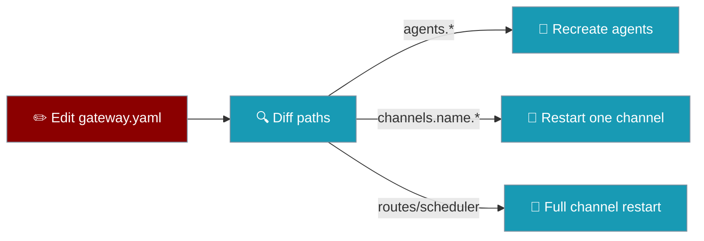

The gateway diffs `gateway.yaml` against the running config and restarts only affected agents or channels. The WebSocket server keeps running.

```yaml
# gateway.yaml
agents:
  assistant:
    instructions: "You are a helpful assistant."
```

```bash
praisonai gateway run gateway.yaml
# Edit agents.assistant.instructions and save — only agents reload (~5s)
```



## Quick Start

<Steps>
<Step title="Run the gateway">

```bash
praisonai gateway run gateway.yaml
```

</Step>

<Step title="Edit live">

Change agent instructions or a single channel token in `gateway.yaml` and save. The watcher applies a selective reload within ~5 seconds (1s debounce).

</Step>
</Steps>

---

## Restart Scope

| Changed section | Effect |
|---|---|
| `agents.*` | Recreate agents only — channels keep running |
| `channels.<name>.*` | Restart only that channel |
| `provider.*`, `guardrails.*` | Recreate agents |
| `scheduler.*`, `routes.*`, `routing.*` | Full channel restart |
| Entire `channels` section | Full channel restart |
| Invalid YAML on save | Keep last-known-good config |

Full restart stops and starts all channels but **does not** restart the WebSocket server — connected clients stay connected.

---

## Tuning

| Setting | Default | Description |
|---|---|---|
| Poll interval | `5.0`s | How often the watcher checks the file |
| Debounce | `1.0`s | Wait after last write before applying |

---

## Best Practices

<AccordionGroup>
<Accordion title="Prefer agent-only edits for prompt tweaks">
Changing `agents.*` avoids dropping live Telegram/Discord sessions.
</Accordion>

<Accordion title="Scope channel edits narrowly">
Edit one channel block to restart only that platform.
</Accordion>

<Accordion title="Validate YAML before saving">
Invalid saves are ignored — the previous config keeps running.
</Accordion>
</AccordionGroup>

---

## Related

<CardGroup cols={2}>
<Card title="Bot Gateway" icon="server" href="/docs/features/bot-gateway">
  Gateway server overview
</Card>
<Card title="Gateway Channel Supervision" icon="shield" href="/docs/features/gateway-channel-supervision">
  Self-healing channels
</Card>
<Card title="Code-Skew Guard" icon="shield-halved" href="/docs/features/gateway-code-skew-guard">
  Detect in-place code updates and refuse hot operations until the process restarts.
</Card>
</CardGroup>
