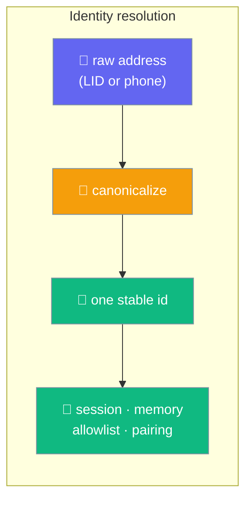
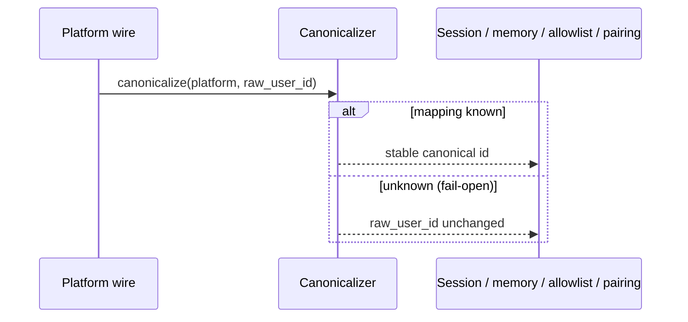

Some platforms address the same person with two interchangeable ids — WhatsApp uses both `<lid>@lid` and `<phone>@s.whatsapp.net`. Identity canonicalization maps every alternate form to one stable id **before** the gateway keys the session, memory, allowlist, and pairing on it, so one person is never split into two principals.



## Quick Start

<Steps>
<Step title="WhatsApp: nothing to configure">
`WhatsAppBot` wires `WhatsAppIdentityCanonicalizer` on the web-mode message path automatically. LID and phone forms of the same person resolve to one identity — no flags, no config.

```bash
praisonai bot whatsapp --mode web
```
</Step>

<Step title="Implement it for another platform">
The extension point is a dependency-free, runtime-checkable `Protocol`. Implement `canonicalize` and return the stable id — or the raw id unchanged when you don't know it.

```python
from praisonaiagents.gateway import IdentityCanonicalizerProtocol


class MyPlatformCanonicalizer:
    def __init__(self):
        self._map: dict[str, str] = {}

    def canonicalize(self, platform: str, raw_user_id: str) -> str:
        # Return the stable canonical id, or raw_user_id when unknown (fail-open).
        return self._map.get(raw_user_id, raw_user_id)


# Runtime-checkable — no base class to inherit
assert isinstance(MyPlatformCanonicalizer(), IdentityCanonicalizerProtocol)
```
</Step>
</Steps>

---

## How It Works

Canonicalization is the **first** step of identity resolution. Every downstream key — session, memory, allowlist, pairing — is derived from the reconciled id, so alternate address forms of the same person collapse to one principal.



The contract is deliberately small and safe:

- **Deterministic.** The same input always maps to the same output.
- **Fail-open.** An unknown address returns unchanged, so a missing mapping is never worse than passing the raw id through. With no canonicalizer registered, resolution is unchanged.
- **First in line.** It runs before any key is derived, so the allowlist and session see the reconciled id — not the raw one.

### WhatsApp implementation

`WhatsAppIdentityCanonicalizer` learns the LID↔phone mapping from whatsmeow's `SenderAlt` alternate-JID field and reconciles the sender toward the phone form. It only accepts an exact `@lid` ↔ `@s.whatsapp.net` pairing — a group `@g.us`, an unexpected domain, or an LID-to-LID pair is rejected, so a malformed or hostile alternate JID never stores a bogus identity.

| Behaviour | Result |
|-----------|--------|
| LID form of an allowlisted phone number arrives | Matches the allowlist (reconciled to phone form) |
| LID-form and phone-form turns from one person | One session and memory bucket |
| Already-paired user arrives in the other form | No re-pairing prompt |
| LID-addressed self-chat | Still detected as self-chat, not dropped as outgoing |
| Unknown or malformed alternate JID | Returned unchanged (fail-open) |

See [WhatsApp Bot → Identity: LID vs phone JID](/features/whatsapp-bot#identity-lid-vs-phone-jid).

---

## Protocol Reference

Import from the gateway package:

```python
from praisonaiagents.gateway import IdentityCanonicalizerProtocol
```

| Method | Signature | Contract |
|--------|-----------|----------|
| `canonicalize` | `canonicalize(platform: str, raw_user_id: str) -> str` | Deterministic; MUST return `raw_user_id` unchanged when no reconciliation is known (fail-open). |

`IdentityCanonicalizerProtocol` is a `@runtime_checkable` `Protocol`, so any object with a matching `canonicalize` method satisfies `isinstance(...)` without subclassing.

---

## Common Patterns

### Learn a mapping, then canonicalize

```python
from praisonaiagents.gateway import IdentityCanonicalizerProtocol


class AliasCanonicalizer:
    def __init__(self):
        self._alias_to_canonical: dict[str, str] = {}

    def learn(self, alias: str, canonical: str) -> None:
        self._alias_to_canonical[alias] = canonical

    def canonicalize(self, platform: str, raw_user_id: str) -> str:
        return self._alias_to_canonical.get(raw_user_id, raw_user_id)


canon = AliasCanonicalizer()
canon.learn("alt-123", "user-123")

assert canon.canonicalize("myplatform", "alt-123") == "user-123"
assert canon.canonicalize("myplatform", "unknown") == "unknown"   # fail-open
assert isinstance(canon, IdentityCanonicalizerProtocol)
```

### Guard against wrong-shape addresses

Only reconcile pairs you positively recognise; return the raw id for anything else so a hostile or malformed address can't hijack another user's identity.

```python
class StrictCanonicalizer:
    def canonicalize(self, platform: str, raw_user_id: str) -> str:
        if platform != "myplatform" or "@" not in raw_user_id:
            return raw_user_id
        local, _, domain = raw_user_id.partition("@")
        if domain != "alt.example":          # only this alternate domain maps
            return raw_user_id
        return f"{local}@canonical.example"
```

---

## Best Practices

<AccordionGroup>
<Accordion title="Always fail open">
Return `raw_user_id` unchanged whenever you can't map it. A missing mapping must never corrupt identity — it should be exactly today's behaviour.
</Accordion>

<Accordion title="Canonicalize before every key">
Reconcile the id first, then derive session, memory, allowlist, and pairing keys from the result. Canonicalizing after a key is derived reintroduces the split.
</Accordion>

<Accordion title="Accept only exact, known pairings">
Validate the shape of both addresses before storing a mapping. Reject group, cross-type, or unexpected-domain pairs so a hostile alternate id can't map onto a real user.
</Accordion>

<Accordion title="Keep canonicalize deterministic">
The same raw id must always map to the same canonical id within a process. Non-deterministic output splits sessions and breaks allowlist matches.
</Accordion>
</AccordionGroup>

---

## Related

<CardGroup cols={2}>
  <Card title="WhatsApp Bot" icon="whatsapp" href="/features/whatsapp-bot">
    The built-in LID ↔ phone canonicalizer in action
  </Card>
  <Card title="Bot Routing" icon="route" href="/features/bot-routing">
    How reconciled identities flow through channel routing
  </Card>
</CardGroup>
