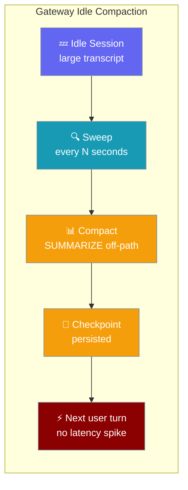
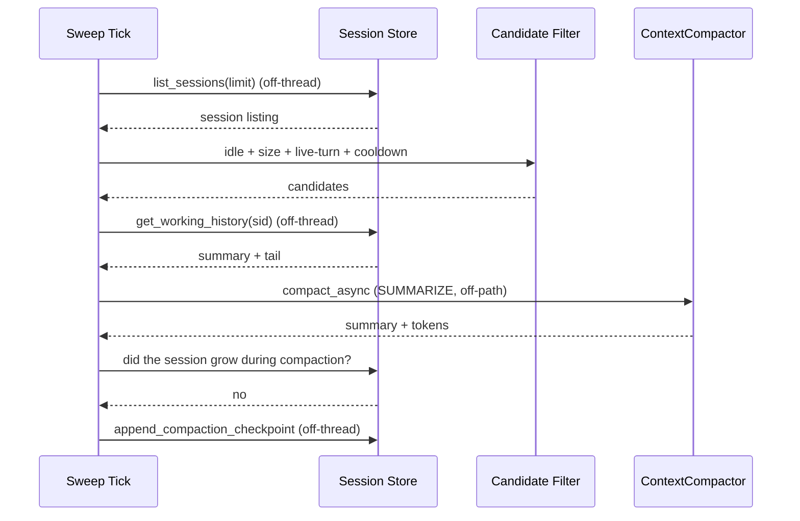
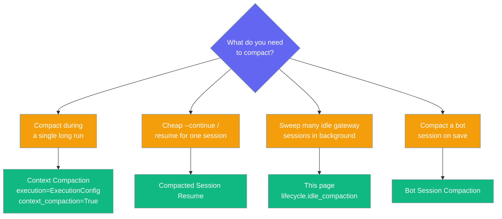

<Note>
The gateway now ships in the `praisonai-bot` package. `praisonai serve gateway` still works exactly as documented here; for a standalone install see [praisonai-bot Migration](/guides/praisonai-bot-migration).
</Note>

Idle-session compaction runs in the background so a returning user resumes an already-compacted session with no latency spike, and idle transcripts stay bounded.



## Quick Start

<Steps>

<Step title="Enable in gateway.yaml (minimal)">

```yaml
# gateway.yaml
lifecycle:
  idle_compaction:
    enabled: true
```

```bash
praisonai gateway start --config gateway.yaml
```

This uses the defaults (idle ≥ 30 min, ≥ 8000 tokens, sweep every 5 min). Requires a durable session store — the shipped default is durable, so no extra flags are needed.

</Step>

<Step title="Tune for a busier gateway">

```yaml
# gateway.yaml
lifecycle:
  idle_compaction:
    enabled: true
    idle_after_seconds: 900      # 15 min
    min_tokens: 4000              # compact smaller transcripts
    sweep_interval_seconds: 120   # sweep every 2 min
    max_per_sweep: 50             # more work per pass
```

```bash
praisonai gateway start --config gateway.yaml
```

</Step>

<Step title="Verify it fires">

Grep the gateway logs for the arm line and per-session shrink lines:

```text
Gateway idle_compaction enabled (idle_after=1800.0s, min_tokens=8000, sweep=300.0s)
Gateway idle-compaction sweep armed
[idle-compaction] user-42-chat: 12400->3100 tokens
```

</Step>

</Steps>

---

## How It Works

Each sweep enumerates persisted sessions off-thread, filters idle over-budget candidates, summarises them off the turn critical path, and persists a checkpoint the next user message resumes from.



| Guard | Behaviour |
|-------|-----------|
| **Idle threshold** | Only sessions with `updated_at ≥ idle_after_seconds` old are candidates. |
| **Size threshold** | Only sessions whose `total_tokens ≥ min_tokens` (unknown size is included — belt-and-braces). |
| **Live-turn guard** | Sessions currently `_is_executing` in this gateway are skipped. |
| **Per-session cooldown** | After a sweep (whether the session shrank or not), the session is off-limits for `cooldown_seconds`. |
| **Stale-checkpoint race guard** | If the transcript grew between selection and summary completion, the checkpoint is skipped and the session is retried later. |
| **Dormancy** | The sweep pauses when the gateway is `_is_dormant` (scale-to-zero quiesced). |
| **Off-path I/O** | `list_sessions`, `get_working_history`, and `append_compaction_checkpoint` all run via `asyncio.to_thread` so websocket/turn handling is never blocked. |

The sweep reuses the same [Context Compaction](/features/context-compaction) engine, constructed as `ContextCompactor(max_tokens=min_tokens, target_tokens=int(min_tokens * 0.75), strategy=CompactionStrategy.SUMMARIZE)`.

---

## Configuration Options

Every knob lives under `lifecycle.idle_compaction:` in `gateway.yaml`.

| Field | Type | Default | Description |
|-------|------|---------|-------------|
| `enabled` | `bool` | `false` | Turns the sweep on. The block is otherwise ignored. Requires a durable session store; otherwise disables itself with a warning. |
| `idle_after_seconds` | `float` | `1800.0` | Minimum seconds since the session's last `updated_at` before it becomes a compaction candidate. Must be `> 0`. |
| `min_tokens` | `int` | `8000` | Minimum transcript size (in tokens, if the store reports `total_tokens`) before the session is considered for compaction. Must be `> 0`. |
| `sweep_interval_seconds` | `float` | `300.0` | Seconds between sweeps. Must be `> 0` (0/negative disables the feature — a zero interval would busy-spin). |
| `cooldown_seconds` | `float` | `3600.0` | Per-session backoff after a sweep touches it (whether it shrank or not), so a session that cannot be shrunk isn't retried every sweep. Must be `> 0`. |
| `max_per_sweep` | `int` | `20` | Maximum sessions to compact per sweep pass. Bounds the work a single tick can queue. Must be `> 0`. |
| `scan_limit` | `int` | `5000` | How many sessions the sweep enumerates from the store per pass. Larger caps prevent older idle sessions from being starved on busy gateways (stores return newest-first). Must be `> 0`. |

<Warning>
**Validation:** non-positive values disable the feature entirely (not just the offending knob) — the gateway logs `Invalid idle_compaction config; disabling: non-positive values not allowed: ...`.
</Warning>

<Note>
This feature does not surface under `health()["lifecycle"]` — unlike [Scale to Zero](/features/gateway-scale-to-zero), verify it from the gateway logs (`Gateway idle-compaction sweep armed` and the per-session `[idle-compaction]` lines).
</Note>

---

## Requirements

<AccordionGroup>

<Accordion title="Durable session store">
The feature needs `list_sessions` + `get_working_history` + `append_compaction_checkpoint`. The shipped SQLite transcript store (`session.store: "sqlite"`, default) implements all three. The legacy `"file"` backend may not — see [Gateway Session Persistence](/features/gateway-session-persistence) and [SQLite Transcript Store](/features/sqlite-transcript-store). If no durable store is bound, the gateway logs `Gateway idle_compaction requires a persistent session store; disabling`.
</Accordion>

<Accordion title="Persistent sessions">
Ephemeral (`session.persist: false`) gateways cannot use `idle_compaction` — there is nothing to enumerate.
</Accordion>

</AccordionGroup>

---

## Hot Reload

Enabling or disabling `idle_compaction` via a `gateway.yaml` reload takes effect without a full process restart — `_reconcile_lifecycle` cancels the old task and starts the new one. See [Gateway Hot Reload](/features/gateway-hot-reload).

---

## Which Compaction Surface?

Four related-but-different compaction surfaces exist; this decision diagram shows which fits which scenario.



- "Compact during a single long run" → [Context Compaction](/features/context-compaction)
- "Cheap `--continue` / resume for one session" → [Compacted Session Resume](/features/session-compaction-checkpoint)
- "Sweep many idle gateway sessions in the background" → **this page (`lifecycle.idle_compaction`)**
- "Compact a bot session on save" → [Bot Session Compaction](/features/bot-session-compaction)

---

## Common Patterns

### 24/7 gateway with many long-lived users

```yaml
# gateway.yaml
lifecycle:
  idle_compaction:
    enabled: true
    idle_after_seconds: 1800
    min_tokens: 8000
    sweep_interval_seconds: 300
```

Compact 30-minute-idle chats over 8k tokens every 5 minutes — cost drops and returning users pay no first-message latency.

### Aggressive shrink for tight-context models

```yaml
# gateway.yaml
lifecycle:
  idle_compaction:
    enabled: true
    min_tokens: 4000
    sweep_interval_seconds: 60
```

Shrink smaller transcripts more often to keep sessions under a tight model context window.

### Very busy gateway (many idle sessions)

```yaml
# gateway.yaml
lifecycle:
  idle_compaction:
    enabled: true
    scan_limit: 20000
    max_per_sweep: 50
```

Bump `scan_limit` and `max_per_sweep` so older idle sessions aren't starved — stores return newest-first.

---

## Best Practices

<AccordionGroup>

<Accordion title="Only durable stores support this">
Without `persist: true` and a store implementing `get_working_history` / `append_compaction_checkpoint`, the sweep disables itself. Verify with `praisonai gateway start` logs — a healthy start prints `Gateway idle-compaction sweep armed`.
</Accordion>

<Accordion title="Keep sweep_interval_seconds ≥ 60">
Sub-minute sweeps rarely pay off on real workloads and can pressure the store. Start at the default `300` and lower only if you observe transcripts growing between sweeps.
</Accordion>

<Accordion title="Cool down long enough to avoid re-work">
Default `cooldown_seconds: 3600` matches the default idle threshold. If you lower `idle_after_seconds`, lower `cooldown_seconds` proportionally so cooled sessions become candidates again on a sensible cadence.
</Accordion>

<Accordion title="Watch for transcript grew during compaction debug logs">
This is normal on active sessions — the sweep skips the checkpoint and retries. Persistent recurrence means your `idle_after_seconds` is too low for the traffic pattern; increase it so live sessions aren't candidates.
</Accordion>

</AccordionGroup>

---

## Related

<CardGroup cols={2}>
  <Card title="Scale to Zero" icon="moon" href="/features/gateway-scale-to-zero">
    Sibling lifecycle policy — idle quiesce for serverless hosts.
  </Card>
  <Card title="Drain Trigger" icon="power-off" href="/features/gateway-drain-trigger">
    Sibling lifecycle policy — epoch-safe external drain marker.
  </Card>
  <Card title="Compacted Session Resume" icon="bookmark" href="/features/session-compaction-checkpoint">
    How the checkpoint this feature writes is consumed on the next user turn.
  </Card>
  <Card title="Context Compaction" icon="compress" href="/features/context-compaction">
    The in-run compactor this feature reuses.
  </Card>
  <Card title="Session Persistence" icon="database" href="/features/gateway-session-persistence">
    The durable session store this feature requires.
  </Card>
  <Card title="Gateway Overview" icon="broadcast-tower" href="/features/gateway-overview">
    How lifecycle policies wire into `WebSocketGateway`.
  </Card>
</CardGroup>
