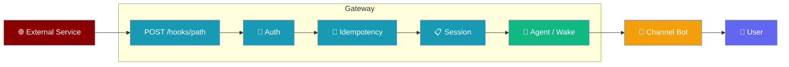
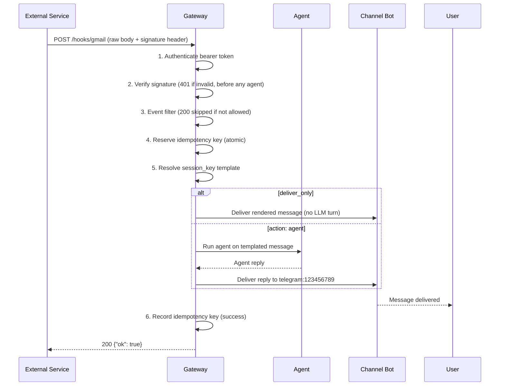
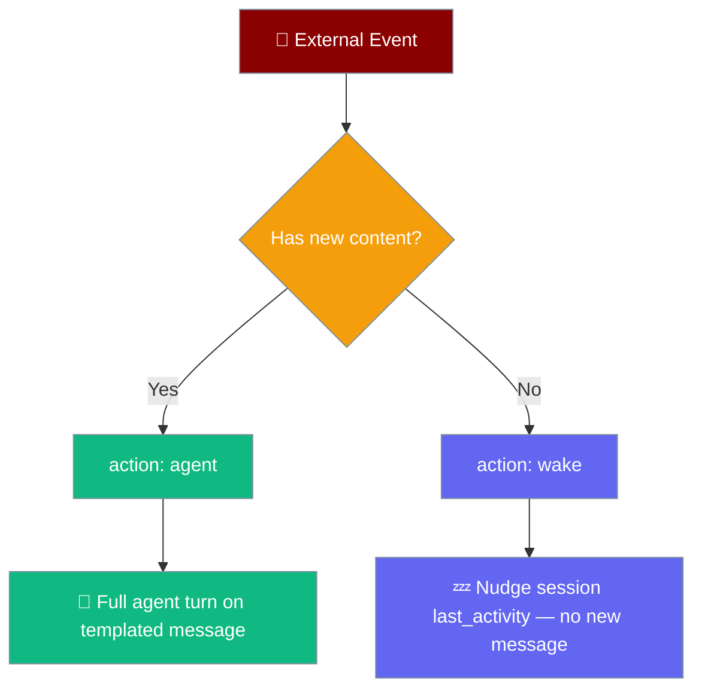

<Note>
The gateway now ships in the `praisonai-bot` package. `praisonai serve gateway` still works exactly as documented here; for a standalone install see [praisonai-bot Migration](/docs/guides/praisonai-bot-migration).
</Note>

Trigger an agent run from any external HTTP event — Gmail, GitHub, Stripe, CI, forms, IoT — by POSTing JSON to `/hooks/<path>`.

```python
from praisonaiagents import Agent

agent = Agent(name="assistant", instructions="Summarise inbound hook payloads for the team.")
agent.start("Process the Gmail hook payload and post a short summary.")
```

The user POSTs JSON to `/hooks/<path>`; the gateway verifies auth, runs the mapped agent, and delivers the reply on the configured channel.



## Quick Start

<Steps>
<Step title="YAML — simplest form">

Create `gateway.yaml`:

```yaml
agents:
  assistant:
    instructions: "You are a helpful email assistant."

hooks:
  - path: gmail                                      # POST /hooks/gmail
    agent: assistant
    auth: "${GATEWAY_HOOK_TOKEN}"
    session_key: "hook:gmail:{{ payload.message_id }}"
    idempotency_key: "{{ payload.message_id }}"
    deliver_to: "telegram:123456789"
    message: "New email from {{ payload.from }}: {{ payload.subject }}"
```

Start the gateway:

```bash
praisonai gateway start --config gateway.yaml
```

Fire a test event:

```bash
curl -X POST http://localhost:8765/hooks/gmail \
  -H "Authorization: Bearer $GATEWAY_HOOK_TOKEN" \
  -H "Content-Type: application/json" \
  -d '{"message_id":"abc","from":"alice@example.com","subject":"Hello"}'
```

Response:

```json
{"ok": true, "session_key": "hook:gmail:abc"}
```

</Step>

<Step title="Python — register programmatically">

```python
from praisonaiagents import Agent
from praisonai.gateway import WebSocketGateway

gateway = WebSocketGateway()
gateway.register_agent("assistant", Agent(
    name="Assistant",
    instructions="You are a helpful email assistant.",
))
gateway.register_hook(
    path="gmail",
    agent="assistant",
    session_key="hook:gmail:{message_id}",
    idempotency_key="{message_id}",
    deliver_to="telegram:123456789",
    message_template="New email from {from}: {subject}",
)
```

</Step>

<Step title="CLI — manage hooks at runtime">

```bash
praisonai gateway hooks add gmail \
  --agent assistant \
  --session-key "hook:gmail:{message_id}" \
  --deliver-to telegram:123456789 \
  --message "New email from {from}: {subject}"

praisonai gateway hooks list
praisonai gateway hooks remove gmail
```

</Step>
</Steps>

---

## How It Works



| Concept | YAML key | Python kwarg | CLI flag |
|---------|----------|--------------|----------|
| URL segment | `path` | `path=` | positional |
| Agent to run | `agent` | `agent=` | `--agent` |
| Action mode | `action` | `action=` | `--action` |
| Bearer secret | `auth` | `auth=` | `--auth` |
| Session id template | `session_key` | `session_key=` | `--session-key` |
| Dedup key template | `idempotency_key` | `idempotency_key=` | `--idempotency-key` |
| Delivery target | `deliver_to` | `deliver_to=` | `--deliver-to` |
| Agent message template | `message` | `message_template=` | `--message` |
| Active? | `enabled` | `enabled=` | — |
| HMAC signing secret | `secret` | `secret=` | — |
| Signature header | `signature_header` | `signature_header=` | — |
| Signature algorithm | `signature_algo` | `signature_algo=` | — |
| Signature prefix | `signature_prefix` | `signature_prefix=` | — |
| Event allow-list | `events` | `events=` | — |
| Event type source | `event_header` | `event_header=` | — |
| Deliver without a turn | `deliver_only` | `deliver_only=` | — |

---

## Two Actions: `agent` vs `wake`

Choose based on whether the external event carries new content for the agent.



**`action: agent`** (default) — runs a full agent turn on the templated `message`. Use when the external event carries new content the agent should process.

**`action: wake`** — nudges an existing session's `_last_activity` without a new user message. Use when the external event means "this session is still alive / re-deliver any pending work".

---

## Templating

Both placeholder styles work and render the same payload fields:

| Style | Example | Used in |
|-------|---------|---------|
| `{{ payload.x }}` | `{{ payload.message_id }}` | YAML examples |
| `{x}` | `{message_id}` | Python / CLI examples |

Rules:
- A leading `payload.` is optional — `{{ payload.from }}` and `{{ from }}` both work.
- Dotted paths resolve nested keys: `{{ payload.user.email }}` → `{user: {email: "x"}}`.
- **Missing keys render as empty strings** — templates never raise.
- Substitution is **single-pass** — payload values containing `{...}` are not re-expanded (prevents key-corruption via payload injection).

**Worked example:**

Payload:
```json
{"message_id": "abc123", "from": "alice@example.com", "subject": "Hello"}
```

Template config:
```yaml
session_key: "hook:gmail:{{ payload.message_id }}"
idempotency_key: "{{ payload.message_id }}"
message: "New email from {{ payload.from }}: {{ payload.subject }}"
```

Resolved values:
- `session_key` → `"hook:gmail:abc123"`
- `idempotency_key` → `"abc123"`
- `message` → `"New email from alice@example.com: Hello"`

---

## Idempotency & Retries

- `idempotency_key` is a template; the rendered value is hashed (`sha256`) and scoped by `path` so the same id on different hooks never collide.
- If omitted, the **entire payload** is hashed deterministically (canonical JSON).
- Store is bounded (10,000 entries) with a 24h TTL — pruned lazily on each delivery.
- Key is **only recorded on success** — transient failures stay retryable.
- Concurrent identical deliveries are deduplicated atomically (in-flight reservation prevents TOCTOU between seen-check and record).
- Duplicate response: `200 {"ok": true, "deduplicated": true}`.

---

## Authentication

- Per-hook bearer: set `auth:` to a literal token or `${ENV_VAR}` in YAML.
- Falls back to the gateway's `auth_token` when no hook-specific secret is set.
- **Bearer header only** — `?token=` query params are rejected by design (prevents secret leakage into access logs).
- Compared in constant time (`secrets.compare_digest`).
- `401` if no token provided, `403` if token is wrong.

```yaml
hooks:
  - path: github
    auth: "${GITHUB_WEBHOOK_SECRET}"    # per-hook secret
    agent: triage
```

---

## Verifying Provider Signatures (HMAC)

Set `secret` to verify the provider's HMAC signature over the raw request body — a missing or invalid signature returns `401 {"error": "invalid signature"}` before any agent runs.

Verification is **fail-closed** and **opt-in**: without `secret`, nothing changes. When `secret` is set with no explicit `signature_header`, the header defaults to `X-Hub-Signature-256` (the GitHub convention).

```yaml
hooks:
  - path: github
    agent: triage
    secret: "${GITHUB_WEBHOOK_SECRET}"
    signature_prefix: "sha256="          # signature_header defaults to X-Hub-Signature-256
    deliver_to: "slack:#triage"
    message: "New {{ payload.action }} on #{{ payload.issue.number }}: {{ payload.issue.title }}"
```

| Field | Purpose |
|-------|---------|
| `secret` | Signing secret; enables verification. |
| `signature_header` | Header carrying the signature (auto-defaults to `X-Hub-Signature-256`). |
| `signature_algo` | HMAC digest, defaults to `sha256`. |
| `signature_prefix` | Optional prefix on the signature, e.g. `sha256=`. |

Sign the exact body you POST to test locally:

```bash
SECRET="my-signing-secret"
BODY='{"action":"opened","issue":{"number":42,"title":"Bug"}}'
SIG="sha256=$(printf '%s' "$BODY" | openssl dgst -sha256 -hmac "$SECRET" | sed 's/^.* //')"

curl -X POST http://localhost:8765/hooks/github \
  -H "Content-Type: application/json" \
  -H "X-Hub-Signature-256: $SIG" \
  -H "X-GitHub-Event: issues" \
  -d "$BODY"
```

---

## Event Filtering

Set `events` to an allow-list so only matching deliveries run a turn — everything else is a cheap `200 {"ok": true, "skipped": "event"}` with no LLM cost.

The event type is read from `event_header` (a request header) or, when absent, from the payload as a dotted path (defaulting to `"event"`).

```yaml
hooks:
  - path: github
    agent: triage
    event_header: "X-GitHub-Event"
    events: ["issues.opened", "pull_request.opened"]
    deliver_to: "slack:#triage"
    message: "New {{ payload.action }} on #{{ payload.issue.number }}"
```

A namespaced filter like `issues.opened` matches only when the payload's `action == "opened"` — **fail-closed**: a delivery that omits `action` is never admitted, so a bare `issues` event cannot pass a filter that only allows `issues.opened`.

Read the event from a payload field by pointing `event_header` at a dotted path:

```yaml
hooks:
  - path: stripe
    event_header: "type"                 # read payload["type"]
    events: ["invoice.payment_failed"]
    deliver_to: "slack:#billing"
    message: "⚠️ Payment failed for {{ payload.data.object.customer }}"
```

---

## Deliver-Only Mode (no LLM turn)

Set `deliver_only: true` to route the rendered `message` straight to `deliver_to` — no agent, no LLM cost, sub-second forwarding. Requires `deliver_to`.

```yaml
hooks:
  - path: sentry
    deliver_only: true
    deliver_to: "telegram:${OPS_CHAT_ID}"
    secret: "${SENTRY_WEBHOOK_SECRET}"
    signature_header: "Sentry-Signature"
    message: "🚨 {{ payload.project }}: {{ payload.event.title }}\n{{ payload.url }}"
```

| Outcome | Response |
|---|---|
| Delivered | `{"ok": true, "action": "deliver", "delivered": true}` |
| Empty rendered message | `{"ok": true, "action": "deliver", "delivered": false, "skipped": "empty message"}` |
| Missing `deliver_to` | `{"ok": false, "error": "deliver_only hook requires 'deliver_to'"}` |
| Delivery failed | `{"ok": false, "error": "hook delivery failed", "delivered": false}` |

`deliver_only` composes with signature verification and event filtering — forward alerts (Sentry → Telegram, CI → Slack) at near-instant latency with zero LLM cost.

---

## Delivery

- `deliver_to: "channel:target"` — e.g. `"telegram:123456789"`, `"discord:987654321"`, `"slack:U12345"`.
- Reuses the same channel-bot send path as scheduled delivery (hooks and scheduler route outbound identically).
- If the channel bot is not registered, delivery is logged as failed and the hook returns `{"ok": false}` so the sender retries.
- Omit `deliver_to` to skip outbound delivery entirely — the agent still runs.

---

## Config Locations & Hot-Reload

YAML hooks can live at the **top level** (`hooks:`) or nested under `gateway:` (for grouping with other gateway settings):

```yaml
# Top-level (recommended)
hooks:
  - path: gmail
    agent: assistant

# Or nested under gateway:
gateway:
  host: "0.0.0.0"
hooks:
  - path: gmail
    agent: assistant
```

Both locations are picked up at startup and at `reload_config` — a config reload **clears and re-registers** the entire hook table, so removed hooks and rotated secrets take effect without a process restart. See [Gateway Hot-Reload](/docs/features/gateway-hot-reload).

---

## Real User-Interaction Flow

> Gmail received a new email. Zapier POSTs the parsed message to `/hooks/gmail`. The gateway deduplicates by `message_id`, runs the `assistant` agent on a templated summary, and Telegram chat `123456789` gets a notification with the agent's reply. If Zapier retries the same delivery, the gateway returns `{"ok": true, "deduplicated": true}` instantly without re-running the agent.

---

## Common Patterns

### GitHub Issue Triage

```yaml
hooks:
  - path: github/issue
    agent: triage
    auth: "${GITHUB_WEBHOOK_SECRET}"
    session_key: "gh:issue:{{ payload.issue.number }}"
    idempotency_key: "{{ payload.delivery }}"
    deliver_to: "slack:#triage"
    message: "New issue #{{ payload.issue.number }}: {{ payload.issue.title }}"
```

Webhook POSTs arrive, the triage agent classifies the issue, and a Slack notification lands in `#triage`.

### Stripe Payment Event

```yaml
hooks:
  - path: stripe/payment
    agent: billing-support
    action: wake                          # event has no new content — just re-activate
    auth: "${STRIPE_WEBHOOK_SECRET}"
    session_key: "billing:{{ payload.data.object.customer }}"
    idempotency_key: "{{ payload.id }}"
```

Payment events nudge the billing-support session for that customer without generating a new agent turn.

### CI Failure Ping

```yaml
hooks:
  - path: ci/failure
    agent: ops
    auth: "${CI_WEBHOOK_TOKEN}"
    session_key: "ci:{{ payload.repo }}:{{ payload.branch }}"
    idempotency_key: "{{ payload.run_id }}"
    deliver_to: "telegram:${OPS_CHAT_ID}"
    message: "CI failed on {{ payload.repo }}/{{ payload.branch }} — {{ payload.url }}"
```

The ops agent investigates and the reply goes directly to the on-call Telegram chat.

---

## Best Practices

<AccordionGroup>
<Accordion title="Pick a stable idempotency_key from the payload">
Use the provider's native delivery id (Gmail `message_id`, GitHub `X-GitHub-Delivery`, Stripe event `id`). Never rely on time of receipt — providers retry with identical ids.
</Accordion>

<Accordion title="Use one per-hook auth secret per provider">
A separate `auth:` token per integration means a leaked secret isolates to one source, not your entire webhook surface.
</Accordion>

<Accordion title="Keep session_key templates payload-derived">
Derive the session key from a stable entity id (`customer`, `repo`, `user`) so related events thread through the same conversation and the agent has full context.
</Accordion>

<Accordion title="Prefer action: wake when the event has no new content">
If the webhook just signals "still alive" or "payment completed" without carrying content the agent should read, `action: wake` saves an LLM call.
</Accordion>
</AccordionGroup>

---

## Related

<CardGroup cols={2}>
<Card title="Gateway Overview" icon="broadcast-tower" href="/docs/features/gateway-overview">
  Gateway architecture and how channels, agents, and routing connect.
</Card>
<Card title="Gateway CLI" icon="terminal" href="/docs/features/gateway-cli">
  Full CLI reference including the `praisonai gateway hooks` subcommand.
</Card>
<Card title="Bot Lifecycle Hooks" icon="webhook" href="/docs/features/bot-lifecycle-hooks">
  In-process outbound hooks (GATEWAY_START, SESSION_START, SCHEDULE_TRIGGER) — the counterpart to inbound HTTP triggers.
</Card>
<Card title="Gateway Hot-Reload" icon="rotate" href="/docs/features/gateway-hot-reload">
  How hook changes and rotated secrets take effect without a process restart.
</Card>
</CardGroup>
