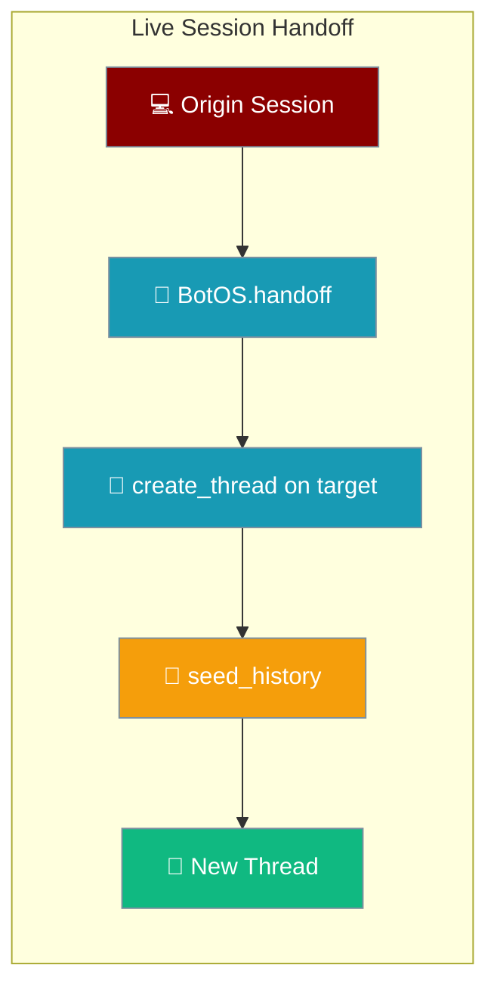
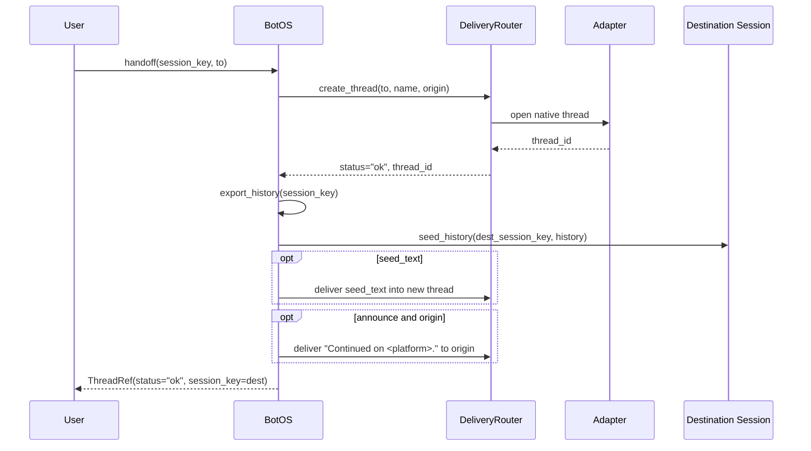
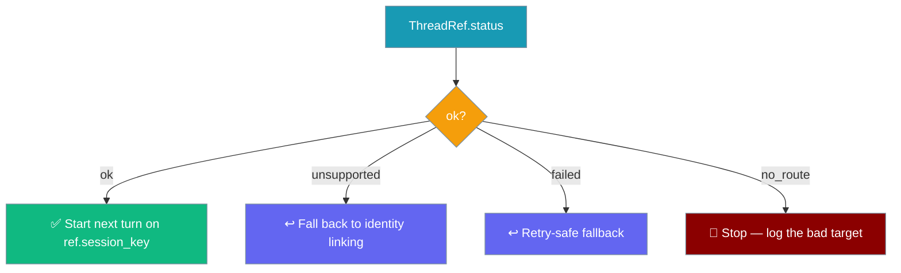

Start a conversation on your laptop, continue it on Telegram — the same session, the same transcript, the next reply lands where you moved.



<Note>
Moving a **live gateway conversation** between platforms is this page. For assembling an agent-side continuation prompt from durable state, see [Session Handoff](/features/session-handoff) — a different feature.
</Note>

## Quick Start

<Steps>
<Step title="Minimal handoff">

```python
from praisonai_bot.bots import BotOS, ThreadRef

ref: ThreadRef = await botos.handoff(session_key, to="telegram")

if ref.ok:
    print(f"Continue on {ref.target}")
```

</Step>

<Step title="With a seed message and breadcrumb">

```python
from praisonai_bot.bots import BotOS, ThreadRef

ref = await botos.handoff(
    session_key,
    to="telegram",
    name="Trip planning",
    seed_text="Continuing here — same conversation.",
    announce=True,
)
```

</Step>
</Steps>

---

## How It Works

`handoff` reuses [`DeliveryRouter.create_thread`](/features/gateway-threads) to open the destination thread, then seeds it with the origin transcript so the conversation continues seamlessly — it adds no new per-platform behaviour.



The destination session key is composed as `platform:channel:thread` — subsequent turns arriving on the new thread route to it through the normal inbound path.

---

## ThreadRef

`handoff` returns a frozen `ThreadRef` describing the destination thread and the session key subsequent turns route to.

| Field | Type | Default | Description |
|-------|------|---------|-------------|
| `platform` | `str` | *(required)* | Destination platform id |
| `channel` | `str` | *(required)* | Destination channel id |
| `thread_id` | `str` | *(required)* | New thread/topic id — `""` on non-`ok` |
| `session_key` | `str` | *(required)* | Destination session key subsequent turns route to — `""` on non-`ok` |
| `status` | `str` | `"ok"` | `"ok"` / `"unsupported"` / `"failed"` / `"no_route"` |
| `ok` | `bool` (property) | — | `status == "ok"` |
| `target` | `str` (property) | — | `"platform:channel:thread"` (or `"platform:channel"` when `thread_id` is empty) |

---

## handoff() Parameters

| Param | Type | Default | Description |
|-------|------|---------|-------------|
| `session_key` | `str` | *(required)* | Resolved session key to move — as reported by `BotSessionManager.warm_sessions` / `get_user_ids` |
| `to` | `str` | *(required)* | Destination target: `"platform"`, `"platform:channel"`, or a router alias |
| `name` | `str` | `""` | Optional thread name (defaults to `"Handoff"`) |
| `seed_text` | `Optional[str]` | `None` | Optional first message posted into the new thread |
| `announce` | `bool` | `True` | Leave a `"Continued on <platform>."` breadcrumb in `origin` |
| `origin` | `Optional[SessionSource]` | `None` | Source of the original request (for breadcrumb + target resolution) |

---

## Status Decision Guide

Every call resolves to exactly one `status` — map it to the right caller action.



| Value | Meaning | Caller action |
|-------|---------|---------------|
| `"ok"` | The thread was created and the session re-homed | Start the next turn on `ref.session_key` |
| `"unsupported"` | The target adapter has no `supports_threads` capability | Fall back to identity linking / pairing |
| `"failed"` | The transport rejected the thread attempt | Retry-safe fallback |
| `"no_route"` | The `to` target didn't resolve to a reachable channel | Stop and log the bad target |

---

## Capability Requirements

The target adapter must set `supports_threads=True` on its `PlatformCapabilities`; otherwise `handoff` returns `status == "unsupported"` and seeds nothing.

| Channel | supports_threads | Handoff |
|---------|:----------------:|---------|
| Telegram | Yes | Forum topic |
| Discord | Yes | Native thread |
| Slack | Yes | Thread anchoring |
| WhatsApp | No | `unsupported` |
| Email | No | `unsupported` |

See [Platform Capabilities](/features/bot-platform-capabilities) for the per-adapter descriptor.

---

## Common Patterns

Chat-command style — a `/handoff <platform>` wrapper moves the session and reports the outcome back.

```python
from praisonai_bot.bots import BotOS, ThreadRef

async def on_handoff_command(botos: BotOS, session_key: str, platform: str, origin):
    ref = await botos.handoff(session_key, to=platform, origin=origin)
    if ref.ok:
        return f"Moved — continue on {ref.target}"
    return f"Could not hand off: {ref.status}"
```

Programmatic hand-off after a long-running step — move the user to their phone once the work is done.

```python
ref = await botos.handoff(session_key, to="telegram", seed_text="Flight booked — continue with me here.")
if not ref.ok:
    ...  # unsupported | failed | no_route — keep the origin conversation
```

---

## Best Practices

<AccordionGroup>
  <Accordion title="Branch on ref.ok — handoff never raises">
    An unsupported or unreachable target returns a non-`ok` `ThreadRef` instead of throwing. Check `ref.ok`; you do not need `try/except`.
  </Accordion>
  <Accordion title="Pass announce=False for batch or CLI origins">
    The `"Continued on <platform>."` breadcrumb interrupts the origin. Silence it with `announce=False` when the origin is a batch job or CLI you don't want to notify.
  </Accordion>
  <Accordion title="Handoff moves the transcript, not the run">
    The next turn starts on the destination as soon as `ref.ok` is `True`. Route the following message to `ref.session_key` — the in-flight run is not transferred.
  </Accordion>
  <Accordion title="Fall back to identity linking on unsupported platforms">
    Platforms without native threads (WhatsApp, Email) return `status == "unsupported"`. Link the user's identities instead of opening a thread.
  </Accordion>
</AccordionGroup>

---

## Related

<CardGroup cols={2}>
  <Card title="Gateway Threads" icon="comments" href="/features/gateway-threads">
    The underlying `create_thread` primitive handoff builds on
  </Card>
  <Card title="Gateway Overview" icon="network-wired" href="/features/gateway-overview">
    Where `BotOS` fits in the gateway
  </Card>
  <Card title="Session Persistence" icon="database" href="/features/gateway-session-persistence">
    Durable transcripts handoff reads and seeds
  </Card>
  <Card title="Session Handoff" icon="clock-rotate-left" href="/features/session-handoff">
    Different feature — agent-side context resume
  </Card>
</CardGroup>
