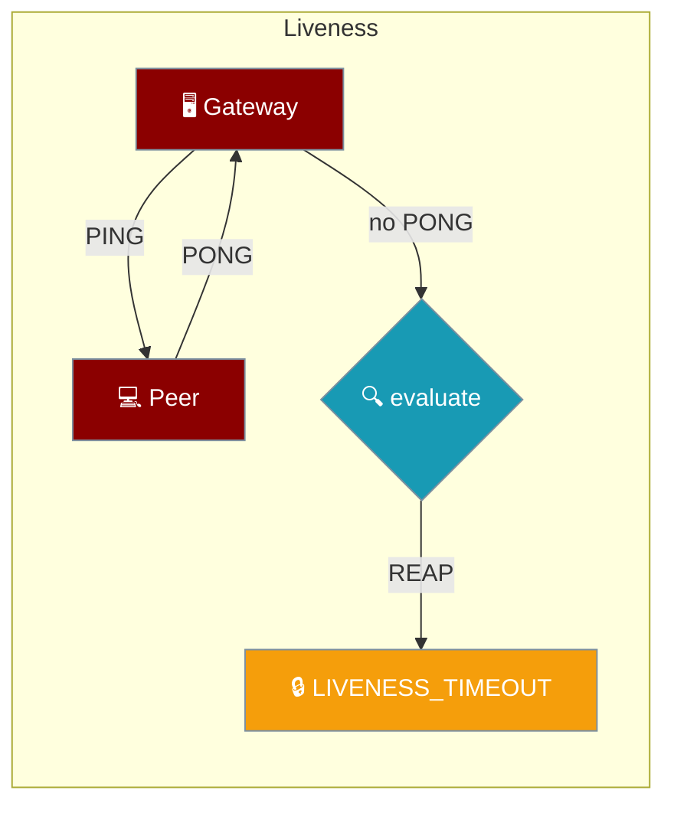
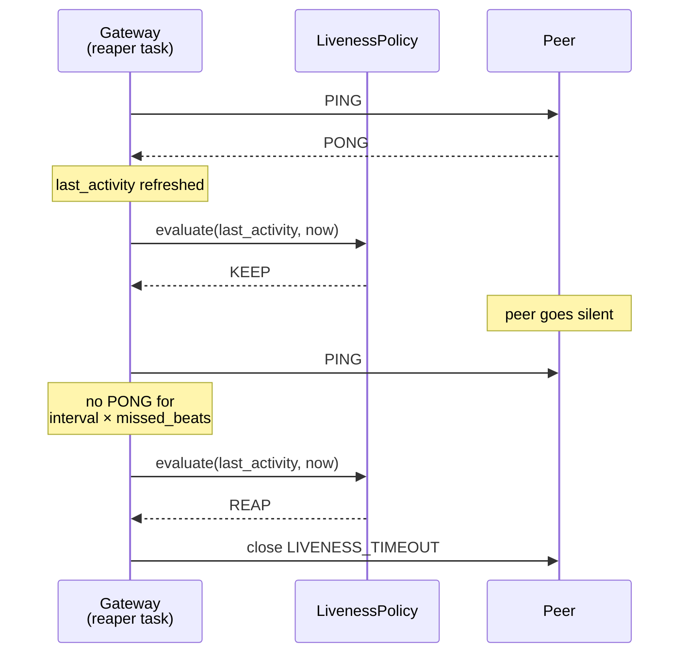
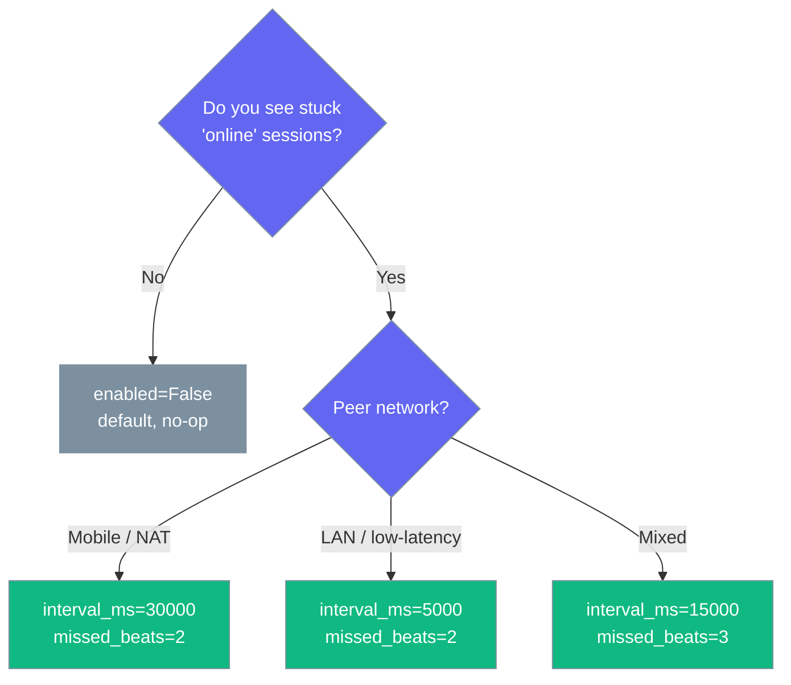

<Note>
The gateway now ships in the `praisonai-bot` package. `praisonai serve gateway` still works exactly as documented here; for a standalone install see [praisonai-bot Migration](/docs/guides/praisonai-bot-migration).
</Note>

Liveness closes half-open gateway connections by heartbeating over the wire and reaping any peer that misses too many beats.



## Quick Start

<Steps>

<Step title="Enable liveness on an agent's gateway">

```python
from praisonaiagents import Agent
from praisonaiagents.gateway import GatewayConfig, LivenessConfig
from praisonai_bot.gateway import WebSocketGateway

gateway = WebSocketGateway(
    config=GatewayConfig(liveness=LivenessConfig(enabled=True))
)
gateway.register_agent(Agent(name="Support", instructions="Reply to users"))
```

</Step>

<Step title="Tune the cadence">

```python
from praisonaiagents.gateway import GatewayConfig, LivenessConfig

config = GatewayConfig(
    liveness=LivenessConfig(
        enabled=True,
        interval_ms=15_000,
        missed_beats_before_reap=3,
    )
)
```

</Step>

<Step title="Or configure it in gateway.yaml">

```yaml
gateway:
  liveness:
    enabled: true
    interval_ms: 15000
    missed_beats_before_reap: 3
```

</Step>

</Steps>

---

## How It Works

The gateway emits a `PING` on each interval; any inbound frame (a `PONG`, a peer `PING`, or a normal message) refreshes `last_activity`. A silent peer misses beats until the reaper closes it.



| Piece | Owner | Role |
|---|---|---|
| `EventType.PING` / `EventType.PONG` | Protocol | Wire frame both peers agree on |
| `LivenessPolicy.evaluate(last_activity, now)` | Core (pure) | Returns `KEEP` or `REAP` |
| Gateway reaper task | Wrapper server | Emits `PING`, calls `evaluate`, closes with `LIVENESS_TIMEOUT` |
| Client watchdog | Reference client | Sends `PING`, force-reconnects on silence |
| `GatewayCloseCode.LIVENESS_TIMEOUT` | Protocol | Typed close code the client can recognise |

A connection is reaped once `now > last_activity + interval_seconds × missed_beats_before_reap`. Setting `enabled=False` (the default) makes `evaluate` always return `KEEP`, so upgrading changes nothing.

---

## Configuration Options

`LivenessConfig` is the user-facing config; `to_policy()` bridges it to the pure `LivenessPolicy` the reaper consumes.

<Card icon="code" href="/docs/sdk/reference/python/gateway/LivenessConfig">
  Full field, type, and default reference
</Card>

---

## Common Patterns

Pick a cadence from the peer's network profile — the default is a no-op until you turn it on.



### Disabled (default)

```python
from praisonaiagents.gateway import GatewayConfig

config = GatewayConfig()  # liveness disabled, behaviour unchanged
```

### Mobile / NAT peers

```python
from praisonaiagents.gateway import GatewayConfig, LivenessConfig

config = GatewayConfig(liveness=LivenessConfig(enabled=True))  # 30s × 2 beats
```

### Aggressive reaping for high-turnover realtime

```python
from praisonaiagents.gateway import GatewayConfig, LivenessConfig

config = GatewayConfig(
    liveness=LivenessConfig(enabled=True, interval_ms=5_000, missed_beats_before_reap=2)
)
```

---

## Best Practices

<AccordionGroup>

<Accordion title="Leave it off until presence lies">
Default is `enabled=False` — behaviour is unchanged. Only enable it when presence stays online after a peer vanishes.
</Accordion>

<Accordion title="Honour the advertised interval on custom clients">
The server advertises `heartbeat_ms`; the reference client's watchdog trips at ~2× that. If you build your own client, honour the advertised value so both sides derive the same window from `reap_deadline` / `interval_seconds`.
</Accordion>

<Accordion title="Treat LIVENESS_TIMEOUT as expected">
Treat this close code as expected. Reconnect and resume — don't surface it as a fatal error to the user.
</Accordion>

</AccordionGroup>

---

## Related

<CardGroup cols={2}>
<Card title="Reliability Preset" icon="shield-check" href="/docs/features/gateway-reliability">
  Related resilience knobs
</Card>
<Card title="Session Continuity" icon="link" href="/docs/features/gateway-session-continuity">
  What survives a reap
</Card>
</CardGroup>
