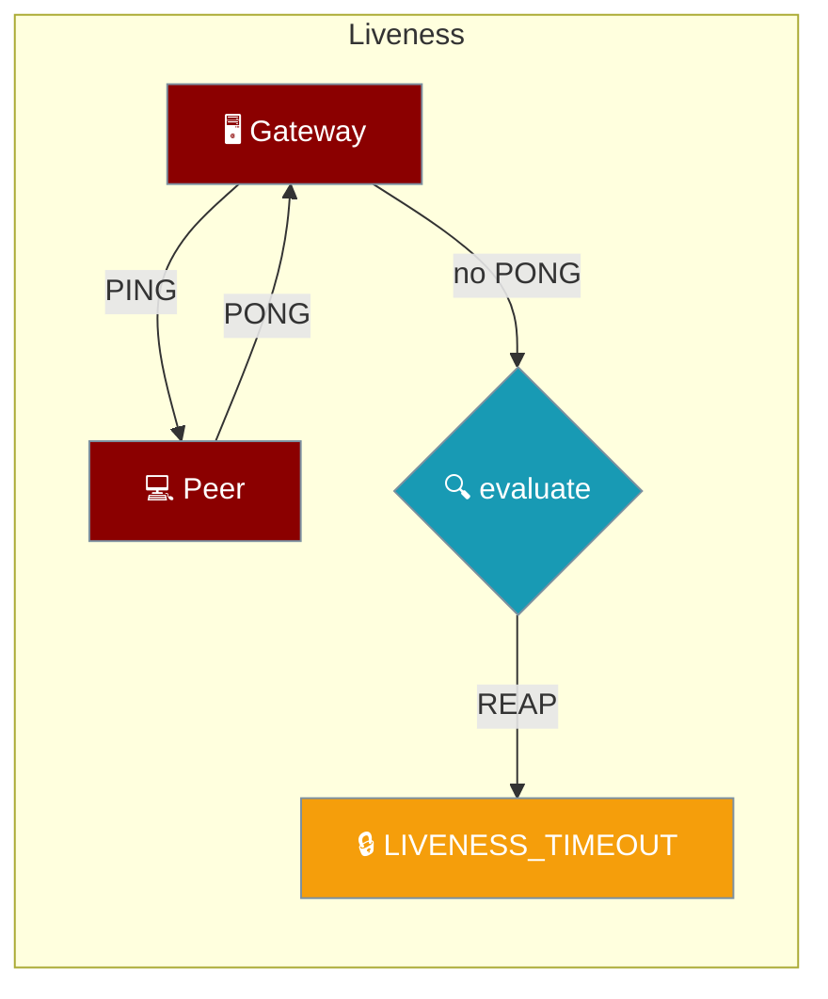
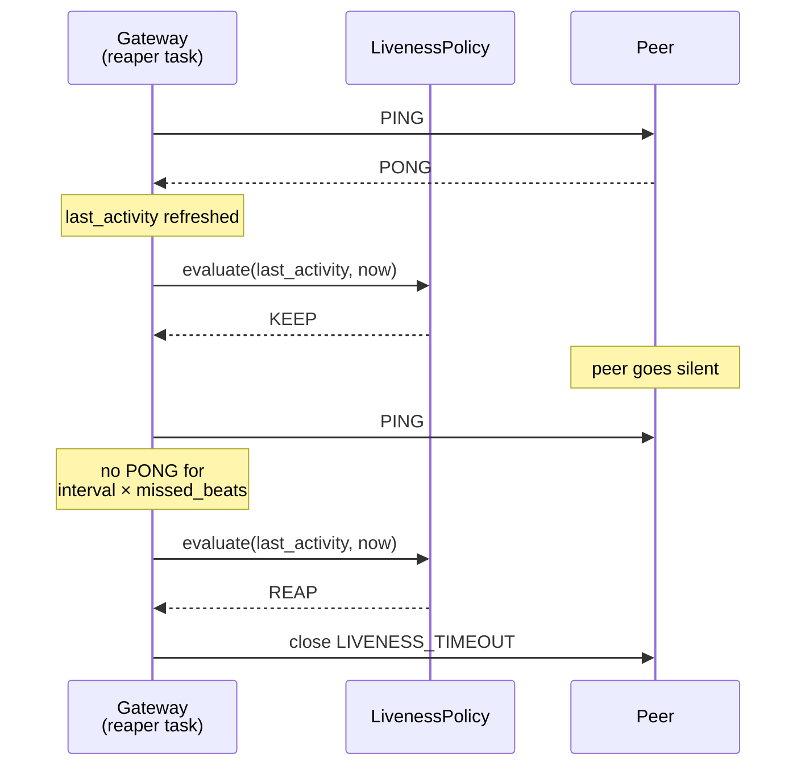
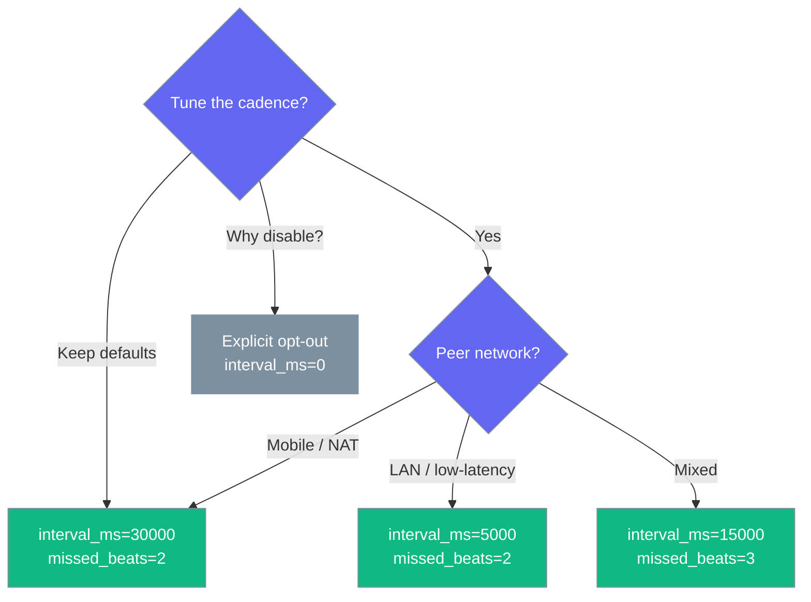

<Note>
The gateway now ships in the `praisonai-bot` package. `praisonai serve gateway` still works exactly as documented here; for a standalone install see [praisonai-bot Migration](/guides/praisonai-bot-migration).
</Note>

<Note>
**Looking for the event-loop watchdog?** This page covers connection-level heartbeats that reap silent clients. To detect a **wedged asyncio loop** (the process is up but the loop isn't running), see [Event-Loop Watchdog](/features/gateway-loop-watchdog).
</Note>

Liveness is on out-of-box: the gateway pings peers on an interval, refreshes activity on every inbound frame, and reaps any session — or any stalled handshake — that misses too many beats.


```mermaid
graph LR
    subgraph "Liveness"
        Server[🖥️ Gateway] -->|PING| Client[💻 Peer]
        Client -->|PONG| Server
        Server -->|no PONG| Reaper{🔍 evaluate}
        Reaper -->|REAP| Close[🔒 LIVENESS_TIMEOUT]
    end

    classDef server fill:#8B0000,stroke:#7C90A0,color:#fff
    classDef proc fill:#189AB4,stroke:#7C90A0,color:#fff
    classDef warn fill:#F59E0B,stroke:#7C90A0,color:#fff
    classDef ok fill:#10B981,stroke:#7C90A0,color:#fff

    class Server,Client server
    class Reaper proc
    class Close warn
```

## Quick Start

<Steps>

<Step title="On by default">

```python
from praisonaiagents import Agent
from praisonai_bot.gateway import WebSocketGateway

# Liveness runs at the config defaults — no LivenessConfig needed.
gateway = WebSocketGateway()
gateway.register_agent(Agent(name="Support", instructions="Reply to users"))
```

</Step>

<Step title="Tune the cadence">

```python
from praisonaiagents.gateway import GatewayConfig, LivenessConfig
from praisonai_bot.gateway import WebSocketGateway

gateway = WebSocketGateway(
    config=GatewayConfig(
        liveness=LivenessConfig(interval_ms=15_000, missed_beats_before_reap=3)
    )
)
```

</Step>

<Step title="Opt out with interval_ms=0">

```python
from praisonaiagents.gateway import GatewayConfig, LivenessConfig
from praisonai_bot.gateway import WebSocketGateway

# The only supported way to fully disable liveness at the runtime.
gateway = WebSocketGateway(
    config=GatewayConfig(liveness=LivenessConfig(enabled=False, interval_ms=0))
)
```

</Step>

</Steps>

<Warning>
`LivenessConfig(enabled=False)` alone does **not** disable liveness. The runtime overrides the config default and synthesises an enabled policy from the config's own window. Set `interval_ms=0` to fully opt out.
</Warning>

---

## How It Works

The gateway emits a `PING` on each interval; any inbound frame (a `PONG`, a peer `PING`, or a normal message) refreshes activity. A silent peer misses beats until the reaper closes it.


```mermaid
sequenceDiagram
    participant Server as Gateway<br/>(reaper task)
    participant Policy as LivenessPolicy
    participant Client as Peer

    Server->>Client: PING
    Client-->>Server: PONG
    Note over Server: last_activity refreshed
    Server->>Policy: evaluate(last_activity, now)
    Policy-->>Server: KEEP

    Note over Client: peer goes silent
    Server->>Client: PING
    Note over Server: no PONG for<br/>interval × missed_beats
    Server->>Policy: evaluate(last_activity, now)
    Policy-->>Server: REAP
    Server->>Client: close LIVENESS_TIMEOUT
```

| Piece | Owner | Role |
|---|---|---|
| `EventType.PING` / `EventType.PONG` | Protocol | Wire frame both peers agree on |
| `LivenessPolicy.evaluate(last_activity, now)` | Core (pure) | Returns `KEEP` or `REAP` |
| `WebSocketGateway._liveness_loop` | Wrapper server | Emits `PING`, evaluates policy, closes reaped peers |
| `WebSocketGateway._client_last_seen[client_id]` | Wrapper server | Per-connection fallback clock so sessionless peers still age out |
| `WebSocketClient._heartbeat_loop` | Reference client | Sends `PING`, force-closes the socket after 2× silence for backoff/resume to reconnect |
| `GatewayCloseCode.LIVENESS_TIMEOUT` | Protocol | Typed close code the client can recognise |

A connection is reaped once `now > last_activity + interval_seconds × missed_beats_before_reap`. Half-open peers with **no bound session yet** (a stalled pre-`hello`/`join` handshake) are evaluated against a per-connection `_client_last_seen` clock, so silent handshake sockets age out instead of leaking forever.

The runtime is **on by default**: the config's `enabled=False` no longer disables it. Only `interval_ms=0` yields a disabled policy, after which the loop stays inert and nothing is reaped.

---

## Health Output

`WebSocketGateway.health()` surfaces the reaper's state when the task is running:

| Field | Type | Description |
|-------|------|-------------|
| `liveness.enabled` | `bool` | True while the reaper is emitting `PING` and evaluating |
| `liveness.interval_ms` | `int` | Cadence being used (same value advertised as `heartbeat_ms`) |
| `liveness.missed_beats_before_reap` | `int` | How many intervals of silence trigger a reap |
| `liveness.reaped_connections` | `int` | Cumulative half-open peers closed with `LIVENESS_TIMEOUT` |

```json
"liveness": {
  "enabled": true,
  "interval_ms": 30000,
  "missed_beats_before_reap": 2,
  "reaped_connections": 4
}
```

---

## LIVENESS_TIMEOUT close code

The reaped peer sees a WebSocket close with:

- **Code:** `4002` (application-defined, private-use 4000–4999 range)
- **Reason:** `"liveness_timeout"` (equal to `GatewayCloseCode.LIVENESS_TIMEOUT.value`)

Custom clients should treat this as expected and reconnect. The reference client's heartbeat loop usually force-reconnects first — after `2 × heartbeat_ms` of silence it closes its own socket so the backoff/resume path re-establishes the connection before the server reaps it.

---

## Configuration Options

`LivenessConfig` is the user-facing config; `to_policy()` bridges it to the pure `LivenessPolicy` the reaper consumes.

<Card icon="code" href="/sdk/reference/praisonaiagents/modules/feature_configs">
  Full field, type, and default reference
</Card>

---

## Common Patterns

Liveness runs at the defaults; pick a cadence from the peer's network profile, or opt out entirely with `interval_ms=0`.


```mermaid
graph TB
    Start{Tune the cadence?} -->|Keep defaults| Def[interval_ms=30000<br/>missed_beats=2]
    Start -->|Yes| Net{Peer network?}
    Net -->|Mobile / NAT| Def
    Net -->|LAN / low-latency| Ag[interval_ms=5000<br/>missed_beats=2]
    Net -->|Mixed| Bal[interval_ms=15000<br/>missed_beats=3]
    Start -->|Why disable?| Opt[Explicit opt-out<br/>interval_ms=0]

    classDef q fill:#6366F1,stroke:#7C90A0,color:#fff
    classDef opt fill:#10B981,stroke:#7C90A0,color:#fff
    classDef off fill:#7C90A0,stroke:#7C90A0,color:#fff

    class Start,Net q
    class Def,Ag,Bal opt
    class Opt off
```

### Out-of-box defaults

```python
from praisonai_bot.gateway import WebSocketGateway

gateway = WebSocketGateway()  # liveness on: 30s × 2 beats
```

### Aggressive reaping for high-turnover realtime

```python
from praisonaiagents.gateway import GatewayConfig, LivenessConfig
from praisonai_bot.gateway import WebSocketGateway

gateway = WebSocketGateway(
    config=GatewayConfig(
        liveness=LivenessConfig(interval_ms=5_000, missed_beats_before_reap=2)
    )
)
```

### Fully disabled

```python
from praisonaiagents.gateway import GatewayConfig, LivenessConfig
from praisonai_bot.gateway import WebSocketGateway

gateway = WebSocketGateway(
    config=GatewayConfig(liveness=LivenessConfig(enabled=False, interval_ms=0))
)
```

---

## Best Practices

<AccordionGroup>

<Accordion title="Only opt out with interval_ms=0">
`enabled=False` alone does not disable liveness — the runtime overrides it and synthesises an enabled policy from the config's window. To fully turn liveness off, set `interval_ms=0`, which yields a disabled policy and keeps the reaper loop inert.
</Accordion>

<Accordion title="Alert on liveness.reaped_connections">
`health()` exposes a cumulative `liveness.reaped_connections` counter. A sudden burst of reaps signals an upstream network problem (flaky peers, NAT timeouts, or a proxy dropping idle sockets) — watch the rate, not just the total.
</Accordion>

<Accordion title="Honour the advertised interval on custom clients">
The server advertises `heartbeat_ms` in `hello_ok`; when liveness is enabled (the default) this equals the policy's `interval_ms`. The reference client already runs `_heartbeat_loop`: it pings every interval and force-closes the socket after `2 × heartbeat_ms` of silence so backoff/resume reconnects. Custom clients should derive the same 2× silence window from the advertised value — miss it and the server closes you with `4002`.
</Accordion>

<Accordion title="Treat LIVENESS_TIMEOUT as expected">
A reaped peer sees `GatewayCloseCode.LIVENESS_TIMEOUT` (value `"liveness_timeout"`, close code `4002`) in the WebSocket close reason. Match on it to reconnect and resume — don't surface it as a fatal error to the user.
</Accordion>

</AccordionGroup>

---

## Related

<CardGroup cols={2}>
<Card title="Doctor Plugins" icon="stethoscope" href="/features/gateway-doctor-plugins">
  Surfaces liveness state in gateway diagnostics
</Card>
<Card title="Reliability Preset" icon="shield-check" href="/features/gateway-reliability">
  Related resilience knobs
</Card>
<Card title="Session Continuity" icon="link" href="/features/gateway-session-continuity">
  What survives a reap
</Card>
<Card title="Event-Loop Watchdog" icon="stethoscope" href="/features/gateway-loop-watchdog">
  Detect a wedged asyncio loop (not just a silent connection)
</Card>
</CardGroup>
