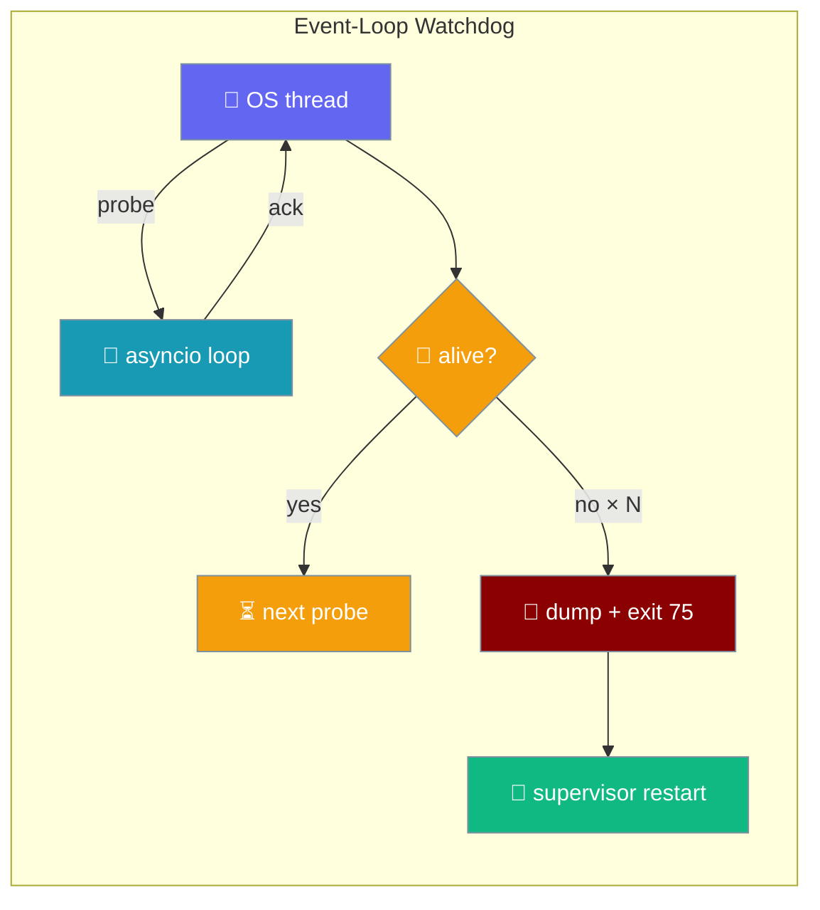
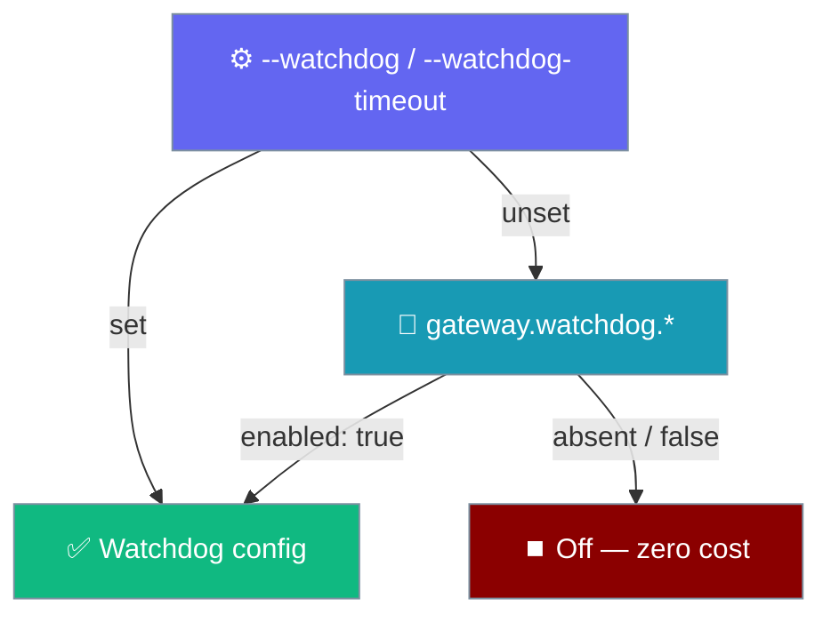
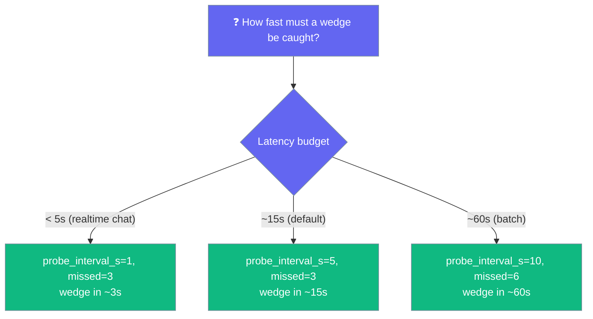

`LoopWatchdog` detects a wedged asyncio loop and hands the process back to your supervisor before the gateway becomes a silent zombie.

<Info>
**Running `praisonai gateway start`?** You don't need to write any Python — the gateway wires the watchdog for you. Add `gateway.watchdog: { enabled: true }` to `gateway.yaml`, or pass `--watchdog` on the CLI. See [Using it from the gateway](#using-it-from-the-gateway) below.
</Info>



<Note>
**Looking for connection heartbeats?** [Gateway Liveness](/features/gateway-liveness) reaps silent **client connections** with `PING`/`PONG` frames. This page covers the **event loop itself** — when the process is up but the loop stops running. The two solve orthogonal problems:

| Concern | Gateway Liveness | Loop Watchdog |
|---|---|---|
| What is dead? | An individual **client connection** | The **event loop itself** (process is a zombie) |
| Detected how? | `PING` / `PONG` frames on the wire | OS-thread probe via `loop.call_soon_threadsafe` |
| Reaction | Close the connection (`LIVENESS_TIMEOUT`) | Dump stacks and `os._exit(75)` for restart |
| Config surface | `LivenessConfig` in `gateway.yaml` | Python opt-in via `watchdog.arm(loop)` |
| Runs on | Gateway reaper task (async) | Dedicated OS thread (survives loop hang) |
</Note>

## Using it from the gateway

Most operators run `praisonai gateway start` — turn the watchdog on with YAML or a CLI flag, no Python required.

<Tabs>

<Tab title="YAML (recommended)">

Add a `watchdog` block under `gateway` and start as usual.

```yaml
# gateway.yaml
gateway:
  watchdog:
    enabled: true
    liveness_interval: 5      # seconds between loop probes
    liveness_strikes: 3       # hard-exit after N consecutive misses (wedge_after ≈ 15s)
    dump_file: /var/log/praisonai/loop-wedge.log   # optional; stderr always gets the dump
```

```bash
praisonai gateway start --config gateway.yaml
```

The gateway arms the watchdog right before `_server.serve()` and disarms it in `finally` and on `stop()`.

</Tab>

<Tab title="CLI flags">

Pass `--watchdog` to enable it for a single run — the flags override the matching YAML fields.

```bash
# Enable with defaults (probe every 5s, wedge after ~15s)
praisonai gateway start --config gateway.yaml --watchdog

# Set a specific wedge budget (splits into 3 strikes → probe interval = budget / 3)
praisonai gateway start --config gateway.yaml --watchdog --watchdog-timeout 15

# Works without a YAML file too (no-config WebSocket-only mode)
praisonai gateway start --watchdog
```

`restart` replays these flags automatically via the persisted start-flags — you do not re-pass them.

</Tab>

<Tab title="Python (custom runtime)">

Embedding your own asyncio runtime? Arm the watchdog on the loop directly.

```python
import asyncio
from praisonaiagents import Agent
from praisonaiagents.gateway import LoopWatchdog

agent = Agent(name="Support", instructions="Reply to users.")

async def serve():
    # ... your long-lived gateway/serving loop here ...
    await asyncio.sleep(3600)

loop = asyncio.new_event_loop()
watchdog = LoopWatchdog()          # probe every 5s, wedge after 3 misses (~15s)
watchdog.arm(loop)
try:
    loop.run_until_complete(serve())
finally:
    watchdog.disarm()
```

</Tab>

</Tabs>

---

## Quick Start (custom runtime)

<Steps>

<Step title="Simple usage (defaults)">

Build an agent, then arm the watchdog on the loop that serves it.

```python
import asyncio
from praisonaiagents import Agent
from praisonaiagents.gateway import LoopWatchdog

agent = Agent(name="Support", instructions="Reply to users.")

async def serve():
    # ... your long-lived gateway/serving loop here ...
    await asyncio.sleep(3600)

loop = asyncio.new_event_loop()
watchdog = LoopWatchdog()          # probe every 5s, wedge after 3 misses (~15s)
watchdog.arm(loop)
try:
    loop.run_until_complete(serve())
finally:
    watchdog.disarm()
```

</Step>

<Step title="Tune the cadence">

Pass a `LoopWatchdogPolicy` to change how fast a wedge is caught.

```python
from praisonaiagents.gateway import LoopWatchdog, LoopWatchdogPolicy

watchdog = LoopWatchdog(LoopWatchdogPolicy(
    probe_interval_s=2.0,               # probe every 2s
    missed_probes_before_wedged=5,      # wedge only after ~10s of silence
    dump_file="/var/log/praisonai/loop-wedge.log",
))
```

</Step>

<Step title="Observe without exiting (dev / staging)">

Use `dump_only` to catch a hang without killing the process.

```python
from praisonaiagents.gateway import LoopWatchdog, LoopWatchdogPolicy

watchdog = LoopWatchdog(LoopWatchdogPolicy(on_wedge="dump_only"))
watchdog.arm(loop)
# ... later ...
if watchdog.wedged:
    print("loop hung at least once; check the stack dump on stderr")
```

</Step>

</Steps>

---

## How It Works

A dedicated OS thread probes the loop, so it keeps working precisely when the loop does not.

```mermaid
sequenceDiagram
    participant Sup as Supervisor
    participant App as Embedder
    participant WD as LoopWatchdog<br/>(OS thread)
    participant Loop as asyncio loop

    App->>WD: arm(loop)
    loop every probe_interval_s
        WD->>Loop: call_soon_threadsafe(_ack)
        alt loop is healthy
            Loop-->>WD: _ack() runs
            Note over WD: missed = 0
        else loop is wedged
            Note over Loop: _ack never runs
            Note over WD: missed += 1
        end
    end
    Note over WD: missed >= threshold
    WD->>WD: faulthandler.dump_traceback(all_threads)
    WD->>Sup: os._exit(75)
    Sup-->>App: restart process
```

| Piece | Owner | Role |
|---|---|---|
| `LoopWatchdogPolicy` | Core (pure) | Configuration: cadence, threshold, on-wedge action, exit code, dump file |
| `LoopWatchdog.arm(loop)` | Embedder call | Spawns daemon OS thread `praisonai-loop-watchdog` |
| Watchdog thread | Runs off-loop | Schedules `_ack` via `call_soon_threadsafe` every interval |
| `faulthandler.dump_traceback(all_threads=True)` | Stdlib | All-thread stack dump on wedge |
| `os._exit(75)` | Stdlib | Bypasses `Py_FinalizeEx` — supervisor sees `EX_TEMPFAIL` |
| `GATEWAY_RESTART_EXIT_CODE` | Protocol | The `75` constant, shared with the restart-intent codes |

The watchdog uses `os._exit`, not `sys.exit`, on a confirmed wedge. Normal interpreter shutdown runs `Py_FinalizeEx`, which would itself hang trying to join the wedged loop thread — so `os._exit` hands the process straight back to the supervisor, which restarts it cleanly.

### Health signal

When the watchdog is configured, `GET /health` (or `gateway.health()` in-process) includes a `watchdog` block.

| Field | Type | Description |
|---|---|---|
| `watchdog.enabled` | `bool` | Always `true` when the block is present (implied by the block existing at all). |
| `watchdog.armed` | `bool` | `true` while `_server.serve()` is running; flips to `false` on graceful `stop()`. |
| `watchdog.wedge_after_s` | `float` | `liveness_interval * liveness_strikes` — the effective wedge budget. |

The block is omitted entirely from `health()` when the watchdog isn't configured — an always-on gateway sees no shape change.

<Note>
The watchdog's `last_lag_ms` property also feeds `pressure.event_loop_lag_p99_ms` on the [Pressure Telemetry](/features/gateway-pressure-telemetry) health block. Note the lag anchor pins to the *oldest* still-unacked probe, so under a multi-interval stall the reported lag reflects the full stall, not just the gap since the newest probe.
</Note>

---

## Configuration Options

`LoopWatchdogPolicy` holds every knob.

| Option | Type | Default | Description |
|--------|------|---------|-------------|
| `probe_interval_s` | `float` | `5.0` | Seconds between liveness probes scheduled onto the loop. Also the cadence at which the watchdog thread wakes. Must be finite and `> 0` (raises `ValueError` on `0`, negative, `NaN`, or `inf`). |
| `missed_probes_before_wedged` | `int` | `3` | Number of **consecutive** probes that must fail to round-trip within their budget before the loop is declared wedged. Must be `>= 1`. |
| `on_wedge` | `"dump_and_exit"` \| `"dump_only"` | `"dump_and_exit"` | What to do once a wedge is confirmed. `"dump_and_exit"` dumps all-thread stacks then calls `os._exit(exit_code)`; `"dump_only"` dumps stacks but leaves the process running. |
| `exit_code` | `int` | `75` (`GATEWAY_RESTART_EXIT_CODE`) | Exit code used when `on_wedge == "dump_and_exit"`. Defaults to EX_TEMPFAIL so a supervisor restarts the process. |
| `dump_file` | `Optional[str]` | `None` | Optional path to *also* write the stack dump to (appended, line-buffered). `None` writes to stderr only. |

**Computed property:**

| Property | Returns | Description |
|---|---|---|
| `wedge_after_s` | `float` | `probe_interval_s * missed_probes_before_wedged` — approximate stall before a wedge is declared (defaults: `~15s`). |

`LoopWatchdog` exposes a small surface:

| Method / property | Description |
|---|---|
| `LoopWatchdog(policy=None)` | Construct with an explicit `LoopWatchdogPolicy` or accept the defaults. |
| `arm(loop)` | Start watching `loop` from a daemon OS thread named `praisonai-loop-watchdog`. Idempotent and fail-open. |
| `disarm()` | Stop watching. Safe to call multiple times / when not armed. Joins the worker (best-effort) with a `probe_interval_s + 1.0s` timeout. |
| `armed` | `True` iff the worker thread is alive. |
| `wedged` | `True` once a wedge has been confirmed (mainly useful for `dump_only`). |

### YAML config keys

The `gateway.watchdog` block is a thin façade over `LoopWatchdogPolicy` for gateway operators.

| YAML key (under `gateway.watchdog.*`) | Type | Default | Maps to | Description |
|---|---|---|---|---|
| `enabled` | `bool` \| `"true"`/`"yes"`/`"on"` | `false` | — | Master switch. Omit or set to `false` and the gateway does not create a watchdog at all — zero cost. |
| `liveness_interval` | `float` | `5.0` | `LoopWatchdogPolicy.probe_interval_s` | Seconds between probes scheduled onto the loop. |
| `liveness_strikes` | `int` | `3` | `LoopWatchdogPolicy.missed_probes_before_wedged` | Consecutive missed probes before a wedge is declared. |
| `dump_file` | `str` \| `null` | `null` | `LoopWatchdogPolicy.dump_file` | Optional path to also write the stack dump to. `null` writes to stderr only. |

An invalid value (for example `liveness_interval: 0`) fails closed: the gateway logs a warning and runs without a watchdog.

### CLI flag reference

- `--watchdog` — enable the watchdog for this run (sets/overrides `gateway.watchdog.enabled: true`).
- `--watchdog-timeout <seconds>` — total wedge budget in seconds. Derives `liveness_interval = budget / liveness_strikes` (keeps the default 3 strikes unless YAML overrides). `--watchdog-timeout 15` → probe every 5s. `--watchdog-timeout 6` → probe every 2s.

### Precedence

Highest wins: `--watchdog[-timeout]` CLI flag → `gateway.watchdog.*` YAML block → off. Missing values fall back down the chain — an unset CLI flag does **not** clobber `enabled: true` in YAML.



---

## Choosing a cadence

Match the probe interval to how fast a wedge must be caught.



Shorter intervals bound recovery time but cost a scheduling roundtrip every N seconds; longer intervals reduce noise and false alerts under GC pauses.

<Warning>
A long stop-the-world GC or a big **synchronous** blocking call inside a coroutine looks like a wedge if it exceeds `wedge_after_s`. If you legitimately do 20-second sync work on the loop, either raise `wedge_after_s` above it or — better — push the work off the loop with `run_in_executor` / `asyncio.to_thread`.
</Warning>

<Info>
`faulthandler` writes one per-thread traceback on a wedge. Read the **loop thread** first (typically `MainThread` or the asyncio worker) — that's where the actual hang is. Other threads may just be blocked waiting on that one.
</Info>

---

## Fail-open guarantees

A misbehaving watchdog must never kill a healthy gateway.

- `arm()` while already armed is a no-op.
- `disarm()` when not armed is safe.
- Any exception inside probe scheduling, dumping, or exiting is swallowed.
- A closed / stopped loop is **not** a wedge — scheduling onto it is a normal shutdown, so the missed counter resets and the watchdog keeps failing open.
- A `disarm()` racing an in-flight wedge suppresses the destructive `os._exit` — a deliberate shutdown never triggers a supervisor restart.

---

## Common Patterns

Three ways teams wire the watchdog.

**Long-lived embedder (production):** keep the defaults and wire the process to your existing supervisor (systemd / Kubernetes / pm2). `EX_TEMPFAIL (75)` is the same exit code the rest of the restart-intent protocol uses, so any supervisor that already restarts the gateway handles this too.

```python
from praisonaiagents.gateway import LoopWatchdog

watchdog = LoopWatchdog()          # defaults trip at ~15s
watchdog.arm(loop)
```

**Diagnostic-only mode (staging):** catch a hang without killing the process, inspect the dump, then flip to `dump_and_exit` in production.

```python
from praisonaiagents.gateway import LoopWatchdog, LoopWatchdogPolicy

watchdog = LoopWatchdog(LoopWatchdogPolicy(
    on_wedge="dump_only",
    dump_file="/var/log/praisonai/loop-wedge.log",
))
watchdog.arm(loop)
```

**Custom exit code for a bespoke supervisor:** override `exit_code` if you can't use `75`.

```python
from praisonaiagents.gateway import LoopWatchdog, LoopWatchdogPolicy

watchdog = LoopWatchdog(LoopWatchdogPolicy(exit_code=42))
watchdog.arm(loop)
```

---

## Best Practices

<AccordionGroup>

<Accordion title="Turn it on wherever a supervisor can restart the process">
systemd's `Restart=on-failure`, launchd's `KeepAlive`, Docker's `restart: unless-stopped`, and Kubernetes all handle exit code 75 correctly. If your supervisor doesn't, the watchdog will still dump stacks but the process won't come back — either fix the supervisor or use `on_wedge="dump_only"` for diagnostics.
</Accordion>

<Accordion title="Prefer YAML over CLI flags for permanent deployments">
CLI flags survive `restart` via persisted start-flags, but a colleague reading `gateway.yaml` learns the watchdog is on. The YAML block is the discoverable configuration surface.
</Accordion>

<Accordion title="Only arm in long-lived processes">
Short-lived CLI runs don't need the watchdog — the process exits anyway. Arm it around gateways, bots, and other loops that must stay up for hours.
</Accordion>

<Accordion title="Always pair arm(loop) with disarm() in finally">
The watchdog is a daemon thread and never blocks shutdown, but `disarm()` also joins it cleanly and prevents any race with a shutdown-time wedge.
</Accordion>

<Accordion title="Do not shorten the interval below your longest sync block">
A 100ms interval false-positives under GC or big JSON serialisation. Keep `probe_interval_s` above your longest expected synchronous block on the loop.
</Accordion>

<Accordion title="Make sure your supervisor restarts on EX_TEMPFAIL">
systemd (`Restart=on-failure`) restarts on `75`; a naive `nohup` does not. See [Exit Codes](/features/gateway-exit-codes) for the full restart-intent contract.
</Accordion>

</AccordionGroup>

---

## Related

<CardGroup cols={2}>

<Card title="Gateway Liveness" icon="heart-pulse" href="/features/gateway-liveness">
Connection-level heartbeats that reap silent clients (disambiguation).
</Card>

<Card title="Exit Codes" icon="hashtag" href="/features/gateway-exit-codes">
The shared `EX_TEMPFAIL (75)` restart-intent protocol.
</Card>

<Card title="Forensics" icon="magnifying-glass" href="/features/gateway-forensics">
What to keep on unhealthy exits.
</Card>

<Card title="Crash-Loop Guard" icon="shield" href="/features/gateway-crash-loop-guard">
Guard against restart storms.
</Card>

<Card title="Restart Continuation" icon="rotate" href="/features/gateway-restart-continuation">
Re-drive interrupted turns after the restart.
</Card>

</CardGroup>

{/* SDK verification — every claim above maps to a test in tests/unit/test_gateway_loop_watchdog.py:
  test_policy_defaults, test_policy_validation, test_policy_rejects_non_finite_interval,
  test_disarm_when_not_armed_is_safe, test_healthy_loop_not_tripped, test_wedged_loop_detected,
  test_wedge_writes_dump_file, test_arm_is_idempotent, test_disarm_suppresses_in_flight_exit,
  test_closed_loop_does_not_trip.
  Source: praisonaiagents/gateway/liveness.py; re-exported from praisonaiagents/gateway/__init__.py;
  GATEWAY_RESTART_EXIT_CODE = 75 in praisonaiagents/gateway/protocols.py. */}
