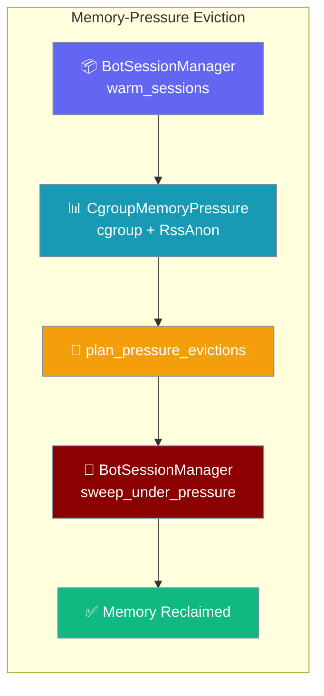
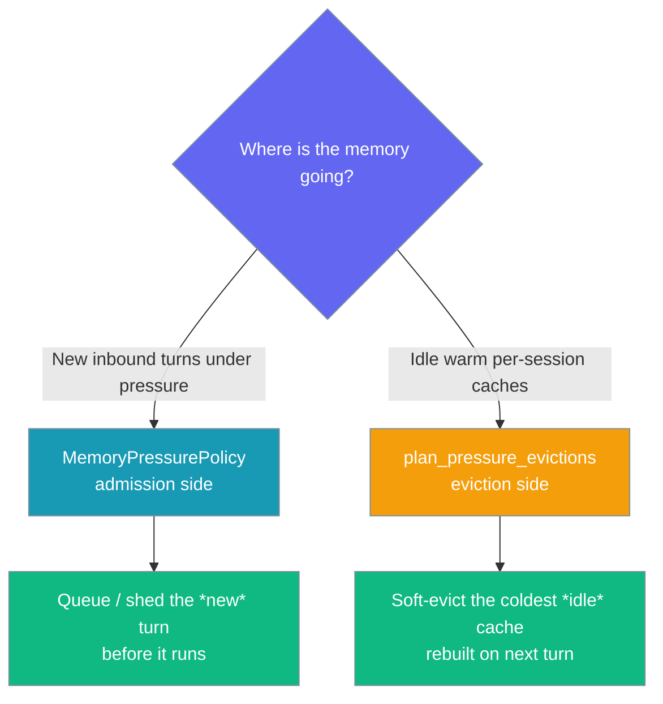
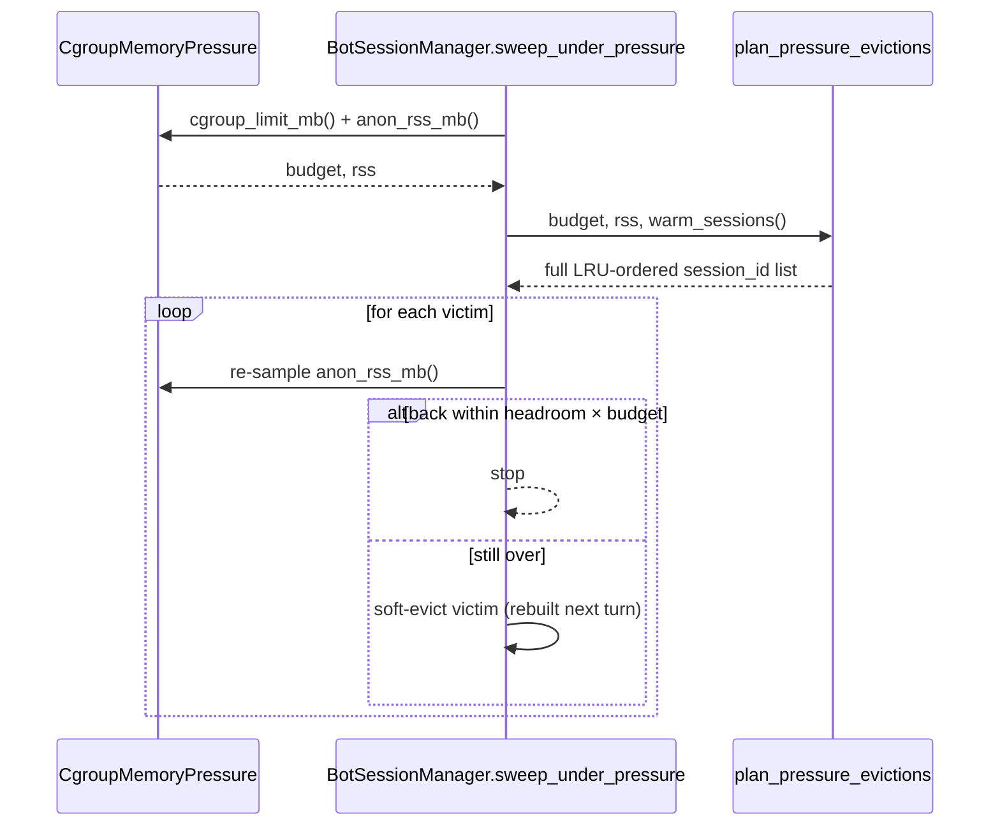

The eviction planner names the coldest idle warm caches to reclaim under memory pressure, so a busy gateway on a small host survives instead of being OOM-killed.

```python
from praisonaiagents import Agent
from praisonai.bots import BotOS

agent = Agent(name="Support", instructions="Help users")

# On a memory-limited host (a $5 VPS, a Fly machine, a k8s cgroup),
# the gateway automatically soft-evicts the coldest warm caches under
# pressure before the OOM killer fires — no config needed.
# A persistent session store (SQLite, Postgres) is what makes soft
# eviction rebuildable, so it must be configured for eviction to be active.
bot = BotOS(agent=agent, platforms=["telegram"])
bot.start()
```

Each evicted session is transparently rebuilt from the persisted session store on its next turn — cheap and lossless, with no user-visible impact.



<Note>
`MemoryPressurePolicy` sheds *new* turns under pressure; this planner reclaims memory from *idle warm* caches. See [Admission Control · Memory-aware admission](/features/gateway-admission-control#memory-aware-admission) for the sibling admission-side control.
</Note>

## Quick Start

<Steps>

<Step title="On by default on cgroup-aware Linux hosts">
No knob to set. On a Linux host that can read a cgroup v1/v2 memory limit, the gateway samples RSS and soft-evicts the coldest rebuildable caches under pressure on its periodic tick. On a host that can't report a cgroup limit (macOS/Windows, unconstrained host), the sweep is a no-op — legacy behaviour is preserved exactly.

```python
from praisonaiagents import Agent
from praisonai.bots import BotOS

agent = Agent(name="Support", instructions="Help users")
bot = BotOS(agent=agent, platforms=["telegram"])
bot.start()
```
</Step>

<Step title="Add a persistent store to make eviction rebuildable">
A cache is only evicted when its transcript is durably persisted, so it can be losslessly rebuilt on the next turn. A `BotSessionManager` reads/writes that store via its `store=` argument. Without a store, nothing is flushed, nothing is evicted, and the sweep is a no-op.

```python
from praisonaiagents.session.store import DefaultSessionStore
from praisonai_bot.bots._session import BotSessionManager

# A persistent store makes each warm cache rebuildable — the precondition
# for soft eviction. See Gateway Session Persistence for store options.
session_manager = BotSessionManager(store=DefaultSessionStore("./sessions"))
```

For a full `BotOS` deployment, configure the store through `gateway.yaml` (`session.persist: true`) — see [Gateway Session Persistence](/features/gateway-session-persistence).
</Step>

<Step title="Trigger the sweep yourself">
Running the session manager standalone (no `BotOS`)? Call the enactor directly with the concrete cgroup probe:

```python
from praisonai_bot.gateway import CgroupMemoryPressure

# session_manager is your BotSessionManager instance
evicted = session_manager.sweep_under_pressure(CgroupMemoryPressure(), headroom=0.9)
```
</Step>

</Steps>

---

## Which primitive?

Two gateway primitives protect memory from opposite sides — this diagram picks the right one.



Use both together for full memory protection: admission gates *new* work; the planner reclaims from *idle* warm caches.

---

## API Reference

Three symbols export from `praisonaiagents.gateway`:

```python
from praisonaiagents.gateway import (
    WarmSession,
    MemoryPressureProtocol,
    plan_pressure_evictions,
)
```

### `WarmSession`

A frozen dataclass carrying a pure fact from the running gateway to the planner.

| Field | Type | Default | Description |
|---|---|---|---|
| `session_id` | `str` | *(required)* | The cache key to soft-evict. |
| `last_activity` | `float` | `0.0` | Monotonic/epoch seconds of the session's last turn; the planner evicts the coldest (smallest `last_activity`) first. |
| `in_flight` | `bool` | `False` | `True` while a turn is executing — never evicted (would abort live work). |
| `flushed` | `bool` | `True` | `True` when the transcript is durably persisted — only a flushed cache is rebuildable, so an unflushed one is never evicted (would lose data). |

### `MemoryPressureProtocol`

A `@runtime_checkable` Protocol the gateway implements over its own process to report the container's memory ceiling and current RSS.

| Method | Returns | Description |
|---|---|---|
| `cgroup_limit_mb()` | `Optional[float]` | The container memory limit in MiB (from the cgroup v1/v2 memory limit), or `None` if unknown. |
| `anon_rss_mb()` | `float` | Current anonymous (non-reclaimable) RSS in MiB. |

### `plan_pressure_evictions`

```python
plan_pressure_evictions(
    budget_mb: Optional[float],
    rss_mb: float,
    warm_sessions: Sequence[WarmSession],
    *,
    headroom_ratio: float = 0.9,
) -> List[str]
```

Returns the `session_id`s to soft-evict, coldest (LRU) first, tie-broken by `session_id` (stable). It never touches the caches — the gateway is the enactor.

| Parameter | Type | Default | Description |
|---|---|---|---|
| `budget_mb` | `Optional[float]` | *(required)* | The container memory budget in MiB (typically the cgroup limit). |
| `rss_mb` | `float` | *(required)* | The current anonymous RSS in MiB. |
| `warm_sessions` | `Sequence[WarmSession]` | *(required)* | The warm-cache registry to consider. |
| `headroom_ratio` | `float` | `0.9` | Fraction of the budget to shed back down to. Clamped to `(0.0, 1.0]`; non-finite / out-of-range values fall back to `0.9`. |

Returns `[]` when RSS is within budget, the budget is unknown (`None` / `<= 0`), the budget or RSS is non-finite (NaN/inf), or nothing evictable remains.

---

## Using `CgroupMemoryPressure`

`CgroupMemoryPressure` is the concrete, stdlib-only `MemoryPressureProtocol` the gateway uses to read the real cgroup budget and anonymous RSS.

```python
from praisonai_bot.gateway import CgroupMemoryPressure

probe = CgroupMemoryPressure()
probe.cgroup_limit_mb()  # -> float | None (MiB)
probe.anon_rss_mb()      # -> float (MiB)
```

| Method | Reads | Unavailable degrades to |
|---|---|---|
| `cgroup_limit_mb()` | cgroup v2 `memory.high` / `memory.max`, then cgroup v1 `memory.limit_in_bytes` | `None` |
| `anon_rss_mb()` | `RssAnon` from `/proc/self/status` | `0.0` |

A nested cgroup's lower limit is preferred: `cgroup_limit_mb()` resolves the process's own cgroup path from `/proc/self/cgroup` first, then falls back to the filesystem root. Every source degrades safely, so on a host with no cgroup limit the sweep is a no-op.

---

## Wrapper-side wiring

`BotSessionManager` is the runtime enactor — it snapshots warm caches, calls the pure planner, and soft-evicts the losers.

### `warm_sessions`

```python
BotSessionManager.warm_sessions() -> List[WarmSession]
```

Snapshots the warm per-session caches as core `WarmSession` facts (LRU `last_activity`, `in_flight`, `flushed`). A cache is `flushed` only when a persistent store is configured **and** its last store write succeeded.

### `sweep_under_pressure`

```python
BotSessionManager.sweep_under_pressure(
    memory_pressure: MemoryPressureProtocol,
    headroom: float = 0.9,
) -> int
```

Reads the real cgroup budget/RSS from `memory_pressure`, calls `plan_pressure_evictions`, and soft-evicts the coldest rebuildable caches LRU-first — re-sampling RSS to shed the minimum. Returns the number evicted. A no-op (returns `0`) when no cgroup limit is reported.

| Parameter | Type | Default | Description |
|---|---|---|---|
| `memory_pressure` | `MemoryPressureProtocol` | *(required)* | The probe reporting `cgroup_limit_mb()` and `anon_rss_mb()` — typically `CgroupMemoryPressure()`. |
| `headroom` | `float` | `0.9` | Shed until RSS is back within `headroom × budget`. Passed through to the planner's `headroom_ratio`. |

---

## How It Works

The gateway samples its own memory, asks the planner for the order to evict, then enacts it — re-sampling RSS as it goes.



The planner returns the **full ordered list**, not a prefix — the gateway re-samples RSS as it evicts and stops as soon as RSS is back within `headroom_ratio × budget` (default `0.9`). It is byte-agnostic by design: it never guesses per-cache sizes, so over-shedding is avoided by the enactor and under-shedding is caught on the next pass.

**Guards** — a victim is skipped entirely (never evicted) when:

| Guard | Why |
|---|---|
| `in_flight=True` | An executing turn must not be aborted. Re-checked at enact time — a turn may have started against a planned victim between the plan and the enact. |
| `flushed=False` | An unflushed transcript is not yet rebuildable from the store — evicting it would lose data. `flushed=True` requires a configured store **and** a successful last write; a caught store-write failure clears the marker, so the sweep skips the cache. |

**Degraded modes** — the planner never crashes the gateway it protects, returning `[]` when:

| Input | Result |
|---|---|
| `budget_mb=None` | `[]` (host can't report a cgroup limit — never soft-evicts) |
| `budget_mb <= 0` | `[]` |
| non-finite `budget`/`rss` (NaN/inf) | `[]` (a NaN would otherwise slip past the threshold and evict *every* cache) |
| non-numeric `budget`/`rss` | `[]` |
| non-finite / non-numeric `headroom_ratio` | falls back to `0.9` |

---

## Configuration

The single tunable is `headroom_ratio` — the fraction of the budget the gateway sheds back down to.

| Option | Type | Default | Description |
|---|---|---|---|
| `headroom_ratio` | `float` | `0.9` | Shed until RSS is back within `headroom_ratio × budget`. Clamped to `(0.0, 1.0]`; non-finite or out-of-range values fall back to `0.9`. |

```python
from praisonaiagents.gateway import WarmSession, plan_pressure_evictions

warm = [WarmSession(session_id="a", last_activity=1.0)]

# 800 MiB is within 90% of 1000, but breaches 70% — drop the ratio to reclaim earlier.
assert plan_pressure_evictions(1000.0, 800.0, warm) == []
assert plan_pressure_evictions(1000.0, 800.0, warm, headroom_ratio=0.7) == ["a"]
```

---

## User Interaction Flow

A Fly machine with a **512 MiB** cgroup limit hosts a Telegram bot that has accumulated **60 warm session caches**. A burst pushes RSS to **490 MiB** — over `0.9 × 512 ≈ 460 MiB`.

1. `CgroupMemoryPressure` reads `cgroup_limit_mb() = 512`, `anon_rss_mb() = 490`.
2. `plan_pressure_evictions` names the **40 evictable** sessions LRU-first (in-flight and unflushed ones are skipped).
3. `sweep_under_pressure` evicts down the list, re-sampling RSS, and stops at **~460 MiB**.
4. Those users get their cache rebuilt transparently on their next turn.

No user-visible impact. No OOM kill.

On each periodic tick the gateway already runs `reap_stale`; the new sweep sits alongside it and is a no-op when the host has no cgroup limit:

```python
from praisonai_bot.gateway import CgroupMemoryPressure

probe = CgroupMemoryPressure()

# session_manager is your BotSessionManager instance
session_manager.reap_stale(max_age_seconds=3600)
session_manager.sweep_under_pressure(probe, headroom=0.9)
```

---

## Common Patterns

**Combine with `MemoryPressurePolicy` for full memory protection** — admission gates *new* work, the planner reclaims from *idle* warm caches:

```python
from praisonaiagents import Agent
from praisonai.bots import BotOS

agent = Agent(name="Support", instructions="Help users")

# Admission side: shed new turns under RSS pressure. Eviction side is on by
# default on cgroup-aware hosts — together they cover both memory sources.
bot = BotOS(agent=agent, platforms=["telegram"], max_rss_mb=512)
bot.start()
```

**Custom `MemoryPressureProtocol` for non-Linux hosts** — supply a macOS/Windows probe:

```python
from praisonaiagents.gateway import MemoryPressureProtocol

class MacProbe:
    def cgroup_limit_mb(self):
        return 2048.0  # from your platform's memory limit
    def anon_rss_mb(self):
        return 512.0   # from psutil or a platform API

assert isinstance(MacProbe(), MemoryPressureProtocol)
```

**Tune `headroom_ratio` for hosts with spiky per-turn allocations** — drop to `0.8` to leave more headroom:

```python
from praisonaiagents.gateway import WarmSession, plan_pressure_evictions

warm = [WarmSession(session_id="s", last_activity=1.0)]
victims = plan_pressure_evictions(1000.0, 850.0, warm, headroom_ratio=0.8)
assert victims == ["s"]
```

---

## Best Practices

<AccordionGroup>
  <Accordion title="Never re-implement the planner in an adapter">
    Call `plan_pressure_evictions` and enact the returned list. The decision is pure and unit-tested in isolation — a re-implementation drifts from the guards and degraded-mode returns.
  </Accordion>

  <Accordion title="The planner is byte-agnostic — re-sample RSS as you evict">
    It returns the full LRU-ordered list, not a prefix, and never guesses per-cache sizes. Evict down the list and stop as soon as RSS is back within `headroom_ratio × budget`. Never guess how much each cache will free.
  </Accordion>

  <Accordion title="Never evict in_flight=True or flushed=False">
    The planner already skips them — an executing turn would be aborted, and an unflushed transcript isn't rebuildable yet. Do not override the guards in your enactor.
  </Accordion>

  <Accordion title="Trust the degraded-mode returns">
    An empty list means "no work to do" — RSS within budget, unknown/`<= 0` budget, non-finite inputs, or nothing evictable. It never means the planner is broken; it never crashes the gateway it protects.
  </Accordion>
</AccordionGroup>

---

## Related

<CardGroup cols={2}>
  <Card title="Admission Control · Memory-aware" icon="shield-check" href="/features/gateway-admission-control#memory-aware-admission">
    The admission-side sibling — sheds *new* turns under RSS pressure with `MemoryPressurePolicy`
  </Card>
  <Card title="Gateway Reliability Presets" icon="shield-check" href="/features/gateway-reliability">
    One switch that composes the gateway's protective primitives
  </Card>
  <Card title="Gateway Session Persistence" icon="database" href="/features/gateway-session-persistence">
    Why evicted caches can be losslessly rebuilt — an unflushed transcript is never evicted
  </Card>
  <Card title="Gateway Graceful Drain" icon="power-off" href="/features/gateway-graceful-drain">
    The other "avoid dropping live sessions" primitive
  </Card>
</CardGroup>

<Note>
Core planner introduced in [PraisonAI PR #3805](https://github.com/MervinPraison/PraisonAI/pull/3805) (fixes [#3804](https://github.com/MervinPraison/PraisonAI/issues/3804)). Wrapper-side wiring (`CgroupMemoryPressure`, `BotSessionManager.warm_sessions` / `sweep_under_pressure`, per-turn in-flight and flushed guards) added in [PR #4296](https://github.com/MervinPraison/PraisonAI/pull/4296) (fixes [#4294](https://github.com/MervinPraison/PraisonAI/issues/4294)).
</Note>
