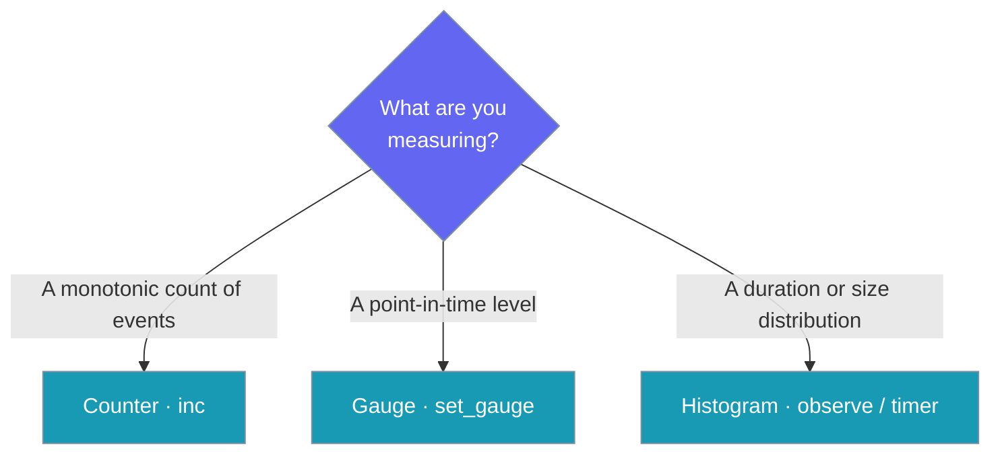

<Note>
The gateway now ships in the `praisonai-bot` package. `praisonai serve gateway` still works exactly as documented here; for a standalone install see [praisonai-bot Migration](/guides/praisonai-bot-migration).
</Note>


Scrape `GET /metrics` on the PraisonAI gateway to feed Prometheus — counters, gauges, **and latency histograms** for every hop of the message flow, zero new dependencies.

```python
from praisonaiagents import Agent
from praisonai.bots import GatewayMetrics

agent = Agent(name="assistant", instructions="Be helpful")

metrics = GatewayMetrics()
with metrics.timer("gateway_turn_latency_seconds", labels={"platform": "telegram"}):
    agent.start("Handle user messages while metrics export on GET /metrics")
```

```bash
curl -sH "Authorization: Bearer $PRAISONAI_GATEWAY_AUTH_TOKEN" http://localhost:8765/metrics
```


The user scrapes `GET /metrics` while messaging the gateway; counters, gauges, and latency histograms record inbound, agent, and outbound hops.


## Quick Start

<Steps>
  <Step title="Start the gateway with auth_token set">
    ```yaml
    gateway:
      host: "0.0.0.0"
      port: 8765
      auth_token: ${PRAISONAI_GATEWAY_AUTH_TOKEN}
    ```
    ```bash
    export PRAISONAI_GATEWAY_AUTH_TOKEN=secret
    praisonai gateway start --config gateway.yaml
    ```
  </Step>

  <Step title="Scrape the metrics endpoint">
    ```bash
    curl -sH "Authorization: Bearer $PRAISONAI_GATEWAY_AUTH_TOKEN" \
      http://localhost:8765/metrics
    ```
  </Step>

  <Step title="Read the Prometheus exposition output">
    ```
    # HELP channel_restarts_total Total channel restarts performed by supervision.
    # TYPE channel_restarts_total counter
    channel_restarts_total{channel="telegram"} 2.0
    # HELP messages_dispatched_total Total inbound messages dispatched to an agent run.
    # TYPE messages_dispatched_total counter
    messages_dispatched_total 184.0
    # HELP messages_inbound_total Total inbound messages received by the gateway.
    # TYPE messages_inbound_total counter
    messages_inbound_total 187.0
    # HELP outbound_failed_total Total outbound messages that failed delivery.
    # TYPE outbound_failed_total counter
    outbound_failed_total{channel="discord"} 1.0
    # HELP outbound_sent_total Total outbound messages successfully delivered.
    # TYPE outbound_sent_total counter
    outbound_sent_total{channel="telegram"} 184.0
    # HELP active_sessions Current number of active gateway sessions.
    # TYPE active_sessions gauge
    active_sessions 5.0
    # HELP channel_recoveries Total supervision recoveries per channel.
    # TYPE channel_recoveries gauge
    channel_recoveries{channel="telegram"} 2.0
    # HELP gateway_turn_latency_seconds Turn latency (inbound received -> reply delivered).
    # TYPE gateway_turn_latency_seconds histogram
    gateway_turn_latency_seconds_bucket{platform="telegram",le="0.1"} 0
    gateway_turn_latency_seconds_bucket{platform="telegram",le="0.25"} 1
    gateway_turn_latency_seconds_bucket{platform="telegram",le="0.5"} 3
    gateway_turn_latency_seconds_bucket{platform="telegram",le="1.0"} 5
    gateway_turn_latency_seconds_bucket{platform="telegram",le="+Inf"} 5
    gateway_turn_latency_seconds_sum{platform="telegram"} 1.87
    gateway_turn_latency_seconds_count{platform="telegram"} 5
    ```
  </Step>
</Steps>

---

## How It Works

```mermaid
sequenceDiagram
    participant Scraper
    participant Gateway as Gateway /metrics
    participant Auth as _check_auth
    participant Refresh as _refresh_metric_gauges
    participant Registry as GatewayMetrics

    Scraper->>Gateway: GET /metrics
    Gateway->>Auth: token check
    Auth-->>Gateway: 200 OK
    Gateway->>Refresh: sample live gauges
    Refresh->>Registry: set_gauge("active_sessions", ...)
    Refresh->>Registry: set_gauge("channel_recoveries", ...)
    Gateway->>Registry: render_prometheus()
    Registry-->>Gateway: text/plain; version=0.0.4
    Gateway-->>Scraper: Prometheus exposition
```

Gauges are sampled on every scrape — not pushed on a timer. The `/metrics` endpoint calls `_refresh_metric_gauges()` before rendering, so `active_sessions` and `channel_recoveries` always reflect the live gateway state.

---

## Configuration Options

Pick the metric type that matches what you are measuring.



### Authentication

The `/metrics` endpoint uses the same `_check_auth` gate as other operational endpoints (e.g. `/info`).

| Method | How |
|--------|-----|
| **Cookie session** | Active browser session |
| **Loopback bypass** | Requests from `127.0.0.1` / `::1` bypass token check |
| **Bearer token** | `Authorization: Bearer <token>` header |
| **Query param** | `?token=<token>` (deprecated) |

Returns `401` if token is required but missing; `403` on token mismatch.

<Note>
If `auth_token` is not set in the gateway config, the endpoint is open to all callers. Set `auth_token` before binding to non-loopback addresses.
</Note>

### Counters

| Name | Help |
|------|------|
| `messages_inbound_total` | Total inbound messages received by the gateway. |
| `messages_dispatched_total` | Total inbound messages dispatched to an agent run. |
| `messages_duplicate_total` | Total inbound messages dropped as duplicates. |
| `outbound_sent_total` | Total outbound messages successfully delivered. |
| `outbound_failed_total` | Total outbound messages that failed delivery. |
| `approval_pending_total` | Total approval requests created. |
| `approval_decided_total` | Total approval requests decided (allowed or denied). |
| `channel_errors_total` | Total channel errors observed by supervision. |
| `channel_restarts_total` | Total channel restarts performed by supervision. |

### Gauges

| Name | Help |
|------|------|
| `outbox_depth` | Current number of messages pending outbound delivery. |
| `approval_pending` | Current number of approvals awaiting a decision. |
| `active_sessions` | Current number of active gateway sessions. |
| `channel_recoveries` | Total supervision recoveries per channel. |

**Labels:** Counters and gauges accept an arbitrary `labels` dict (string→string). Channel-scoped metrics use `labels={"channel": <name>}`. Labels are rendered as sorted, deterministic `name{a="b",c="d"} value`.

<Note>
`messages_inbound_total` is incremented on every inbound message via `_record_channel_inbound`, carrying a single `channel` label — one time series per configured channel (including Telegram polling injected through `_inject_routing_handler`). The `praisonai gateway test --check-inbound` command scrapes this counter to compute a per-window delta as live-delivery proof. See [Inbound tier](/docs/features/gateway-readiness#inbound-tier-check-inbound).
</Note>

### Histograms

Histograms record latency distributions per hop, so you can compute p50/p95/p99 straight from `/metrics`.


Five histograms are pre-registered with help text:

| Name | Help |
|------|------|
| `gateway_turn_latency_seconds` | Turn latency (inbound received -> reply delivered). |
| `gateway_llm_latency_seconds` | LLM-call latency in seconds. |
| `gateway_tool_latency_seconds` | Tool-call latency in seconds. |
| `gateway_queue_wait_seconds` | Admission/queue wait time before dispatch. |
| `gateway_outbound_latency_seconds` | Outbound send latency in seconds. |

`observe(name, seconds, buckets=DEFAULT_BUCKETS, labels=None)` records a duration into cumulative buckets plus running `_sum` / `_count`. `timer(name, ...)` is a context manager that times its body with `time.perf_counter()` and calls `observe`. Both default to `DEFAULT_BUCKETS`:

```python
DEFAULT_BUCKETS = (0.005, 0.01, 0.025, 0.05, 0.1, 0.25, 0.5, 1.0, 2.5, 5.0, 10.0)
```

<Note>
**Histogram invariants (enforced by the SDK):**
- Buckets must be **finite** and **strictly increasing** — `NaN`, `±Inf`, duplicates, or decreases raise `ValueError`.
- The `+Inf` bucket is appended automatically at render time — supply only finite bounds.
- A histogram `name` is **pinned to its first bucket set**; re-observing the same name with different buckets raises `ValueError`.
- `"le"` is a **reserved label** and cannot appear in your `labels` dict.
</Note>

---

## Common Patterns

### Recording a custom counter

```python
from praisonai.gateway.server import WebSocketGateway

gateway = WebSocketGateway.from_config_file("gateway.yaml")

gateway.record_metric("messages_inbound_total", labels={"channel": "telegram"})
```

### Fetching a JSON snapshot in tests

```python
snap = gateway.metrics_snapshot()
# {
#   "counters":  {"messages_inbound_total{channel=\"telegram\"}": 1.0, ...},
#   "gauges":    {"active_sessions": 5.0, ...},
#   "histograms":{
#       "gateway_turn_latency_seconds_count":               2.0,
#       "gateway_turn_latency_seconds_sum":                 1.8,
#       "gateway_turn_latency_seconds_bucket{le=\"0.5\"}":  1.0,
#       "gateway_turn_latency_seconds_bucket{le=\"2.5\"}":  2.0,
#   },
# }
```

### Prometheus scrape config

```yaml
scrape_configs:
  - job_name: praisonai-gateway
    metrics_path: /metrics
    bearer_token: ${PRAISONAI_GATEWAY_AUTH_TOKEN}
    static_configs:
      - targets: ["gateway.internal:8765"]
```

### Using `GatewayMetrics` directly

```python
from praisonai.bots import GatewayMetrics

metrics = GatewayMetrics()

metrics.inc("messages_inbound_total", labels={"channel": "telegram"})
metrics.set_gauge("active_sessions", 5.0)

print(metrics.counter_value("messages_inbound_total", labels={"channel": "telegram"}))
print(metrics.render_prometheus())
```

### Timing a stage with `timer()`

```python
from praisonai.bots import GatewayMetrics

metrics = GatewayMetrics()

with metrics.timer("gateway_turn_latency_seconds", labels={"platform": "telegram"}):
    reply = run_turn(event)
```

### Recording a measured duration with `observe()`

```python
from praisonai.bots import GatewayMetrics

metrics = GatewayMetrics()

metrics.observe("gateway_llm_latency_seconds", llm_elapsed_seconds)
metrics.observe(
    "gateway_tool_latency_seconds",
    tool_elapsed_seconds,
    labels={"tool": "search"},
)
```

### Custom buckets for a different latency profile

```python
from praisonai.bots import GatewayMetrics

metrics = GatewayMetrics()

metrics.observe(
    "gateway_queue_wait_seconds",
    wait_seconds,
    buckets=(0.001, 0.005, 0.01, 0.05, 0.1),
)
```

The bucket set is pinned to the histogram name on first observation — re-observing with different bounds raises `ValueError`.

---

## Best Practices

<AccordionGroup>
  <Accordion title="Set auth_token before binding to non-loopback">
    Always configure `auth_token` in `gateway.yaml` when your gateway binds to `0.0.0.0` or a public address. Without it, `/metrics` is open to the network.
  </Accordion>

  <Accordion title="Use a scrape interval of 5s or longer">
    Gauges are sampled on each scrape. Scraping more frequently than every 5 seconds wastes resources without adding useful resolution — gateway state changes at human timescales.
  </Accordion>

  <Accordion title="Alert on outbound_failed_total and channel_restarts_total">
    These two counters surface delivery problems immediately. Configure Prometheus alerting rules on their rates:
    ```yaml
    - alert: GatewayOutboundFailures
      expr: rate(outbound_failed_total[5m]) > 0
      for: 1m
    - alert: GatewayChannelRestarts
      expr: rate(channel_restarts_total[5m]) > 0.1
      for: 2m
    ```
  </Accordion>

  <Accordion title="Don't depend on push frequency for gauges">
    `active_sessions`, `outbox_depth`, and `approval_pending` are point-in-time samples taken at scrape time — they are not time-averaged. Use them as snapshots, not as rate inputs.
  </Accordion>

  <Accordion title="Alert on p95/p99 turn latency">
    Turn-latency histograms feed SLOs directly. Use `histogram_quantile` over the `_bucket` rate to alert on p95:
    ```yaml
    - alert: GatewayTurnLatencyHigh
      expr: |
        histogram_quantile(
          0.95,
          sum by (le, platform) (rate(gateway_turn_latency_seconds_bucket[5m]))
        ) > 3
      for: 5m
    ```
  </Accordion>
</AccordionGroup>

---

<Note>
Histograms now cover turn / LLM / tool / queue-wait / outbound **latency distributions** — use them for SLOs (p50/p95/p99). For per-stage **error spans** and cross-service correlation, attach a hook via [Gateway Tracing Hook](/features/gateway-tracing-hook).
</Note>

## Related

<CardGroup cols={2}>
  <Card icon="shield" href="/features/gateway-bind-aware-auth" title="Bind-Aware Auth">
    The bind-aware loopback bypass (permissive on loopback by default) that also protects `/metrics` — understand how token auth and the loopback bypass work together.
  </Card>
  <Card icon="link" href="/features/correlation-ids" title="Correlation IDs">
    Join ingress, session, and agent-run logs on one stable id per message.
  </Card>
  <Card icon="server" href="/features/bot-gateway" title="Gateway Server">
    Multi-bot WebSocket gateway — the host that exposes `/metrics`.
  </Card>
  <Card icon="layout-grid" href="/features/botos" title="BotOS">
    The full bot operating system layer above the gateway.
  </Card>
  <Card icon="rotate" href="/features/gateway-hot-reload#observability" title="Hot-Reload Observability">
    Last reload outcome, watcher liveness, and config drift via `health()`.
  </Card>
  <Card icon="route" href="/features/gateway-tracing-hook" title="Tracing Hook">
    The other observability rail — per-stage OpenTelemetry spans alongside these counters.
  </Card>
</CardGroup>
