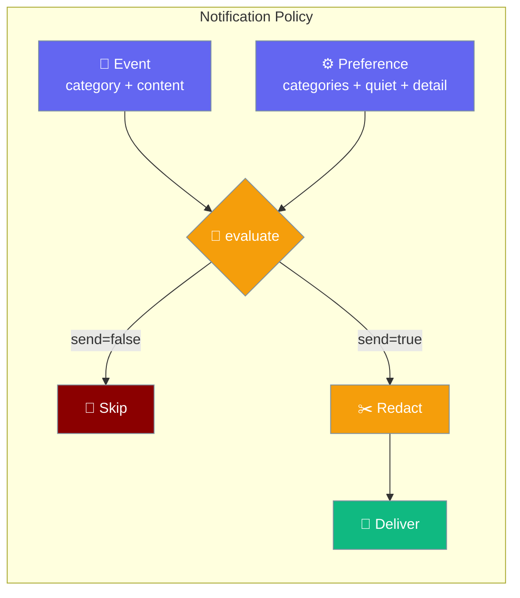
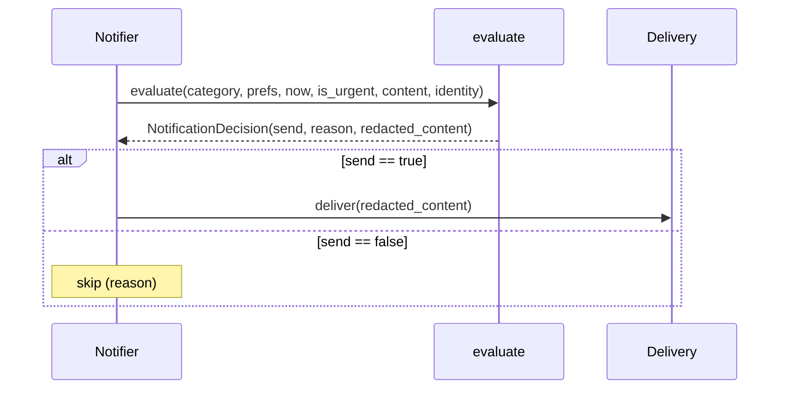
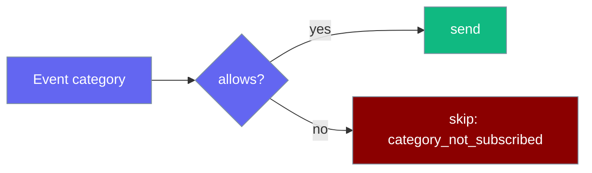
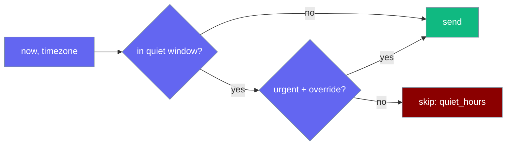
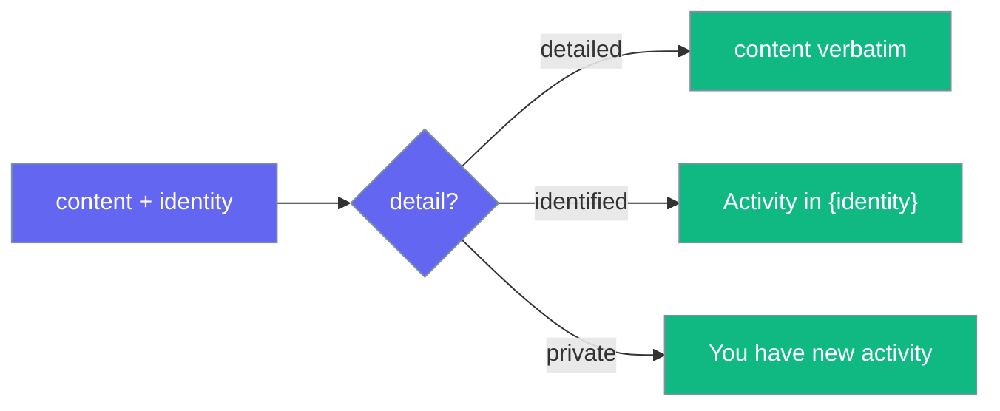
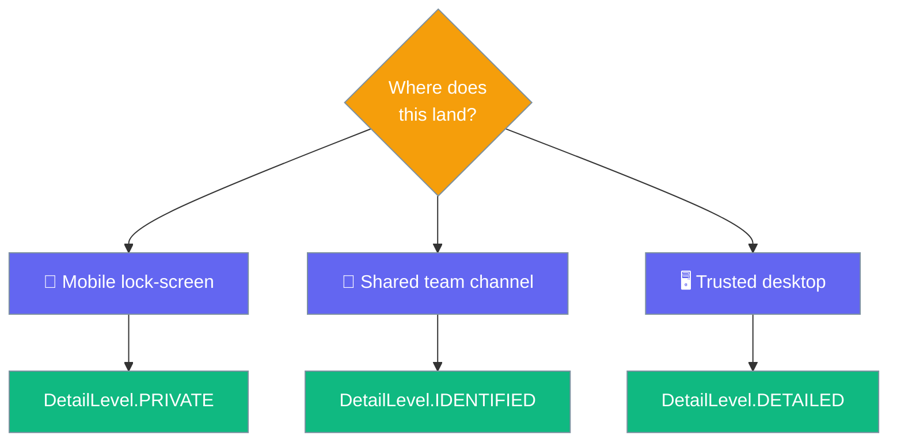
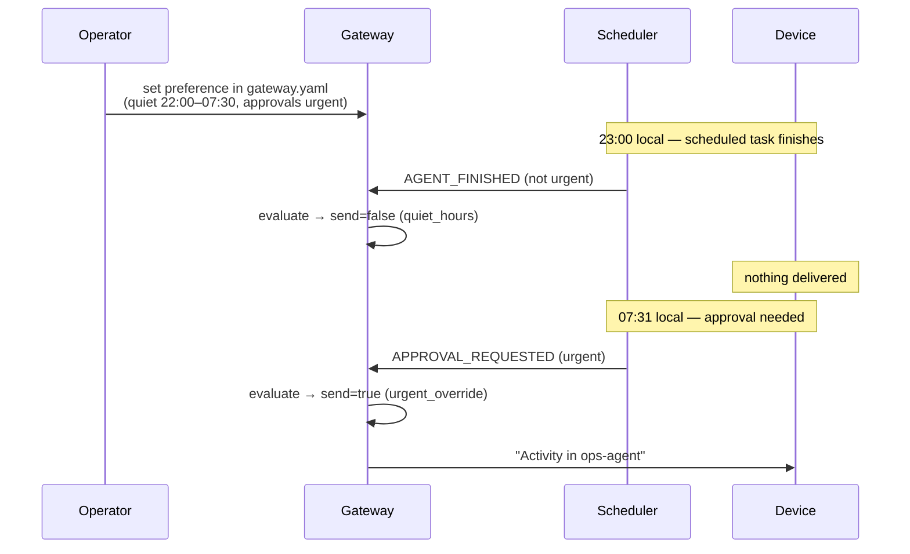

Notification policy decides whether and what to notify each recipient — filter by category, honour quiet hours, and redact content per privacy level, all before the message leaves the gateway.



<Note>
This is the policy layer — the *whether* and *what* to notify. It sits above [Push Delivery Store](/features/gateway-push-delivery-store) (delivery guarantee) and before [Real-Time Push Notifications](/features/push-notifications) (transport).
</Note>

## Quick Start

<Steps>
<Step title="Gate a notification with the default policy">
Apply `DEFAULT_PREFERENCE` to decide whether an agent's event should notify you.

```python
from praisonaiagents import Agent
from praisonaiagents.push import NotificationCategory, evaluate

agent = Agent(
    name="ops-agent",
    instructions="Run overnight report and notify me only when I approve.",
)

result = agent.start("Run the overnight sales report")

# No preference set → DEFAULT_PREFERENCE (approvals + questions, identified detail).
decision = evaluate(
    NotificationCategory.APPROVAL_REQUESTED,
    identity=agent.name,
)
if decision.send:
    print(decision.redacted_content)   # → "Activity in ops-agent"
```
</Step>

<Step title="Per-recipient preference with quiet hours">
Subscribe to specific categories and stay silent overnight unless the event is urgent.

```python
from datetime import time
from praisonaiagents.push import (
    NotificationCategory, DetailLevel, NotificationPreference, evaluate,
)

my_prefs = NotificationPreference(
    categories={NotificationCategory.APPROVAL_REQUESTED},
    quiet_hours=(time(22, 0), time(7, 30)),   # wraps past midnight
    timezone="Europe/London",
    detail=DetailLevel.IDENTIFIED,
)

decision = evaluate(
    NotificationCategory.APPROVAL_REQUESTED,
    prefs=my_prefs,
    is_urgent=True,                            # approvals override quiet hours
    identity="ops-agent",
)
print(decision.send, decision.reason)          # → True urgent_override
```
</Step>

<Step title="Detail-level redaction">
Pick how much content leaves the gateway with `DetailLevel`.

```python
from praisonaiagents.push import (
    NotificationCategory, DetailLevel, NotificationPreference, evaluate,
)

for level in (DetailLevel.PRIVATE, DetailLevel.IDENTIFIED, DetailLevel.DETAILED):
    prefs = NotificationPreference(
        categories={NotificationCategory.AGENT_FINISHED},
        detail=level,
    )
    decision = evaluate(
        NotificationCategory.AGENT_FINISHED,
        prefs=prefs,
        content="Report ready: revenue up 12%",
        identity="ops-agent",
    )
    print(level.value, "→", decision.redacted_content)

# private    → You have new activity
# identified → Activity in ops-agent
# detailed   → Report ready: revenue up 12%
```
</Step>
</Steps>

---

## How It Works

Every notifier calls one pure function before delivery; the decision carries the send flag and the already-redacted content.



`evaluate()` is pure and side-effect-free, so any process can call it at delivery-decision time without I/O. Pass `prefs=None` to fall back to `DEFAULT_PREFERENCE`; pass `now=None` to use the current time localised to `prefs.timezone`.

---

## The Three Concerns

### Categories

A recipient opts into each event class independently; an un-opted category is suppressed with reason `category_not_subscribed`.



| Value | Meaning |
|-------|---------|
| `APPROVAL_REQUESTED` | Agent awaits your approval to proceed |
| `AGENT_FINISHED` | Agent completed its run |
| `AGENT_QUESTION` | Agent needs an answer to continue |
| `HUMAN_MENTIONED` | You were mentioned in a session |
| `SCHEDULED_TASK_FAILED` | A scheduled task failed |
| `BACKGROUND_TASK_FAILED` | A background job failed |

### Quiet Hours

A per-recipient local window suppresses non-urgent categories; urgent events override when `urgent_overrides_quiet=True`.



The window is half-open `[start, end)`. When `start == end` the window is empty (never quiet). When `start > end` it wraps past midnight — `(22:00, 07:30)` means 22:00–24:00 ∪ 00:00–07:30. A naive `now` is treated as already local; an aware `now` is converted to `prefs.timezone` via stdlib `zoneinfo`. An unknown timezone name falls back silently to the naive time.

### Detail Levels

Three levels control how much content leaves the gateway.



| Level | Output |
|-------|--------|
| `DETAILED` | `content` verbatim (or `"You have new activity"` when `content is None`) |
| `IDENTIFIED` | `"Activity in {identity}"` (or `"You have new activity"` when `identity is None`) |
| `PRIVATE` | Always `"You have new activity"`; `content` and `identity` ignored |

---

## Which Detail Level Should I Pick?

Match the level to how trusted the destination surface is.



---

## Configuration Options

### `NotificationPreference`

| Option | Type | Default | Description |
|--------|------|---------|-------------|
| `categories` | `Set[NotificationCategory]` | `set()` | Opted-in categories; a category not present is suppressed |
| `quiet_hours` | `Optional[Tuple[time, time]]` | `None` | Local `(start, end)` window suppressing non-urgent categories; `None` disables. Wraps past midnight when `start > end` |
| `timezone` | `str` | `"UTC"` | IANA name used to localise `now` for the quiet-hours test |
| `detail` | `DetailLevel` | `DetailLevel.IDENTIFIED` | Redaction level applied to notification content |
| `urgent_overrides_quiet` | `bool` | `True` | When True, an urgent event is delivered even inside quiet hours |

Also exposes `.allows(category)` → `bool`, whether this recipient opted into `category`.

### `NotificationDecision`

| Option | Type | Default | Description |
|--------|------|---------|-------------|
| `send` | `bool` | — | Whether the notification should be delivered |
| `reason` | `str` | — | One of `"ok"`, `"urgent_override"`, `"quiet_hours"`, `"category_not_subscribed"` |
| `redacted_content` | `Optional[str]` | `None` | Content to push per `prefs.detail`; `None` when `send` is False |

### `evaluate(...)`

| Argument | Type | Default | Description |
|----------|------|---------|-------------|
| `category` | `NotificationCategory` | — | The event class being considered |
| `prefs` | `Optional[NotificationPreference]` | `None` | Recipient preference; `DEFAULT_PREFERENCE` when `None` |
| `now` | `Optional[datetime]` | `None` | Evaluation moment; `datetime.now()` localised to `prefs.timezone` when `None` |
| `is_urgent` | `bool` | `False` | Whether this event may override quiet hours |
| `content` | `Optional[str]` | `None` | Full message content, redacted per `prefs.detail` |
| `identity` | `Optional[str]` | `None` | Agent/session label used at the `identified` level |

### `DEFAULT_PREFERENCE`

Applied when a recipient has set nothing: the two interaction-blocking categories are on, at the `identified` (no-content) detail level, with no quiet hours.

```python
DEFAULT_PREFERENCE = NotificationPreference(
    categories={
        NotificationCategory.APPROVAL_REQUESTED,
        NotificationCategory.AGENT_QUESTION,
    },
    detail=DetailLevel.IDENTIFIED,
)
```

---

## Common Patterns

**Gate a scheduler completion notification** — the recipient opts into `AGENT_FINISHED`, and it is not urgent.

```python
from praisonaiagents.push import (
    NotificationCategory, NotificationPreference, evaluate,
)

prefs = NotificationPreference(categories={NotificationCategory.AGENT_FINISHED})

decision = evaluate(
    NotificationCategory.AGENT_FINISHED,
    prefs=prefs,
    content="Nightly ETL finished in 12m",
    identity="etl-agent",
)
if decision.send:
    print(decision.redacted_content)   # → "Activity in etl-agent"
```

**Approval request during quiet hours** — the recipient is inside their window, but the urgent flag overrides it.

```python
from datetime import datetime, time
from praisonaiagents.push import (
    NotificationCategory, NotificationPreference, evaluate,
)

prefs = NotificationPreference(
    categories={NotificationCategory.APPROVAL_REQUESTED},
    quiet_hours=(time(22, 0), time(7, 30)),
    timezone="Europe/London",
)

decision = evaluate(
    NotificationCategory.APPROVAL_REQUESTED,
    prefs=prefs,
    now=datetime(2026, 1, 1, 2, 15),   # 02:15 → inside quiet window
    is_urgent=True,
    identity="ops-agent",
)
print(decision.send, decision.reason)  # → True urgent_override
```

**Privacy-first mobile push** — `DetailLevel.PRIVATE` so the lock-screen never shows content.

```python
from praisonaiagents.push import (
    NotificationCategory, DetailLevel, NotificationPreference, evaluate,
)

prefs = NotificationPreference(
    categories={NotificationCategory.HUMAN_MENTIONED},
    detail=DetailLevel.PRIVATE,
)

decision = evaluate(
    NotificationCategory.HUMAN_MENTIONED,
    prefs=prefs,
    content="Secret: launch is Tuesday",
    identity="strategy-session",
)
print(decision.redacted_content)       # → "You have new activity"
```

---

## Best Practices

<AccordionGroup>
<Accordion title="Pick a sensible default per product surface">
Match the default `detail` to where notifications land. Use `PRIVATE` for mobile lock-screens where anyone nearby can read the preview, `IDENTIFIED` for shared team channels that route by agent, and `DETAILED` only for trusted single-user desktops. `DEFAULT_PREFERENCE` uses `IDENTIFIED` as a safe middle ground.
</Accordion>

<Accordion title="Reserve urgency for interaction-blocking events">
Treat `APPROVAL_REQUESTED` and `AGENT_QUESTION` as urgent by convention — they block an agent from continuing until you answer. Pass `is_urgent=True` for these so quiet hours never strand a paused agent. Keep failure alerts (`SCHEDULED_TASK_FAILED`, `BACKGROUND_TASK_FAILED`) non-urgent unless your operations demand overnight paging.
</Accordion>

<Accordion title="Get quiet-hours edge cases right">
The window is half-open `[start, end)`. A same-day window needs `start < end` (e.g. `(09:00, 17:00)`); an overnight window needs `start > end` (e.g. `(22:00, 07:30)`), which wraps across midnight. Setting `start == end` produces an empty window — never quiet. Always set `timezone` to the recipient's IANA zone so `now` localises correctly; a naive `now` is assumed already local and an unknown zone falls back to the naive time.
</Accordion>

<Accordion title="Balance lock-screen privacy against actionability">
Lower detail protects content but forces the recipient to open the app to act. If a notification only exists to prompt an approval, `IDENTIFIED` is usually enough — the recipient knows which agent to open. Reserve `DETAILED` for events where the content itself is the action (e.g. a failure stack trace) and the destination is trusted.
</Accordion>
</AccordionGroup>

---

## User Interaction Flow

An operator sets a preference once; later events are gated automatically by the policy.



---

## Related

<CardGroup cols={2}>
<Card title="Real-Time Push Notifications" icon="bell" href="/features/push-notifications">
The PushClient / WebSocket transport this policy sits above
</Card>
<Card title="Push Delivery Store" icon="database" href="/features/gateway-push-delivery-store">
The durable at-least-once delivery this policy composes with
</Card>
</CardGroup>
