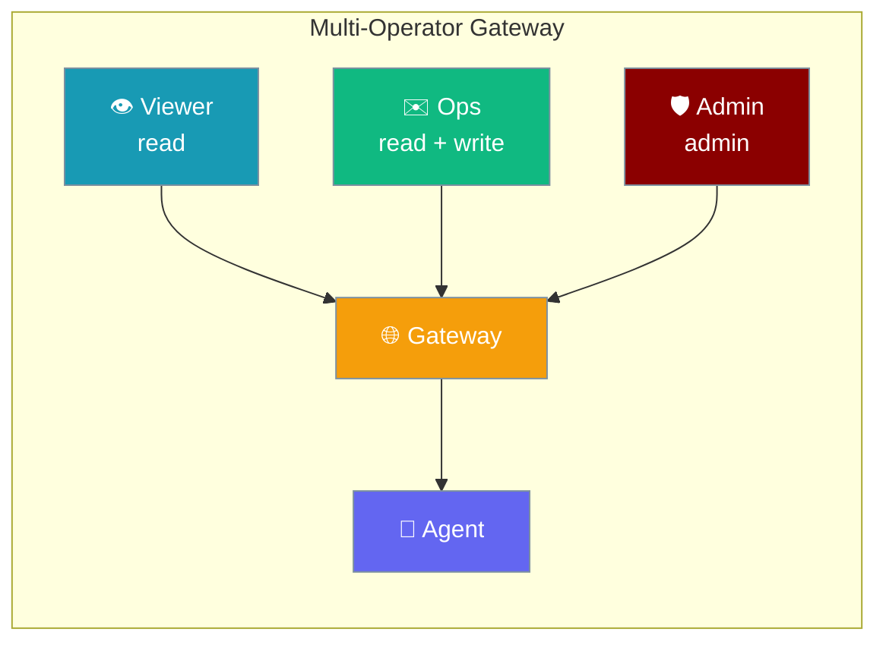
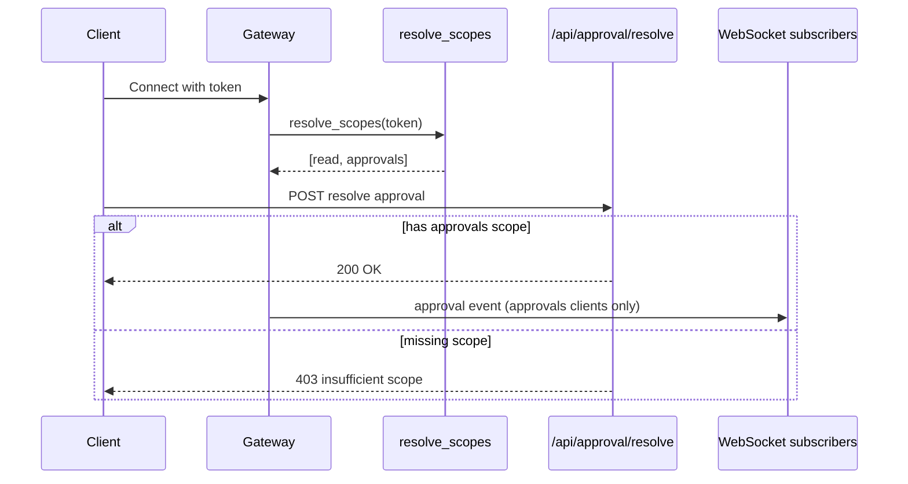
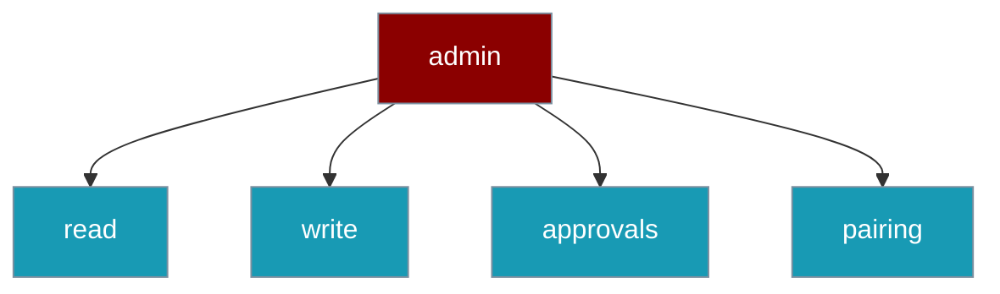
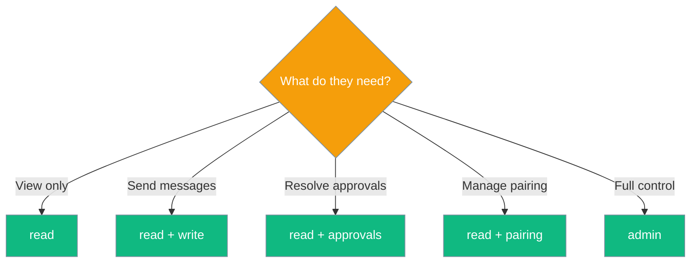

Operator scopes grant teammates least-privilege access to a shared Gateway — read-only dashboards, send-but-not-approve operators, or full admins — without handing over the whole keys.

```python
from praisonaiagents import Agent

agent = Agent(
    name="assistant",
    instructions="You are a helpful assistant.",
)
agent.start("Send a message through the gateway")
```

The user assigns scoped roles; each operator reaches only the gateway actions their role allows.



## Quick Start

<Steps>
<Step title="Single-operator (no scopes — unchanged)">

Today's setup keeps working. Authenticated clients receive all scopes when no policy is configured.

```python
from praisonaiagents import Agent

agent = Agent(
    name="assistant",
    instructions="You are a helpful assistant.",
)

# $ praisonai gateway start --host 127.0.0.1
agent.start("hello")
```

</Step>

<Step title="Multi-operator (scoped tokens)">

Map each operator token to the scopes they need in `gateway.yaml`, then run your agent as usual.

```yaml
gateway:
  host: "0.0.0.0"
  port: 8765
  auth:
    tokens:
      - token: "${VIEWER_TOKEN}"
        scopes: [read]
      - token: "${OPS_TOKEN}"
        scopes: [read, write]
      - token: "${ADMIN_TOKEN}"
        scopes: [admin]

agents:
  assistant:
    instructions: "You are a helpful assistant."
    model: gpt-4o-mini
```

```python
from praisonaiagents import Agent
from praisonaiagents.gateway import OperatorScope

agent = Agent(name="assistant", instructions="You are a helpful assistant.")
# OperatorScope.READ, .WRITE, .APPROVALS, .PAIRING, .ADMIN
print([s.value for s in OperatorScope.all()])
```

</Step>
</Steps>

<Note>
When **no** `auth_scopes` policy is configured, every successfully authenticated client is granted **all** scopes — identical to today's binary auth behaviour. Single-operator setups need no changes.
</Note>

---

## How It Works



1. Client connects with a bearer token.
2. Gateway resolves scopes via `GatewayConfig.resolve_scopes(token)`.
3. Each HTTP route and WebSocket action checks the required scope.
4. Outbound events are filtered — approval events only reach clients with the `approvals` scope.

---

## Scope Reference

| Scope | Value | Grants |
|---|---|---|
| Read | `read` | View dashboard, session transcripts, and status events |
| Write | `write` | Send messages as the agent (WebSocket `message`) |
| Approvals | `approvals` | Resolve tool-execution approvals and manage allowlist |
| Pairing | `pairing` | Approve or revoke device pairing |
| Admin | `admin` | Channel pause/resume/reconnect — implies all scopes |



### Which scope should this operator have?



| Role | Recommended scopes |
|---|---|
| Read-only stakeholder | `[read]` |
| Junior support (send, not approve) | `[read, write]` |
| On-call approver | `[read, approvals]` |
| SRE / platform admin | `[admin]` |

---

## Configuration

### YAML — structured (recommended)

```yaml
gateway:
  auth:
    tokens:
      - token: "${VIEWER_TOKEN}"
        scopes: [read]
      - token: "${OPS_TOKEN}"
        scopes: [read, write, approvals]
      - token: "${ADMIN_TOKEN}"
        scopes: [admin]
```

### YAML — flat mapping

```yaml
gateway:
  auth_scopes:
    "${VIEWER_TOKEN}": [read]
    "${OPS_TOKEN}": [read, write, approvals]
    "${ADMIN_TOKEN}": [admin]
```

### Python

```python
from praisonaiagents.gateway import GatewayConfig, OperatorScope

config = GatewayConfig(
    host="0.0.0.0",
    port=8765,
    auth_token="${ADMIN_TOKEN}",
    auth_scopes={
        "${VIEWER_TOKEN}": [OperatorScope.READ.value],
        "${OPS_TOKEN}": [OperatorScope.READ.value, OperatorScope.WRITE.value],
        "${ADMIN_TOKEN}": [OperatorScope.ADMIN.value],
    },
)

print(config.has_scope_policy)  # True when auth_scopes is non-empty
print(config.resolve_scopes("${VIEWER_TOKEN}"))  # ['read']
```

---

## Scope-Gated Routes

| Route | Method | Required scope |
|---|---|---|
| `/api/channels/{name}/pause` | POST | `admin` |
| `/api/channels/{name}/resume` | POST | `admin` |
| `/api/channels/{name}/reconnect` | POST | `admin` |
| `/api/approval/resolve` | POST | `approvals` |
| `/api/approval/allowlist` | GET | any authenticated |
| `/api/approval/allowlist` | POST/DELETE | `approvals` |
| `/api/pairing/approve` | POST | `pairing` |
| `/api/pairing/revoke` | POST | `pairing` |
| WebSocket `message` | — | `write` |

---

## Common Patterns

**Read-only dashboard viewer** — `[read]` for status and transcripts without send or approve rights.

**Send but not approve** — `[read, write]` for operators who reply to users but cannot resolve tool approvals.

**Approvals-only on-call** — `[read, approvals]` for security-sensitive approval resolution without channel admin rights.

**Full admin** — `[admin]` for SREs who need pause/resume/reconnect plus all other capabilities.

---

## Error Handling

HTTP 403 when scope check fails:

```json
{ "error": "insufficient scope", "required_scope": "approvals" }
```

WebSocket `message` without `write` scope:

```json
{
  "type": "error",
  "code": "insufficient_scope",
  "message": "insufficient scope",
  "required_scope": "write"
}
```

---

<Warning>
Granting `approvals` is effectively remote command execution — never assign it casually. `ALLOW_LOOPBACK_BYPASS=true` grants all scopes on loopback; use for local development only, never in production.
</Warning>

---

## Best Practices

<AccordionGroup>
<Accordion title="Default to read and add scopes as needed">
Start every operator with `[read]` and expand only when their role requires it.
</Accordion>

<Accordion title="Rotate per-token secrets independently">
Issue separate tokens per operator so you can revoke one role without rotating everyone.
</Accordion>

<Accordion title="Pair approvals with the allowlist">
Combine `approvals` scope with `/api/approval/allowlist` for defence-in-depth on tool execution.
</Accordion>

<Accordion title="Use admin sparingly">
Prefer explicit scope lists over `[admin]` unless the operator truly needs channel control.
</Accordion>
</AccordionGroup>

---

## Related

<CardGroup cols={2}>
<Card title="Bind-Aware Auth" icon="shield" href="/docs/features/gateway-bind-aware-auth">
  Token requirements when binding to external interfaces
</Card>
<Card title="Gateway Overview" icon="broadcast-tower" href="/docs/features/gateway-overview">
  Multi-channel gateway architecture and setup
</Card>
</CardGroup>
