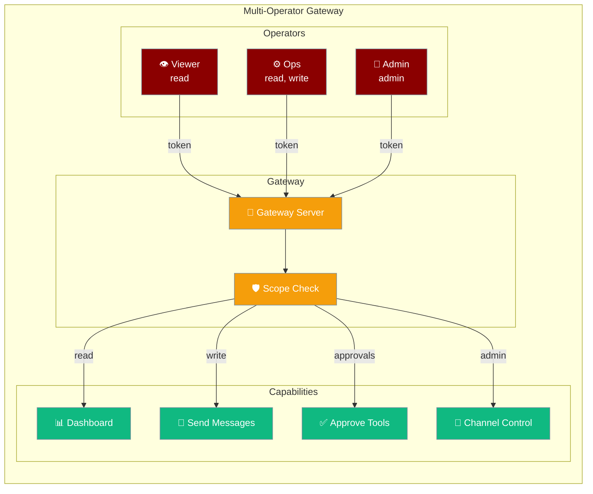
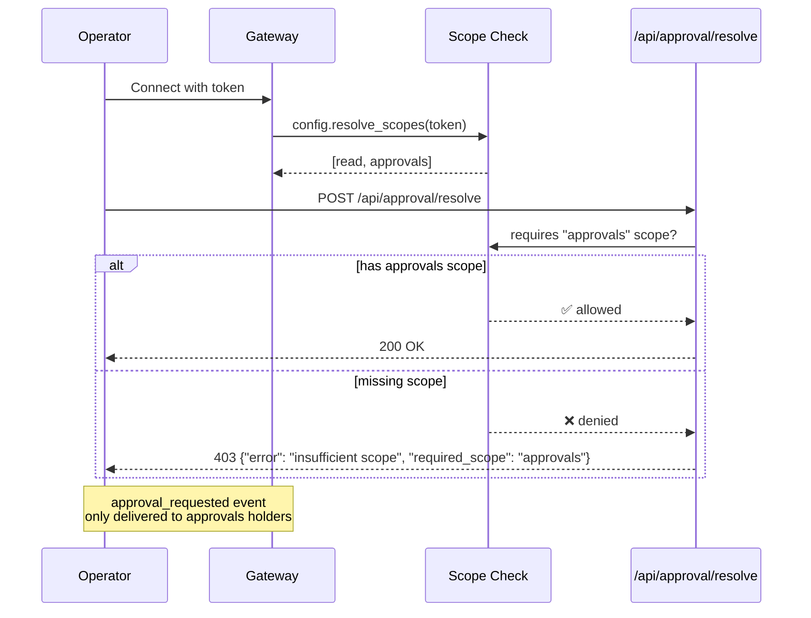
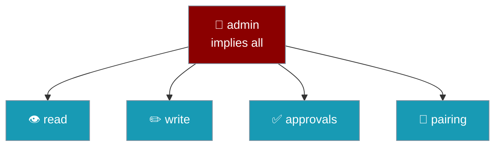
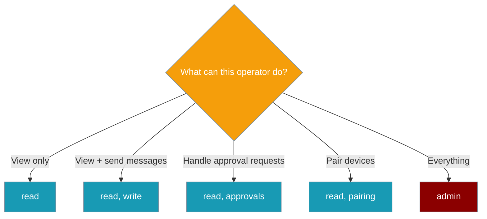

Operator scopes let you grant teammates least-privilege access to a shared Gateway — read-only dashboards, send-but-not-approve operators, full admins — without handing over the whole keys.



## Quick Start

<Steps>
<Step title="Single-operator (no scopes — works today)">
No changes needed for existing single-operator setups. Every authenticated client gets all capabilities.

```python
from praisonaiagents import Agent

agent = Agent(
    name="Support Agent",
    instructions="You are a helpful support assistant.",
)
agent.start("hello")
```

Start the gateway normally — no scope policy required:

```bash
export GATEWAY_AUTH_TOKEN=your-secret-token
praisonai gateway start --host 0.0.0.0
```
</Step>

<Step title="Multi-operator (with scopes)">
Add `auth.tokens` to your `gateway.yaml` to assign each operator a scope set.

```yaml
gateway:
  auth:
    tokens:
      - token: "${VIEWER_TOKEN}"
        scopes: [read]
      - token: "${OPS_TOKEN}"
        scopes: [read, write]
      - token: "${ADMIN_TOKEN}"
        scopes: [admin]
```

The same agent code works unchanged — scopes are enforced at the Gateway level, not in agent code:

```python
from praisonaiagents import Agent

agent = Agent(
    name="Support Agent",
    instructions="You are a helpful support assistant.",
)
agent.start("hello")
```

Set the token environment variables and start:

```bash
export VIEWER_TOKEN=viewer-secret-here
export OPS_TOKEN=ops-secret-here
export ADMIN_TOKEN=admin-secret-here
praisonai gateway start --host 0.0.0.0
```
</Step>
</Steps>

---

## How It Works



When a client connects, the gateway calls `resolve_scopes(token)` once and stores the resolved scope list. Every subsequent request or WebSocket action is checked against that list. Approval-class events are only broadcast to clients holding the `approvals` scope.

---

## Scope Reference

| Scope | Value | Grants |
|---|---|---|
| Read | `read` | View dashboard, receive session transcripts and status events |
| Write | `write` | Send messages as the agent |
| Approvals | `approvals` | Resolve tool-execution approval requests |
| Pairing | `pairing` | Approve or revoke device pairing |
| Admin | `admin` | Channel control (pause/resume/reconnect) — implies all other scopes |



---

## Configuration

### YAML — Structured (recommended)

```yaml
gateway:
  auth:
    tokens:
      - token: "${VIEWER_TOKEN}"
        scopes: [read]
      - token: "${OPS_TOKEN}"
        scopes: [read, write, approvals]
      - token: "${ADMIN_TOKEN}"
        scopes: [admin]
```

### YAML — Flat mapping

```yaml
gateway:
  auth_scopes:
    "${VIEWER_TOKEN}": [read]
    "${OPS_TOKEN}":    [read, write, approvals]
    "${ADMIN_TOKEN}":  [admin]
```

### Python

```python
from praisonaiagents.gateway import GatewayConfig, OperatorScope

config = GatewayConfig(
    auth_scopes={
        "viewer-secret": [OperatorScope.READ],
        "ops-secret":    [OperatorScope.READ, OperatorScope.WRITE, OperatorScope.APPROVALS],
        "admin-secret":  [OperatorScope.ADMIN],
    }
)
```

---

## Which Scope Should This Operator Have?



| Role | Recommended Scopes |
|---|---|
| Read-only stakeholder | `[read]` |
| Junior support operator | `[read, write]` |
| On-call approval handler | `[read, approvals]` |
| Shift lead | `[read, write, approvals]` |
| SRE / full control | `[admin]` |

---

## Common Patterns

### Read-only dashboard viewer

A stakeholder who needs visibility but must never send messages or approve tools:

```yaml
gateway:
  auth:
    tokens:
      - token: "${VIEWER_TOKEN}"
        scopes: [read]
```

### Send but not approve

An operator who can respond to users but cannot resolve sensitive tool approvals:

```yaml
gateway:
  auth:
    tokens:
      - token: "${OPS_TOKEN}"
        scopes: [read, write]
```

### Approvals-only on-call

A dedicated security reviewer who only handles approval requests:

```yaml
gateway:
  auth:
    tokens:
      - token: "${ONCALL_TOKEN}"
        scopes: [read, approvals]
```

### Full admin

A trusted SRE with unrestricted access including channel control:

```yaml
gateway:
  auth:
    tokens:
      - token: "${ADMIN_TOKEN}"
        scopes: [admin]
```

---

## Error Handling

**HTTP 403** — scope check failed on a REST route:

```json
{
  "error": "insufficient scope",
  "required_scope": "approvals"
}
```

**WebSocket error** — `write` scope missing when sending a message:

```json
{
  "type": "error",
  "code": "insufficient_scope",
  "message": "insufficient scope",
  "required_scope": "write"
}
```

---

## Backward Compatibility

<Note>
When no `auth_scopes` policy is configured, every successfully authenticated client is granted all scopes — identical to today's binary auth behaviour. Single-operator setups require no changes. Existing `gateway.yaml` files continue to work unchanged.
</Note>

---

## Security

<Warning>
**Approvals scope** — resolving a tool approval is effectively remote command execution. Grant `approvals` only to trusted operators. Consider pairing it with the approval allowlist (`GET /api/approval/allowlist`) for defence-in-depth.

**`ALLOW_LOOPBACK_BYPASS=true`** grants all scopes to requests from `127.0.0.1`/`::1`/`localhost` with no proxy headers. This is intended for local development only — never enable it in production.
</Warning>

---

## Best Practices

<AccordionGroup>
<Accordion title="Default to read and add scopes as needed">
Start every new operator token with `[read]` and add scopes only when the operator's role requires them. Principle of least privilege prevents accidental tool execution or channel disruption.
</Accordion>

<Accordion title="Rotate per-token secrets independently">
Because each operator has their own token, you can rotate a single compromised credential without affecting other operators. Store tokens in environment variables, never hardcode them.
</Accordion>

<Accordion title="Pair approvals scope with the approval allowlist">
Use `GET /api/approval/allowlist` to pre-approve safe tools for known operators. This limits the blast radius if an `approvals`-scoped token is misused — only allowlisted tools can be auto-resolved.
</Accordion>

<Accordion title="Use admin sparingly; prefer explicit scope lists">
`admin` implies all scopes including future ones. Prefer explicit lists like `[read, write, approvals, pairing]` so new scopes added in future releases are not silently granted. Reserve `admin` for SREs who genuinely need channel control.
</Accordion>
</AccordionGroup>

---

## Related

<CardGroup cols={2}>
<Card title="Bind-Aware Authentication" icon="shield" href="/docs/features/gateway-bind-aware-auth">
  Token-based authentication and loopback bypass behaviour
</Card>
<Card title="Gateway Overview" icon="broadcast-tower" href="/docs/features/gateway-overview">
  Overall Gateway architecture and multi-channel coordination
</Card>
</CardGroup>
