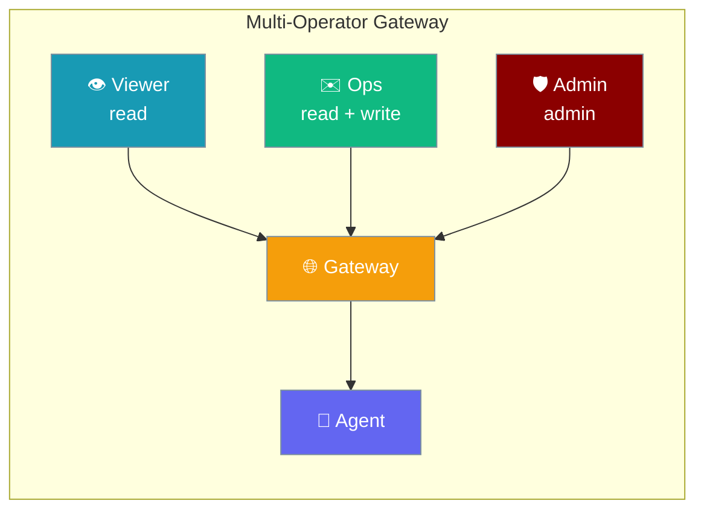
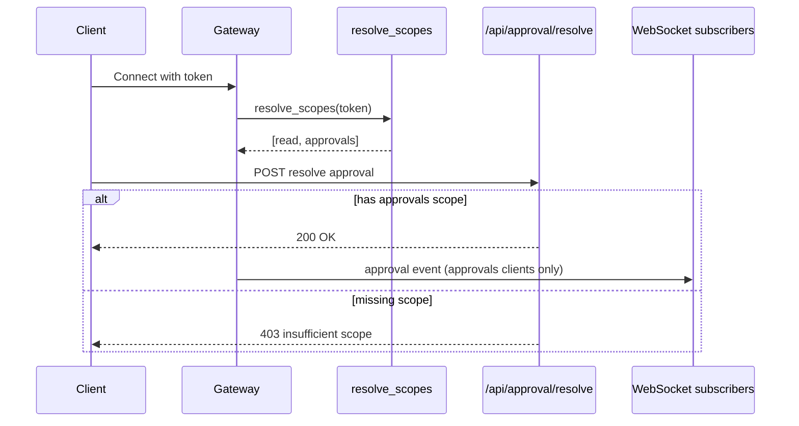
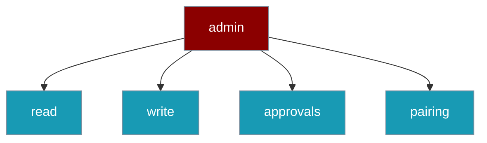
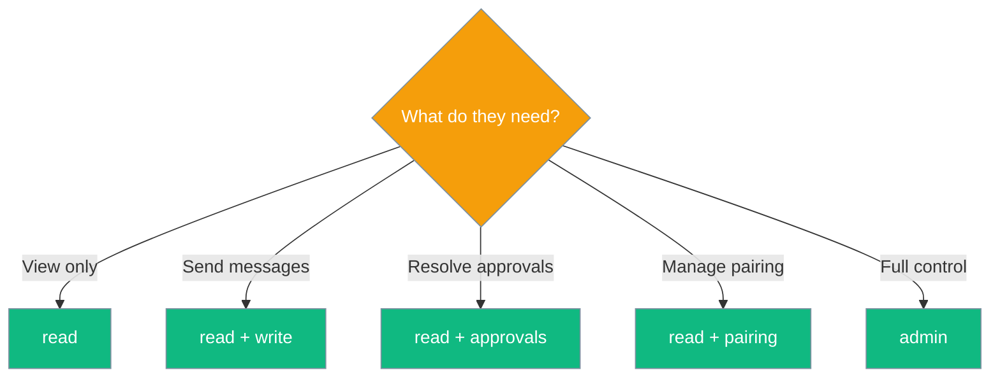
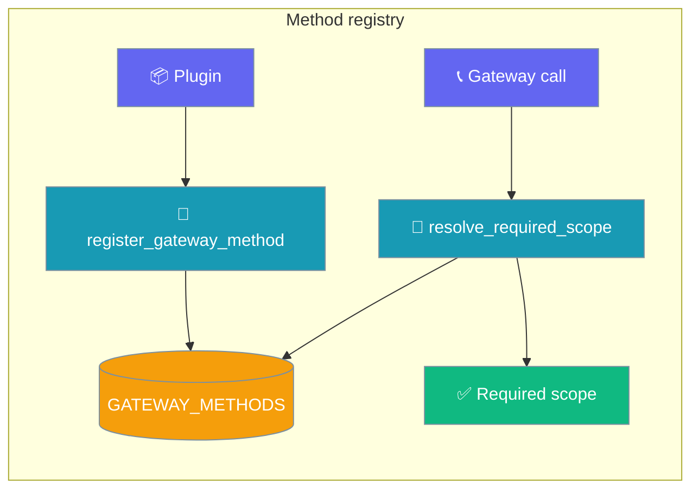

<Note>
The gateway now ships in the `praisonai-bot` package. `praisonai serve gateway` still works exactly as documented here; for a standalone install see [praisonai-bot Migration](/docs/guides/praisonai-bot-migration).
</Note>


Operator scopes grant teammates least-privilege access to a shared Gateway — read-only dashboards, send-but-not-approve operators, or full admins — without handing over the whole keys.

```python
from praisonaiagents import Agent

agent = Agent(
    name="assistant",
    instructions="You are a helpful assistant.",
)
agent.start("Send a message through the gateway")
```

The user assigns scoped roles; each operator reaches only the gateway actions their role allows.



## Quick Start

<Steps>
<Step title="Single-operator (no scopes — unchanged)">

Today's setup keeps working. Authenticated clients receive all scopes when no policy is configured.

```python
from praisonaiagents import Agent

agent = Agent(
    name="assistant",
    instructions="You are a helpful assistant.",
)

# $ praisonai gateway start --host 127.0.0.1
agent.start("hello")
```

</Step>

<Step title="Multi-operator (scoped tokens)">

Map each operator token to the scopes they need in `gateway.yaml`, then run your agent as usual.

```yaml
gateway:
  host: "0.0.0.0"
  port: 8765
  auth:
    tokens:
      - token: "${VIEWER_TOKEN}"
        scopes: [read]
      - token: "${OPS_TOKEN}"
        scopes: [read, write]
      - token: "${ADMIN_TOKEN}"
        scopes: [admin]

agents:
  assistant:
    instructions: "You are a helpful assistant."
    model: gpt-4o-mini
```

```python
from praisonaiagents import Agent
from praisonaiagents.gateway import OperatorScope

agent = Agent(name="assistant", instructions="You are a helpful assistant.")
# OperatorScope.READ, .WRITE, .APPROVALS, .PAIRING, .ADMIN
print([s.value for s in OperatorScope.all()])
```

</Step>
</Steps>

<Note>
When **no** `auth_scopes` policy is configured, every successfully authenticated client is granted **all** scopes — identical to today's binary auth behaviour. Single-operator setups need no changes.
</Note>

---

## How It Works



1. Client connects with a bearer token.
2. Gateway resolves scopes via `GatewayConfig.resolve_scopes(token)`.
3. Each HTTP route and WebSocket action checks the required scope.
4. Outbound events are filtered — approval events only reach clients with the `approvals` scope.

---

## Scope Reference

| Scope | Value | Grants |
|---|---|---|
| Read | `read` | View dashboard, session transcripts, and status events |
| Write | `write` | Send messages as the agent (WebSocket `message`) |
| Approvals | `approvals` | Resolve tool-execution approvals and manage allowlist |
| Pairing | `pairing` | Approve or revoke device pairing |
| Admin | `admin` | Channel pause/resume/reconnect — implies all scopes |

<Note>
`admin` implies every scope, but `approvals` and `pairing` do **not** imply each other — they are sibling capabilities. Only `admin` grants both. A method requiring both (via field escalation) therefore resolves to `admin`. See [Incomparable scopes escalate to `ADMIN`](#incomparable-scopes-escalate-to-admin).
</Note>



### Which scope should this operator have?



| Role | Recommended scopes |
|---|---|
| Read-only stakeholder | `[read]` |
| Junior support (send, not approve) | `[read, write]` |
| On-call approver | `[read, approvals]` |
| SRE / platform admin | `[admin]` |

---

## Configuration

### YAML — structured (recommended)

```yaml
gateway:
  auth:
    tokens:
      - token: "${VIEWER_TOKEN}"
        scopes: [read]
      - token: "${OPS_TOKEN}"
        scopes: [read, write, approvals]
      - token: "${ADMIN_TOKEN}"
        scopes: [admin]
```

### YAML — flat mapping

```yaml
gateway:
  auth_scopes:
    "${VIEWER_TOKEN}": [read]
    "${OPS_TOKEN}": [read, write, approvals]
    "${ADMIN_TOKEN}": [admin]
```

### Python

```python
from praisonaiagents.gateway import GatewayConfig, OperatorScope

config = GatewayConfig(
    host="0.0.0.0",
    port=8765,
    auth_token="${ADMIN_TOKEN}",
    auth_scopes={
        "${VIEWER_TOKEN}": [OperatorScope.READ.value],
        "${OPS_TOKEN}": [OperatorScope.READ.value, OperatorScope.WRITE.value],
        "${ADMIN_TOKEN}": [OperatorScope.ADMIN.value],
    },
)

print(config.has_scope_policy)  # True when auth_scopes is non-empty
print(config.resolve_scopes("${VIEWER_TOKEN}"))  # ['read']
```

---

## Scope-Gated Routes

For programmatic (WebSocket / RPC) methods, see [Method → Scope Registry](#method-scope-registry) below.

| Route | Method | Required scope |
|---|---|---|
| `/api/channels/{name}/pause` | POST | `admin` |
| `/api/channels/{name}/resume` | POST | `admin` |
| `/api/channels/{name}/reconnect` | POST | `admin` |
| `/api/approval/resolve` | POST | `approvals` |
| `/api/approval/allowlist` | GET | any authenticated |
| `/api/approval/allowlist` | POST/DELETE | `approvals` |
| `/api/pairing/approve` | POST | `pairing` |
| `/api/pairing/revoke` | POST | `pairing` |
| WebSocket `message` | — | `write` |

The WebSocket `message` requirement comes from the [Method Scope Registry](#method-scope-registry) below — the dispatcher calls `resolve_required_scope("message")` (and `resolve_required_scope("agent.message")`) rather than hard-coding the check per route.

---

## Method Scope Registry

New gateway methods are closed until classified — you cannot accidentally ship an unauthenticated control-plane call.


Every method maps to a `GatewayMethodDescriptor` in the module-level `GATEWAY_METHODS` registry. `resolve_required_scope` looks up that descriptor and returns the effective scope for a call.

<Warning>
**Default-deny.** Unknown or unregistered methods require `admin`. Adding a new gateway method without calling `register_gateway_method` means any caller holding less than `admin` is denied — this is intentional (fail closed), so new control surface is never reachable by omission.
</Warning>

### Quick lookup

```python
from praisonaiagents import Agent
from praisonaiagents.gateway import resolve_required_scope, OperatorScope

agent = Agent(name="assistant", instructions="You are a helpful assistant.")

print(resolve_required_scope("agent.message"))   # OperatorScope.WRITE
print(resolve_required_scope("session.status"))  # OperatorScope.READ
print(resolve_required_scope("myplugin.unknown"))  # OperatorScope.ADMIN (default-deny)
```

### Registering a plugin method

Plugin authors adding a new dispatcher method register its required scope once, at import time.

```python
from praisonaiagents import Agent
from praisonaiagents.gateway import register_gateway_method, OperatorScope

agent = Agent(name="assistant", instructions="You are a helpful assistant.")

register_gateway_method(
    "myplugin.reindex",
    scope=OperatorScope.ADMIN,
    owner="myplugin",
)
```

`register_gateway_method` refuses duplicates — pass `replace=True` to override an existing entry.

### Per-field escalation

Escalation raises the required scope when a sensitive field is present; a plain call stays at the baseline.

```python
from praisonaiagents import Agent
from praisonaiagents.gateway import register_gateway_method, resolve_required_scope, OperatorScope

agent = Agent(name="assistant", instructions="You are a helpful assistant.")

register_gateway_method(
    "myplugin.publish",
    scope=OperatorScope.WRITE,
    owner="myplugin",
    escalate_fields={"config": OperatorScope.ADMIN},
    replace=True,
)

print(resolve_required_scope("myplugin.publish", {"text": "hi"}))       # OperatorScope.WRITE
print(resolve_required_scope("myplugin.publish", {"config": {...}}))    # OperatorScope.ADMIN
```

Escalation only ever raises the requirement — a field mapped to a weaker scope than the baseline is ignored.

### Strict fields (fail-closed on unknown payload)

`strict_fields=True` escalates any structural field not explicitly listed as safe, so unexpected payload keys fail closed.

```python
from praisonaiagents import Agent
from praisonaiagents.gateway import register_gateway_method, resolve_required_scope, OperatorScope

agent = Agent(name="assistant", instructions="You are a helpful assistant.")

register_gateway_method(
    "myplugin.echo",
    scope=OperatorScope.WRITE,
    owner="myplugin",
    strict_fields=True,
    safe_fields={"text"},
    replace=True,
)

print(resolve_required_scope("myplugin.echo", {"text": "hi"}))              # OperatorScope.WRITE
print(resolve_required_scope("myplugin.echo", {"text": "hi", "raw": 1}))    # OperatorScope.ADMIN
```

<Note>
`APPROVALS` and `PAIRING` are **sibling** scopes — neither implies the other. A method whose baseline is one but whose payload escalates to the other resolves to `admin`, its common upper bound, so a single-scope check can never be satisfied by holding only one of the two capabilities.
</Note>

### Core method classification

Core methods are classified at import; anything unlisted defaults to `admin`.

| Method | Required scope |
|---|---|
| `agent.message` | `write` |
| `message` | `write` |
| `session.status` | `read` |
| `session.transcript` | `read` |
| `approvals.resolve` | `approvals` |
| `pairing.approve` | `pairing` |
| `pairing.revoke` | `pairing` |
| `channels.control` | `admin` |
| `channels.pause` | `admin` |
| `channels.resume` | `admin` |
| `channels.reconnect` | `admin` |

<AccordionGroup>
<Accordion title="Descriptor fields">
`GatewayMethodDescriptor` is a frozen dataclass; its `escalate_fields` and `safe_fields` collections are defensively copied at construction, so mutating the originals after registration cannot change resolution.

| Field | Default | Meaning |
|---|---|---|
| `name` | — | Method / route / message-type identifier |
| `required_scope` | `admin` | Baseline scope required |
| `owner` | `"core"` | Who declared it (informational) |
| `since` | `None` | Version/date when classified |
| `escalate_fields` | `{}` | Per-field escalations (raises, never lowers) |
| `strict_fields` | `False` | Escalate unlisted fields to `escalate_unknown_scope` |
| `safe_fields` | `set()` | Fields that never escalate under `strict_fields` |
| `escalate_unknown_scope` | `admin` | Scope for unknown fields under `strict_fields` |
</Accordion>
</AccordionGroup>

---

## Method → Scope Registry

Every gateway method declares its required scope in one place — a declarative registry — instead of scattered checks per endpoint. New methods are **closed until explicitly classified**; an unregistered method requires `admin`.

```python
from praisonaiagents.gateway import (
    OperatorScope,
    register_gateway_method,
    resolve_required_scope,
)

# What scope does this call need?
resolve_required_scope("agent.message")            # OperatorScope.WRITE
resolve_required_scope("channels.pause")           # OperatorScope.ADMIN
resolve_required_scope("totally.unknown.method")   # OperatorScope.ADMIN (default-deny)
```



### Core method classification

Core methods are classified at import in `praisonaiagents.gateway.protocols`:

| Method | Required scope |
|---|---|
| `agent.message`, `message` | `write` |
| `session.status`, `session.transcript` | `read` |
| `approvals.resolve` | `approvals` |
| `pairing.approve`, `pairing.revoke` | `pairing` |
| `channels.control`, `channels.pause`, `channels.resume`, `channels.reconnect` | `admin` |

### Registering a plugin method

A plugin that adds a new gateway surface registers its scope at import time:

```python
from praisonaiagents.gateway import OperatorScope, register_gateway_method

register_gateway_method(
    "myplugin.notify",
    scope=OperatorScope.WRITE,
    owner="myplugin",
    since="1.4.0",
)
```

### Per-payload-field escalation (raise, never lower)

A descriptor can raise the required scope when a specific field appears in the params — an otherwise `write` method that mutates configuration should require `admin` when the `config` field is present:

```python
from praisonaiagents.gateway import OperatorScope, register_gateway_method, resolve_required_scope

register_gateway_method(
    "myplugin.update",
    scope=OperatorScope.WRITE,
    escalate_fields={"config": OperatorScope.ADMIN},
)

resolve_required_scope("myplugin.update", {"text": "hi"})               # WRITE
resolve_required_scope("myplugin.update", {"text": "hi", "config": {}}) # ADMIN
```

### Strict-fields mode (fail closed on unknown fields)

For high-risk methods, enable `strict_fields=True` with an allowlist of known-safe fields. Any field not in `safe_fields` or `escalate_fields` escalates to `admin`:

```python
from praisonaiagents.gateway import OperatorScope, register_gateway_method, resolve_required_scope

register_gateway_method(
    "myplugin.execute",
    scope=OperatorScope.WRITE,
    strict_fields=True,
    safe_fields={"text"},
)

resolve_required_scope("myplugin.execute", {"text": "hi"})              # WRITE
resolve_required_scope("myplugin.execute", {"text": "hi", "mutate": 1}) # ADMIN
```

### Incomparable scopes escalate to `ADMIN`

`approvals` and `pairing` are sibling capabilities — neither implies the other. When a method's baseline is one and a field escalates to the other, the combined requirement escalates to `admin` rather than silently picking one (a single-scope check cannot satisfy both):

```python
from praisonaiagents.gateway import OperatorScope, register_gateway_method, resolve_required_scope

register_gateway_method(
    "myplugin.combo",
    scope=OperatorScope.APPROVALS,
    escalate_fields={"pair": OperatorScope.PAIRING},
)

resolve_required_scope("myplugin.combo", {"other": 1})   # APPROVALS
resolve_required_scope("myplugin.combo", {"pair": True}) # ADMIN — fail-closed
```

### API reference

| Symbol | Meaning |
|---|---|
| `GatewayMethodDescriptor` | Frozen dataclass — `name`, `required_scope`, `owner`, `since`, `escalate_fields`, `strict_fields`, `safe_fields`, `escalate_unknown_scope` |
| `GATEWAY_METHODS: dict[str, GatewayMethodDescriptor]` | The module-level registry |
| `register_gateway_method(name, *, scope=ADMIN, owner="core", since=None, escalate_fields=None, strict_fields=False, safe_fields=None, escalate_unknown_scope=ADMIN, replace=False)` | Registers `name`. Raises `ValueError` on duplicate unless `replace=True` |
| `resolve_required_scope(method, params=None)` | Resolves the effective required scope. Unknown method → `admin` |

<Note>
`register_gateway_method` is safe to call at plugin import time. The core-method classification runs at `praisonaiagents.gateway.protocols` import, so any plugin registration you do afterwards adds to the same registry.
</Note>

<Warning>
Do not lower a scope by re-registering with `replace=True` unless you own the method. Downgrading the required scope of a core method is a security regression.
</Warning>

For the approval-flow context these scopes gate, see [Scoped Approvals](/docs/features/gateway-scoped-approvals).

---

## Common Patterns

**Read-only dashboard viewer** — `[read]` for status and transcripts without send or approve rights.

**Send but not approve** — `[read, write]` for operators who reply to users but cannot resolve tool approvals.

**Approvals-only on-call** — `[read, approvals]` for security-sensitive approval resolution without channel admin rights.

**Full admin** — `[admin]` for SREs who need pause/resume/reconnect plus all other capabilities.

---

## Error Handling

HTTP 403 when scope check fails:

```json
{ "error": "insufficient scope", "required_scope": "approvals" }
```

WebSocket `message` without `write` scope:

```json
{
  "type": "error",
  "code": "insufficient_scope",
  "message": "insufficient scope",
  "required_scope": "write"
}
```

---

<Warning>
Granting `approvals` is effectively remote command execution — never assign it casually. On a loopback-bound gateway, local non-proxied requests bypass auth by default and are granted all operator scopes — intended for local development only. External binds (`0.0.0.0`, LAN IPs) are unaffected and still require a token with the correct scopes. Set `ALLOW_LOOPBACK_BYPASS=false` to opt back into strict auth on loopback, or `true` to force-enable the bypass even on an external bind (**unsafe — never do this in production**). See [Bind-Aware Auth](/docs/features/gateway-bind-aware-auth#auth-bypass-on-loopback).
</Warning>

---

## Best Practices

<AccordionGroup>
<Accordion title="Default to read and add scopes as needed">
Start every operator with `[read]` and expand only when their role requires it.
</Accordion>

<Accordion title="Rotate per-token secrets independently">
Issue separate tokens per operator so you can revoke one role without rotating everyone.
</Accordion>

<Accordion title="Pair approvals with the allowlist">
Combine `approvals` scope with `/api/approval/allowlist` for defence-in-depth on tool execution.
</Accordion>

<Accordion title="Use admin sparingly">
Prefer explicit scope lists over `[admin]` unless the operator truly needs channel control.
</Accordion>

<Accordion title="Classify every new gateway method">
An unregistered gateway method defaults to `admin` (fail closed). When a plugin adds new surface, always call `register_gateway_method(name, scope=...)` at import time so the requirement matches the intent — not just whatever the current default happens to be.
</Accordion>
</AccordionGroup>

---

## Related

<CardGroup cols={2}>
<Card title="Bind-Aware Auth" icon="shield" href="/docs/features/gateway-bind-aware-auth">
  Token requirements when binding to external interfaces
</Card>
<Card title="Gateway Overview" icon="broadcast-tower" href="/docs/features/gateway-overview">
  Multi-channel gateway architecture and setup
</Card>
<Card title="Scoped Approvals" icon="circle-check" href="/docs/features/gateway-scoped-approvals">
  Resolve tool-execution approvals with the `approvals` scope
</Card>
</CardGroup>
