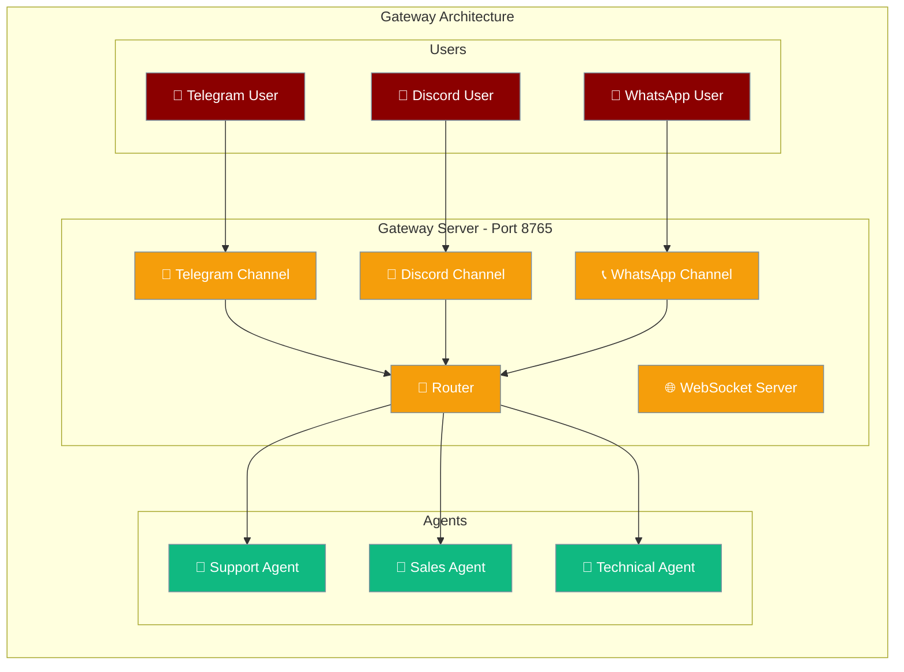
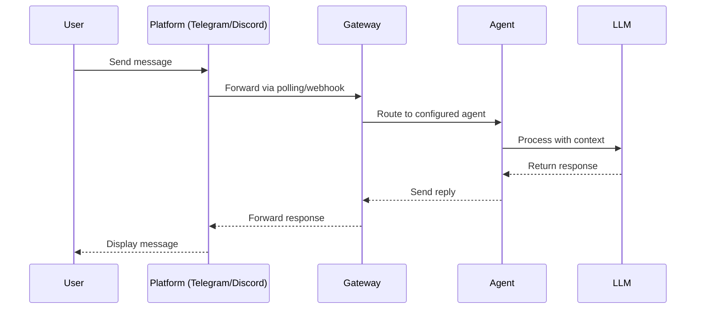
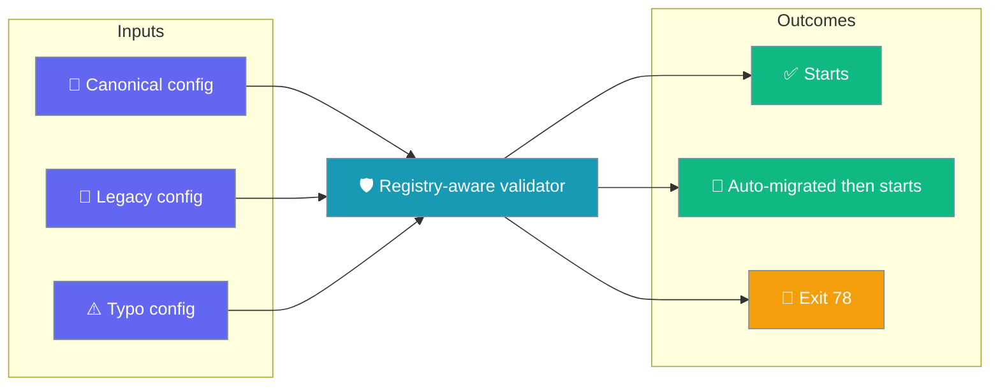

<Note>
The gateway now ships in the `praisonai-bot` package. `praisonai serve gateway` still works exactly as documented here; for a standalone install see [praisonai-bot Migration](/docs/guides/praisonai-bot-migration).
</Note>


```python
from praisonaiagents import Agent

agent = Agent(name="gateway-agent", instructions="Route messages through the PraisonAI gateway.")
agent.start("Set up the gateway to handle Telegram and Slack messages.")
```


The PraisonAI Gateway enables multi-channel agent deployment through a WebSocket server that coordinates communication between agents and various platforms.

The user starts the gateway and sends a message on a channel; the gateway routes it to the right agent and returns the reply.



## Quick Start

<Steps>
<Step title="Install Gateway Dependencies">

Install both bot and API dependencies for gateway functionality:

```bash
pip install "praisonai[bot,api]"
```

The `[api]` extra provides uvicorn, fastapi, and starlette required by the gateway server.

</Step>

<Step title="Create Gateway Configuration">

Create a `gateway.yaml` file:

```yaml
gateway:
  host: "127.0.0.1"
  port: 8765

agents:
  assistant:
    model: gpt-4o-mini
    instructions: "You are a helpful assistant."

channels:
  telegram:
    platform: telegram
    token: ${TELEGRAM_BOT_TOKEN}
    routes:
      default: assistant
```

</Step>

<Step title="Start the Gateway">

Launch the gateway server:

```bash
praisonai gateway start --config gateway.yaml
```

The gateway starts on port 8765 with WebSocket and HTTP health endpoints.

</Step>
</Steps>

---

## How It Works



| Component | Role |
|-----------|------|
| **Gateway Server** | Manages WebSocket connections and routes messages |
| **Channels** | Platform-specific integrations (Telegram, Discord, etc.) |
| **Router** | Directs messages to appropriate agents based on rules |
| **Agents** | Process messages and generate responses |
| **Inbound Triggers** | `POST /hooks/<path>` — start agent runs from external HTTP events (webhooks, CI, IoT). See [Inbound Hooks](/docs/features/gateway-inbound-hooks). |

---

## Architecture Principles

### Single Instance Rule

**Critical:** Only run one gateway process per machine. Multiple processes conflict:

- Both try to bind port 8765
- Both poll the same Telegram token (causes 409 conflicts)
- Session state becomes inconsistent

### Channel Isolation

Each channel operates independently:

- Separate token per platform
- Independent routing rules
- Isolated session management
- Per-channel error handling

### Live Config Reload

The gateway diffs `gateway.yaml` against the running config and restarts only affected agents or channels. Invalid YAML saves keep the last-known-good config. The WebSocket server is never restarted. See [Gateway Hot-Reload](/docs/features/gateway-hot-reload).

### Fail-Safe Design

The gateway implements fail-safe patterns:

- Health checks at `/health` endpoint
- Automatic reconnection for platform polling
- Graceful degradation when agents are unavailable
- Request timeout handling (25-30 seconds for RAG)
- Versioned `hello` handshake with capability negotiation — see [Handshake Protocol](/docs/features/gateway-handshake-protocol). Connecting from Python, the bundled `praisonai-bot` client performs this handshake automatically and exposes the negotiated `client.features` / `client.policy` / `client.heartbeat_ms` — see [Client-side wiring](/docs/features/gateway-handshake-protocol#client-side-wiring-praisonai-bot).
- Shutdown forensics — on every exit, one log line and one diagnostic file record *why* the gateway stopped. See [Crash Forensics](/docs/features/gateway-forensics).
- Opt-in close-the-loop notice on permanent delivery failure — see [Undelivered Message Notice](/docs/features/undelivered-messages).

---

## Config Validation

A typo in `gateway.yaml` won't start a broken gateway — it fails fast with exit 78 before your users notice.

`praisonai gateway start` and `praisonai bot serve` now validate the same `gateway.yaml` to the same standard: canonical configs start, legacy configs auto-migrate then start, and typos exit 78.



The validator consults the platform registry — built-in platforms plus any published via `praisonai.channels` / `praisonai.bots` entry points plus any registered at runtime with `register_platform()`.

<AccordionGroup>

<Accordion title="Typo channel (telegran) — rejected, exit 78">

```yaml
agents:
  assistant:
    instructions: "You are a helpful assistant."
channels:
  telegran:                     # typo — should be 'telegram'
    token: ${TELEGRAM_BOT_TOKEN}
```

**Before:** warns, gateway starts, `/health` returns 200 — but Telegram is silently dead.

```text
WARNING  Channel 'telegran' platform 'telegran' is not a known platform
         (agentmail, discord, email, slack, telegram, whatsapp)
INFO     Gateway started on http://127.0.0.1:8765
```

**After:** rejected before startup, exit 78 — the supervisor does not crash-loop.

```text
ERROR    Gateway config invalid (gateway.yaml):
           - Unknown channel 'telegran' (platform 'telegran').
             Supported platforms: agentmail, discord, email, linear, slack, telegram, whatsapp
$ echo $?                              # 78
```

</Accordion>

<Accordion title="Real adapter (linear) — accepted cleanly">

```yaml
channels:
  linear:
    token: ${LINEAR_API_KEY}
```

**Before:** spurious "not a known platform" warning, then starts.

**After:** accepted with no warning — `linear` is a shipped adapter on the registry.

</Accordion>

<Accordion title="Plugin channel (mattermost) — accepted via register_platform()">

```python
from praisonai.bots._registry import register_platform

class MattermostBot:
    def __init__(self, **kwargs): self.cfg = kwargs
    async def start(self): ...
    async def stop(self): ...

register_platform("mattermost", MattermostBot)
```

```yaml
channels:
  mattermost:
    token: ${MATTERMOST_TOKEN}
```

**Before:** warned "not a known platform", gateway started, channel silently dead on the runtime path.

**After:** accepted on both `praisonai bot serve` and `praisonai gateway start`.

</Accordion>

</AccordionGroup>

<Tip>
See [Gateway Exit Codes](/docs/features/gateway-exit-codes) for how to wire your supervisor so a fatal config error alerts instead of restart-looping.
</Tip>

---

## Gateway Modes

<AccordionGroup>

<Accordion title="Multi-Channel Mode">

Run multiple platforms simultaneously:

```yaml
channels:
  telegram_support:
    platform: telegram
    token: ${TELEGRAM_SUPPORT_TOKEN}
    routes:
      default: support_agent
  
  discord_community:
    platform: discord
    token: ${DISCORD_BOT_TOKEN}
    routes:
      default: community_agent
```

Each channel requires a unique token and can route to different agents.

</Accordion>

<Accordion title="WebSocket-Only Mode">

Pure WebSocket server without chat platforms:

```bash
praisonai gateway start --host 127.0.0.1 --port 8765
```

Provides WebSocket endpoint for custom client integration.

</Accordion>

<Accordion title="Agent File Mode">

Load agents from separate configuration:

```bash
praisonai gateway start --agents agents.yaml
```

Separates agent definitions from gateway configuration.

</Accordion>

</AccordionGroup>

---

## Health Monitoring

The gateway exposes health information:

```bash
curl http://127.0.0.1:8765/health
```

**Response:**
```json
{
  "status": "healthy",
  "uptime": 3600.5,
  "agents": 3,
  "sessions": 12,
  "clients": 8,
  "channels": {
    "telegram_support": {
      "platform": "telegram",
      "running": true
    },
    "discord_community": {
      "platform": "discord", 
      "running": true
    }
  }
}
```

### Health Check Limitations

Current implementation limitations:

- `"running": true` doesn't guarantee platform polling health
- No detection of Telegram 409 conflicts until PraisonAI fix ships
- Manual verification required for silent bot issues

---

## Configuration Options

<Note>
For complete configuration reference, see the auto-generated SDK documentation. The table below shows common options.
</Note>

| Option | Type | Default | Description |
|--------|------|---------|-------------|
| `host` | `str` | `"127.0.0.1"` | Gateway bind address |
| `port` | `int` | `8765` | Gateway port |
| `max_connections` | `int` | `100` | WebSocket connection limit |
| `heartbeat_interval` | `int` | `30` | WebSocket ping interval |
| `session_timeout` | `int` | `3600` | Session expiration in seconds |
| `session.persist` | `bool` | `false` | Persist sessions across restarts |
| `session.persist_path` | `str` | `~/.praisonai/sessions/` | Storage directory |
| `session.resume_window` | `int` | `86400` | Seconds detached sessions stay resumable |

---

## Best Practices

<AccordionGroup>

<Accordion title="Edit gateway.yaml live">

You can change agent instructions, models, or a single channel section while the gateway runs. Agent-only edits recreate agents without restarting channels. See [Hot-Reload](/docs/features/gateway-hot-reload).

</Accordion>

<Accordion title="Use environment variables for secrets">

Never hardcode tokens in configuration files:

```yaml
# Good
channels:
  telegram:
    token: ${TELEGRAM_BOT_TOKEN}

# Bad  
channels:
  telegram:
    token: "123456:hardcoded_token"
```

Store tokens in `.env` file or environment variables.

</Accordion>

<Accordion title="Implement proper error handling">

Monitor gateway logs for platform-specific errors:

```bash
# View gateway logs
tail -f ~/.praisonai/logs/gateway.log

# Common error patterns
grep "409\|Conflict\|getUpdates" ~/.praisonai/logs/gateway.log
```

</Accordion>

<Accordion title="Configure resource limits">

Set appropriate limits based on expected load:

```yaml
gateway:
  max_connections: 100    # Adjust for concurrent users
  session_timeout: 3600   # 1 hour default
  message_queue_size: 1000
```

</Accordion>

<Accordion title="Use unique tokens per channel">

Each channel must have its own platform token:

```yaml
channels:
  telegram_support:
    token: ${TELEGRAM_SUPPORT_TOKEN}  # Bot 1
  telegram_sales:  
    token: ${TELEGRAM_SALES_TOKEN}    # Bot 2 (different bot)
```

Never reuse tokens across channels.

</Accordion>

</AccordionGroup>

---

## Cost Optimization

Running a PraisonAI gateway on serverless hosts (Fly.io Machines, Modal, Cloud Run) charges for every second the machine is alive — even when no users are chatting. The **Scale-to-Zero** feature lets the gateway stand transports down after a configurable period of silence and wake back up on the next inbound message, so you pay only for active time.

<Card title="Scale-to-Zero Gateway" icon="moon" href="/docs/features/gateway-scale-to-zero">
  Suspend the gateway when idle and wake on the next message — pay only for active time.
</Card>

---

## Lifecycle

Three opt-in **lifecycle** policies wire into the primary `WebSocketGateway` through a `lifecycle:` block in `gateway.yaml`, matching CLI flags, and a Python surface. Each is off unless enabled, and configured features surface under `health()["lifecycle"]`.

<CardGroup cols={2}>
<Card title="Scale to Zero" icon="moon" href="/docs/features/gateway-scale-to-zero">
  Quiesce when idle for `idle_minutes` and self-wake on the next message.
</Card>
<Card title="Drain Trigger" icon="power-off" href="/docs/features/gateway-drain-trigger">
  Epoch-safe external drain marker with a built-in watcher.
</Card>
<Card title="Crash-Loop Guard" icon="shield-halved" href="/docs/features/gateway-crash-loop-guard">
  Halt auto-resume of a channel that keeps crashing on resume.
</Card>
</CardGroup>

---

## Related

<CardGroup cols={2}>
<Card title="Admission Control" icon="shield-check" href="/docs/features/gateway-admission-control">
  Bound concurrent inbound agent runs with a fair queue and overflow policy
</Card>
<Card title="Session Persistence" icon="database" href="/docs/features/gateway-session-persistence">
  Survive restarts and resume mid-conversation
</Card>
<Card title="Windows Deployment" icon="windows" href="/docs/features/gateway-windows-deployment">
  Complete Windows setup guide
</Card>
<Card title="Multi-Channel Telegram" icon="paper-plane" href="/docs/features/gateway-telegram-multichannel">
  Hermes-style workforce deployment
</Card>
<Card title="Scale to Zero" icon="moon" href="/docs/features/gateway-scale-to-zero">
  Pay only for active time — idle-dormancy for serverless hosts
</Card>
<Card title="Tracing Hook" icon="route" href="/docs/features/gateway-tracing-hook">
  Emit OpenTelemetry spans across each pipeline stage
</Card>
<Card title="Undelivered Notice" icon="envelope-open-text" href="/docs/features/gateway-undelivered-notice">
  Notify users and operators when a reply can't be delivered
</Card>
</CardGroup>