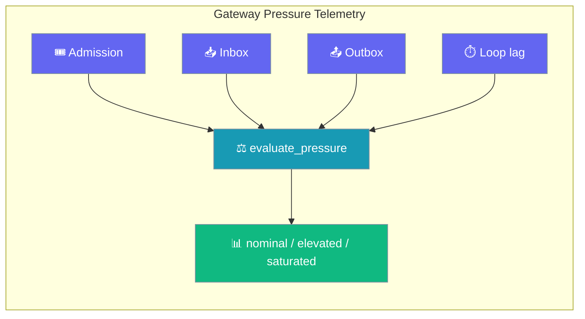
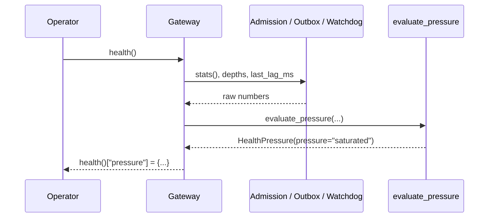
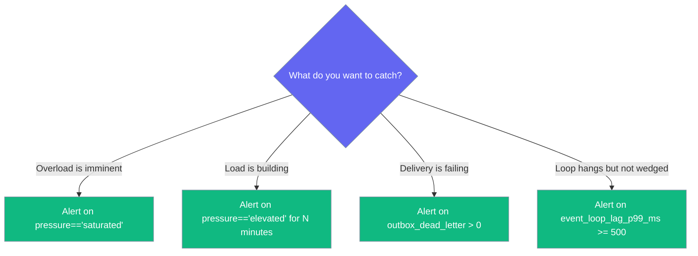

Pressure telemetry surfaces how loaded the gateway is *before* it starts shedding turns. One health block, one classification.



## Quick Start

<Steps>

<Step title="Ask an agent">

```python
from praisonaiagents import Agent

agent = Agent(
    name="Ops",
    instructions="Read gateway.health() and tell the operator if the gateway is backing up.",
)
agent.start("Is the gateway saturated right now?")
```

</Step>

<Step title="Read the health block">

```python
h = gateway.health()
pressure = h.get("pressure")
if pressure:
    print(pressure["pressure"])            # 'nominal' | 'elevated' | 'saturated'
    print(pressure["admission_in_flight"], "/", pressure["admission_max"])
    print(pressure["event_loop_lag_p99_ms"], "ms")
```

</Step>

<Step title="Classify your own numbers">

```python
from praisonaiagents.gateway import evaluate_pressure

p = evaluate_pressure(
    admission={"max_concurrent_runs": 16, "in_flight": 15, "queued": 40, "shed": 3},
    inbox_pending=128,
    outbox_pending=412,
    outbox_dead_letter=2,
    loop_lag_p99_ms=740.0,
)
print(p.pressure)   # 'saturated'
```

</Step>

</Steps>

---

## How It Works

The enforcement layer already measures every field. This block reads them back and folds them through a pure classifier.



| Signal | Where it comes from |
|---|---|
| `admission_*` | `AdmissionGate.stats()` |
| `inbox_pending` | Sum of per-session inbox depth |
| `outbox_pending`, `outbox_dead_letter` | `OutboundQueue.try_depth_snapshot()` (never blocks the loop) |
| `event_loop_lag_p99_ms` | `LoopWatchdog.last_lag_ms` |

The block is omitted entirely when no back-pressure machinery is wired — always-on gateways see the block appear naturally.

The resulting health surface under load:

```python
h = gateway.health()
# {'status': 'healthy', ...,
#  'pressure': {'admission_max': 16, 'admission_in_flight': 15,
#     'admission_queued': 40, 'admission_shed_total': 3,
#     'inbox_pending': 128, 'outbox_pending': 412, 'outbox_dead_letter': 2,
#     'event_loop_lag_p99_ms': 740.0, 'pressure': 'saturated'}}
```

---

## Choosing what to alert on



---

## Configuration Options

Nothing to configure — pressure telemetry is on wherever the back-pressure machinery is on.

The fields on `HealthPressure`:

| Field | Type | Default | Description |
|---|---|---|---|
| `admission_max` | `int` | `0` | Configured concurrency ceiling (`0` = unbounded). |
| `admission_in_flight` | `int` | `0` | Turns currently running. |
| `admission_queued` | `int` | `0` | Turns waiting for a slot. |
| `admission_shed_total` | `int` | `0` | Cumulative turns shed since start. |
| `inbox_pending` | `int` | `0` | Aggregate pending inbound queue depth across sessions. |
| `outbox_pending` | `int` | `0` | Durable outbound backlog awaiting delivery. |
| `outbox_dead_letter` | `int` | `0` | Durable outbound entries in the dead-letter tier. |
| `event_loop_lag_p99_ms` | `float` | `0.0` | Recent event-loop scheduling lag (ms). |
| `pressure` | `"nominal"` \| `"elevated"` \| `"saturated"` | `"nominal"` | Derived classification. |

`HealthPressure` is `frozen=True` — mutating a field raises `dataclasses.FrozenInstanceError`.

### Thresholds

**`saturated`** (any one):
- admission full **and** work is queuing (`in_flight >= max` and `queued > 0`)
- `outbox_dead_letter > 0`
- `event_loop_lag_p99_ms >= 500.0`

**`elevated`** (any one):
- admission utilisation `>= 0.8` (80%)
- `queued > 0`
- `inbox_pending > 0`
- `outbox_pending > 0`
- `event_loop_lag_p99_ms >= 100.0`

**`nominal`** — none of the above.

Unbounded admission (`max_concurrent_runs == 0`) never divides by zero. Negative or non-numeric inputs are coerced to zero.

---

## Metrics

Six gauges appear on `/metrics` whenever the block is populated:

| Metric | Source field |
|---|---|
| `admission_in_flight` | `pressure.admission_in_flight` |
| `admission_queued` | `pressure.admission_queued` |
| `inbox_pending` | `pressure.inbox_pending` |
| `outbox_pending` | `pressure.outbox_pending` |
| `outbox_dead_letter` | `pressure.outbox_dead_letter` |
| `event_loop_lag_ms` | `pressure.event_loop_lag_p99_ms` |

---

## Common Patterns

**Autoscaler / load-balancer readiness gate**

```python
p = gateway.health().get("pressure", {})
ready = p.get("pressure") != "saturated"
```

**Agent-driven ops assistant**

```python
from praisonaiagents import Agent

def get_pressure() -> dict:
    return gateway.health().get("pressure", {})

agent = Agent(
    name="Ops",
    instructions="If pressure=='saturated', tell the operator what to check first.",
    tools=[get_pressure],
)
agent.start("How is the gateway holding up?")
```

**Pre-flight classification**

```python
from praisonaiagents.gateway import evaluate_pressure

# Fold your own metrics through the same classifier the gateway uses
p = evaluate_pressure(loop_lag_p99_ms=210.0)
print(p.pressure)   # 'elevated'
```

---

## Best Practices

<AccordionGroup>

<Accordion title="Page on saturated, not elevated">
`saturated` is imminent shed. A non-empty dead-letter tier means outbound work is being dropped — page immediately.
</Accordion>

<Accordion title="Unit-test with evaluate_pressure">
Pure and deterministic — feed it stub numbers and assert the classification. No fixtures needed.
</Accordion>

<Accordion title="Guard the pressure key">
The `pressure` key is absent when no back-pressure machinery is wired. Guard with `.get("pressure")`.
</Accordion>

<Accordion title="Snapshot vs shape over time">
`health()["pressure"]` is a point-in-time snapshot; the `/metrics` gauges give you the shape over time.
</Accordion>

</AccordionGroup>

---

## Related

<CardGroup cols={2}>

<Card title="Loop Watchdog" icon="stethoscope" href="/features/gateway-loop-watchdog">
  Where `event_loop_lag_p99_ms` comes from.
</Card>

<Card title="Hot Reload" icon="rotate" href="/features/gateway-hot-reload">
  The `ReloadStatus` health block this feature mirrors exactly.
</Card>

<Card title="Gateway Overview" icon="server" href="/features/gateway-overview">
  Where the top-level `health()` fields live.
</Card>

<Card title="Reliability Preset" icon="shield-check" href="/features/gateway-reliability">
  The drain + admission preset this telemetry observes.
</Card>

</CardGroup>
