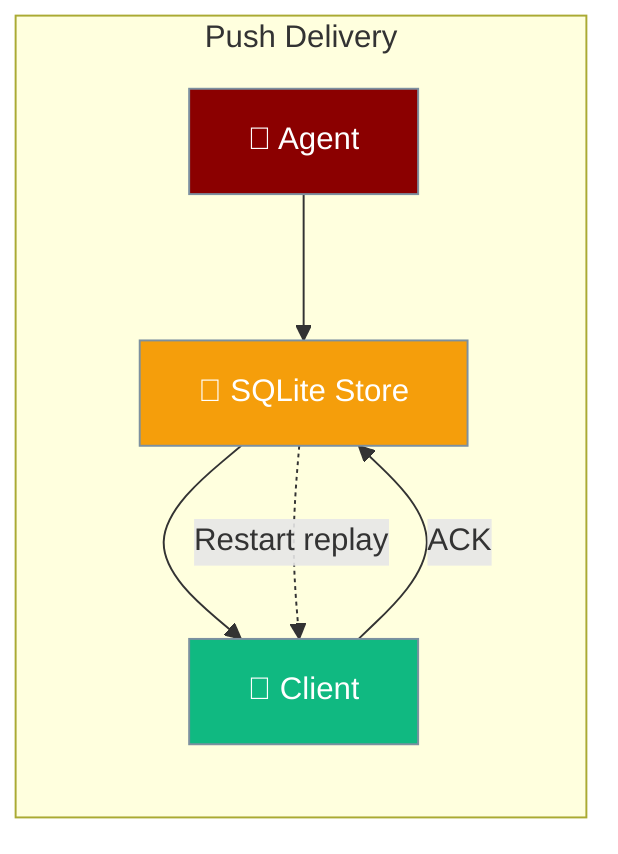
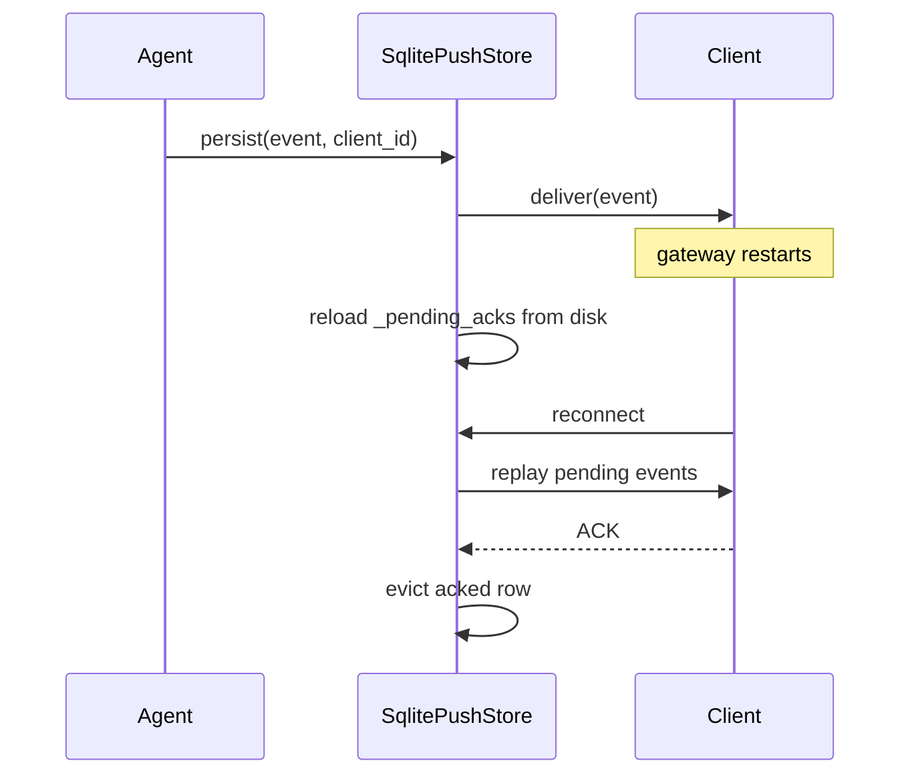
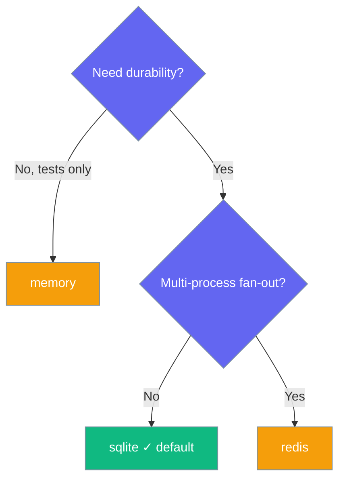

Push delivery persists pending, un-acknowledged events to disk so a gateway restart never silently drops a message.



## Quick Start

<Steps>
<Step title="Default (durable, zero config)">
Enable push and delivery is durable out of the box — no flags, no external services.

```python
from praisonaiagents import Agent
from praisonaiagents.gateway import GatewayConfig, PushConfig

agent = Agent(name="Notifier", instructions="Push updates to subscribed clients")

gateway = GatewayConfig(
    push=PushConfig(enabled=True)   # durable-by-default SQLite backend
)
```

Pending events are written to `~/.praisonai/state/push_delivery.sqlite` and replayed on restart.
</Step>

<Step title="Explicit ephemeral (opt-out for tests)">
Switch to `memory` when durability is unwanted, such as throwaway test runs.

```python
from praisonaiagents.gateway import GatewayConfig, PushConfig, DeliveryConfig

gateway = GatewayConfig(
    push=PushConfig(
        enabled=True,
        delivery=DeliveryConfig(store_backend="memory"),
    )
)
```
</Step>

<Step title="Redis for horizontal scaling">
Point delivery at Redis to fan out across multiple gateway processes.

```python
from praisonaiagents.gateway import GatewayConfig, PushConfig, DeliveryConfig, RedisConfig

gateway = GatewayConfig(
    push=PushConfig(
        enabled=True,
        redis=RedisConfig(url="redis://localhost:6379/0"),
        delivery=DeliveryConfig(store_backend="redis"),
    )
)
```
</Step>
</Steps>

The same settings load from `gateway.yaml`:

```yaml
gateway:
  push:
    enabled: true
    delivery:
      store_backend: sqlite   # default; also: redis | memory
      ack_timeout: 30
      max_retries: 3
      message_ttl: 86400
```

---

## How It Works

The store persists each pending event, replays it after a restart, and evicts the row once the client acknowledges.



| Stage | What happens |
|-------|--------------|
| Persist | Event and its recipient `client_id` are written to the SQLite WAL journal |
| Deliver | The gateway sends the event and waits for an ACK |
| Restart replay | Pending rows are reloaded and scheduled for immediate redelivery |
| Evict | The row is deleted on ACK or once older than `message_ttl` |

---

## Choosing a Backend

Pick the backend that matches your durability and scaling needs.



---

## Configuration Options

`DeliveryConfig` controls the at-least-once guarantee.

| Option | Type | Default | Description |
|--------|------|---------|-------------|
| `enabled` | `bool` | `True` | Toggle delivery guarantees |
| `ack_timeout` | `int` | `30` | Seconds to wait for ACK before retrying |
| `max_retries` | `int` | `3` | Maximum retry attempts |
| `retry_backoff` | `float` | `2.0` | Exponential backoff multiplier |
| `message_ttl` | `int` | `86400` | Retention seconds for un-acked messages |
| `store_backend` | `str` | `"sqlite"` | `"sqlite"` \| `"redis"` \| `"memory"` |

An invalid `store_backend` raises `ValueError` at construction time — the closed set is validated in `__post_init__`.

### Where State Lives

| Backend | Location | Survives restart? | Multi-process? |
|---------|----------|-------------------|----------------|
| `sqlite` (default) | `~/.praisonai/state/push_delivery.sqlite` (WAL) | ✅ | ❌ single process |
| `redis` | Redis (uses `RedisConfig`) | ✅ | ✅ |
| `memory` | RAM | ❌ | ❌ |

---

## Common Patterns

Three setups cover most deployments.

<Tabs>
<Tab title="Survives a redeploy">
Keep the default backend so a mid-notification restart replays on reconnect.

```python
from praisonaiagents.gateway import GatewayConfig, PushConfig

gateway = GatewayConfig(push=PushConfig(enabled=True))
```
</Tab>

<Tab title="Horizontal scale-out">
Switch to `redis` when running more than one gateway replica behind a load balancer.

```python
from praisonaiagents.gateway import GatewayConfig, PushConfig, DeliveryConfig, RedisConfig

gateway = GatewayConfig(
    push=PushConfig(
        enabled=True,
        redis=RedisConfig(url="redis://localhost:6379/0"),
        delivery=DeliveryConfig(store_backend="redis"),
    )
)
```
</Tab>

<Tab title="Throwaway CI">
Use `memory` so no SQLite artefacts leak into the CI workspace.

```python
from praisonaiagents.gateway import GatewayConfig, PushConfig, DeliveryConfig

gateway = GatewayConfig(
    push=PushConfig(
        enabled=True,
        delivery=DeliveryConfig(store_backend="memory"),
    )
)
```
</Tab>
</Tabs>

---

## Best Practices

<AccordionGroup>
<Accordion title="Keep the default">
SQLite is durable, zero-dependency, and appropriate for the vast majority of deployments.
</Accordion>

<Accordion title="Choose redis only for multi-process gateways">
For a single gateway, SQLite is faster and simpler. Reach for `redis` when fanning out across replicas.
</Accordion>

<Accordion title="Use memory only for tests">
Any restart loses in-flight events silently, so reserve `memory` for throwaway runs.
</Accordion>

<Accordion title="Back up the state directory">
Include `~/.praisonai/state/` in your agent-state backups. The file is small — rows evict on ACK and TTL — but it holds the durability guarantee.
</Accordion>
</AccordionGroup>

---

## Related

<CardGroup cols={2}>
<Card title="Gateway Overview" icon="server" href="/docs/features/gateway-overview">
Configure and run the gateway that hosts push delivery.
</Card>
<Card title="Durable Delivery" icon="paper-plane" href="/docs/features/durable-delivery">
Distinguish outbound platform delivery from gateway push delivery.
</Card>
</CardGroup>
