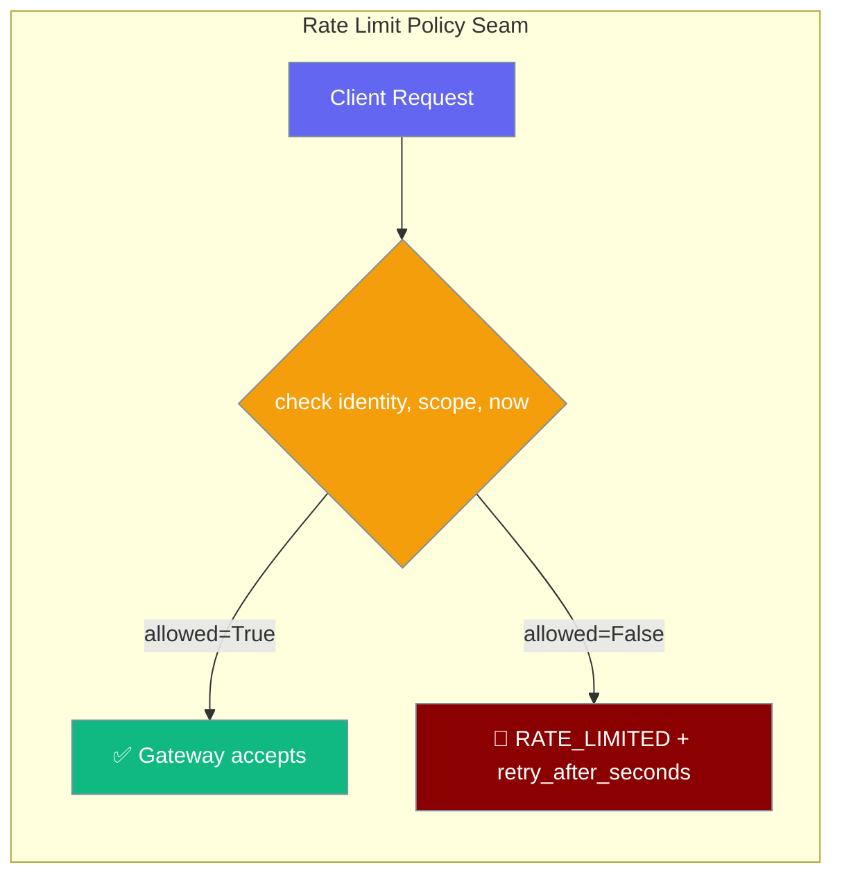

The `RateLimitPolicyProtocol` lets you plug any rate limiter — per-tenant, Redis-backed, or cost-based — into the gateway's connection handshake. A built-in sliding window policy covers most use cases out of the box.

```python
from praisonaiagents.gateway import SlidingWindowRateLimitPolicy
from praisonai.gateway import WebSocketGateway
from praisonaiagents import Agent

policy = SlidingWindowRateLimitPolicy(max_requests=5, window_seconds=60.0)
gateway = WebSocketGateway(agent=Agent(name="Bot", instructions="Be helpful"), rate_limit_policy=policy)
```



## Quick Start

<Steps>
<Step title="Use the built-in sliding window">

```python
from praisonaiagents.gateway import SlidingWindowRateLimitPolicy

policy = SlidingWindowRateLimitPolicy(
    max_requests=5,
    window_seconds=60.0,
    lockout_seconds=300.0,   # 5 min cooldown after ceiling breach
)
```
</Step>

<Step title="Inject into WebSocketGateway">

```python
from praisonaiagents import Agent
from praisonai.gateway import WebSocketGateway
from praisonaiagents.gateway import SlidingWindowRateLimitPolicy

policy = SlidingWindowRateLimitPolicy(max_requests=5, window_seconds=60.0)

gateway = WebSocketGateway(
    agent=Agent(name="Bot", instructions="Be helpful"),
    rate_limit_policy=policy,
)
```
</Step>

<Step title="Configure via YAML">

```yaml
gateway:
  rate_limit:
    max_requests: 5
    window_seconds: 60
    lockout_seconds: 300
```
</Step>

<Step title="Write your own policy">

```python
from praisonaiagents.gateway import RateLimitDecision, RateLimitPolicyProtocol

class MyPolicy:
    def check(self, *, identity: str, scope: str, now: float) -> RateLimitDecision:
        if is_over_quota(identity, scope):
            return RateLimitDecision(allowed=False, retry_after_seconds=30.0)
        return RateLimitDecision(allowed=True)

assert isinstance(MyPolicy(), RateLimitPolicyProtocol)  # runtime-checkable
```
</Step>
</Steps>

---

## API Reference

### `RateLimitDecision`

A frozen dataclass returned by every `check()` call.

| Field | Type | Description |
|-------|------|-------------|
| `allowed` | `bool` | `True` means the request passes. `False` triggers `RATE_LIMITED` on the connection. |
| `retry_after_seconds` | `Optional[float]` | Hint to the client: how long to wait before retrying. Sent as `HelloError.retry_after_seconds` on the wire. |

### `RateLimitPolicyProtocol`

A `@runtime_checkable Protocol` — any class with a matching `check` method satisfies it without inheritance.

```
check(*, identity: str, scope: str, now: float) → RateLimitDecision
```

| Argument | Type | Description |
|----------|------|-------------|
| `identity` | `str` | Caller identity: auth token, user id, or API key. |
| `scope` | `str` | Endpoint class, channel, or tenant token. |
| `now` | `float` | `time.time()`-style float. Use instead of calling `time.time()` directly for testability. |

### `SlidingWindowRateLimitPolicy`

The built-in concrete implementation.

| Option | Type | Default | Description |
|--------|------|---------|-------------|
| `max_requests` | `int` | `0` | Ceiling per `(scope, identity)` in the window. **`0` disables limiting entirely** — every request is allowed (legacy default). |
| `window_seconds` | `float` | `60.0` | Sliding window size. Must be `> 0`. |
| `lockout_seconds` | `float` | `0.0` | Cooldown after ceiling breach. Must be `>= 0`. During lockout, every `check()` returns `allowed=False` with `retry_after_seconds` pointing at the end of the cooldown. |

### `RateLimitPolicy`

A backward-compatible alias for `RateLimitPolicyProtocol`. Use `RateLimitPolicyProtocol` in new code.

---

## How the Gateway Maps a Limited Decision

When `check()` returns `allowed=False`:

1. The gateway sends a `hello_error` frame with `code: rate_limited`.
2. If `retry_after_seconds` is set, it is included in the frame.
3. The connection is closed.

The client receives `ConnectErrorCode.RATE_LIMITED` with `next_step=WAIT_THEN_RETRY`. See [Gateway Handshake Protocol](/docs/features/gateway-handshake-protocol) for the full frame schema.

---

## State Ownership Caveat

The built-in `SlidingWindowRateLimitPolicy` is **not internally synchronised** and reclaims `(scope, identity)` entries lazily (next-check overwrite).

- **Suitable for:** bounded, authenticated identity spaces (tenants, endpoint classes, known API keys).
- **Not suitable for:** unbounded / untrusted identity spaces (raw per-IP keys). For those, the wrapper that owns the policy instance should run periodic reclamation to bound memory growth.

---

## Best Practices

<AccordionGroup>
<Accordion title="Set max_requests=0 to disable limiting">

`max_requests=0` is the default — it passes every request through, identical to having no policy. Use this when you want to add a policy object for future use without enforcing limits yet.
</Accordion>

<Accordion title="Tune lockout_seconds for abusive callers">

Set `lockout_seconds` to apply a cooldown after a caller hits the ceiling. Without a lockout, callers can burst exactly `max_requests` per window forever by timing their requests carefully.
</Accordion>

<Accordion title="Use identity for per-user limits, scope for per-feature limits">

Pass the authenticated user id as `identity` and a channel or feature class as `scope`. This gives you `(user, feature)` rate limiting — for example, 5 research queries per minute per user, not 5 total.
</Accordion>

<Accordion title="Use runtime_checkable for duck-typing">

`RateLimitPolicyProtocol` is `@runtime_checkable` — use `isinstance(my_policy, RateLimitPolicyProtocol)` to verify your custom class satisfies the contract before injecting it.
</Accordion>
</AccordionGroup>

---

## Related

<CardGroup cols={2}>
<Card title="Gateway Handshake Protocol" icon="handshake" href="/docs/features/gateway-handshake-protocol">
  ConnectErrorCode.RATE_LIMITED and HelloError.retry_after_seconds
</Card>
<Card title="Bot Rate Limiting" icon="traffic-cone" href="/docs/features/bot-rate-limiting">
  Platform-level outbound rate limiting for messaging APIs
</Card>
<Card title="Gateway Admission Control" icon="door-open" href="/docs/features/gateway-admission-control">
  Inbound concurrency ceiling and queue policy
</Card>
<Card title="Gateway Reliability" icon="shield-check" href="/docs/features/gateway-reliability">
  One-switch reliability preset for production deployments
</Card>
</CardGroup>
