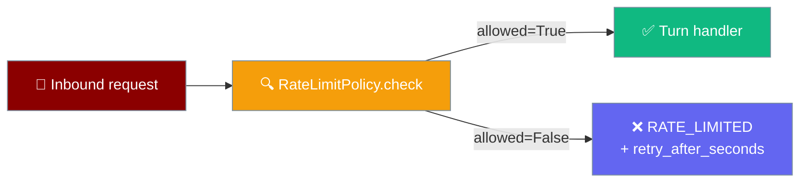
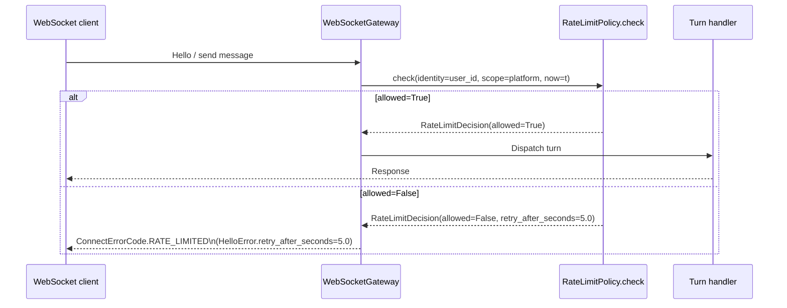

`RateLimitPolicyProtocol` is the injectable seam that lets you plug any rate-limiting logic — per-tenant, Redis-backed, cost-based — into the core gateway with a single `check` method.



## Quick Start

<Steps>
<Step title="Import the built-in sliding-window limiter">

```python
from praisonaiagents.gateway import SlidingWindowRateLimitPolicy

limiter = SlidingWindowRateLimitPolicy(max_requests=60, window_seconds=60)
```

</Step>

<Step title="Inject it into the gateway">

```python
from praisonaiagents import Agent
from praisonai.bots import BotOS
from praisonaiagents.gateway import SlidingWindowRateLimitPolicy

agent = Agent(name="assistant", instructions="Help the user.")
limiter = SlidingWindowRateLimitPolicy(max_requests=30, window_seconds=60)

bot = BotOS(
    agent=agent,
    platforms=["telegram"],
    rate_limit_policy=limiter,
)
bot.start()
```

</Step>

<Step title="Write a custom limiter">

Any object with a `check(*, identity, scope, now)` method satisfies the protocol — no base class needed:

```python
from praisonaiagents.gateway import RateLimitDecision

class MyTenantLimiter:
    def check(self, *, identity: str, scope: str, now: float) -> RateLimitDecision:
        # identity: usually user/chat id
        # scope: platform or channel name
        # now: unix timestamp (float) from time.monotonic()
        allowed = self._check_quota(identity, scope, now)
        retry_after = 0.0 if allowed else 5.0
        return RateLimitDecision(allowed=allowed, retry_after_seconds=retry_after)

    def _check_quota(self, identity, scope, now):
        return True   # replace with real logic
```

</Step>
</Steps>

---

## How It Works



`allowed=False` maps to `ConnectErrorCode.RATE_LIMITED` on the wire and sets `HelloError.retry_after_seconds` so clients know when to retry. The shape is symmetric with `SendPolicy`, `ConcurrencyLimitPolicy`, and `DrainPolicy`.

---

## Imports

```python
from praisonaiagents.gateway import (
    RateLimitDecision,
    RateLimitPolicyProtocol,
    RateLimitPolicy,              # backward-compat alias for the Protocol
    SlidingWindowRateLimitPolicy,
)
```

---

## API Reference

### `RateLimitDecision`

A **frozen** dataclass returned by every `check` call:

| Field | Type | Description |
|-------|------|-------------|
| `allowed` | `bool` | `True` → request passes; `False` → reject with rate-limit error |
| `retry_after_seconds` | `float` | Hint to the client for when to retry. `0.0` when allowed. |

### `RateLimitPolicyProtocol`

`@runtime_checkable` `Protocol` — any class with a matching `check` signature satisfies it without inheriting:

```python
class RateLimitPolicyProtocol(Protocol):
    def check(
        self,
        *,
        identity: str,
        scope: str,
        now: float,
    ) -> RateLimitDecision: ...
```

| Parameter | Type | Description |
|-----------|------|-------------|
| `identity` | `str` | Per-user or per-chat identifier |
| `scope` | `str` | Platform or channel name (e.g. `"telegram"`) |
| `now` | `float` | Current monotonic timestamp (`time.monotonic()`) |

### `RateLimitPolicy`

Backward-compat alias for `RateLimitPolicyProtocol`. New code should import `RateLimitPolicyProtocol`.

### `SlidingWindowRateLimitPolicy`

Config-driven, dependency-free default. Keyed per `(scope, identity)`.

| Option | Type | Default | Description |
|--------|------|---------|-------------|
| `max_requests` | `int` | `0` | Max requests per window. `0` disables limiting (always-allow). |
| `window_seconds` | `float` | `60.0` | Rolling window width in seconds |
| `lockout_seconds` | `float` | `0.0` | Optional cooldown after a breach before allowing again |

```python
from praisonaiagents.gateway import SlidingWindowRateLimitPolicy

# 20 requests per minute, 10-second lockout on breach
limiter = SlidingWindowRateLimitPolicy(
    max_requests=20,
    window_seconds=60.0,
    lockout_seconds=10.0,
)
```

---

## Common Patterns

### Per-tenant limiter with different quotas

```python
from praisonaiagents.gateway import RateLimitDecision

QUOTAS = {
    "premium": 120,
    "free": 10,
}

class TierLimiter:
    def __init__(self):
        self._counts = {}

    def _get_tier(self, identity: str) -> str:
        return "premium" if identity.startswith("p_") else "free"

    def check(self, *, identity: str, scope: str, now: float) -> RateLimitDecision:
        tier = self._get_tier(identity)
        quota = QUOTAS[tier]
        # simplified — use a real sliding window in production
        count = self._counts.get(identity, 0)
        if count >= quota:
            return RateLimitDecision(allowed=False, retry_after_seconds=60.0)
        self._counts[identity] = count + 1
        return RateLimitDecision(allowed=True, retry_after_seconds=0.0)
```

### Disable rate limiting (legacy always-allow)

```python
from praisonaiagents.gateway import SlidingWindowRateLimitPolicy

limiter = SlidingWindowRateLimitPolicy(max_requests=0)  # 0 = disabled
```

---

## Best Practices

<AccordionGroup>

<Accordion title="Keep check() fast — it runs on every request">

`check` is called synchronously on the hot path. Avoid network calls inside it. Use a local in-process cache (e.g. a dict + sliding window) and sync to Redis or a database asynchronously.

</Accordion>

<Accordion title="Always return retry_after_seconds when rejecting">

Clients use `retry_after_seconds` to back off correctly. Returning `0.0` on a rejection causes immediate retries and amplifies load. Return a meaningful value (5–60 s).

</Accordion>

<Accordion name="Use SlidingWindowRateLimitPolicy as the baseline">

The built-in sliding-window limiter covers most production needs with zero dependencies. Build a custom limiter only when you need cross-process state (Redis) or dynamic quotas.

</Accordion>

<Accordion title="Scope by both identity and scope for multi-platform bots">

The same user may appear across Telegram and Discord. Scope per `(identity, scope)` to set per-platform limits, or drop `scope` to share a single quota across all platforms.

</Accordion>

</AccordionGroup>

---

## Related

<CardGroup cols={2}>
<Card title="Rate Limiter" icon="gauge-high" href="/docs/features/rate-limiter">
  LLM API rate limiting (requests per minute, token budget)
</Card>
<Card title="Bot Rate Limiting" icon="traffic-cone" href="/docs/features/bot-rate-limiting">
  Messaging platform rate limits (Telegram, Discord, Slack)
</Card>
<Card title="Gateway Overview" icon="server" href="/docs/features/gateway-overview">
  Bot gateway architecture and core concepts
</Card>
<Card title="Gateway Flow Control" icon="sliders-horizontal" href="/docs/features/gateway-flow-control">
  Admission control and back-pressure
</Card>
</CardGroup>
