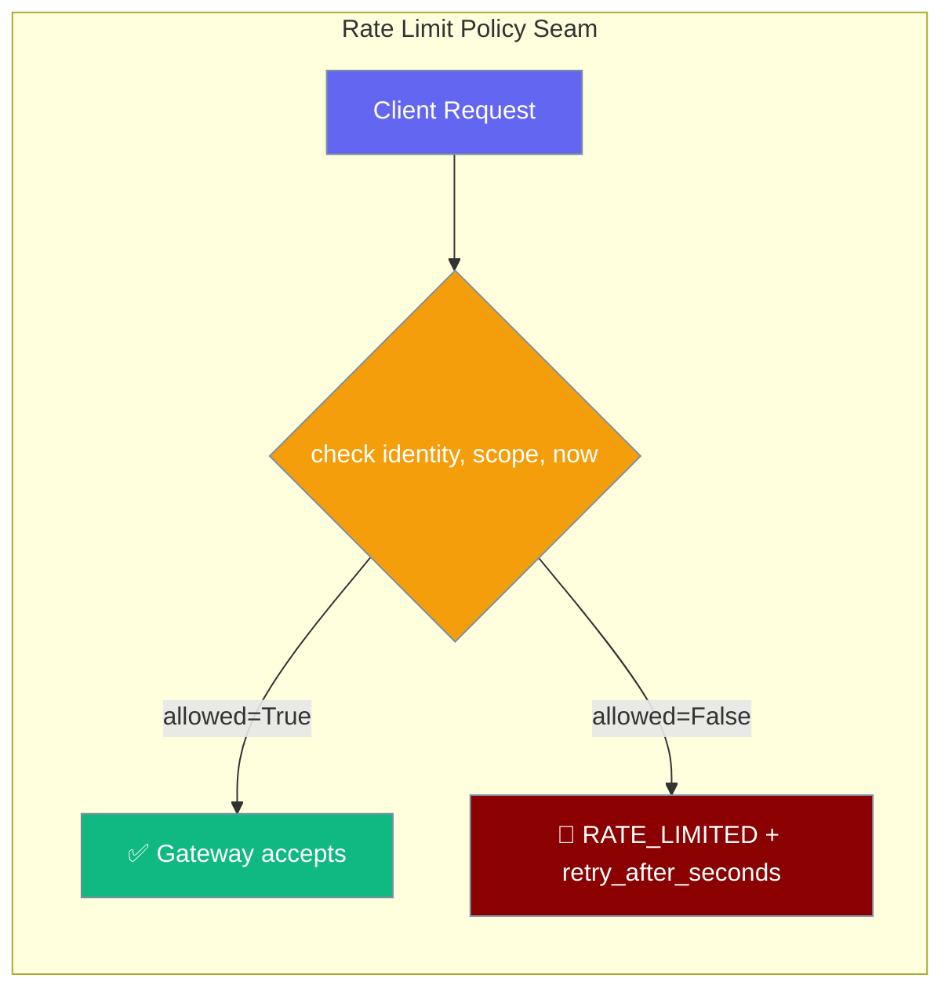
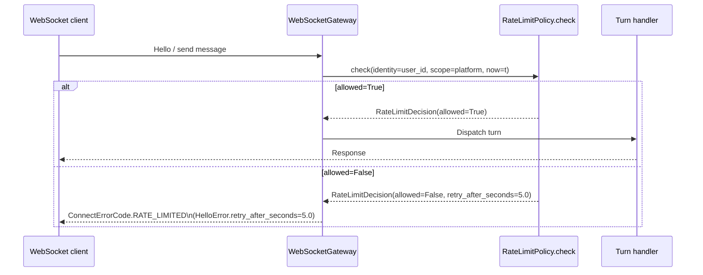

<Note>
The gateway now ships in the `praisonai-bot` package. `praisonai serve gateway` still works exactly as documented here; for a standalone install see [praisonai-bot Migration](/docs/guides/praisonai-bot-migration).
</Note>

The `RateLimitPolicyProtocol` lets you plug any rate limiter — per-tenant, Redis-backed, or cost-based — into the gateway's connection handshake with a single `check` method. A built-in sliding window policy covers most use cases out of the box.

```python
from praisonaiagents.gateway import SlidingWindowRateLimitPolicy
from praisonai.gateway import WebSocketGateway
from praisonaiagents import Agent

policy = SlidingWindowRateLimitPolicy(max_requests=5, window_seconds=60.0)
gateway = WebSocketGateway(agent=Agent(name="Bot", instructions="Be helpful"), rate_limit_policy=policy)
```



## Quick Start

<Steps>
<Step title="Use the built-in sliding window">

```python
from praisonaiagents.gateway import SlidingWindowRateLimitPolicy

policy = SlidingWindowRateLimitPolicy(
    max_requests=5,
    window_seconds=60.0,
    lockout_seconds=300.0,   # 5 min cooldown after ceiling breach
)
```
</Step>

<Step title="Inject into the gateway">

```python
from praisonaiagents import Agent
from praisonai.gateway import WebSocketGateway
from praisonaiagents.gateway import SlidingWindowRateLimitPolicy

policy = SlidingWindowRateLimitPolicy(max_requests=30, window_seconds=60.0)

gateway = WebSocketGateway(
    agent=Agent(name="Bot", instructions="Be helpful"),
    rate_limit_policy=policy,
)
```
</Step>

<Step title="Configure via YAML">

```yaml
gateway:
  rate_limit:
    max_requests: 5
    window_seconds: 60
    lockout_seconds: 300
```
</Step>

<Step title="Write your own policy">

Any object with a `check(*, identity, scope, now)` method satisfies the protocol — no base class needed:

```python
from praisonaiagents.gateway import RateLimitDecision, RateLimitPolicyProtocol

class MyPolicy:
    def check(self, *, identity: str, scope: str, now: float) -> RateLimitDecision:
        if is_over_quota(identity, scope):
            return RateLimitDecision(allowed=False, retry_after_seconds=30.0)
        return RateLimitDecision(allowed=True)

assert isinstance(MyPolicy(), RateLimitPolicyProtocol)  # runtime-checkable
```

</Step>
</Steps>

---

## How It Works



`allowed=False` maps to `ConnectErrorCode.RATE_LIMITED` on the wire and sets `HelloError.retry_after_seconds` so clients know when to retry. Wire details are in [Gateway Handshake Protocol](/docs/features/gateway-handshake-protocol).

---

## Imports

```python
from praisonaiagents.gateway import (
    RateLimitDecision,
    RateLimitPolicyProtocol,
    RateLimitPolicy,              # backward-compat alias for the Protocol
    SlidingWindowRateLimitPolicy,
)
```

---


## API Reference

### `RateLimitDecision`

A frozen dataclass returned by every `check()` call.

| Field | Type | Description |
|-------|------|-------------|
| `allowed` | `bool` | `True` → request passes; `False` → reject with `RATE_LIMITED` error |
| `retry_after_seconds` | `float` | Hint to the client: how long to wait before retrying. Sent as `HelloError.retry_after_seconds` on the wire. |

### `RateLimitPolicyProtocol`

`@runtime_checkable` `Protocol` — any class with a matching `check` signature satisfies it without inheriting:

```python
class RateLimitPolicyProtocol(Protocol):
    def check(
        self,
        *,
        identity: str,   # Caller identity: auth token, user id, or API key
        scope: str,      # Endpoint class, channel, or tenant token
        now: float,      # time.monotonic() float for testability
    ) -> RateLimitDecision: ...
```

### `SlidingWindowRateLimitPolicy`

Config-driven, dependency-free default. Keyed per `(scope, identity)`.

| Option | Type | Default | Description |
|--------|------|---------|-------------|
| `max_requests` | `int` | `0` | Ceiling per `(scope, identity)` in the window. **`0` disables limiting entirely.** |
| `window_seconds` | `float` | `60.0` | Rolling window width in seconds. Must be `> 0`. |
| `lockout_seconds` | `float` | `0.0` | Cooldown after ceiling breach. During lockout, every `check()` returns `allowed=False`. |

```python
from praisonaiagents.gateway import SlidingWindowRateLimitPolicy

# 20 requests per minute, 10-second lockout on breach
limiter = SlidingWindowRateLimitPolicy(
    max_requests=20,
    window_seconds=60.0,
    lockout_seconds=10.0,
)
```

### `RateLimitPolicy`

Backward-compat alias for `RateLimitPolicyProtocol`. New code should import `RateLimitPolicyProtocol`.

---

## State Ownership

The built-in `SlidingWindowRateLimitPolicy` is not internally synchronised and reclaims `(scope, identity)` entries lazily on the next check.

- **Suitable for:** bounded, authenticated identity spaces (tenants, endpoint classes, known API keys).
- **Not suitable for:** unbounded / untrusted identity spaces (raw per-IP keys) — implement `RateLimitPolicyProtocol` in the wrapper layer and run periodic reclamation yourself.

---

## Common Patterns

### Per-tenant limiter with different quotas

```python
from praisonaiagents.gateway import RateLimitDecision

QUOTAS = {"premium": 120, "free": 10}

class TierLimiter:
    def __init__(self):
        self._counts = {}

    def _get_tier(self, identity: str) -> str:
        return "premium" if identity.startswith("p_") else "free"

    def check(self, *, identity: str, scope: str, now: float) -> RateLimitDecision:
        tier = self._get_tier(identity)
        quota = QUOTAS[tier]
        count = self._counts.get(identity, 0)
        if count >= quota:
            return RateLimitDecision(allowed=False, retry_after_seconds=60.0)
        self._counts[identity] = count + 1
        return RateLimitDecision(allowed=True, retry_after_seconds=0.0)
```

### Disable rate limiting (legacy always-allow)

```python
limiter = SlidingWindowRateLimitPolicy(max_requests=0)  # 0 = disabled
```

---

## Best Practices

<AccordionGroup>

<Accordion title="Keep check() fast — it runs on every request">

`check` is called synchronously on the hot path. Avoid network calls inside it. Use a local in-process cache (e.g. a dict + sliding window) and sync to Redis asynchronously.
</Accordion>

<Accordion title="Always return retry_after_seconds when rejecting">

Clients use `retry_after_seconds` to back off correctly. Returning `0.0` on a rejection causes immediate retries and amplifies load. Return a meaningful value (5–60 s).
</Accordion>

<Accordion title="Set max_requests=0 to disable limiting">

`max_requests=0` is the default — it passes every request through, identical to having no policy. Use this when you want to add a policy object for future use without enforcing limits yet.
</Accordion>

<Accordion title="Tune lockout_seconds for abusive callers">

Set `lockout_seconds` to apply a cooldown after a caller hits the ceiling. Without a lockout, callers can burst exactly `max_requests` per window forever by timing their requests carefully.
</Accordion>

<Accordion title="Scope by both identity and scope for multi-platform bots">

The same user may appear across Telegram and Discord. Scope per `(identity, scope)` to set per-platform limits, or drop `scope` to share a single quota across all platforms.
</Accordion>

<Accordion title="Use runtime_checkable for duck-typing">

`RateLimitPolicyProtocol` is `@runtime_checkable` — use `isinstance(my_policy, RateLimitPolicyProtocol)` to verify your custom class satisfies the contract before injecting it.
</Accordion>

</AccordionGroup>

---

## Related

<CardGroup cols={2}>
<Card title="Gateway Handshake Protocol" icon="handshake" href="/docs/features/gateway-handshake-protocol">
  ConnectErrorCode.RATE_LIMITED and HelloError.retry_after_seconds
</Card>
<Card title="Bot Rate Limiting" icon="traffic-cone" href="/docs/features/bot-rate-limiting">
  Messaging platform rate limits (Telegram, Discord, Slack)
</Card>
<Card title="Gateway Reliability" icon="shield-check" href="/docs/features/gateway-reliability">
  One-switch reliability preset for production deployments
</Card>
<Card title="Rate Limiter" icon="gauge-high" href="/docs/features/rate-limiter">
  LLM API rate limiting (requests per minute, token budget)</Card>
</Card>
</CardGroup>
