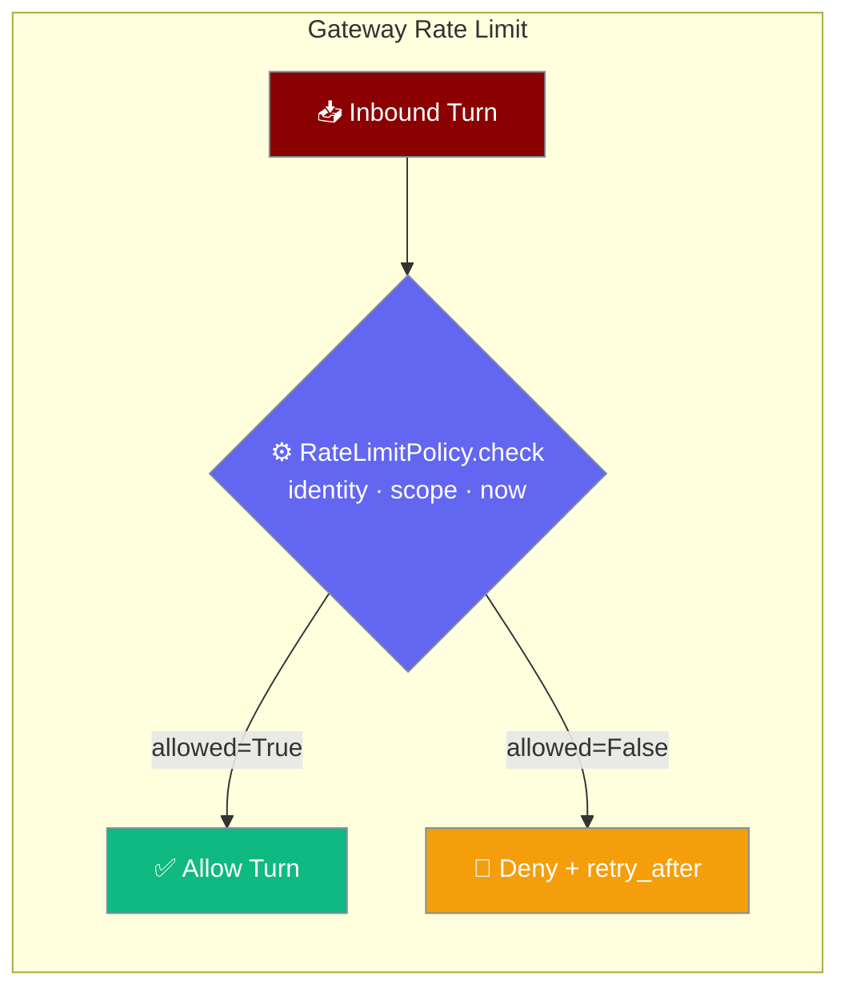
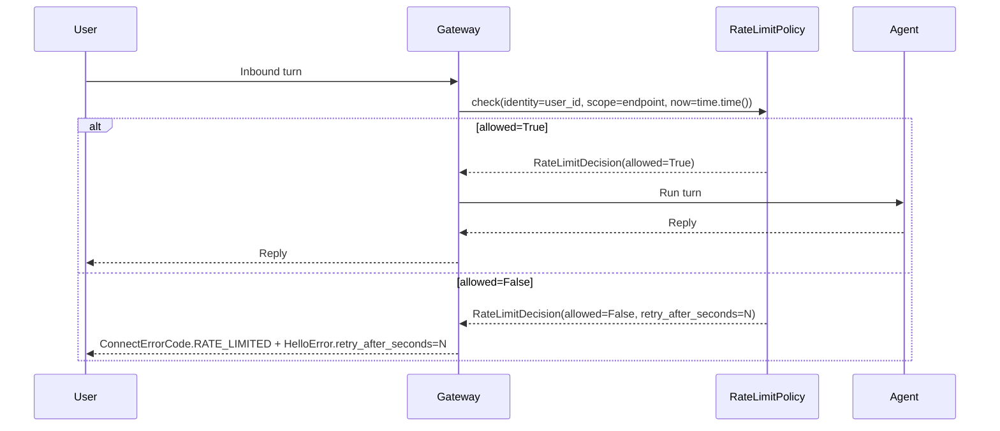
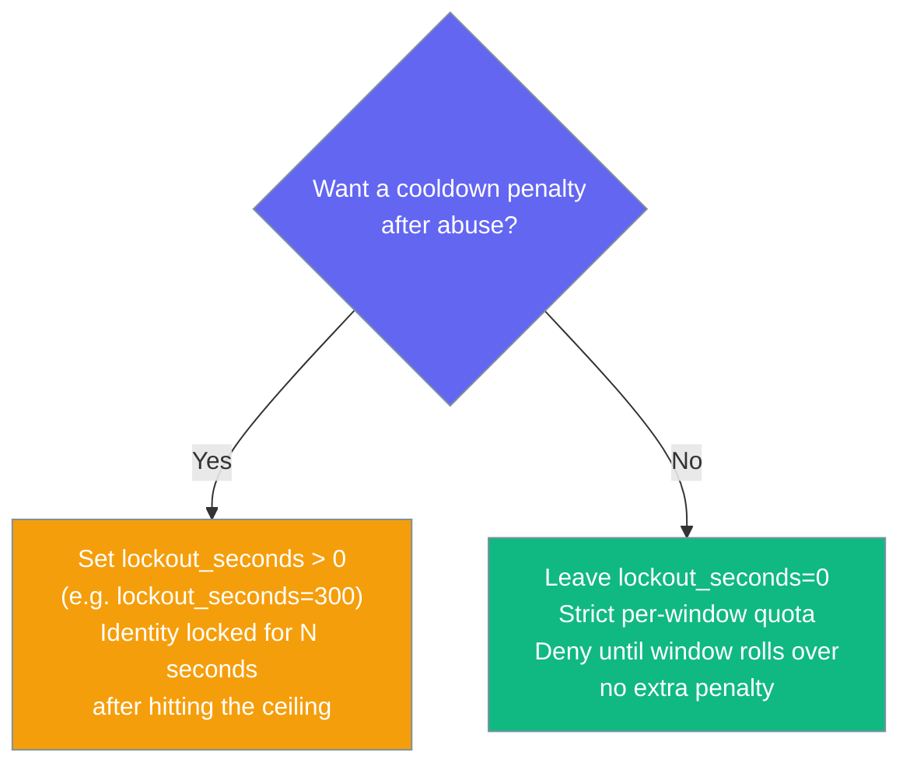

Gateway rate limiting completes the gateway's policy-protocol family: bound how often an identity can start turns in a given scope with the built-in sliding window, or inject your own limiter.



## Quick Start

<Steps>

<Step title="Simple sliding window">
Five turns per minute per identity. `max_requests=0` (default) disables the gate entirely — safe for dev environments.

```python
from praisonaiagents import Agent
from praisonaiagents.gateway import SlidingWindowRateLimitPolicy
from praisonai.bots import BotOS

agent = Agent(name="Support", instructions="Help users")

rate_limit = SlidingWindowRateLimitPolicy(
    max_requests=5,
    window_seconds=60,
)

bot = BotOS(
    agent=agent,
    platforms=["telegram"],
    rate_limit_policy=rate_limit,
)
bot.start()
```
</Step>

<Step title="With lockout cooldown">
After hitting the ceiling, lock out the identity for an additional cooldown period.

```python
from praisonaiagents import Agent
from praisonaiagents.gateway import SlidingWindowRateLimitPolicy
from praisonai.bots import BotOS

agent = Agent(name="Support", instructions="Help users")

rate_limit = SlidingWindowRateLimitPolicy(
    max_requests=5,
    window_seconds=60,
    lockout_seconds=300,   # 5-minute penalty after abuse
)

bot = BotOS(
    agent=agent,
    platforms=["telegram"],
    rate_limit_policy=rate_limit,
)
bot.start()
```
</Step>

<Step title="YAML configuration">
Configure via `gateway.yaml`:

```yaml
gateway:
  rate_limit:
    max_requests: 5
    window_seconds: 60
    lockout_seconds: 0    # 0 = no lockout, deny until window rolls over
```
</Step>

<Step title="Custom limiter">
Implement `RateLimitPolicyProtocol` for Redis-backed, per-tenant, or cost-based limits:

```python
from praisonaiagents.gateway import RateLimitDecision, RateLimitPolicyProtocol
from praisonai.bots import BotOS
from praisonaiagents import Agent

class RedisRateLimitPolicy:
    def check(self, *, identity: str, scope: str, now: float) -> RateLimitDecision:
        key = f"rl:{scope}:{identity}"
        count = redis_client.incr(key)
        if count == 1:
            redis_client.expire(key, 60)
        if count > 10:
            return RateLimitDecision(allowed=False, retry_after_seconds=60.0)
        return RateLimitDecision(allowed=True)

assert isinstance(RedisRateLimitPolicy(), RateLimitPolicyProtocol)

agent = Agent(name="Support", instructions="Help users")
bot = BotOS(agent=agent, platforms=["telegram"], rate_limit_policy=RedisRateLimitPolicy())
bot.start()
```
</Step>

</Steps>

---

## How It Works



| Component | Role |
|-----------|------|
| `identity` | The caller — authenticated tenant, user ID, or endpoint principal |
| `scope` | Endpoint class, channel name, or tenant token |
| `now` | Current timestamp (seconds) — injected so decisions are pure and testable |
| `RateLimitDecision` | Closed result: `allowed` bool + optional `retry_after_seconds` backoff hint |

---

## Configuration Options

`SlidingWindowRateLimitPolicy` accepts three knobs:

| Option | Type | Default | Description |
|--------|------|---------|-------------|
| `max_requests` | `int` | `0` | Maximum requests allowed per window. `0` disables the gate (legacy pass-through). |
| `window_seconds` | `float` | `60.0` | Window duration in seconds. Must be `> 0` or `ValueError` is raised. |
| `lockout_seconds` | `float` | `0.0` | Penalty lockout after exceeding the ceiling. `0` means no lockout. Must be `>= 0` or `ValueError` is raised. |

```python
from praisonaiagents.gateway import SlidingWindowRateLimitPolicy

policy = SlidingWindowRateLimitPolicy(
    max_requests=10,
    window_seconds=60.0,
    lockout_seconds=0.0,
)

print(policy.enabled)   # True when max_requests > 0
```

---

## Decision Table

Per `(scope, identity)` key:

| Situation | `allowed` | `retry_after_seconds` |
|-----------|-----------|----------------------|
| `max_requests == 0` (disabled) | `True` | `None` |
| Active lockout (`now < lockout_until`) | `False` | `lockout_until - now` |
| New or expired window | `True` | `None` |
| Below ceiling in current window | `True` | `None` |
| Over ceiling, `lockout_seconds > 0` | `False` | `lockout_seconds` (window dropped; key locked) |
| Over ceiling, `lockout_seconds == 0` | `False` | `window_seconds - (now - window_start)` (window **preserved** — not reset) |

<Warning>
When `lockout_seconds=0`, a denial does **not** reset the window. The identity stays denied until the window naturally expires and then rolls over. This is intentional — resetting the window on denial would bypass the per-window ceiling.
</Warning>

---

## Choosing Lockout vs. No Lockout



---

## Building a Custom Limiter

Any object with a `check(*, identity, scope, now)` method satisfies `RateLimitPolicyProtocol`. The signature **must be keyword-only**.

```python
from praisonaiagents.gateway import RateLimitDecision, RateLimitPolicyProtocol

class TenantRateLimitPolicy:
    def __init__(self, limits: dict[str, int]):
        self._limits = limits
        self._counts: dict[tuple, int] = {}

    def check(self, *, identity: str, scope: str, now: float) -> RateLimitDecision:
        limit = self._limits.get(identity, 5)
        key = (scope, identity)
        count = self._counts.get(key, 0) + 1
        self._counts[key] = count
        if count > limit:
            return RateLimitDecision(allowed=False, retry_after_seconds=60.0)
        return RateLimitDecision(allowed=True)

policy = TenantRateLimitPolicy(limits={"premium-tenant": 100, "free-tenant": 10})

assert isinstance(policy, RateLimitPolicyProtocol)
```

Key requirements:
- **Keyword-only args** — `check(*, identity, scope, now)` — positional calls will raise `TypeError`.
- **Return a closed `RateLimitDecision`** — never `None`.
- **`@runtime_checkable`** — `isinstance(policy, RateLimitPolicyProtocol)` works at runtime.

---

## State Ownership

<Warning>
`SlidingWindowRateLimitPolicy` is designed for a **bounded identity space** — endpoint classes, authenticated tenants, or a small set of known scopes.

Wrappers exposing it to an **unbounded or untrusted** identity space (e.g. raw per-IP from the public internet) own:
- **Periodic reclamation** — entries accumulate lazily; no built-in eviction.
- **Locking on concurrent hot paths** — the policy is **not internally synchronised**.

The gateway's built-in limiters (`gateway/rate_limiter.py`, `bots/_rate_limit.py`) already handle locking and reclamation — prefer those for untrusted identity spaces.
</Warning>

---

## Best Practices

<AccordionGroup>
  <Accordion title="Disable in dev, enable deliberately in production">
    `max_requests=0` (the default) disables rate limiting entirely. This is the safe default for development. Turn on the gate explicitly when you deploy to production — don't rely on it being on by default.
  </Accordion>

  <Accordion title="Prefer window-only limiting unless you want an abuse penalty">
    `lockout_seconds=0` (the default) gives you a strict per-window quota with no extra penalty. The identity is simply denied until the window rolls over. Set `lockout_seconds` only if you want a cooldown penalty after a burst — e.g. `lockout_seconds=300` for a 5-minute cool-down after hitting the ceiling.
  </Accordion>

  <Accordion title="Implement the protocol for per-tenant or distributed limits">
    `SlidingWindowRateLimitPolicy` uses in-process state. For per-tenant pricing, multi-process gateways, or Redis-backed distributed limits, implement `RateLimitPolicyProtocol` yourself — the seam is intentional. The `check` method is the only surface you need to implement.
  </Accordion>

  <Accordion title="Keep identity and scope cardinality bounded">
    Each `(scope, identity)` pair gets its own state entry. If your identity space is unbounded (e.g. raw IPs), entries accumulate without eviction. Either use the gateway's built-in limiters (which handle reclamation) or implement your own with periodic cleanup.
  </Accordion>
</AccordionGroup>

---

## Related

<CardGroup cols={2}>
  <Card title="Admission Control" icon="shield-check" href="/docs/features/gateway-admission-control">
    Bound concurrent inbound agent runs with a fair queue and overflow policy
  </Card>
  <Card title="Flow Control" icon="gauge-high" href="/docs/features/gateway-flow-control">
    Bounded outbound inboxes and slow-consumer disconnect
  </Card>
  <Card title="Graceful Drain" icon="power-off" href="/docs/features/gateway-graceful-drain">
    Drain in-flight turns before shutdown
  </Card>
  <Card title="Gateway Overview" icon="tower-broadcast" href="/docs/features/gateway">
    WebSocket control plane for multi-agent coordination
  </Card>
</CardGroup>
