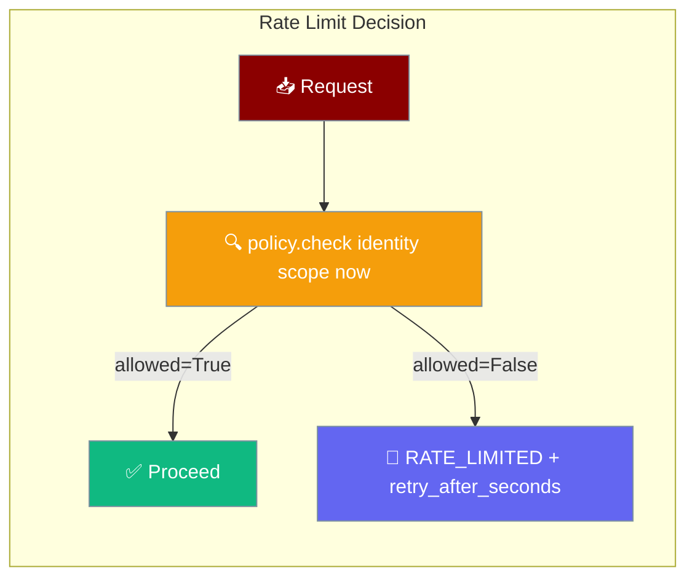
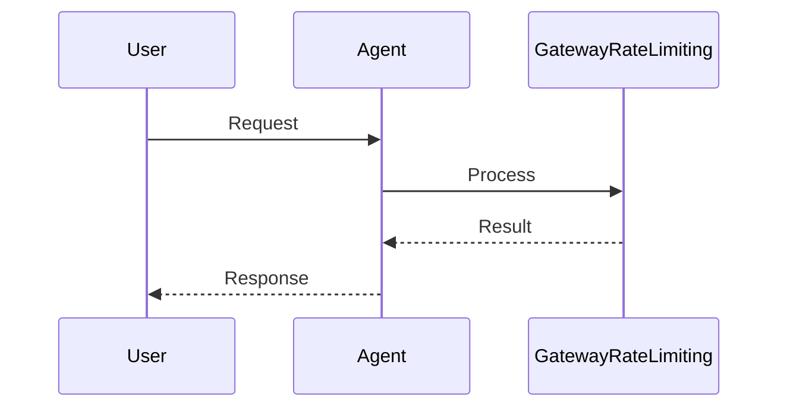

<Note>
The gateway now ships in the `praisonai-bot` package. `praisonai serve gateway` still works exactly as documented here; for a standalone install see [praisonai-bot Migration](/docs/guides/praisonai-bot-migration).
</Note>


```python
from praisonaiagents import Agent

agent = Agent(name="assistant", instructions="Be helpful.")
# Gateway rate limiting queues or rejects excess requests before the agent runs
agent.start("Status update?")
```
Rate limiting caps how many requests a given identity can make within a time window, returning a `retry_after_seconds` hint when they exceed it.

```python
from praisonaiagents.gateway import SlidingWindowRateLimitPolicy

policy = SlidingWindowRateLimitPolicy(max_requests=100, window_seconds=60)
```

The user or bot sends high-volume traffic; gateway rate limiting protects agents and downstream APIs.



## How It Works




## Quick Start

<Steps>

<Step title="Create a sliding-window policy">
```python
from praisonaiagents.gateway import SlidingWindowRateLimitPolicy

policy = SlidingWindowRateLimitPolicy(
    max_requests=100,     # 100 requests per window
    window_seconds=60,    # 60-second rolling window
    lockout_seconds=300,  # 5-minute cooldown after exceeding limit
)
```
</Step>

<Step title="Inject into the gateway">
```python
from praisonai.bots import BotOS
from praisonaiagents import Agent
from praisonaiagents.gateway import SlidingWindowRateLimitPolicy

policy = SlidingWindowRateLimitPolicy(max_requests=60, window_seconds=60)

agent = Agent(name="SupportBot", instructions="Help users.")
bots = BotOS(agent=agent, platforms=["telegram"], rate_limit_policy=policy)
bots.run()
```
</Step>

</Steps>

---

## Wire Response

A `limited` decision maps to `ConnectErrorCode.RATE_LIMITED` on the handshake wire:

```json
{
  "type": "hello_error",
  "code": "rate_limited",
  "retry_after_seconds": 42.0
}
```

Clients read `retry_after_seconds` and back off before reconnecting. This keeps retry storms from amplifying the load that triggered limiting in the first place.

---

## `SlidingWindowRateLimitPolicy` Reference

| Parameter | Type | Default | Description |
|-----------|------|---------|-------------|
| `max_requests` | `int` | `0` | Maximum requests per window. **`0` disables limiting** — every request is allowed (legacy always-allow behaviour). |
| `window_seconds` | `float` | `60.0` | Rolling window duration in seconds. Must be > 0. |
| `lockout_seconds` | `float` | `0.0` | Cooldown after exceeding the ceiling. `0` means no cooldown — the key is denied until the window expires naturally. |

```python
from praisonaiagents.gateway import SlidingWindowRateLimitPolicy

# Disabled (legacy always-allow)
SlidingWindowRateLimitPolicy(max_requests=0)

# 100 req/min, no cooldown
SlidingWindowRateLimitPolicy(max_requests=100, window_seconds=60)

# 5 req/min with 5-minute lockout for abusive clients
SlidingWindowRateLimitPolicy(max_requests=5, window_seconds=60, lockout_seconds=300)
```

---

## `RateLimitDecision` Fields

```python
from praisonaiagents.gateway import RateLimitDecision
```

`RateLimitDecision` is a frozen dataclass — immutable by design so it can be safely returned across threads.

| Field | Type | Description |
|-------|------|-------------|
| `allowed` | `bool` | Whether the request may proceed |
| `retry_after_seconds` | `float \| None` | Backoff hint when `allowed=False`; `None` when allowed |

<Note>
`RateLimitDecision` is frozen (`@dataclass(frozen=True)`). Never try to mutate it — create a new instance instead.
</Note>

---

## Bring Your Own Limiter

Implement `RateLimitPolicyProtocol` for per-tenant, distributed, or cost-based limiting:

```python
from praisonaiagents.gateway import RateLimitPolicyProtocol, RateLimitDecision

class TenantRateLimitPolicy:
    """Per-tenant limiter — example sketch, no real Redis dependency."""

    def __init__(self, limits: dict):
        # e.g. {"tenant_a": 1000, "tenant_b": 100}
        self._limits = limits
        self._counters: dict = {}

    def check(self, *, identity: str, scope: str, now: float) -> RateLimitDecision:
        limit = self._limits.get(identity, 50)   # default 50 req/min
        count = self._counters.get(identity, 0)
        if count >= limit:
            return RateLimitDecision(allowed=False, retry_after_seconds=60.0)
        self._counters[identity] = count + 1
        return RateLimitDecision(allowed=True)

policy = TenantRateLimitPolicy(limits={"premium": 1000, "free": 60})
```

<Note>
`RateLimitPolicy` is a backward-compatible alias for `RateLimitPolicyProtocol`. Both names import from `praisonaiagents.gateway`.
</Note>

---

## The Gateway Policy Family

Rate limiting completes the gateway's symmetric policy-protocol family:

| Protocol | What it decides |
|----------|-----------------|
| `SendPolicyProtocol` | Whether to send an outbound frame now |
| `GatewayIdlePolicyProtocol` | Whether the gateway is idle enough to scale to zero |
| `GatewayDrainPolicyProtocol` | Timing and order of graceful drain |
| `GatewayConcurrencyPolicyProtocol` | Bound on concurrent in-flight turns |
| `RateLimitPolicyProtocol` **(new)** | Bound on inbound request rate per identity/scope |

All five follow the same shape: pure, stateless decision over typed facts, with a frozen decision dataclass returned.

---

## Best Practices

<AccordionGroup>

<Accordion title="Start with the sliding-window default">
`SlidingWindowRateLimitPolicy` is dependency-free and covers the common case. Only inject a custom policy when you need per-tenant fairness, shared state (Redis), or cost-based limits.
</Accordion>

<Accordion title="Use lockout_seconds for abusive clients">
A 5-minute lockout after 5 exceeded requests in a minute prevents a script from hammering the gateway every 60 s. The `retry_after_seconds` hint in the response lets well-behaved clients back off cleanly.
</Accordion>

<Accordion title="Return realistic retry_after_seconds">
Clients respect `retry_after_seconds`. A hint of 0 invites immediate retry; a hint matching your actual window (`window_seconds`) gives the client a correct backoff. Use `lockout_seconds` when you want a longer penalty than the window naturally provides.
</Accordion>

</AccordionGroup>

---

## Related

<CardGroup cols={2}>
  <Card title="Gateway" icon="tower-broadcast" href="/docs/features/gateway">
    WebSocket control plane — full YAML and Python reference
  </Card>
  <Card title="Reliability Preset" icon="shield-check" href="/docs/features/gateway-reliability">
    One-switch production posture (includes admission control)
  </Card>
  <Card title="Admission Control" icon="shield" href="/docs/features/gateway-admission-control">
    Bound concurrent turns with a fair queue and overflow policy
  </Card>
  <Card title="Gateway Security" icon="lock" href="/docs/features/gateway-operator-scopes">
    Operator authentication and scope-based access control
  </Card>
</CardGroup>
