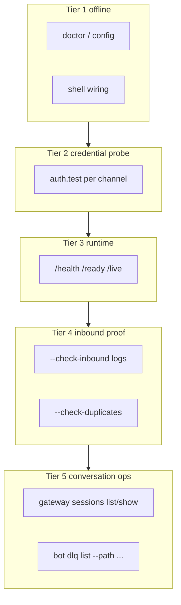

Use this checklist before starting a gateway or relying on a Slack/Telegram bot in production.

<Warning>
``praisonai gateway test --turn`` and ``praisonai gateway doctor --turn`` run an **offline** agent turn via ``BotSessionManager.chat``. They do **not** exercise Slack Bolt/socket handlers or @mention routing. A passing turn test does **not** guarantee live @mention delivery.
</Warning>

## Five-tier diagnostics



<Note>
**Sessions ≠ liveness.** ``gateway sessions list`` shows stored conversation history only. Use ``--check-inbound`` to verify live Slack delivery.
</Note>

## Three-tier checklist

<Steps>
<Step title="Static config (offline)">
```bash
praisonai doctor
praisonai doctor bots --file /path/to/bot.yaml
```

Validates YAML, env vars, security settings, and **shell wiring** (`gateway_shell_readiness`) without network or LLM calls.
</Step>

<Step title="Live credential probe">
```bash
praisonai doctor bots --file /path/to/bot.yaml --deep
# or
praisonai gateway doctor --config /path/to/bot.yaml
```

Probes each channel (`auth.test`, `getMe`, …) and surfaces bot identity (e.g. `@test`).
</Step>

<Step title="Full readiness (recommended)">
```bash
praisonai gateway test --config /path/to/bot.yaml
```

Combines credential probes + offline shell wiring. Add optional flags:

```bash
# Shell bot smoke (requires LLM API key)
praisonai gateway test --config /path/to/bot.yaml --channel slack \
  --turn "run uname -a with execute_command and reply with raw output only"

# Verify running gateway runtime endpoints
praisonai gateway test --config /path/to/bot.yaml --check-runtime

# Scan for duplicate gateways / shared tokens
praisonai gateway test --config /path/to/bot.yaml --check-duplicates

# After messaging Slack — prove inbound delivery
praisonai gateway test --config /path/to/bot.yaml --check-inbound --since 5m
```
</Step>

<Step title="Extended status and sessions">
```bash
praisonai gateway status --deep --config /path/to/bot.yaml
praisonai gateway status --probe --config /path/to/bot.yaml
praisonai gateway sessions list --platform slack
praisonai gateway sessions show U08R1HK9PJS --tail 20
```
</Step>

<Step title="Start and confirm live traffic">
```bash
praisonai gateway start --config /path/to/bot.yaml --preflight
praisonai gateway status
```

After @mentioning the bot in Slack, confirm inbound events in logs:

```bash
grep "@mention received" ~/.praisonai/logs/bot-stderr.log
```

If the turn test passes but Slack is silent, check for duplicate bots, stale sessions, or messages not reaching this gateway process.
</Step>
</Steps>

## Command matrix

| Goal | Command |
|------|---------|
| First install, no network | `praisonai doctor` + `praisonai doctor bots` |
| Config + shell wiring offline | `praisonai doctor bots --file PATH` |
| Live tokens | `praisonai gateway doctor --config PATH` |
| Onboarding one-shot | `praisonai gateway test --config PATH` |
| Runtime endpoints | `praisonai gateway test --config PATH --check-runtime` |
| Inbound delivery proof | `praisonai gateway test --config PATH --check-inbound --since 5m` |
| Duplicate gateway scan | `praisonai gateway test --config PATH --check-duplicates` |
| Session history | `praisonai gateway sessions list` / `show ID` |
| Deep status + DLQ hint | `praisonai gateway status --deep --config PATH` |
| Pre-Slack shell smoke | `praisonai gateway test --config PATH --channel slack --turn "..."` |
| Automated start gate | `praisonai gateway start --preflight` |
| After start | `praisonai gateway status` + log check |

## JSON automation

Both commands support ``--json`` with a **single** top-level document:

```bash
praisonai gateway test --config bot.yaml --json
praisonai gateway doctor --config bot.yaml --json --channel slack --turn "Say OK"
```

Keys: `probes`, `secrets` (optional), `shell`, `runtime` (with `--check-runtime`), `running` (with `--check-running`), `inbound` (with `--check-inbound`), `duplicates` (with `--check-duplicates`), `turn` (with `--turn`).

### Sub-object schema

Each top-level key maps to a per-channel or per-check sub-object:

```json
{
  "probes":     { "<channel>": { "ok": bool, "platform": str, "bot_username": str?, "error": str? } },
  "secrets":    { "<channel>": { "<field>": "available" | "configured-but-unavailable" | "configured" | "missing" } },
  "shell":      { "ok": bool, "message": str, "issues": [str] },
  "runtime":    { "ok": bool, "message": str },
  "running":    { "ok": bool, "message": str },
  "inbound":    { "ok": bool, "message": str, "events": [str] },
  "duplicates": { "ok": bool, "message": str, "duplicates": [str] },
  "turn":       { "channel": str, "ok": bool, "response": str },
  "gateway_auth_token": "weak"?
}
```

| Key | Present when |
|-----|--------------|
| `probes` | Always. |
| `secrets` | Any channel uses a [secret reference](/docs/features/gateway-secret-references) or credential field. |
| `shell` | `gateway test` only (not `gateway doctor`). |
| `runtime` | `--check-runtime` is passed. |
| `running` | `--check-running` is passed. |
| `inbound` | `--check-inbound` is passed. |
| `duplicates` | `--check-duplicates` is passed. |
| `turn` | `--turn` is passed. |
| `gateway_auth_token` | The gateway's own `auth_token` is weak. |

---

## Programmatic API

Import `praisonai_bot.gateway.preflight` to build custom health-check endpoints, CI gates, and monitoring integrations without shelling out to the CLI.

```python
from praisonai_bot.gateway.preflight import (
    load_channels_mapping,          # (config_path) -> dict
    resolve_gateway_endpoint,       # (config_path) -> (host, port)
    probe_channels,                 # (channels, timeout=15.0) -> dict[str, ProbeResult]
    probe_channels_from_config,     # (config_path, channel_filter=None, timeout=15.0)
    probe_results_to_dict,          # (results) -> JSON-safe dict
    resolve_env_token,              # (value) — handles ${VAR} and {source, id} secret refs
    apply_probe_ca_bundle,          # honours PRAISONAI_SSL_CA_BUNDLE precedence
    run_shell_readiness_check,      # (config_path) -> ShellReadinessResult(ok, message, issues)
    run_turn_test,                  # (config_path, channel_name, prompt) -> (ok, message)
    check_gateway_running,          # (config_path, timeout=5.0) -> (ok, message)
)
```

### Healthcheck endpoint

Expose channel readiness as a JSON endpoint — the same probe the CLI runs, embedded in your own service.

```python
from fastapi import FastAPI
from praisonai_bot.gateway.preflight import (
    probe_channels_from_config,
    probe_results_to_dict,
)

app = FastAPI()

@app.get("/healthz/channels")
async def channel_health():
    results = await probe_channels_from_config("gateway.yaml")
    payload = probe_results_to_dict(results)
    ok = all(r.ok for r in results.values())
    return {"ok": ok, "probes": payload}
```

### Offline shell + turn gate for CI

Fail a deploy when shell wiring is broken, before any network call.

```python
from praisonai_bot.gateway.preflight import run_shell_readiness_check

result = run_shell_readiness_check("gateway.yaml")
if not result.ok:
    raise SystemExit("\n".join(result.issues))
print(result.message)
```

<Note>
`apply_probe_ca_bundle()` honours the CA-bundle precedence ladder — `PRAISONAI_SSL_CA_BUNDLE` > `REQUESTS_CA_BUNDLE` > `SSL_CERT_FILE` — so a corporate CA set once fixes both the probe and long-lived channel connections. See [Corporate CA bundle](/docs/features/gateway-cli#corporate-ca-bundle-ssl-inspecting-networks).
</Note>
