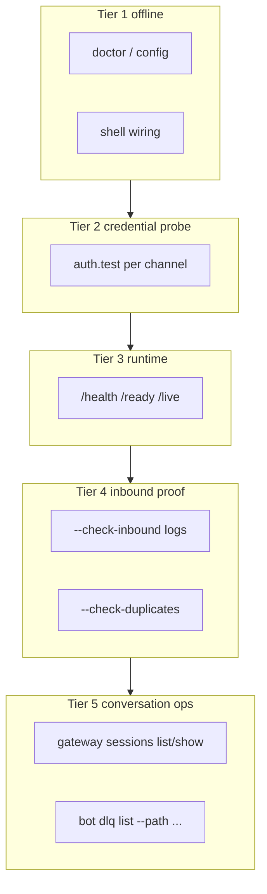

Use this checklist before starting a gateway or relying on a Slack/Telegram bot in production.

<Warning>
``praisonai gateway test --turn`` and ``praisonai gateway doctor --turn`` run an **offline** agent turn via ``BotSessionManager.chat``. They do **not** exercise Slack Bolt/socket handlers or @mention routing. A passing turn test does **not** guarantee live @mention delivery.
</Warning>

## Five-tier diagnostics



<Note>
**Sessions ≠ liveness.** ``gateway sessions list`` shows stored conversation history only. Use ``--check-inbound`` to verify live Slack delivery.
</Note>

## Three-tier checklist

<Steps>
<Step title="Static config (offline)">
```bash
praisonai doctor
praisonai doctor bots --file /path/to/bot.yaml
```

Validates YAML, env vars, security settings, and **shell wiring** (`gateway_shell_readiness`) without network or LLM calls.
</Step>

<Step title="Live credential probe">
```bash
praisonai doctor bots --file /path/to/bot.yaml --deep
# or
praisonai gateway doctor --config /path/to/bot.yaml
```

Probes each channel (`auth.test`, `getMe`, …) and surfaces bot identity (e.g. `@test`).

`gateway doctor` also confirms **route/binding targets resolve to declared agents** — a typo in `routes[]`, `routing[]`, or `bindings.agent` (including the `default` slot) fails here with a closest-agent hint. See [Fail-Fast Validation](/docs/features/gateway-route-bindings#fail-fast-validation).
</Step>

<Step title="Full readiness (recommended)">
```bash
praisonai gateway test --config /path/to/bot.yaml
```

Combines credential probes + offline shell wiring. Add optional flags:

```bash
# Shell bot smoke (requires LLM API key)
praisonai gateway test --config /path/to/bot.yaml --channel slack \
  --turn "run uname -a with execute_command and reply with raw output only"

# Verify running gateway runtime endpoints
praisonai gateway test --config /path/to/bot.yaml --check-runtime

# Scan for duplicate gateways / shared tokens
praisonai gateway test --config /path/to/bot.yaml --check-duplicates

# After messaging Slack — prove inbound delivery
praisonai gateway test --config /path/to/bot.yaml --check-inbound --since 5m
```
</Step>

<Step title="Extended status and sessions">
```bash
praisonai gateway status --deep --config /path/to/bot.yaml
praisonai gateway status --probe --config /path/to/bot.yaml
praisonai gateway sessions list --platform slack
praisonai gateway sessions show U08R1HK9PJS --tail 20
```
</Step>

<Step title="Start and confirm live traffic">
```bash
praisonai gateway start --config /path/to/bot.yaml --preflight
praisonai gateway status
```

After @mentioning the bot in Slack, confirm inbound events in logs:

```bash
grep "@mention received" ~/.praisonai/logs/bot-stderr.log
```

If the turn test passes but Slack is silent, check for duplicate bots, stale sessions, or messages not reaching this gateway process.
</Step>
</Steps>

## Command matrix

| Goal | Command |
|------|---------|
| First install, no network | `praisonai doctor` + `praisonai doctor bots` |
| Config + shell wiring offline | `praisonai doctor bots --file PATH` |
| Live tokens | `praisonai gateway doctor --config PATH` |
| Route/binding targets resolve | `praisonai gateway doctor --config PATH` |
| Onboarding one-shot | `praisonai gateway test --config PATH` |
| Runtime endpoints | `praisonai gateway test --config PATH --check-runtime` |
| Inbound delivery proof | `praisonai gateway test --config PATH --check-inbound --since 5m` |
| Duplicate gateway scan | `praisonai gateway test --config PATH --check-duplicates` |
| Session history | `praisonai gateway sessions list` / `show ID` |
| Deep status + DLQ hint | `praisonai gateway status --deep --config PATH` |
| Pre-Slack shell smoke | `praisonai gateway test --config PATH --channel slack --turn "..."` |
| Automated start gate | `praisonai gateway start --preflight` |
| After start | `praisonai gateway status` + log check |

## JSON automation

Both commands support ``--json`` with a **single** top-level document:

```bash
praisonai gateway test --config bot.yaml --json
praisonai gateway doctor --config bot.yaml --json --channel slack --turn "Say OK"
```

Keys: `probes`, `secrets` (optional), `shell`, `runtime` (with `--check-runtime`), `running` (with `--check-running`), `inbound` (with `--check-inbound`), `duplicates` (with `--check-duplicates`), `turn` (with `--turn`).

### Sub-object schema

Each top-level key maps to a per-channel or per-check sub-object:

```json
{
  "probes":     { "<channel>": { "ok": bool, "platform": str, "bot_username": str?, "error": str? } },
  "secrets":    { "<channel>": { "<field>": "available" | "configured-but-unavailable" | "configured" | "missing" } },
  "shell":      { "ok": bool, "message": str, "issues": [str] },
  "runtime":    { "ok": bool, "message": str },
  "running":    { "ok": bool, "message": str },
  "inbound":    { "ok": bool, "message": str, "events": [str] },
  "duplicates": { "ok": bool, "message": str, "duplicates": [str] },
  "turn":       { "channel": str, "ok": bool, "response": str },
  "gateway_auth_token": "weak"?
}
```

| Key | Present when |
|-----|--------------|
| `probes` | Always. |
| `secrets` | Any channel uses a [secret reference](/docs/features/gateway-secret-references) or credential field. |
| `shell` | `gateway test` only (not `gateway doctor`). |
| `runtime` | `--check-runtime` is passed. |
| `running` | `--check-running` is passed. |
| `inbound` | `--check-inbound` is passed. |
| `duplicates` | `--check-duplicates` is passed. |
| `turn` | `--turn` is passed. |
| `gateway_auth_token` | The gateway's own `auth_token` is weak. |

---

## `/health` channels schema

`GET /health` returns a rich per-channel object under `channels[<name>]`, plus a top-level `last_inbound_at`.

```json
{
  "status": "healthy",
  "uptime": 842.1,
  "channels": {
    "slack": {
      "platform": "slack",
      "running": true,
      "last_activity": 1769500000.0,
      "ok": true,
      "reason": "healthy",
      "probe": { "ok": true },
      "supervision": { "state": "running", "total_recoveries": 0 }
    }
  },
  "last_inbound_at": 1769500000.0
}
```

| Field | Type | Meaning |
|-------|------|---------|
| `platform` | string | Channel platform (`slack`, `telegram`, …). |
| `running` | bool | Whether the channel bot is currently running. |
| `last_activity` | float\|null | Epoch seconds of the last inbound activity (falls back to start time). |
| `ok` | bool | True only when `reason == healthy`. |
| `reason` | string | `HealthReason` enum value (see below). |
| `probe` | object? | `{ "ok": bool }` — present only when a cached probe result exists. |
| `supervision` | object? | Present when the channel is supervised: `state`, `last_error`, `next_retry_at`, `total_recoveries`, `manual_pause`. |
| `last_inbound_at` | float | **Top-level.** Epoch seconds of the most recent inbound event across all channels — consumed by both CLI and Prometheus tooling. |

The `reason` field comes from `evaluate_channel_health(...)` and takes one of these values:

| `reason` | When |
|----------|------|
| `healthy` | Running, past startup grace, recent inbound. |
| `not-running` | Channel bot is not running. |
| `startup-grace` | Within the `startup_grace` window after boot. |
| `stale-socket` | Idle with no inbound past `stale_after`. |
| `busy` | An agent run is in flight with recent progress. |
| `stuck` | Busy but no progress past `stuck_after` (default 900s). |
| `disconnected` | Cached probe reports `ok=false`. |
| `error` | The channel reported an error. |

<Warning>
Watch for `ok=false, reason=stale-socket` — this is the **"gateway is up but not receiving messages"** signal. It means the socket is connected but no inbound has arrived within `stale_after`.
</Warning>

### Health liveness config

The `health:` block under `gateway:` tunes when a channel flips from `healthy` to `stale-socket`.

```yaml
gateway:
  host: "0.0.0.0"
  port: 8765
  health:
    startup_grace: 60     # seconds; suppress stale alarms during boot
    stale_after: 120      # seconds without inbound before a channel is stale
    stuck_after: 900      # seconds a busy channel can make no progress
    interval: 300         # supervision poll interval
    max_restarts_per_hour: 10
```

| Key | Default | Purpose |
|-----|---------|---------|
| `startup_grace` | `60` | Grace window that suppresses `stale-socket` alarms right after boot. |
| `stale_after` | `120` | Age past which an idle channel with no inbound is marked degraded. |
| `stuck_after` | `900` | Age past which a busy channel making no progress is `stuck`. |
| `interval` | `300` | Supervision poll interval. |
| `max_restarts_per_hour` | `10` | Restart rate limit per channel. |

<Warning>
Lowering `stale_after` / `startup_grace` too aggressively causes false-positive alerts on legitimately idle bots. Values are clamped to sane lower bounds and unresolved env placeholders fall back to defaults.
</Warning>

---

## Runtime tier (`--check-runtime`)

`--check-runtime` (or `check_runtime(config)`) probes `/info`, `/health`, `/ready`, and `/live`. `/ready` requires `ready=true` and `/live` requires `alive=true` in the body; the bearer token is only attached to `/info` over loopback or HTTPS (never over remote plaintext HTTP).

```bash
praisonai gateway test --config bot.yaml --check-runtime --json
```

### Credential probe warnings

A channel's `probes.<channel>.details.warnings[]` array surfaces non-fatal setup issues. For Slack, a missing app token appends:

```
SLACK_APP_TOKEN missing — Socket Mode will not start
```

This warning fires even when `bot.probe()` succeeds with `SLACK_BOT_TOKEN` alone — because inbound Socket Mode still needs `SLACK_APP_TOKEN` (`xapp-…`). See [Inbound Message Gate → Slack @mentions](/docs/features/inbound-message-gate#slack-mentions).

---

## Inbound tier (`--check-inbound`)

`--check-inbound` proves live delivery two ways: it scans the gateway log for `@mention received:` markers **and** scrapes the `messages_inbound_total` metric to compute a delta.

### How inbound is detected

The CLI parses `~/.praisonai/logs/bot-stderr.log` (`default_log_path()`) for lines containing the literal marker `@mention received:` within the `--since` window. `parse_inbound_log` extracts count, ISO timestamp, and mention text.

<Warning>
If the daemon writes logs elsewhere or a custom log format filters out the marker, `--check-inbound` will falsely report no delivery. Preserve `INFO`-level log output from the Slack bot module.
</Warning>

### Metrics baseline state file

`--check-inbound` persists the last scraped `messages_inbound_total` per host/port to:

```
~/.praisonai/state/inbound_metrics_baseline.json
```

- **First run** seeds the baseline and may return `metrics_inbound_delta=null` — but still passes if `messages_inbound_total > 0`.
- **Later runs** return the delta within the `--since` window.
- **Reset** by deleting the file.

The `inbound` result exposes `metrics_inbound_total`, `metrics_inbound_delta`, `mentions_in_window`, `last_mention_at`, and one of three `hint` strings:

| Hint | Meaning |
|------|---------|
| `No @mention received in the log window…` | No marker found within `--since`. |
| `…Message may have hit a different Slack app…` | No delivery — likely a competing Slack app. |
| `Inbound metrics baseline established from existing traffic…` | First run with a pre-existing non-zero counter; re-run to confirm. |

The `--since` window accepts `Ns`/`Nm`/`Nh`/`Nd` or a bare integer (seconds), parsed by `parse_since_window`.

---

## Duplicates tier (Hermes conflict detection)

`--check-duplicates` (or `check_duplicates(config)`) scans for competing gateways and shared tokens. It inspects:

- macOS LaunchAgents by label: `~/Library/LaunchAgents/ai.praison.bot.plist` and `ai.hermes.gateway.plist`
- both env files: `~/.praisonai/.env` and `~/.hermes/.env`
- Hermes runtime state: `~/.hermes/gateway_state.json`
- the gateway PID lock (`GatewayPIDLock`)
- the log tail for the Telegram `Conflict: terminated by other getUpdates request` string

Token values (`*_TOKEN`) are fingerprinted with SHA-256 (first 12 hex chars) and flagged when the same fingerprint appears across processes.

```bash
praisonai gateway test --config bot.yaml --check-duplicates --json
```

Warnings it can emit:

- `Hermes Slack is connected — events may split if SLACK_APP_TOKEN is shared.`
- `Hermes Telegram is connected — stopping ai.hermes.gateway affects Telegram.`
- `Telegram getUpdates Conflict detected — another bot may be polling.`

<Note>
Only macOS LaunchAgents are scanned today (no systemd support). A PID mismatch between the LaunchAgent and `GatewayPIDLock` also triggers a warning. Token fingerprints are SHA-256 truncated — safe to include in support tickets.
</Note>

---

## Extended status (`status --deep` / `--config`)

`praisonai gateway status` accepts `--config, -c PATH`. Combining `--deep` with `--config` unlocks extra diagnostics.

| Flag | Meaning |
|------|---------|
| `--config`, `-c PATH` | Gateway config path (unlocks DLQ hints + log tail under `--deep`). |
| `--deep` | Per-channel health rows + version-skew warning. |
| `--probe` | Live credential probe per channel. |

**What `--deep` adds:**

- Per-channel rows: `running / state / reason / last_activity / probe_ok` (from `/health`).
- A **version-skew warning** when the running gateway's `/info.version` differs from the installed `praisonai-bot` package version.

**What `--deep --config` adds on top:**

- The last 20 lines of the gateway log (`get_logs(lines=20)` from `~/.praisonai/logs/bot-stderr.log`).
- A `DLQ (<name>): praisonai bot dlq list --path <sqlite>` hint per channel (path from `resolve_platform_dlq_path()`).

<Note>
The bearer token is only attached to the `/info` probe over loopback or HTTPS — never over remote plaintext HTTP.
</Note>

---

## Sessions (stored history)

`gateway sessions list` supports filtering and JSON output.

| Flag | Meaning |
|------|---------|
| `--platform NAME` | Filter by platform (e.g. `slack`). |
| `--active N` | Only sessions updated within the last `N` seconds. |
| `--json` | Emit JSON. |

```bash
praisonai gateway sessions list --platform slack --active 300 --json
praisonai gateway sessions show U08R1HK9PJS --tail 20
```

`sessions show <ref>` resolves the reference in order: exact `session_id` → exact filename → substring in filename (first alphabetical match wins). It prints `Session:` / `Agent:` header lines, truncates each message body to 200 chars, and always ends with a footer:

```
Sessions reflect stored history; use `praisonai gateway test --check-inbound` for live delivery.
```

<Note>
The **"stored history ≠ live delivery"** footer is intentional operator-safety copy — session files are conversation history, not proof that inbound is currently arriving.
</Note>

---

## Programmatic API

Import `praisonai_bot.gateway.preflight` to build custom health-check endpoints, CI gates, and monitoring integrations without shelling out to the CLI.

```python
from praisonai_bot.gateway.preflight import (
    load_channels_mapping,          # (config_path) -> dict
    resolve_gateway_endpoint,       # (config_path) -> (host, port)
    probe_channels,                 # (channels, timeout=15.0) -> dict[str, ProbeResult]
    probe_channels_from_config,     # (config_path, channel_filter=None, timeout=15.0)
    probe_results_to_dict,          # (results) -> JSON-safe dict
    resolve_env_token,              # (value) — handles ${VAR} and {source, id} secret refs
    apply_probe_ca_bundle,          # honours PRAISONAI_SSL_CA_BUNDLE precedence
    run_shell_readiness_check,      # (config_path) -> ShellReadinessResult(ok, message, issues)
    run_turn_test,                  # (config_path, channel_name, prompt) -> (ok, message)
    check_gateway_running,          # (config_path, timeout=5.0) -> (ok, message)
)
```

### Tiered check helpers

These helpers back the `--check-runtime|--check-inbound|--check-duplicates` flags and the session/DLQ commands. All are re-exported from `praisonai_bot.cli.commands.gateway` for tests and third-party tooling.

```python
from praisonai_bot.gateway.preflight import (
    check_runtime,            # (config_path, timeout=5.0) -> RuntimeCheckResult
    check_inbound,            # (config_path, since="10m", log_path=None) -> InboundCheckResult
    check_duplicates,         # (config_path) -> DuplicateCheckResult
    list_gateway_sessions,    # (platform=None, active_seconds=None) -> list[dict]
    show_gateway_session,     # (session_ref, tail=20) -> dict
    resolve_platform_dlq_path,# (platform) -> str
    parse_since_window,       # (since) -> float seconds; accepts Ns/Nm/Nh/Nd or int
    parse_inbound_log,        # (log_path, since_seconds, marker="@mention received:")
)
```

| Result class | `to_dict()` keys |
|--------------|------------------|
| `RuntimeProbeResult` | `ok`, `path`, `status_code`, `error`, `body` |
| `RuntimeCheckResult` | `ok`, `host`, `port`, `info`, `health`, `ready`, `live` |
| `InboundCheckResult` | `ok`, `proves`, `since_seconds`, `mentions_in_window`, `last_mention_at`, `last_mention_text`, `no_inbound_in_window`, `metrics_inbound_total`, `metrics_inbound_delta`, `hint`, `log_path` |
| `DuplicateService` | `label`, `installed`, `running`, `pid`, `plist_path`, `token_fingerprints` |
| `DuplicateCheckResult` | `ok`, `services`, `shared_tokens`, `hermes_platforms`, `pid_lock`, `warnings` |

Gate CI on runtime readiness:

```python
from praisonai_bot.gateway.preflight import check_runtime

result = check_runtime("gateway.yaml").to_dict()
if not result["ok"]:
    raise SystemExit(f"Gateway runtime not ready: {result}")
```

<Note>
`parse_since_window` accepts `Ns`/`Nm`/`Nh`/`Nd` and bare integers (seconds) — align custom scripts with the CLI's `--since` semantics by reusing it directly.
</Note>

### Healthcheck endpoint

Expose channel readiness as a JSON endpoint — the same probe the CLI runs, embedded in your own service.

```python
from fastapi import FastAPI
from praisonai_bot.gateway.preflight import (
    probe_channels_from_config,
    probe_results_to_dict,
)

app = FastAPI()

@app.get("/healthz/channels")
async def channel_health():
    results = await probe_channels_from_config("gateway.yaml")
    payload = probe_results_to_dict(results)
    ok = all(r.ok for r in results.values())
    return {"ok": ok, "probes": payload}
```

### Offline shell + turn gate for CI

Fail a deploy when shell wiring is broken, before any network call.

```python
from praisonai_bot.gateway.preflight import run_shell_readiness_check

result = run_shell_readiness_check("gateway.yaml")
if not result.ok:
    raise SystemExit("\n".join(result.issues))
print(result.message)
```

<Note>
`apply_probe_ca_bundle()` honours the CA-bundle precedence ladder — `PRAISONAI_SSL_CA_BUNDLE` > `REQUESTS_CA_BUNDLE` > `SSL_CERT_FILE` — so a corporate CA set once fixes both the probe and long-lived channel connections. See [Corporate CA bundle](/docs/features/gateway-cli#corporate-ca-bundle-ssl-inspecting-networks).
</Note>
