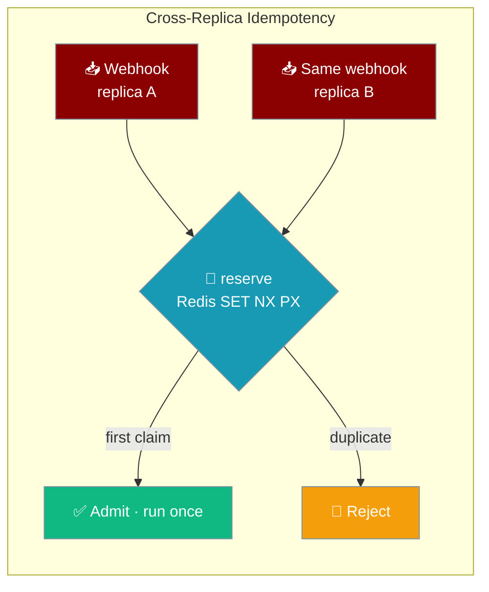
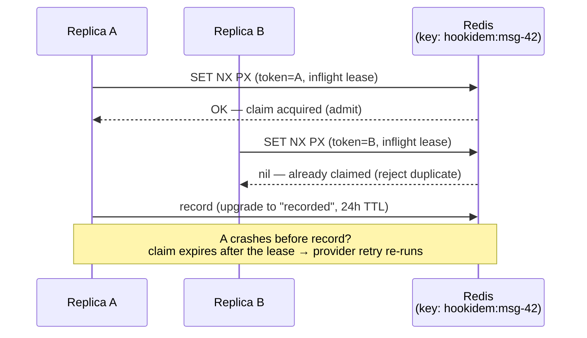
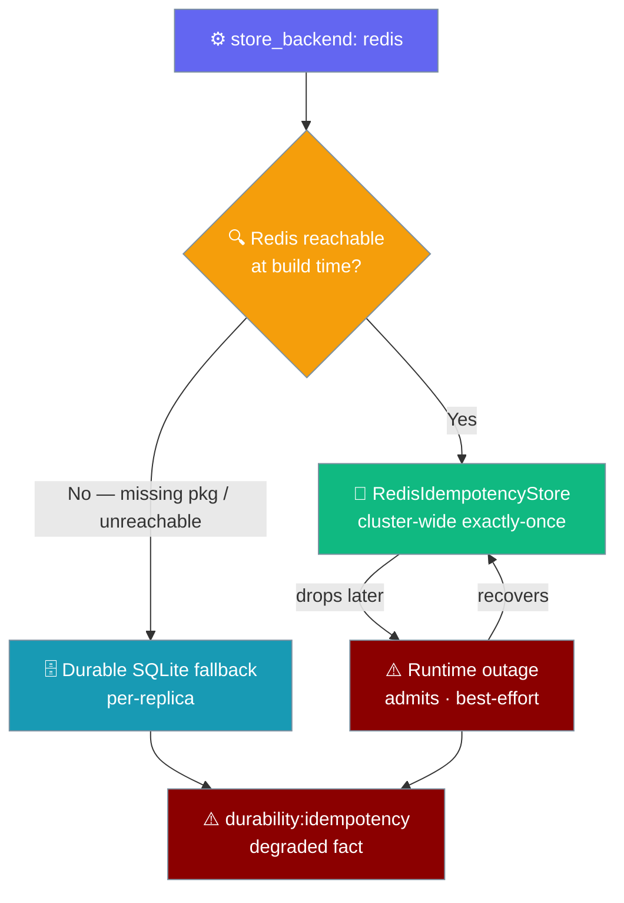
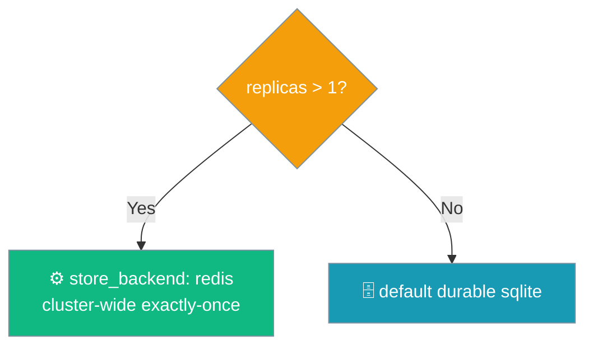

Turn on `store_backend: redis` and every replica of your gateway admits the same webhook exactly once, so a duplicate delivery never runs your agent twice.



## Quick Start

<Steps>
<Step title="Single replica — nothing to do">

One gateway process dedups with the durable SQLite default. Nothing to set.

```python
from praisonaiagents import Agent
from praisonai_bot.gateway import WebSocketGateway

agent = Agent(name="Support", instructions="Help users")
WebSocketGateway(agent=agent).start()   # store_backend defaults to durable sqlite
```

</Step>

<Step title="Multiple replicas — set store_backend: redis">

Two or more gateway processes need a shared claim so the same webhook fanned to both is admitted only once. Set it in `gateway.yaml` and make sure a Redis URL is configured — the store reuses the gateway's push `RedisConfig`.

```yaml
gateway:
  push:
    redis:
      url: redis://localhost:6379   # reused for the idempotency store
hooks:
  idempotency:
    store_backend: redis            # cluster-wide exactly-once admission
  hooks:
    - path: gmail
      agent: assistant
```

</Step>

<Step title="Or wire it in Python">

Pass the same `store_backend` through the gateway's hooks config where you construct it.

```python
from praisonaiagents import Agent
from praisonai_bot.gateway import WebSocketGateway

agent = Agent(name="Support", instructions="Help users")

gateway = WebSocketGateway(
    agent=agent,
    config={
        "push": {"redis": {"url": "redis://localhost:6379"}},
        "hooks": {"idempotency": {"store_backend": "redis"}},
    },
)
gateway.start()
```

</Step>
</Steps>

---

## How It Works

Each replica claims the key `(platform, account, channel_id, message_id)` with a single `SET NX PX`; the first wins and the duplicate is rejected.



| Call | What it does | Atomicity |
|------|--------------|-----------|
| `reserve(key)` | Single `SET NX PX` — atomic claim + owner token + inflight-lease TTL (default 900s). Rejects a redelivery and a concurrent duplicate on another replica. | Native `SET NX PX` |
| `record(key)` | Owner-checked upgrade to a long-lived `recorded` value (TTL 86400s / 24h). A late `record` from a replica whose lease expired is a no-op when another replica reclaimed the key. | Lua `EVAL`, with a `WATCH`/`MULTI` fallback |
| `release(key)` | Compare-and-del on the owner token, so it never drops another replica's live claim. | Lua `EVAL`, with a `WATCH`/`MULTI` fallback |

---

## Fail-Open on Redis Outage

The store never wedges inbound delivery — it degrades to best-effort and surfaces the fact, never a silent green.



Two failure modes, both surfaced under the `durability:idempotency` degraded owner:

| Mode | When | Reason string | Recovery |
|------|------|---------------|----------|
| Build-time | The `redis` package is missing or Redis is unreachable at construction | `"redis idempotency backend not available (running per-replica)"` | Falls back to durable SQLite; clears when Redis is reachable on the next build / hot-reload |
| Runtime | Redis was reachable at build but dropped later | `"redis idempotency backend unreachable at runtime (dedup best-effort until it recovers)"` | Admits (fails open); **auto-clears** on the next successful Redis op |

<Warning>
On a build-time fallback to SQLite, if a message is fanned to two replicas that do **not** share the SQLite state file, the agent turn can run twice. Watch `health()["degraded_owners"]` and restore Redis.
</Warning>

---

## When to Enable



---

## Configuration Options

The operator selects the backend and the store reuses the gateway's push `RedisConfig` — no separate idempotency Redis knob.

| Option | Where | Purpose |
|--------|-------|---------|
| `store_backend` | `hooks.idempotency.store_backend` | Set to `redis` for cluster-wide exactly-once admission |
| `url` | `push.redis.url` | Redis connection URL, reused by the store |
| `host` / `port` / `db` / `password` | `push.redis.*` | Field-wise connection when no `url` is given |
| `prefix` | `push.redis.prefix` | Namespaces keys as `{prefix}hookidem:{key}` so environments sharing one Redis do not collide |

<Card title="Gateway Turn Lock" icon="lock" href="/features/gateway-turn-lock">
  The sibling shared-state knob that wires the same `RedisConfig`.
</Card>

---

## Best Practices

<AccordionGroup>
<Accordion title="Enable the turn lock and idempotency together">
For a multi-replica gateway, set both `turn_lock.backend: redis` and `hooks.idempotency.store_backend: redis` — one serialises a session's turns, the other admits each webhook exactly once.
</Accordion>

<Accordion title="Reuse the gateway's push RedisConfig">
The store auto-shares `push.redis`. Configure Redis once; do not duplicate the connection for idempotency.
</Accordion>

<Accordion title="Watch for durability:idempotency">
A `durability:idempotency` entry in `gateway doctor` / `GET /health` means dedup fell back or is best-effort. Alert on it the same way you alert on a degraded channel.
</Accordion>

<Accordion title="Enable it before raising the replica count">
Switch to `store_backend: redis` before scaling past one replica, so a fanned-out webhook is deduped from the first extra pod.
</Accordion>
</AccordionGroup>

---

## Related

<CardGroup cols={2}>
<Card title="Gateway Turn Lock" icon="lock" href="/features/gateway-turn-lock">
  Sibling shared state — a distributed lease that serialises a session's turns.
</Card>
<Card title="Gateway State Durability" icon="database" href="/features/gateway-durability">
  The default SQLite dedup path and the degraded surface it joins.
</Card>
<Card title="Gateway Inbound Hooks" icon="webhook" href="/features/gateway-inbound-hooks">
  Where `store_backend` is configured on the inbound hook surface.
</Card>
<Card title="Degraded Capabilities" icon="stethoscope" href="/features/gateway-degraded-capabilities">
  Where the `durability:idempotency` fact surfaces.
</Card>
</CardGroup>
