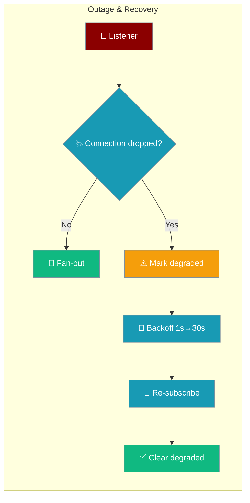
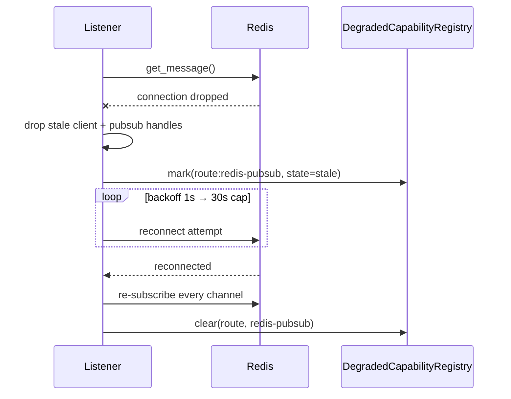

The Redis pub/sub adapter powering multi-instance gateway fan-out reconnects on a dropped connection, re-subscribes every channel, and reports the outage through `gateway status` / `doctor` — so a cross-instance blackout is never silent.



When Redis drops, the adapter marks itself degraded, reconnects with bounded backoff, re-subscribes every channel, and clears the degraded record on recovery — while counting any writes that hit the disconnected transport.

## Quick Start

<Steps>
<Step title="Run an agent behind an HA gateway">

The agent code is unchanged — the resilience lives in the fan-out transport:

```python
from praisonaiagents import Agent

agent = Agent(
    name="alerts-agent",
    instructions="Summarise incoming alert events in one sentence",
)
agent.start("Ready to fan out across gateway instances")
```

</Step>

<Step title="Enable Redis fan-out in gateway.yaml">

Point the push config at your Redis instance for cross-instance delivery:

```yaml
# gateway.yaml
push:
  enabled: true
  redis:
    host: redis.internal
    port: 6379
```

</Step>

<Step title="Watch outage signals via gateway status">

The three `redis_*` fields tell you the transport's health at a glance:

```bash
praisonai gateway status --json
# push.redis_connected:      bool  (false while degraded)
# push.redis_degraded:       bool  (true during the outage window)
# push.redis_dropped_writes: int   (cumulative)
```

</Step>
</Steps>

---

## How It Works

On a listener error the adapter drops its stale handles, marks itself degraded, then reconnects with exponential backoff (capped at 30s) and re-subscribes every tracked channel before resuming.



- **Bounded exponential backoff** — retries start at `1s`, double each failure, and cap at `30s`. The loop only exits if the adapter is disconnected.
- **Automatic re-subscription** — every channel tracked before the outage is re-subscribed on the fresh pub/sub handle.
- **Degraded surfacing** — the adapter records itself as owner `("route", "redis-pubsub")` with `state="stale"`, a redacted reason (exception string only — never the URL or password), and an actionable `retry_hint`.
- **Dropped-write counting** — `publish`, `set_presence`, `remove_presence`, `store_message`, and `delete_message` calls made while disconnected increment `dropped_writes` instead of vanishing.
- **Clears on recovery** — the degraded record is removed once Redis is reachable again.

---

## Health Signals

`health()` (and `gateway status`) expose three fields on the `push` status block.

| Field | Type | Meaning |
|-------|------|---------|
| `push.redis_connected` | `bool` | `true` only when the client is live **and** not degraded |
| `push.redis_degraded` | `bool` | `true` while the reconnect is in flight |
| `push.redis_dropped_writes` | `int` | Cumulative publish/presence/store/delete calls that hit a disconnected adapter |

During an outage, the degraded transport is listed under `degraded_owners`:

```json
{
  "push": {
    "redis_connected": false,
    "redis_degraded": true,
    "redis_dropped_writes": 3,
    "online_clients": 12
  },
  "degraded_owners": [
    {
      "owner_kind": "route",
      "owner_id": "redis-pubsub",
      "state": "stale",
      "reason": "redis pub/sub disconnected: Connection refused",
      "retry_hint": "check Redis connectivity; see `praisonai gateway doctor`"
    }
  ]
}
```

After recovery the `redis_*` fields return to healthy and the `route:redis-pubsub` entry is gone. Watch for the `Redis push adapter reconnected (server_id=<uuid>)` log line.

<Warning>
Writes counted in `redis_dropped_writes` are **not** replayed on reconnect. If you need durable cross-instance delivery, publish from a source of truth you can replay.
</Warning>

---

## Doctor Integration

The degraded record shows up in `praisonai gateway doctor` (see [Extensible Gateway Doctor](/features/gateway-doctor-plugins)) with the actionable `retry_hint`. No new plugin is needed — the adapter registers itself with the shared `DegradedCapabilityRegistry`.

```bash
praisonai gateway doctor
# route:redis-pubsub  stale
#   redis pub/sub disconnected: Connection refused
#   → check Redis connectivity; see `praisonai gateway doctor`
```

---

## Best Practices

<AccordionGroup>
<Accordion title="Alert on route:redis-pubsub degradation">
The `degraded_owners` entry for `route:redis-pubsub` is the single hook for a cross-instance-transport pager. It appears for the outage duration and clears automatically on reconnect.
</Accordion>
<Accordion title="Watch redis_dropped_writes after an outage">
A non-zero `push.redis_dropped_writes` tells you how many events fanned out one-sided. Alert on it if replay matters — those writes are gone from the transport's perspective.
</Accordion>
<Accordion title="Trust the redacted reason">
The `reason` only ever carries the exception message. The Redis URL and password are never surfaced, so the field is safe to log or page on.
</Accordion>
<Accordion title="Let the adapter reconnect itself">
Backoff and re-subscription are automatic. Do not restart the gateway to recover Redis — the listener re-establishes every channel on its own.
</Accordion>
</AccordionGroup>

---

## Related

<CardGroup cols={2}>
<Card title="Extensible Gateway Doctor" icon="plug" href="/features/gateway-doctor-plugins">
  Where the degraded record surfaces with its retry hint
</Card>
<Card title="Push Notifications" icon="bell" href="/features/push-notifications">
  Channel pub/sub and HA fan-out over Redis
</Card>
<Card title="Durable Polling" icon="database" href="/features/gateway-durable-polling">
  At-least-once delivery for the long-poll fallback transport
</Card>
<Card title="Gateway Liveness" icon="heart" href="/features/gateway-liveness">
  Health and liveness signals for the gateway
</Card>
</CardGroup>
