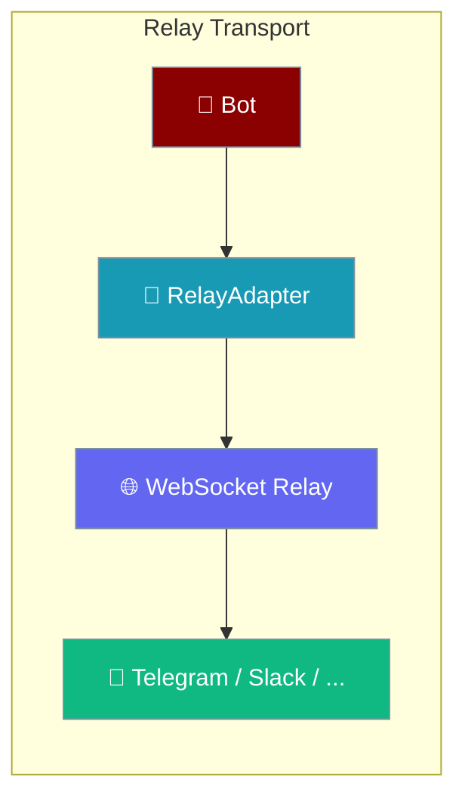
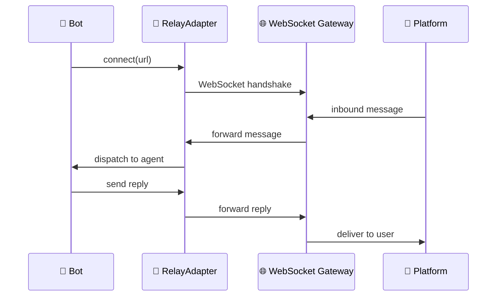
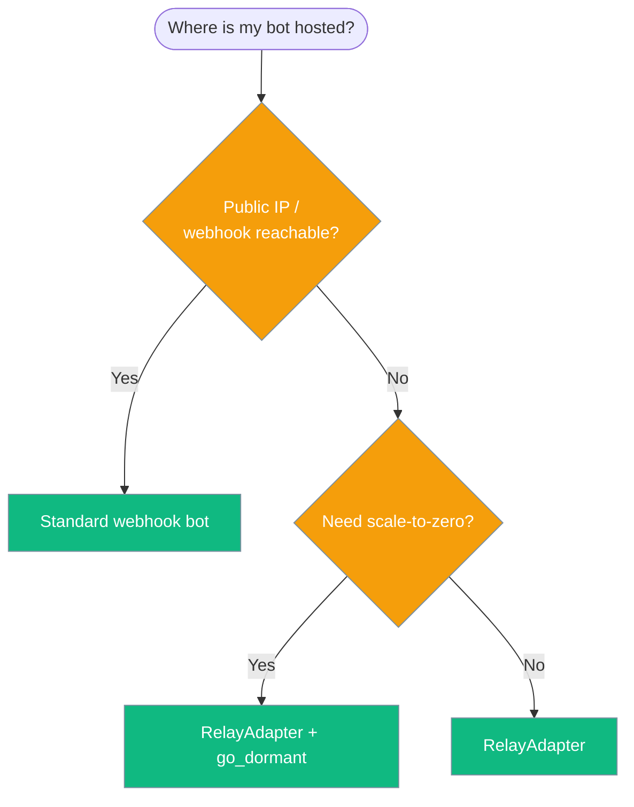

<Note>
The gateway now ships in the `praisonai-bot` package. `praisonai serve gateway` still works exactly as documented here; for a standalone install see [praisonai-bot Migration](/docs/guides/praisonai-bot-migration).
</Note>


```python
from praisonaiagents import Agent

agent = Agent(name="assistant", instructions="Be helpful.")
# Relay transport carries user messages to the gateway-backed agent
agent.start("Hello via relay")
```
Relay transport lets a Bot connect to messaging platforms through an outbound WebSocket relay — no public webhook URL required.

The user connects through a relay; messages traverse the relay transport to reach the gateway and agent.



## Quick Start

<Steps>
<Step title="Start the relay server">
Run the gateway relay CLI to bridge between the platform and your bot:

```bash
praisonai gateway relay --platform telegram --to wss://gw.internal/relay
```
</Step>

<Step title="Connect your bot via relay">
Pass a `transport=` argument when creating a `Bot`:

```python
import os
from praisonaiagents import Agent
from praisonai.bots import TelegramBot
from praisonai.bots.relay import RelayAdapter

agent = Agent(
    name="MyBot",
    instructions="Help users with their questions.",
)

relay = RelayAdapter(url="wss://gw.internal/relay")

bot = TelegramBot(
    token=os.getenv("TELEGRAM_BOT_TOKEN"),
    agent=agent,
    transport=relay,
)

bot.run()
```
</Step>

<Step title="Scale to zero with go_dormant()">
When idle, call `go_dormant()` to release the relay connection and stop consuming resources:

```python
import asyncio
from praisonaiagents import Agent
from praisonai.bots import TelegramBot
from praisonai.bots.relay import RelayAdapter

agent = Agent(name="DormantBot", instructions="Respond to messages.")
relay = RelayAdapter(url="wss://gw.internal/relay")
bot = TelegramBot(token=os.getenv("TELEGRAM_BOT_TOKEN"), agent=agent, transport=relay)

async def main():
    await bot.start()
    # After a period of inactivity:
    await bot.go_dormant()

asyncio.run(main())
```
</Step>
</Steps>

---

## How It Works



The `RelayAdapter` maintains a persistent outbound WebSocket connection to the relay gateway. Platform messages arrive through that channel instead of requiring an inbound webhook. Because the connection is outbound-only, the bot runs behind NAT or in a private network with no firewall rules.

---

## When to Use Relay Transport



| Scenario | Recommended approach |
|---|---|
| Public cloud with static IP | Standard webhook |
| Private network / NAT | **RelayAdapter** |
| Ephemeral compute (Fly.io, serverless) | **RelayAdapter + `go_dormant()`** |
| Multi-region bot fleet | **RelayAdapter** (one relay per region) |

---

## Configuration

### `RelayAdapter`

| Parameter | Type | Default | Description |
|-----------|------|---------|-------------|
| `url` | `str` | _(required)_ | WebSocket URL of the relay gateway |
| `reconnect_interval` | `float` | `5.0` | Seconds between reconnect attempts |
| `max_reconnects` | `int` | `0` | Max reconnect attempts (`0` = unlimited) |

### `Bot(transport=...)`

```python
from praisonai.bots.relay import RelayAdapter

relay = RelayAdapter(
    url="wss://gw.internal/relay",
    reconnect_interval=3.0,
)

bot = TelegramBot(token=token, agent=agent, transport=relay)
```

### CLI

```bash
praisonai gateway relay --platform <platform> --to <relay-url>
```

| Flag | Description |
|------|-------------|
| `--platform` | Platform adapter to use (`telegram`, `slack`, `discord`, …) |
| `--to` | WebSocket URL of the relay gateway |

---

## `go_dormant()`

`go_dormant()` disconnects the relay transport cleanly when the bot is idle, enabling scale-to-zero hosting. The bot wakes up automatically when a new message arrives and the transport reconnects.

```python
async def on_idle():
    await bot.go_dormant()
    # Bot releases WebSocket connection; reconnects on next inbound
```

See [Gateway Scale-to-Zero](/docs/features/gateway-scale-to-zero) for configuring the full idle policy.

---

## Best Practices

<AccordionGroup>
<Accordion title="Keep relay URLs internal">
The relay URL is an internal control plane endpoint. Do not expose it publicly — it should only be reachable from your bot's network.
</Accordion>

<Accordion title="Set reconnect_interval based on your SLO">
The default 5-second reconnect is suitable for most bots. Reduce it if you need sub-second reconnection; increase it on flaky networks to avoid reconnect storms.
</Accordion>

<Accordion title="Combine with durable delivery">
On reconnect the relay may miss messages. Enable [Durable Delivery](/docs/features/durable-delivery) so the outbound outbox survives relay disconnections.
</Accordion>

<Accordion title="Use go_dormant() only when truly idle">
Call `go_dormant()` only after all in-flight agent turns complete. The relay closes the WebSocket, so any in-progress sends will fail if the turn is still running.
</Accordion>
</AccordionGroup>

---

## Related

<CardGroup cols={2}>
<Card title="Gateway Scale-to-Zero" icon="circle-pause" href="/docs/features/gateway-scale-to-zero">
Full idle policy and wake URL configuration
</Card>
<Card title="Bot Gateway" icon="server" href="/docs/features/bot-gateway">
Core bot gateway concepts
</Card>
<Card title="Durable Delivery" icon="shield-check" href="/docs/features/durable-delivery">
Crash-safe outbound message delivery
</Card>
<Card title="Gateway CLI" icon="terminal" href="/docs/features/gateway-cli">
All `praisonai gateway` subcommands
</Card>
</CardGroup>
