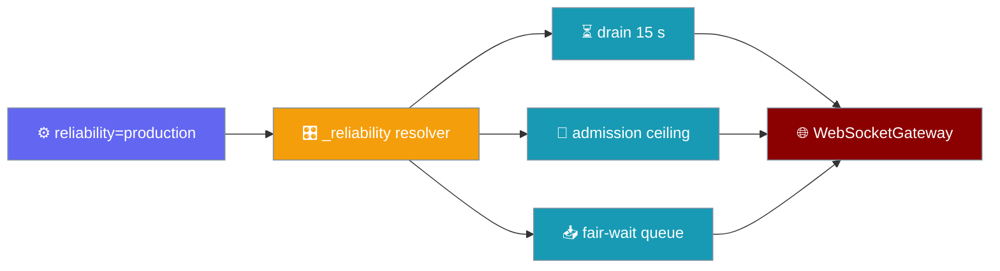
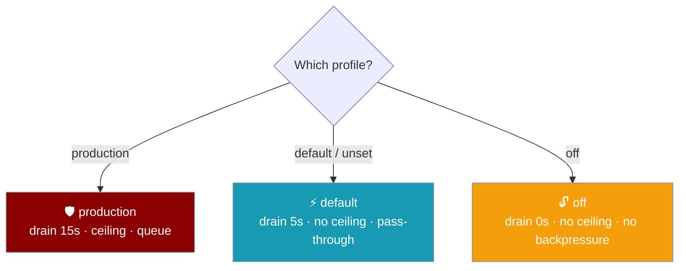
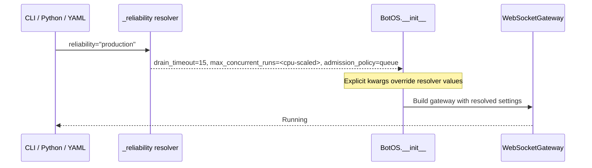

`reliability` is a single posture switch on `BotOS`, gateway YAML, or the CLI that maps a profile name onto drain window, concurrency ceiling, and admission queue — without touching individual settings.



## Quick Start

<Steps>
<Step title="Python — pass reliability= to BotOS">

```python
from praisonaiagents import Agent
from praisonai.bots import BotOS

agent = Agent(name="assistant", instructions="Help the user.")
bot = BotOS(agent=agent, platforms=["telegram", "discord"], reliability="production")
bot.start()
```

</Step>

<Step title="YAML — set reliability: at the top level">

```yaml
# gateway.yaml
reliability: production

agents:
  assistant:
    instructions: "Help the user."

channels:
  telegram:
    token: "${TELEGRAM_TOKEN}"
```

Run with:

```bash
praisonai gateway start --config gateway.yaml
```

</Step>

<Step title="CLI flag — override any YAML value">

```bash
praisonai gateway start --config gateway.yaml --reliability production
```

The CLI flag takes the highest precedence and overrides whatever is in the YAML file.

</Step>

<Step title="Override individual settings after the preset">

Explicit kwargs on `BotOS` always win over the preset:

```python
from praisonaiagents import Agent
from praisonai.bots import BotOS

agent = Agent(name="assistant", instructions="Help the user.")

bot = BotOS(
    agent=agent,
    platforms=["telegram"],
    reliability="production",
    drain_timeout=30.0,   # overrides the preset's 15 s
)
bot.start()
```

</Step>
</Steps>

---

## Profiles

Three built-in profiles cover the most common deployment scenarios.



| Profile | Drain window | Admission ceiling | Overflow behaviour |
|---|---|---|---|
| `production` | 15 s | CPU-scaled `max_concurrent_runs` | Bounded fair-wait queue (`overflow=queue`) |
| `default` / `None` (unset) | 5 s | none | pass-through |
| `off` | 0 s (immediate teardown) | none | today's no-backpressure behaviour |

---

## How It Works



The resolver `_reliability.py` converts the profile string into concrete values for `drain_timeout`, `max_concurrent_runs`, and `admission_policy`. Those values are passed directly to the underlying `WebSocketGateway` build step.

**Precedence (highest → lowest):**

1. Explicit kwargs on `BotOS.__init__` — e.g. `drain_timeout=30`
2. `reliability=` preset — e.g. `"production"`
3. SDK defaults

---

## Configuration Surfaces

### Python

```python
from praisonai.bots import BotOS

# Minimal
bot = BotOS(agent=agent, platforms=["telegram"], reliability="production")

# From a YAML config file (reads top-level `reliability:` or `gateway.reliability`)
bot = BotOS.from_config("gateway.yaml")
```

### YAML

Both placements are accepted:

```yaml
# Top-level
reliability: production

# Or nested under gateway:
gateway:
  reliability: production
  max_concurrent_runs: 8   # explicit override still respected
```

### CLI

```bash
praisonai gateway start --config gateway.yaml --reliability production
praisonai gateway start --config gateway.yaml --reliability off
praisonai gateway start --config gateway.yaml --reliability default
```

---

## Common Patterns

### Production deployment

```python
from praisonaiagents import Agent
from praisonai.bots import BotOS

agent = Agent(name="support", instructions="Answer customer questions.")
bot = BotOS(
    agent=agent,
    platforms=["telegram", "discord", "slack"],
    reliability="production",
)
bot.start()
```

### Extend the drain window for slow agents

```python
bot = BotOS(
    agent=agent,
    platforms=["telegram"],
    reliability="production",
    drain_timeout=45.0,   # 45s instead of preset 15s
)
```

### Disable all backpressure for development

```yaml
reliability: off
```

---

## Best Practices

<AccordionGroup>

<Accordion title="Use production in all deployed services">

`production` composes drain + admission control together. Enabling them separately is error-prone — the preset guarantees a coherent configuration.

</Accordion>

<Accordion title="Never mix reliability= with manual drain/admission in YAML unless intentional">

Explicit YAML keys like `gateway.drain_timeout` override the preset. That is correct behaviour when you need to tune a single value, but it can surprise you if you forget the preset was set.

</Accordion>

<Accordion title="Unknown profile names raise immediately — do not catch the error">

An unrecognised profile (e.g. `reliability: "fast"`) raises at startup, not at first request. This fail-fast behaviour is intentional — silent fallback to `default` would hide misconfiguration.

</Accordion>

<Accordion title="Use --reliability CLI flag for canary deployments">

Deploying a new preset to a single pod via the CLI flag lets you validate behaviour before updating the shared `gateway.yaml`.

</Accordion>

</AccordionGroup>

---

## Related

<CardGroup cols={2}>
<Card title="Gateway Overview" icon="server" href="/docs/features/gateway-overview">
  Bot gateway architecture and core concepts
</Card>
<Card title="Gateway Graceful Drain" icon="hourglass" href="/docs/features/gateway-graceful-drain">
  In-flight turn drain on shutdown or reload
</Card>
<Card title="Gateway Admission Control" icon="traffic-cone" href="/docs/features/gateway-admission-control">
  Cap concurrent runs and queue overflow requests
</Card>
<Card title="Gateway Flow Control" icon="gauge" href="/docs/features/gateway-flow-control">
  Back-pressure and send-policy options
</Card>
</CardGroup>
