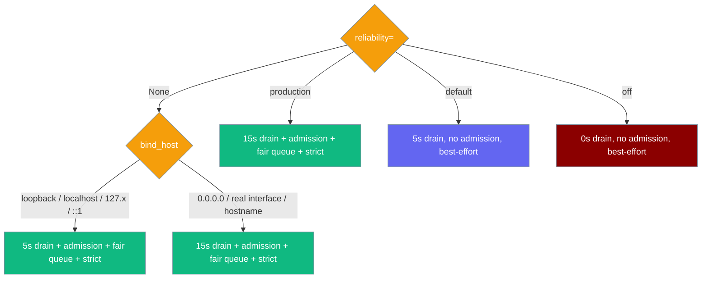
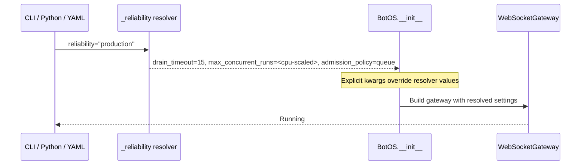

<Note>
The gateway now ships in the `praisonai-bot` package. `praisonai serve gateway` still works exactly as documented here; for a standalone install see [praisonai-bot Migration](/guides/praisonai-bot-migration).
</Note>


A `BotOS(agent=..., ...)` or `praisonai gateway start` with no `reliability=` argument is now safe by default — the gateway picks a bounded admission ceiling, a fair wait queue, strict outbound ordering, and a drain window sized to the bind (loopback → 5s, real interface → 15s). The `reliability=` preset is still there for callers who want to override that.

```python
from praisonaiagents import Agent
from praisonai_bot.bots.botos import BotOS

agent = Agent(name="assistant", instructions="Help the user.")

# Safe by default: admission ceiling + fair queue + drain, bind-aware.
bot = BotOS(agent=agent, platforms=["telegram", "discord"])
bot.start()
```


```mermaid
graph TB
    R{reliability=} -->|None| B{bind_host}
    R -->|"production"| P[15s drain + admission + fair queue + strict]
    R -->|"default"| D[5s drain, no admission, best-effort]
    R -->|"off"| O[0s drain, no admission, best-effort]
    B -->|loopback / localhost / 127.x / ::1| SL[5s drain + admission + fair queue + strict]
    B -->|0.0.0.0 / real interface / hostname| SE[15s drain + admission + fair queue + strict]

    classDef q fill:#F59E0B,stroke:#7C90A0,color:#fff
    classDef input fill:#6366F1,stroke:#7C90A0,color:#fff
    classDef result fill:#10B981,stroke:#7C90A0,color:#fff
    classDef optout fill:#8B0000,stroke:#7C90A0,color:#fff

    class R,B q
    class SL,SE,P result
    class D input
    class O optout
```

<Warning>
Any code that passes **nothing** — `BotOS(agent=agent)` or `praisonai gateway start` with no `--reliability` — silently upgrades to the safe posture. Two behaviours change observably: a burst that used to fan out unboundedly now queues (or rejects when the queue is full), and a `SIGTERM`-then-kill loop now waits 5–15s for in-flight turns. To revert, pass `reliability="off"` (or `--reliability off`). Code that already passes `reliability="default"` keeps its exact current behaviour (PraisonAI #3438).
</Warning>

## Quick Start

<Steps>
<Step title="Simplest — safe by default">

No `reliability=` needed. The gateway resolves admission, a fair queue, strict ordering, and a bind-aware drain:

```python
from praisonaiagents import Agent
from praisonai_bot.bots.botos import BotOS

agent = Agent(name="assistant", instructions="Help the user.")

# Safe by default: admission ceiling + fair queue + drain, bind-aware.
bot = BotOS(agent=agent, platforms=["telegram", "discord"])
bot.start()
```

</Step>

<Step title="Force the full production window even on loopback">

```python
bot = BotOS(
    agent=agent,
    platforms=["telegram", "discord"],
    reliability="production",  # 15s drain regardless of bind
)
```

</Step>

<Step title="Explicit opt-out (revert to pre-#3438 immediate teardown)">

```python
bot = BotOS(
    agent=agent,
    platforms=["telegram", "discord"],
    reliability="off",  # no drain, no admission — you asked for it
)
```

</Step>

<Step title="YAML — set reliability: at the top level">

```yaml
# gateway.yaml
reliability: production

agents:
  assistant:
    instructions: "Help the user."

channels:
  telegram:
    token: "${TELEGRAM_TOKEN}"
```

Run with:

```bash
praisonai gateway start --config gateway.yaml
```

</Step>

<Step title="CLI flag — override any YAML value">

```bash
praisonai gateway start --config gateway.yaml --reliability production
```

The CLI flag takes the highest precedence and overrides whatever is in the YAML file.

</Step>

<Step title="Override individual settings after the preset">

Explicit kwargs on `BotOS` always win over the preset:

```python
from praisonaiagents import Agent
from praisonai_bot.bots.botos import BotOS

agent = Agent(name="assistant", instructions="Help the user.")

bot = BotOS(
    agent=agent,
    platforms=["telegram"],
    reliability="production",
    drain_timeout=30.0,   # overrides the preset's 15 s
)
bot.start()
```

</Step>
</Steps>

---

## Profiles

Four distinct postures. The unset posture is bind-aware, so it appears twice.

| Preset | Drain | Admission ceiling | Wait queue | Outbound ordering | When to use |
|--------|-------|-------------------|------------|-------------------|-------------|
| **Unset** (`None`, loopback bind) | 5 s | Yes (CPU-scaled) | Yes (bounded, fair) | `strict` | Local dev on `127.0.0.1` / `localhost` |
| **Unset** (`None`, non-loopback bind) | 15 s | Yes (CPU-scaled) | Yes (bounded, fair) | `strict` | An actual deployment (`0.0.0.0`, real hostname) |
| **`"production"`** | 15 s | Yes (CPU-scaled) | Yes (bounded, fair) | `strict` | Pin the production window regardless of bind |
| **`"default"`** | 5 s | **No** | No | `best_effort` | Explicit legacy posture — the pre-#3438 shape |
| **`"off"`** | 0 s | **No** | No | `best_effort` | Explicit opt-out — immediate teardown, no backpressure |

The safe posture (unset) and `production` both enable strict per-conversation FIFO delivery on the outbox — see [Outbound Ordering](/features/outbound-ordering). `"default"` and `"off"` keep `best_effort` for backward compatibility.

---

## How It Works


```mermaid
sequenceDiagram
    participant CLI as CLI / Python / YAML
    participant Res as _reliability resolver
    participant BotOS as BotOS.__init__
    participant GW as WebSocketGateway

    CLI->>Res: reliability="production"
    Res-->>BotOS: drain_timeout=15, max_concurrent_runs=<cpu-scaled>, admission_policy=queue
    Note over BotOS: Explicit kwargs override resolver values
    BotOS->>GW: Build gateway with resolved settings
    GW-->>CLI: Running
```

The resolver `_reliability.py` converts the profile string into concrete values for `drain_timeout`, `max_concurrent_runs`, and `admission_policy`. Those values are passed directly to the underlying `WebSocketGateway` build step.

**Precedence (highest → lowest):**

1. Explicit kwargs on `BotOS.__init__` — e.g. `drain_timeout=30`, `outbound_ordering="strict"`
2. `reliability=` preset — e.g. `"production"`
3. SDK defaults

`outbound_ordering=` is also an explicit kwarg that overrides the preset. Passing `outbound_ordering="strict"` (or `"best_effort"`) always wins over the profile's choice; unknown values raise `ValueError` at resolve time.

---

## Configuration Surfaces

### Python

```python
from praisonai_bot.bots.botos import BotOS

# Minimal — safe by default, no reliability= needed
bot = BotOS(agent=agent, platforms=["telegram"])

# From a YAML config file (reads top-level `reliability:` or `gateway.reliability`)
bot = BotOS.from_config("gateway.yaml")
```

### YAML

Both placements are accepted:

```yaml
# Top-level
reliability: production

# Or nested under gateway:
gateway:
  reliability: production
  max_concurrent_runs: 8   # explicit override still respected
```

### CLI

```bash
praisonai gateway start --config gateway.yaml --reliability production
praisonai gateway start --config gateway.yaml --reliability off
praisonai gateway start --config gateway.yaml --reliability default
```

---

## Common Patterns

### Production deployment

A non-loopback bind auto-selects the full production window — no `reliability=` argument needed:

```python
from praisonaiagents import Agent
from praisonai_bot.bots.botos import BotOS

agent = Agent(name="support", instructions="Answer customer questions.")
bot = BotOS(
    agent=agent,
    platforms=["telegram", "discord", "slack"],
)
bot.start()  # bound to a real interface → 15s drain + admission + fair queue
```

### Extend the drain window for slow agents

```python
bot = BotOS(
    agent=agent,
    platforms=["telegram"],
    reliability="production",
    drain_timeout=45.0,   # 45s instead of preset 15s
)
```

### Production preset with per-thread ordering

The `production` preset enables `strict` ordering; pass a custom `lane_key` to order sends within a shared channel:

```python
from praisonaiagents import Agent
from praisonai.bots import BotOS

agent = Agent(name="support", instructions="Answer customer questions.")
bot = BotOS(agent=agent, platforms=["slack"], reliability="production")

# Later, when enqueuing on the outbox, group by thread:
await bot.outbox.enqueue(
    idempotency_key=f"reply-{msg_id}",
    target="slack:C0123456",
    payload={"text": reply},
    lane_key=f"slack:C0123456:thread:{thread_ts}",
)
```

### Disable all backpressure for development

```yaml
reliability: off
```

---

## Best Practices

<AccordionGroup>

<Accordion title="Recommended: pass nothing — the unset posture is now production-safe">

On a non-loopback bind the unset posture is equivalent to `production` — same admission ceiling, fair queue, strict ordering, and 15 s drain. Most operators don't need to pass anything. Use `reliability="production"` only to pin the 15 s window even on a loopback bind.

</Accordion>

<Accordion title="I want the pre-3438 behaviour back">

Pass `reliability="off"` for no drain and no admission, or `reliability="default"` for a 5 s drain with no admission ceiling. Neither is a recommended default — they exist for callers who explicitly want the pre-#3438 shape.

</Accordion>

<Accordion title="Never mix reliability= with manual drain/admission in YAML unless intentional">

Explicit YAML keys like `gateway.drain_timeout` override the preset. That is correct behaviour when you need to tune a single value, but it can surprise you if you forget the preset was set.

</Accordion>

<Accordion title="Unknown profile names raise immediately — do not catch the error">

An unrecognised profile (e.g. `reliability: "fast"`) raises at startup, not at first request. This fail-fast behaviour is intentional — silent fallback to `default` would hide misconfiguration.

</Accordion>

<Accordion title="Use --reliability CLI flag for canary deployments">

Deploying a new preset to a single pod via the CLI flag lets you validate behaviour before updating the shared `gateway.yaml`.

</Accordion>

</AccordionGroup>

---

## Related

<CardGroup cols={2}>
<Card title="Gateway Overview" icon="server" href="/features/gateway-overview">
  Bot gateway architecture and core concepts
</Card>
<Card title="Gateway Graceful Drain" icon="hourglass" href="/features/gateway-graceful-drain">
  In-flight turn drain on shutdown or reload
</Card>
<Card title="Gateway Admission Control" icon="traffic-cone" href="/features/gateway-admission-control">
  Cap concurrent runs and queue overflow requests
</Card>
<Card title="Gateway Flow Control" icon="gauge" href="/features/gateway-flow-control">
  Back-pressure and send-policy options
</Card>
<Card title="Outbound Ordering" icon="arrow-down-1-0" href="/features/outbound-ordering">
  Per-conversation FIFO delivery the production preset turns on
</Card>
</CardGroup>
