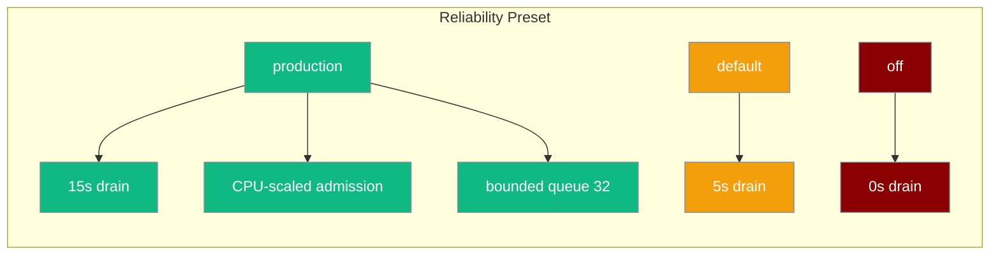
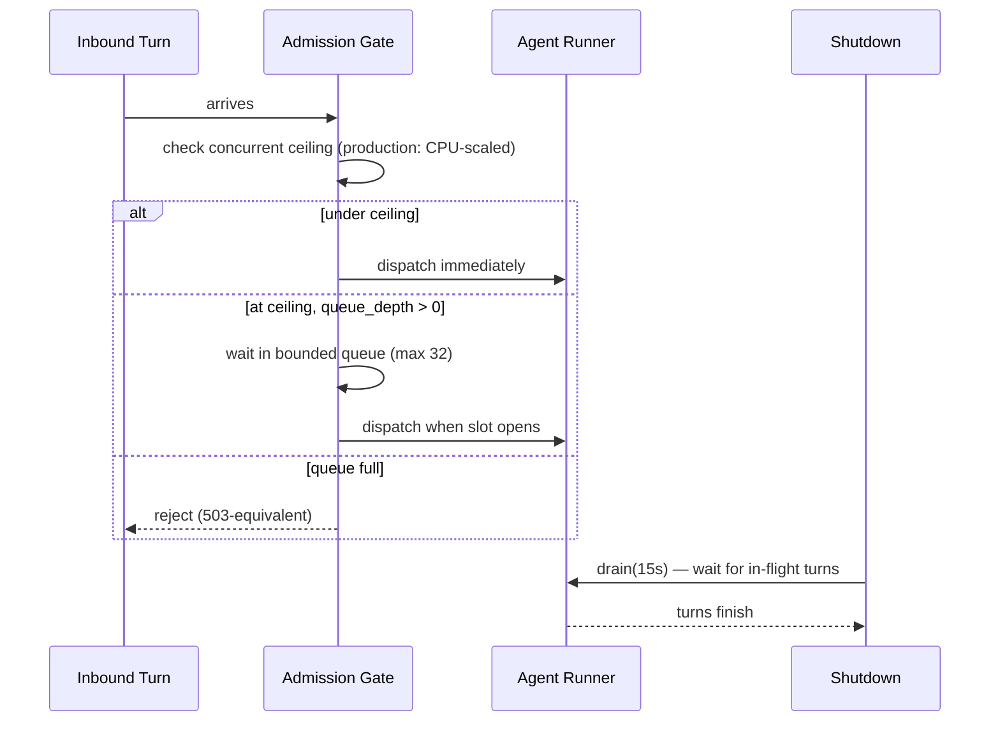

One parameter composing graceful drain and inbound admission control into a production-ready configuration — without touching individual knobs.

<Note>This page covers the **gateway reliability preset** (drain + admission). For task/workflow retry (retry jitter, `workflow_timeout`, `fail_on_callback_error`), see [Reliability](/docs/features/reliability).</Note>

```python
from praisonaiagents import Agent
from praisonai.bots import BotOS

BotOS(
    agent=Agent(name="Bot", instructions="Be helpful"),
    platforms=["telegram", "discord"],
    reliability="production",
)
```



## Quick Start

<Steps>
<Step title="Python (BotOS)">

```python
from praisonaiagents import Agent
from praisonai.bots import BotOS

BotOS(
    agent=Agent(name="Bot", instructions="Be helpful"),
    platforms=["telegram", "discord"],
    reliability="production",
)
```
</Step>

<Step title="YAML (gateway.yaml)">

```yaml
reliability: production
# or nested under gateway:
gateway:
  reliability: production
  max_concurrent_runs: 8   # explicit override still respected
```
</Step>

<Step title="CLI">

```bash
praisonai gateway start --config gateway.yaml --reliability production
```
</Step>
</Steps>

---

## Profiles

| Profile | Drain window | Admission ceiling | Queue depth | Overflow |
|---------|--------------|-------------------|-------------|----------|
| `"production"` | 15 s | CPU-scaled: `max(4, min(32, cpus × 4))` | 32 | `queue` (bounded fair wait) |
| `"default"` / `None` | 5 s | none (unbounded, legacy dispatch) | 0 | `reject` |
| `"off"` | 0 s | none | 0 | `reject` |

- **`production`** — anything customer-facing or rolling deploys. In-flight turns drain cleanly on shutdown and new turns queue fairly up to 32 before being rejected.
- **`default`** — dev / staging. Keeps a 5-second drain so a restart doesn't cut in-flight turns, but no admission ceiling.
- **`off`** — reproduces legacy behaviour or unit tests. No drain, no queueing.

Unknown profile names fail fast with `ValueError`.

---

## What Each Knob Does



**Graceful drain** — on `BotOS.stop()`, the gateway quiesces ingress and waits for in-flight agent turns to finish before cancelling tasks. The drain window is the maximum time to wait.

**Inbound admission control** — caps the number of concurrent agent runs across all channels. Excess turns either queue (bounded fair wait) or are rejected immediately, depending on the `overflow_policy`.

---

## Precedence Ladder

Explicit constructor fields always win over the preset. Only fields left unset are filled by the preset.

```
CLI flag
  > constructor arg (drain_timeout=, max_concurrent_runs=, admission_policy=)
  > gateway.reliability YAML key
  > top-level reliability: YAML key
  > preset default
```

Example — preset sets drain to 15s, but explicit override wins:

```python
from praisonaiagents import Agent
from praisonai.bots import BotOS

BotOS(
    agent=Agent(name="Bot", instructions="Be helpful"),
    platforms=["telegram"],
    reliability="production",
    drain_timeout=30.0,  # 30s wins over preset's 15s
)
```

---

## What It Does NOT Change

These are already default-on regardless of the reliability preset:

- Durable inbound journal (session level)
- Durable outbound outbox

---

## Best Practices

<AccordionGroup>
<Accordion title="Use production for rolling deploys">

`reliability="production"` ensures in-flight conversations finish before a new version takes over. Pair with a process manager that sends `SIGTERM` on deploy.
</Accordion>

<Accordion title="Keep default for development">

`reliability="default"` (or `None`) gives you a 5-second drain so you don't cut conversations mid-turn during `Ctrl+C`, without the admission overhead of production mode.
</Accordion>

<Accordion title="Use off only for tests">

`reliability="off"` makes shutdown immediate — useful for unit tests or reproducing legacy behaviour, but never use it in production.
</Accordion>

<Accordion title="Override individual knobs when needed">

If the preset drain window or admission ceiling doesn't fit your load, pass `drain_timeout=` or `max_concurrent_runs=` directly — they always take precedence over the preset. See the [Graceful Drain](/docs/features/gateway-graceful-drain) and [Admission Control](/docs/features/gateway-admission-control) pages for the full knob reference.
</Accordion>
</AccordionGroup>

---

## Related

<CardGroup cols={2}>
<Card title="Channels Gateway" icon="tower-broadcast" href="/docs/features/channels-gateway">
  Configure BotOS for multi-platform deployments
</Card>
<Card title="Gateway Graceful Drain" icon="hourglass" href="/docs/features/gateway-graceful-drain">
  Configure drain timeout independently
</Card>
<Card title="Gateway Admission Control" icon="traffic-cone" href="/docs/features/gateway-admission-control">
  Fine-grained inbound admission policy
</Card>
<Card title="Reliability" icon="rotate-ccw" href="/docs/features/reliability">
  Task/workflow retry jitter and failure policies
</Card>
</CardGroup>
