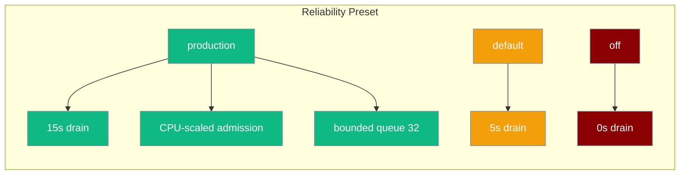
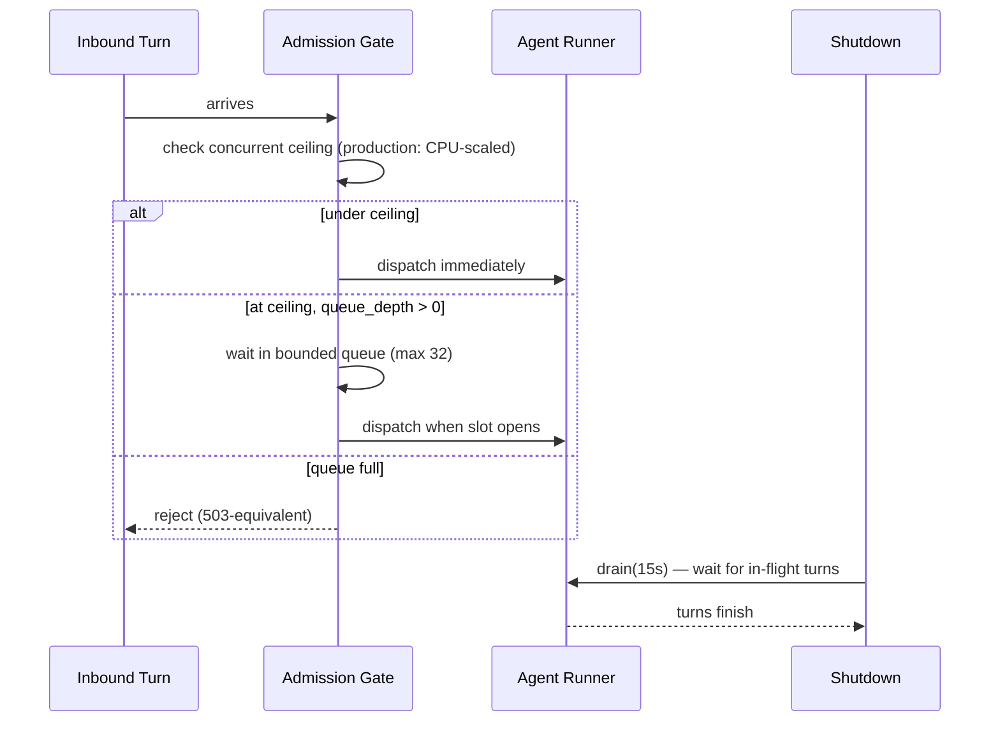
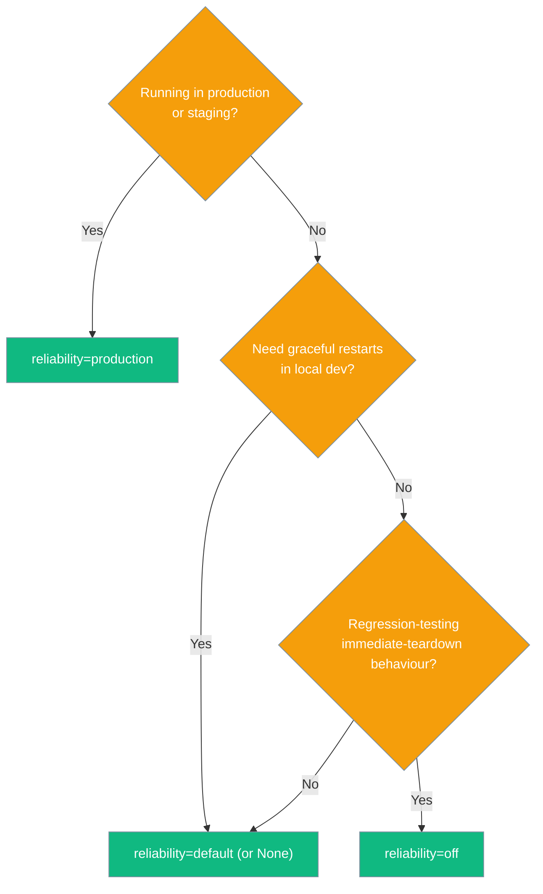

<Note>
The gateway now ships in the `praisonai-bot` package. `praisonai serve gateway` still works exactly as documented here; for a standalone install see [praisonai-bot Migration](/docs/guides/praisonai-bot-migration).
</Note>

<Note>This page covers the **gateway reliability preset** (drain + admission). For task/workflow retry (retry jitter, `workflow_timeout`, `fail_on_callback_error`), see [Reliability](/docs/features/reliability).</Note>

One parameter composing graceful drain and inbound admission control into a production-ready configuration — without touching individual knobs.

```python
from praisonaiagents import Agent
from praisonai.bots import BotOS

BotOS(
    agent=Agent(name="SupportBot", instructions="Help users with support questions."),
    platforms=["telegram", "discord"],
    reliability="production",
)
```



## Quick Start

<Steps>

<Step title="Python (BotOS)">

```python
from praisonaiagents import Agent
from praisonai.bots import BotOS

BotOS(
    agent=Agent(name="SupportBot", instructions="Help users."),
    platforms=["telegram", "discord"],
    reliability="production",
).run()
```
</Step>

<Step title="Override specific knobs">

Explicit args always beat the preset — useful for canary deployments:

```python
BotOS(
    agent=Agent(name="SupportBot", instructions="Help users."),
    platforms=["telegram"],
    reliability="production",
    drain_timeout=30,          # override: 30s instead of preset 15s
)
```
</Step>

<Step title="YAML (gateway.yaml)">

```yaml
reliability: production
# or nested under gateway:
gateway:
  reliability: production
  max_concurrent_runs: 8   # explicit override still respected
```
</Step>

<Step title="CLI">

```bash
praisonai gateway start --config gateway.yaml --reliability production
```
</Step>

</Steps>

---

## Profiles

| Profile | `drain_timeout` | `max_concurrent_runs` | `overflow_policy` | When to use |
|---------|----------------|-----------------------|-------------------|-------------|
| `"production"` | 15 s | CPU-scaled: `max(4, min(32, cpus × 4))` | `queue` (depth 32) | Production / staging / rolling deploys |
| `"default"` / `None` | 5 s | unset (unbounded) | `reject` | Local dev with graceful restart |
| `"off"` | 0 s | unset | `reject` | Legacy immediate-teardown / unit tests |

<Note>
`max_concurrent_runs` is calculated as `os.cpu_count() * 4`, clamped to the range [4, 32]. On a 4-core machine that's 16 concurrent turns; on an 8-core machine, 32. Unknown profile names fail fast with `ValueError`.
</Note>

---

## What Each Knob Does



**Graceful drain** — on `BotOS.stop()`, the gateway quiesces ingress and waits for in-flight agent turns to finish before cancelling tasks. The drain window is the maximum time to wait.

**Inbound admission control** — caps the number of concurrent agent runs across all channels. Excess turns either queue (bounded fair wait) or are rejected immediately, depending on the `overflow_policy`.

---

## Precedence Ladder

Explicit constructor fields always win over the preset. Only fields left unset are filled by the preset.

```
CLI flag
  > constructor arg (drain_timeout=, max_concurrent_runs=, admission_policy=)
  > gateway.reliability YAML key
  > top-level reliability: YAML key
  > preset default
```

Example — preset sets drain to 15s, but explicit override wins:


```python
from praisonaiagents import Agent
from praisonai.bots import BotOS

BotOS(
    agent=Agent(name="SupportBot", instructions="Help users."),
    platforms=["telegram"],
    reliability="production",
    drain_timeout=30.0,  # 30s wins over preset's 15s
)
```

---

## Which Profile Should I Pick?



---

## What It Does NOT Change

These are already default-on regardless of the reliability preset:

- Durable inbound journal (session level)
- Durable outbound outbox

Degraded-channel isolation is another default-on opt-out from fail-closed behaviour, independent of the reliability preset: one channel's unavailable credential isolates just that channel instead of aborting the gateway. See [Degraded Channel Isolation](/docs/features/gateway-degraded-channels).

---

## Best Practices

<AccordionGroup>

<Accordion title="Start with production and only override what you measure">
The preset values (15 s drain, CPU × 4 ceiling, 32-deep queue) are conservative defaults tuned for latency-bound LLM workloads. Only override a value after measuring that the default doesn't fit — e.g. a 99th-percentile turn time of 25 s warrants `drain_timeout=30`.
</Accordion>

<Accordion title="Use production for rolling deploys">

`reliability="production"` ensures in-flight conversations finish before a new version takes over. Pair with a process manager that sends `SIGTERM` on deploy.
</Accordion>

<Accordion title="Keep default for development">

`reliability="default"` (or `None`) gives you a 5-second drain so you don't cut conversations mid-turn during `Ctrl+C`, without the admission overhead of production mode.
</Accordion>

<Accordion title="Keep off for backward-compat regression testing only">
`reliability="off"` restores the pre-reliability behaviour (immediate cancel on SIGTERM, unbounded concurrency). Use it only in tests — never deploy `off` to production.
</Accordion>

<Accordion title="Override individual knobs when needed">

If the preset drain window or admission ceiling doesn't fit your load, pass `drain_timeout=` or `max_concurrent_runs=` directly — they always take precedence over the preset. See the [Graceful Drain](/docs/features/gateway-graceful-drain) and [Admission Control](/docs/features/gateway-admission-control) pages for the full knob reference.
</Accordion>

</AccordionGroup>

---

## Related

<CardGroup cols={2}>
<Card title="Gateway Graceful Drain" icon="hourglass" href="/docs/features/gateway-graceful-drain">
  Drain-only knob — fine-grained drain control without the full preset
</Card>
<Card title="Gateway Admission Control" icon="traffic-cone" href="/docs/features/gateway-admission-control">
  Concurrency ceiling and fair queue — the other half of the production preset
</Card>
<Card title="Config Reload" icon="arrows-rotate" href="/docs/features/gateway-config-reload">
  Hot-reload gateway.yaml without dropping in-flight turns
</Card>
<Card title="Reliability" icon="rotate-ccw" href="/docs/features/reliability">
  Task/workflow retry jitter and failure policies
</Card>
</CardGroup>
