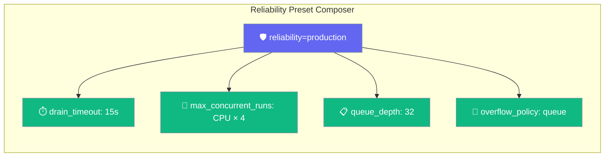
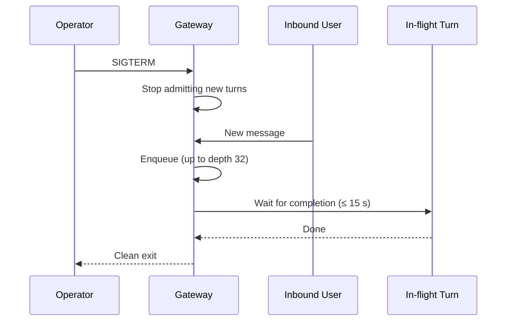
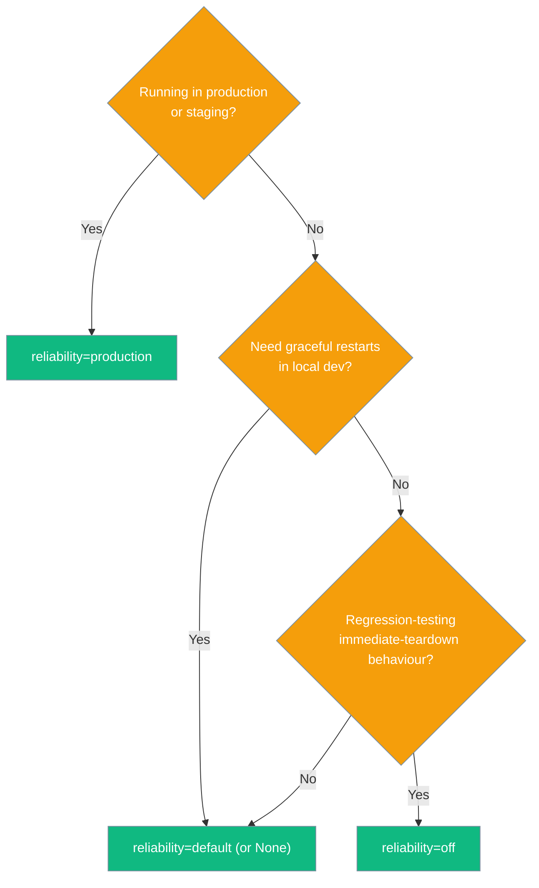

One line makes your gateway production-grade — `reliability="production"` composes graceful drain and admission control automatically.

```python
from praisonaiagents import Agent
from praisonai.bots import BotOS

agent = Agent(name="SupportBot", instructions="Help users with support questions.")
bots = BotOS(agent=agent, platforms=["telegram", "discord"], reliability="production")
bots.run()
```



## Quick Start

<Steps>

<Step title="Enable production preset">
```python
from praisonaiagents import Agent
from praisonai.bots import BotOS

agent = Agent(name="SupportBot", instructions="Help users.")
bots = BotOS(agent=agent, platforms=["telegram"], reliability="production")
bots.run()
```
</Step>

<Step title="Override specific knobs">
Explicit args always beat the preset — useful for canary deployments:

```python
bots = BotOS(
    agent=agent,
    platforms=["telegram"],
    reliability="production",
    drain_timeout=30,          # override: 30s instead of preset 15s
)
```
</Step>

<Step title="Configure via YAML">
```yaml
# gateway.yaml
reliability: production

agents:
  support:
    instructions: "Help users."
    model: gpt-4o-mini

channels:
  telegram:
    token: "${TELEGRAM_BOT_TOKEN}"
```
</Step>

</Steps>

---

## Profile Comparison

| Profile | `drain_timeout` | `max_concurrent_runs` | `overflow_policy` | When to use |
|---------|----------------|-----------------------|-------------------|-------------|
| `production` | 15 s | CPU × 4 (min 4, max 32) | `queue` (depth 32) | Production / staging |
| `default` / `None` | 5 s | unset | `reject` | Local dev with graceful restart |
| `off` | 0 s | unset | `reject` | Legacy immediate-teardown behaviour |

<Note>
`max_concurrent_runs` is calculated as `os.cpu_count() * 4`, clamped to the range [4, 32]. On a 4-core machine that's 16 concurrent turns; on an 8-core machine, 32.
</Note>

---

## Three Configuration Surfaces

<Tabs>
<Tab title="Python">
```python
from praisonaiagents import Agent
from praisonai.bots import BotOS

agent = Agent(name="SupportBot", instructions="Help users.")

bots = BotOS(
    agent=agent,
    platforms=["telegram", "discord"],
    reliability="production",
)
bots.run()
```
</Tab>

<Tab title="YAML">
Top-level `reliability:` field:

```yaml
# gateway.yaml
reliability: production

agents:
  support:
    instructions: "You are a support agent."
    model: gpt-4o-mini

channels:
  telegram:
    token: "${TELEGRAM_BOT_TOKEN}"
  discord:
    token: "${DISCORD_BOT_TOKEN}"
```

Alternatively, nest under `gateway:`:

```yaml
gateway:
  reliability: production
  drain_timeout: 30   # explicit override — beats the preset
```
</Tab>

<Tab title="CLI">
```bash
praisonai gateway start --config gateway.yaml --reliability production
```

The `--reliability` flag overrides `reliability:` from YAML but is itself overridden by explicit `--drain-timeout` / `--max-concurrent-runs`.
</Tab>
</Tabs>

---

## Precedence Rules

Explicit constructor / CLI args always win over the preset. The preset only fills in fields left unset.

```python
bots = BotOS(
    agent=agent,
    platforms=["telegram"],
    reliability="production",   # preset: 15s drain, CPU-scaled ceiling, queue
    drain_timeout=30,           # explicit → 30s wins; other preset values stay
)
```

Order (highest wins):

1. Explicit Python arg / CLI flag (`drain_timeout=`, `--drain-timeout`)
2. `reliability=` preset
3. Framework defaults (immediate cancel, unbounded dispatch)

---

## User Interaction Flow

When `reliability="production"` is set, the gateway stops admitting new turns on SIGTERM, then waits up to 15 s for in-flight turns to finish. Inbound bursts during the window are queued (up to 32 deep) rather than rejected.



---

## Which Profile Should I Pick?



---

## Best Practices

<AccordionGroup>

<Accordion title="Start with production and only override what you measure">
The preset values (15 s drain, CPU × 4 ceiling, 32-deep queue) are conservative defaults tuned for latency-bound LLM workloads. Only override a value after measuring that the default doesn't fit — e.g. a 99th-percentile turn time of 25 s warrants `drain_timeout=30`.
</Accordion>

<Accordion title="Explicit args always win — use them for canaries">
A canary deployment can keep `reliability="production"` for sensible defaults while pinning `drain_timeout=5` to detect stragglers early. The explicit arg wins without needing a separate profile.
</Accordion>

<Accordion title="Keep off for backward-compat regression testing only">
`reliability="off"` restores the pre-reliability behaviour (immediate cancel on SIGTERM, unbounded concurrency). Use it only when you need to verify that old behaviour still works — never deploy `off` to production.
</Accordion>

</AccordionGroup>

---

## Related

<CardGroup cols={2}>
  <Card title="Graceful Drain" icon="circle-stop" href="/docs/features/gateway-graceful-drain">
    Drain-only knob — when you want fine-grained drain control without the full preset
  </Card>
  <Card title="Admission Control" icon="shield-check" href="/docs/features/gateway-admission-control">
    Concurrency ceiling and fair queue — the other half of the production preset
  </Card>
  <Card title="Config Reload" icon="arrows-rotate" href="/docs/features/gateway-config-reload">
    Hot-reload gateway.yaml without dropping in-flight turns
  </Card>
  <Card title="Gateway" icon="tower-broadcast" href="/docs/features/gateway">
    WebSocket control plane overview and full YAML reference
  </Card>
</CardGroup>
