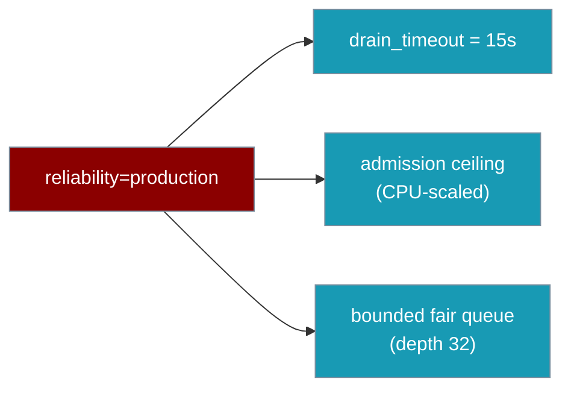
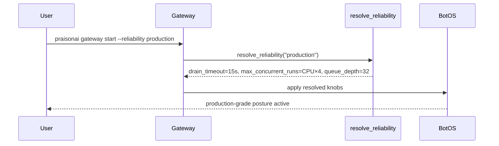
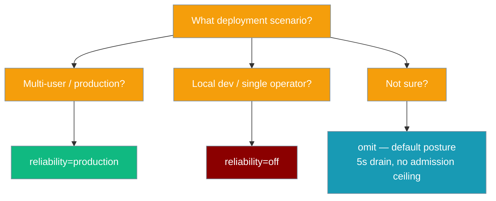

`reliability` is a single preset that composes graceful drain + inbound admission control across Python, YAML, and the CLI.

```python
from praisonaiagents import Agent
from praisonai.bots import BotOS

agent = Agent(name="Support", instructions="Help users")
bot = BotOS(agent=agent, platforms=["telegram", "discord"], reliability="production")
bot.run()
```



## Quick Start

<Steps>
<Step title="Python — one line">

```python
from praisonaiagents import Agent
from praisonai.bots import BotOS

agent = Agent(name="Support", instructions="Help users")
bot = BotOS(agent=agent, platforms=["telegram", "discord"], reliability="production")
bot.run()
```
</Step>

<Step title="YAML — top-level key">

```yaml
# gateway.yaml
reliability: production

agents:
  support:
    instructions: "Help users"
    model: gpt-4o-mini

channels:
  telegram:
    token: "${TELEGRAM_BOT_TOKEN}"
    routing:
      default: support
```

```bash
praisonai gateway start --config gateway.yaml
```
</Step>

<Step title="CLI flag">

```bash
praisonai gateway start --config gateway.yaml --reliability production
```

The CLI flag overrides the `reliability:` key in YAML.
</Step>
</Steps>

---

## How It Works



The `resolve_reliability` function fills in the knobs you have not set explicitly. Explicit values always win — the preset only touches what you left unset.

---

## Profiles

| Profile | `drain_timeout` | `max_concurrent_runs` | `queue_depth` | `overflow_policy` |
|---|---|---|---|---|
| `production` | `15.0` s | CPU-scaled: `max(4, min(32, cpu_count × 4))` | `32` | `queue` |
| `default` / `None` (implicit) | `5.0` s | `0` (disabled) | — | `reject` (unchanged) |
| `off` | `0.0` s | `0` (disabled) | — | `reject` (unchanged) |

<Note>
With no `reliability` and no explicit `drain_timeout`, the gateway now applies a **5-second graceful-drain window** by default (`default` posture). Use `reliability="off"` to restore immediate-teardown behaviour.
</Note>

---

## Choosing a Profile



| Scenario | Profile |
|---|---|
| Production multi-user deployment | `production` |
| Local dev / single operator / need immediate teardown | `off` |
| Anything else / not sure | omit (the implicit `default` posture) |

---

## Precedence Ladder

Explicit values always override the preset. The preset only fills in what is unset.

```
Instance > Explicit constructor fields > Preset > Default
```

```python
from praisonaiagents import Agent
from praisonai.bots import BotOS

agent = Agent(name="Support", instructions="Help users")

# Preset supplies 15s drain — but explicit 30s wins
bot = BotOS(
    agent=agent,
    platforms=["telegram"],
    reliability="production",
    drain_timeout=30.0,
)
bot.run()
```

```python
# Preset supplies CPU-scaled admission — but explicit ceiling wins
bot = BotOS(
    agent=agent,
    platforms=["telegram", "discord"],
    reliability="production",
    max_concurrent_runs=8,   # explicit ceiling; preset's CPU-scaled value is ignored
)
bot.run()
```

<Note>
Passing `max_concurrent_runs=` **or** an `admission_policy=` object treats admission as "explicit". The preset does not synthesise `max_concurrent_runs`, `queue_depth`, or `overflow_policy` in that case — your values win in full.
</Note>

---

## Common Patterns

**Kubernetes rolling deploy** — drain fits inside `terminationGracePeriodSeconds`:

```yaml
# kubernetes pod spec
terminationGracePeriodSeconds: 30

# gateway.yaml
reliability: production   # drain_timeout = 15s — well within the 30s budget
```

**Preset + explicit override** — custom drain window with all other production knobs:

```python
from praisonaiagents import Agent
from praisonai.bots import BotOS

agent = Agent(name="Support", instructions="Help users")

bot = BotOS(
    agent=agent,
    platforms=["telegram"],
    reliability="production",
    drain_timeout=30.0,   # 30s instead of the preset's 15s; admission knobs unchanged
)
bot.run()
```

**Local dev — immediate teardown** — matches pre-1.6.104 default behaviour:

```python
from praisonaiagents import Agent
from praisonai.bots import BotOS

agent = Agent(name="DevBot", instructions="Test locally")

bot = BotOS(agent=agent, platforms=["telegram"], reliability="off")
bot.run()
```

---

## Profile Name Rules

- Case- and whitespace-insensitive: `"Production"`, `"PRODUCTION "`, `"production"` are all equivalent.
- `""` or `"none"` normalise to `None` (the implicit `default` posture).
- Unknown profile names raise `ValueError` — fail-fast, not silent degrade.

```python
BotOS(agent=agent, reliability="Producton")  # ValueError — typo caught immediately
```

---

## Best Practices

<AccordionGroup>
<Accordion title="Default to production for multi-user deployments">
`reliability="production"` turns on a 15s drain window and a CPU-scaled admission ceiling with a bounded queue in a single setting. There is no need to tune `drain_timeout`, `max_concurrent_runs`, and `queue_depth` individually unless you have specific requirements.
</Accordion>

<Accordion title="Only use off when you need immediate-teardown behaviour">
`reliability="off"` restores the pre-1.6.104 default: no drain, no admission. This is correct for short-lived local scripts where an in-flight turn being cut on exit does not matter. Avoid it in production — users mid-turn will see an abrupt disconnect on every restart.
</Accordion>

<Accordion title="Keep drain_timeout slightly under terminationGracePeriodSeconds">
If your Kubernetes pod spec has `terminationGracePeriodSeconds: 30`, set `drain_timeout` (via the preset or explicitly) to `25` or less. This gives the gateway 25 seconds to finish in-flight turns and leaves a 5-second buffer for the process to exit cleanly before the kubelet force-kills it.
</Accordion>

<Accordion title="Explicit max_concurrent_runs disables the preset's synthesised admission">
If you pass `max_concurrent_runs=8` alongside `reliability="production"`, the preset does not add its CPU-scaled ceiling on top. Your value is treated as "explicit admission" and the preset leaves `queue_depth` and `overflow_policy` at your values too. Set them deliberately if you need a custom ceiling with a custom queue.
</Accordion>
</AccordionGroup>

---

## Related

<CardGroup cols={2}>
<Card title="Graceful Drain" icon="circle-stop" href="/docs/features/gateway-graceful-drain">
  Deep-dive into the drain phase, sequence diagram, and configuration reference
</Card>
<Card title="Admission Control" icon="gauge-high" href="/docs/features/gateway-admission-control">
  Concurrent run ceiling, fair queue, and overflow policies in detail
</Card>
<Card title="BotOS" icon="robot" href="/docs/features/botos">
  Multi-platform orchestrator that hosts the reliability preset
</Card>
<Card title="Gateway" icon="tower-broadcast" href="/docs/features/gateway">
  Full gateway architecture and feature overview
</Card>
</CardGroup>
