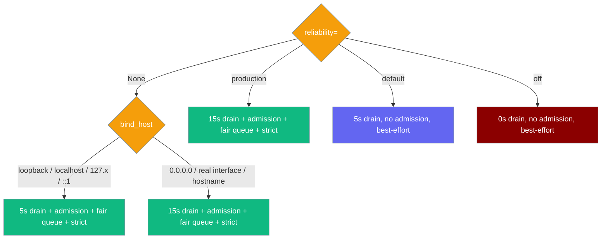
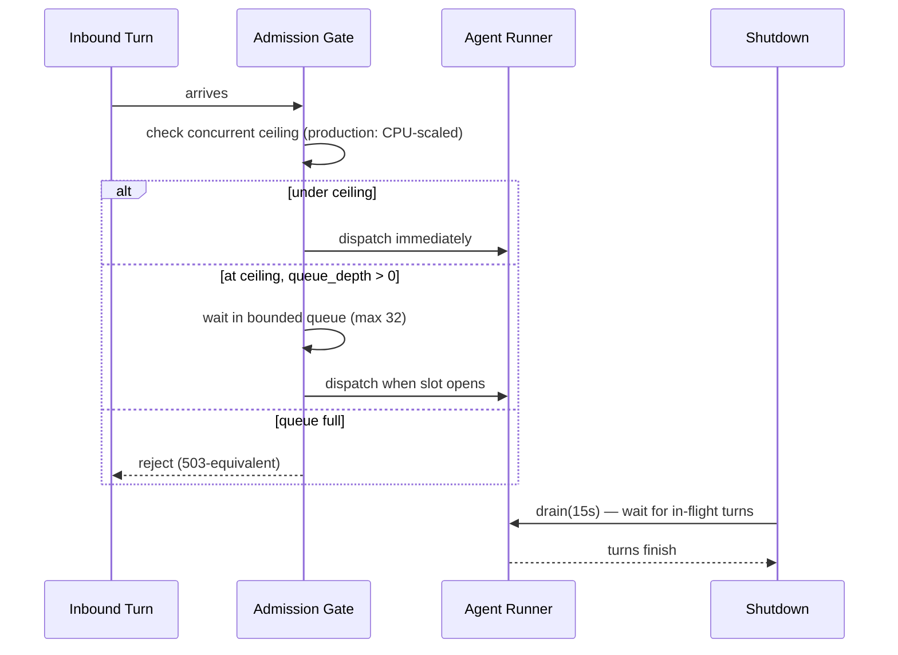
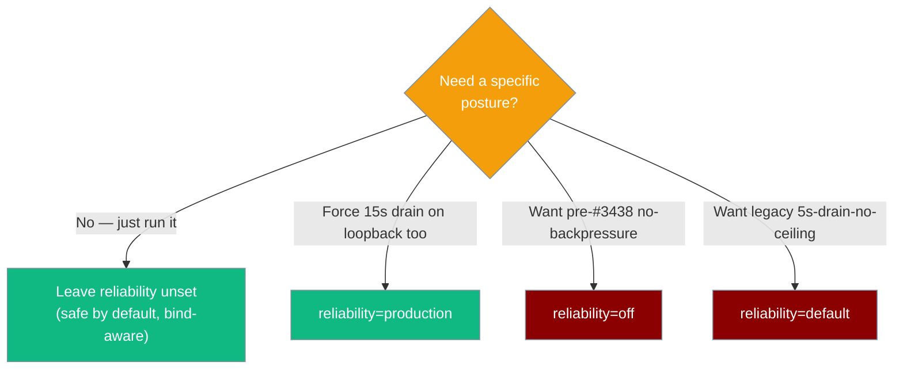

<Note>
The gateway now ships in the `praisonai-bot` package. `praisonai serve gateway` still works exactly as documented here; for a standalone install see [praisonai-bot Migration](/guides/praisonai-bot-migration).
</Note>

<Note>This page covers the **gateway reliability preset** (drain + admission). For task/workflow retry (retry jitter, `workflow_timeout`, `fail_on_callback_error`), see [Reliability](/features/reliability).</Note>

You now get backpressure by default. Leaving `reliability` unset gives you a bounded admission ceiling, a fair wait queue, strict outbound ordering, and a drain window sized to the bind — no argument required.

```python
from praisonaiagents import Agent
from praisonai_bot.bots.botos import BotOS

# Safe by default: admission ceiling + fair queue + drain, bind-aware.
BotOS(
    agent=Agent(name="SupportBot", instructions="Help users with support questions."),
    platforms=["telegram", "discord"],
)
```


```mermaid
graph TB
    R{reliability=} -->|None| B{bind_host}
    R -->|"production"| P[15s drain + admission + fair queue + strict]
    R -->|"default"| D[5s drain, no admission, best-effort]
    R -->|"off"| O[0s drain, no admission, best-effort]
    B -->|loopback / localhost / 127.x / ::1| SL[5s drain + admission + fair queue + strict]
    B -->|0.0.0.0 / real interface / hostname| SE[15s drain + admission + fair queue + strict]

    classDef q fill:#F59E0B,stroke:#7C90A0,color:#fff
    classDef input fill:#6366F1,stroke:#7C90A0,color:#fff
    classDef result fill:#10B981,stroke:#7C90A0,color:#fff
    classDef optout fill:#8B0000,stroke:#7C90A0,color:#fff

    class R,B q
    class SL,SE,P result
    class D input
    class O optout
```

<Warning>
Operators who deliberately want no-admission / no-drain behaviour must now ask for it explicitly. Pass `reliability="off"` (immediate teardown, no backpressure) or `reliability="default"` (5s drain, no ceiling) — leaving the knob unset no longer gives you the pre-safe posture (PraisonAI #3438).
</Warning>

## Quick Start

<Steps>

<Step title="Python (BotOS) — safe by default">

No `reliability=` argument needed — the gateway resolves a bounded admission ceiling, a fair queue, strict ordering, and a bind-aware drain:

```python
from praisonaiagents import Agent
from praisonai_bot.bots.botos import BotOS

BotOS(
    agent=Agent(name="SupportBot", instructions="Help users."),
    platforms=["telegram", "discord"],
).run()
```
</Step>

<Step title="Override specific knobs">

Explicit args always beat the preset — useful for canary deployments:

```python
BotOS(
    agent=Agent(name="SupportBot", instructions="Help users."),
    platforms=["telegram"],
    reliability="production",
    drain_timeout=30,          # override: 30s instead of preset 15s
)
```
</Step>

<Step title="YAML (gateway.yaml)">

```yaml
reliability: production
# or nested under gateway:
gateway:
  reliability: production
  max_concurrent_runs: 8   # explicit override still respected
```
</Step>

<Step title="CLI">

```bash
praisonai gateway start --config gateway.yaml --reliability production
```
</Step>

</Steps>

---

## Profiles

Four distinct postures — the unset posture is bind-aware, so it appears twice.

| Preset | Drain | Admission ceiling | Wait queue | Outbound ordering | When to use |
|--------|-------|-------------------|------------|-------------------|-------------|
| **Unset** (`reliability=None`, loopback bind) | 5 s | Yes (CPU-scaled) | Yes (bounded, fair) | `strict` | Local dev on `127.0.0.1` / `localhost` — safe by default |
| **Unset** (`reliability=None`, non-loopback bind) | 15 s | Yes (CPU-scaled) | Yes (bounded, fair) | `strict` | An actual deployment (`0.0.0.0`, real hostname) — full production posture is auto-picked |
| **`"production"`** (explicit) | 15 s | Yes (CPU-scaled) | Yes (bounded, fair) | `strict` | Explicitly ask for the production window regardless of bind |
| **`"default"`** (explicit) | 5 s | **No** | No | `best-effort` | Legacy behaviour — you know what you're doing and want the pre-#3438 shape |
| **`"off"`** | 0 s | **No** | No | `best-effort` | Explicit opt-out — immediate teardown, no backpressure. This is now the only way to get the pre-safe behaviour |

<Note>
`max_concurrent_runs` is CPU-scaled — `max(4, min(32, cpus × 4))`. On a 4-core machine that's 16 concurrent turns; on an 8-core machine, 32. The bounded fair queue uses `overflow_policy="queue"` in the safe posture. Unknown profile names fail fast with `ValueError`.
</Note>

<Warning>
`reliability="default"` and `reliability=None` used to be aliases. As of PraisonAI #3438 they are **distinct**: `"default"` is the explicit legacy posture (5s drain, no ceiling, best-effort ordering), while `None` is the new safe-by-default posture. A running deployment that upgrades and passes nothing will silently gain admission, a fair queue, strict ordering, and a bind-aware drain.
</Warning>

---

## What Each Knob Does


```mermaid
sequenceDiagram
    participant C as Inbound Turn
    participant G as Admission Gate
    participant A as Agent Runner
    participant S as Shutdown

    C->>G: arrives
    G->>G: check concurrent ceiling (production: CPU-scaled)
    alt under ceiling
        G->>A: dispatch immediately
    else at ceiling, queue_depth > 0
        G->>G: wait in bounded queue (max 32)
        G->>A: dispatch when slot opens
    else queue full
        G-->>C: reject (503-equivalent)
    end
    S->>A: drain(15s) — wait for in-flight turns
    A-->>S: turns finish
```

**Graceful drain** — on `BotOS.stop()`, the gateway quiesces ingress and waits for in-flight agent turns to finish before cancelling tasks. The drain window is the maximum time to wait.

**Inbound admission control** — caps the number of concurrent agent runs across all channels. Excess turns either queue (bounded fair wait) or are rejected immediately, depending on the `overflow_policy`.

---

## Precedence Ladder

Explicit constructor fields always win over the preset. Only fields left unset are filled by the preset.

```
CLI flag
  > constructor arg (drain_timeout=, max_concurrent_runs=, admission_policy=)
  > gateway.reliability YAML key
  > top-level reliability: YAML key
  > preset default
```

Example — preset sets drain to 15s, but explicit override wins:


```python
from praisonaiagents import Agent
from praisonai_bot.bots.botos import BotOS

BotOS(
    agent=Agent(name="SupportBot", instructions="Help users."),
    platforms=["telegram"],
    reliability="production",
    drain_timeout=30.0,  # 30s wins over preset's 15s
)
```

---

## Which Profile Should I Pick?

Most operators pick nothing — the unset posture is safe, and a non-loopback bind auto-selects the full production window.


```mermaid
graph TB
    Q1{Need a specific<br/>posture?}
    Q1 -->|No — just run it| Unset["Leave reliability unset<br/>(safe by default, bind-aware)"]
    Q1 -->|Force 15s drain on loopback too| Prod[reliability=production]
    Q1 -->|Want pre-#3438 no-backpressure| Off[reliability=off]
    Q1 -->|Want legacy 5s-drain-no-ceiling| Def[reliability=default]

    classDef pick fill:#10B981,stroke:#7C90A0,color:#fff
    classDef optout fill:#8B0000,stroke:#7C90A0,color:#fff
    classDef question fill:#F59E0B,stroke:#7C90A0,color:#fff

    class Unset,Prod pick
    class Off,Def optout
    class Q1 question
```

---

## What Changed on Restart

Before #3442, running the gateway the obvious way gave a no-backpressure deployment that cut in-flight turns on restart. The unset posture now drains gracefully, sized to the bind.

```mermaid
sequenceDiagram
    participant Op as Operator
    participant Gw as Gateway
    participant Ag as In-flight turn

    Note over Op: Before #3442
    Op->>Gw: praisonai gateway start (no reliability flag)
    Gw-->>Op: (no admission, 5s drain)
    Op->>Gw: rolling restart
    Gw-->>Ag: SIGTERM — turn cut mid-response ❌

    Note over Op: After #3442 (safe by default)
    Op->>Gw: praisonai gateway start --host 0.0.0.0
    Gw-->>Op: (admission ceiling + fair queue + 15s drain)
    Op->>Gw: rolling restart
    Gw-->>Ag: SIGTERM — drain window; turn completes ✅
```

---

## What It Does NOT Change

These are already default-on regardless of the reliability preset:

- Durable inbound journal (session level)
- Durable outbound outbox

Degraded-channel isolation is another default-on opt-out from fail-closed behaviour, independent of the reliability preset: one channel's unavailable credential isolates just that channel instead of aborting the gateway. See [Degraded Channel Isolation](/features/gateway-degraded-channels).

Cross-instance Redis pub/sub is self-healing: on connection loss the adapter reconnects with bounded backoff and surfaces the outage via `route:redis-pubsub` in `degraded_owners`. See [Real-Time Push Notifications → HA & cross-instance delivery](/features/push-notifications#ha--cross-instance-delivery).

---

## Best Practices

<AccordionGroup>

<Accordion title="Pass nothing — the default is already safe">
Leaving `reliability` unset gives you a bounded admission ceiling, a fair wait queue, strict ordering, and a bind-aware drain. On a non-loopback bind that resolves to the full production window automatically, so most deployments need no `reliability=` argument.
</Accordion>

<Accordion title="Force production to get the 15s window even on loopback">

`reliability="production"` pins the 15 s drain regardless of bind. Use it when you test on `127.0.0.1` but want the same drain window a real deployment gets. Pair with a process manager that sends `SIGTERM` on deploy.
</Accordion>

<Accordion title="I want the pre-#3438 behaviour back">

Pass `reliability="off"` for immediate teardown with no admission, or `reliability="default"` for a 5 s drain with no ceiling. `off` also forces [`gateway.durable_runs`](/features/gateway-durable-runs) **off** — the explicit escape hatch to the zero-overhead path. Neither is a recommended default.
</Accordion>

<Accordion title="Handle admission rejection and a slower restart when upgrading">
Two behaviours change observably once the unset posture becomes safe: a burst that used to fan out unboundedly now queues (or rejects when the queue is full), and a `SIGTERM`-then-kill loop now waits 5–15 s for in-flight turns. Downstream code that assumed the gateway never says no, and deploy scripts that expected sub-second restarts, need to account for both.
</Accordion>

<Accordion title="Override individual knobs when needed">

If the preset drain window or admission ceiling doesn't fit your load, pass `drain_timeout=` or `max_concurrent_runs=` directly — they always take precedence over the preset. See the [Graceful Drain](/features/gateway-graceful-drain) and [Admission Control](/features/gateway-admission-control) pages for the full knob reference.
</Accordion>

</AccordionGroup>

---

## Related

<CardGroup cols={2}>
<Card title="Gateway Graceful Drain" icon="hourglass" href="/features/gateway-graceful-drain">
  Drain-only knob — fine-grained drain control without the full preset
</Card>
<Card title="Gateway Admission Control" icon="traffic-cone" href="/features/gateway-admission-control">
  Concurrency ceiling, fair queue — and memory-aware backpressure with `max_rss_mb`
</Card>
<Card title="Memory-Pressure Eviction" icon="memory" href="/features/gateway-memory-pressure-eviction">
  Reclaims memory from idle warm caches on cgroup-aware Linux hosts with a persistent store — no config required
</Card>
<Card title="Config Reload" icon="arrows-rotate" href="/features/gateway-config-reload">
  Hot-reload gateway.yaml without dropping in-flight turns
</Card>
<Card title="Reliability" icon="rotate-ccw" href="/features/reliability">
  Task/workflow retry jitter and failure policies
</Card>
<Card title="Event-Loop Watchdog" icon="stethoscope" href="/features/gateway-loop-watchdog">
  Detect a wedged asyncio loop and restart before it becomes a zombie
</Card>
<Card title="Pressure Telemetry" icon="gauge-high" href="/features/gateway-pressure-telemetry">
  Observe whether the drain + admission preset is holding — admission, queues and loop-lag on `health()`
</Card>
</CardGroup>
