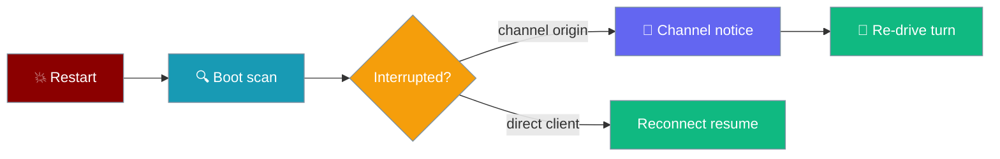
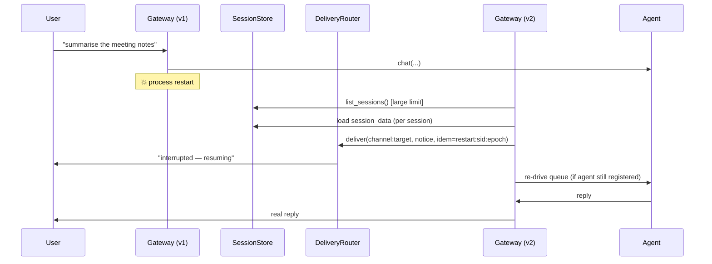

On boot, the gateway resumes turns that were in-flight when the previous process stopped — and proactively tells channel users what happened, so a Telegram or Slack user never sits in silence after a restart.



<Note>
Channel-originated sessions (Slack/Discord/Telegram) get this server-initiated notice. Direct-client sessions keep resuming via the client's own reconnect + `since` cursor — see [Session Continuity](/docs/features/gateway-session-continuity#reconnect-and-auto-resume).
</Note>

## Quick Start

<Steps>

<Step title="Start with an agent">

```python
from praisonaiagents import Agent

agent = Agent(name="assistant", instructions="Be helpful.")
# Restart continuation activates automatically when session persistence is on.
# No extra flags — see the gateway.yaml step below.
```

</Step>

<Step title="Enable session persistence (the only opt-in)">

```yaml
# gateway.yaml
gateway:
  session:
    persist: true
```

```bash
praisonai gateway start --config gateway.yaml
```

</Step>

<Step title="What a channel user sees">

After a restart interrupts their request, the originating channel receives:

```text
I was interrupted by a restart - resuming your request. If you don't get a reply shortly, please resend.
```

</Step>

<Step title="What operators see">

The boot scan logs a one-line summary:

```text
INFO  Resumed 1 interrupted turn(s) on boot
```

</Step>

</Steps>

---

## How It Works

On boot — before serving new traffic — the gateway scans persisted sessions, notifies the originating channel of any interrupted turn, and re-drives it when the agent is still registered.



The whole scan is wrapped in a `try / except` at the `start()` site — a failure in the resume loop never blocks the gateway from serving new traffic.

---

## What Triggers a Resume

A persisted session is resumed when all of these hold:

- `is_executing == True` **or** `pending_inbox` is non-empty (a turn was in flight).
- `channel_target` is set on the persisted snapshot — channel-originated only; direct-client sessions resume via reconnect.
- A durable session store is configured (the scan is a no-op without one).

---

## The Notice Contract

The originating channel receives one verbatim message per interruption:

```text
I was interrupted by a restart - resuming your request. If you don't get a reply shortly, please resend.
```

<Note>
**Exactly-once.** The notice is delivered through the durable delivery router with an idempotency key `restart:<session_id>:<run_epoch>`, where `run_epoch` is the `event_cursor` at persist time. The router's idempotency store survives restart, so a **crash loop** (boot → notice → crash → boot) notifies the originating channel **at most once per interruption**. This is why the router path is used instead of a bare `bot.send_message()`.
</Note>

**Fallback when the delivery router is unavailable.** If `WebSocketGateway.delivery_router` is `None`, the notice falls back to `bot.send_message(target, text)` via `get_channel_bot(channel)` — best-effort, **no idempotency**. If you disable the delivery router, you also opt out of exactly-once: an ill-configured deployment can double-notify on a crash loop.

---

## `channel_target` on Persisted Sessions

<Note>
`channel_target` is a `"channel:target"` string (for example `"telegram:12345"`) recording where to notify a channel user after a restart.

- **Set by the channel adapter** at inbound time via `session.set_channel_target("telegram:12345")`.
- **Round-trips** through `to_dict`/`from_dict`; backward-compatible — `None` for sessions created before the field existed and for direct-client sessions.
- **Fallback:** when the explicit target is absent, it derives from `client_id` **iff** `client_id` itself encodes a `channel:target` origin (contains a `:`). This makes the field a live consumer of existing state — it matters for operators upgrading with in-flight sessions the setter never touched.
</Note>

The persisted snapshot gains one field (default `None`):

```json
{
  "session_id": "...",
  "messages": [],
  "events": [],
  "event_cursor": 42,
  "pending_inbox": ["..."],
  "is_executing": true,
  "channel_target": "telegram:12345"
}
```

---

## Best-Effort Re-drive

Whether the turn actually resumes depends on the agent still being registered on the fresh process.

- **Agent still registered** (same `agent_id` in the config) → the session is rehydrated and `_run_session_queue` restarts, so a real reply follows the notice.
- **Agent no longer registered** (removed from the config) → the notice above still fires, and its wording already asks the user to resend. No exception, no crash-loop.

<Tip>
Treat the re-drive as a nice-to-have, not the contract. The notice already asks users to resend if no reply arrives.
</Tip>

---

## Configuration Options

No new user-facing config flags. The feature is enabled transitively by the presence of:

| Requirement | How it's provided |
|-------------|-------------------|
| Durable session store | `gateway.session.persist: true` |
| `channel_target` on the snapshot | Set automatically by supported adapters (Slack/Discord/Telegram) at inbound time |
| Delivery router | Provided by the standalone bot gateway; disabling it opts out of exactly-once |

No operator action is required to opt in beyond enabling session persistence — the feature is on by default when persistence is on.

```yaml
# gateway.yaml
gateway:
  session:
    persist: true
```

---

## Operator Observability

Search a log stream for these lines to find this behaviour:

| Log line | Level | Meaning |
|----------|-------|---------|
| `Resumed N interrupted turn(s) on boot` | INFO | Success summary at end of scan |
| `channel_target '<x>' must be 'channel:target'; skipping notice` | WARN | Malformed origin — check adapter code |
| `No channel bot '<channel>' for restart notice` | WARN | Router fallback can't find a bot for that channel |
| `Failed to resume interrupted turns on boot` | EXCEPTION | Scan errored — gateway continues serving |

The boot scan calls `list_sessions()` with an explicit large limit, so interrupted turns beyond the store's default 50-session pagination window are **not** silently skipped.

---

## Common Patterns

Two deployment scenarios where restart continuation changes behaviour.

**Rolling restarts.** Restart continuation makes rolling deploys safer for channel users, provided session persistence is on and the delivery router is shared across instances.

**Deliberate maintenance drop.** To swallow all in-flight work on a restart (for example, a schema migration invalidates the persisted format), turn off `gateway.session.persist` for that boot — the scan is a no-op without a store.

---

## Best Practices

<AccordionGroup>

<Accordion title="Enable session persistence if you have channel users">
The feature is a no-op without a durable store. Set `gateway.session.persist: true`.
</Accordion>

<Accordion title="Keep the delivery router on if you use channels">
The fallback path is best-effort, not exactly-once. A crash loop can double-notify when the router is disabled.
</Accordion>

<Accordion title="Watch the boot scan log line">
A non-zero `Resumed N` count on every boot signals that something upstream is crashing regularly.
</Accordion>

<Accordion title="Don't rely on re-drive alone">
If the agent was removed from the config, the turn can't re-drive. The notice already asks users to resend — treat re-drive as a nice-to-have.
</Accordion>

<Accordion title="Size the session store paginator">
The scan uses an explicit large limit so the default 50-session window doesn't hide interrupted sessions, but very large stores still benefit from ordering by recency.
</Accordion>

</AccordionGroup>

---

## Related

<CardGroup cols={2}>
  <Card title="Session Continuity" icon="shield-check" href="/docs/features/gateway-session-continuity">
    Client-initiated reconnect resume — the sibling capability
  </Card>
  <Card title="Session Persistence" icon="database" href="/docs/features/gateway-session-persistence">
    The persistence layer this feature rides on
  </Card>
  <Card title="Undelivered Notice" icon="bell" href="/docs/features/gateway-undelivered-notice">
    Peer user-facing message when something went wrong
  </Card>
  <Card title="Approval Durability" icon="clock-rotate-left" href="/docs/features/gateway-approval-durability">
    The durable rehydrate-on-boot pattern this feature mirrors
  </Card>
</CardGroup>
