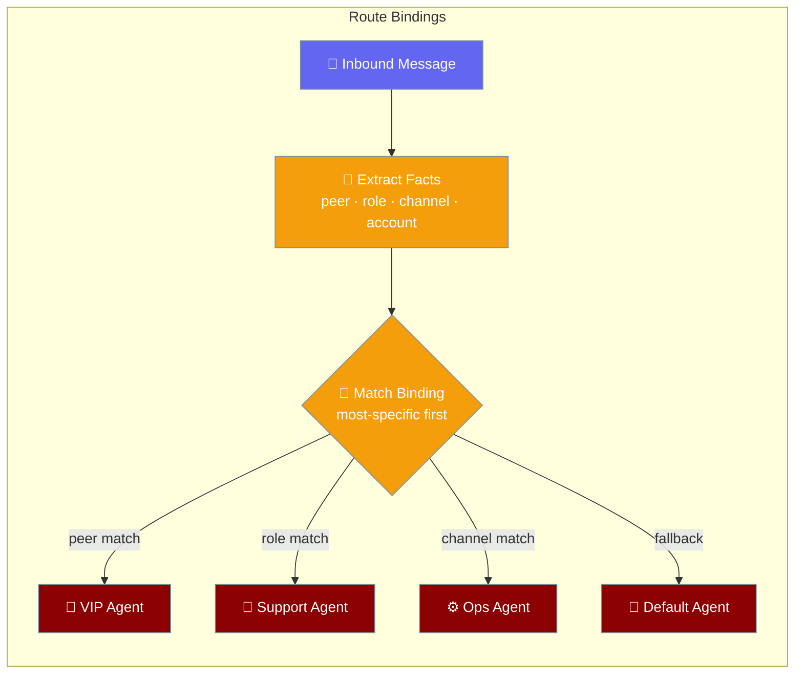
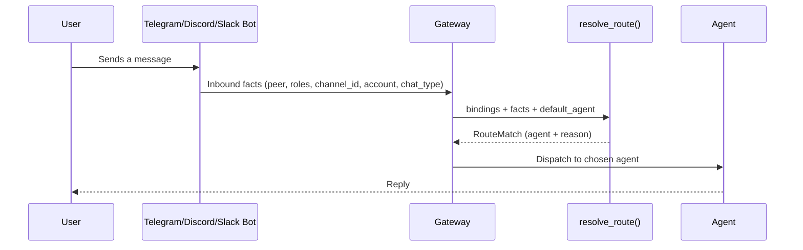
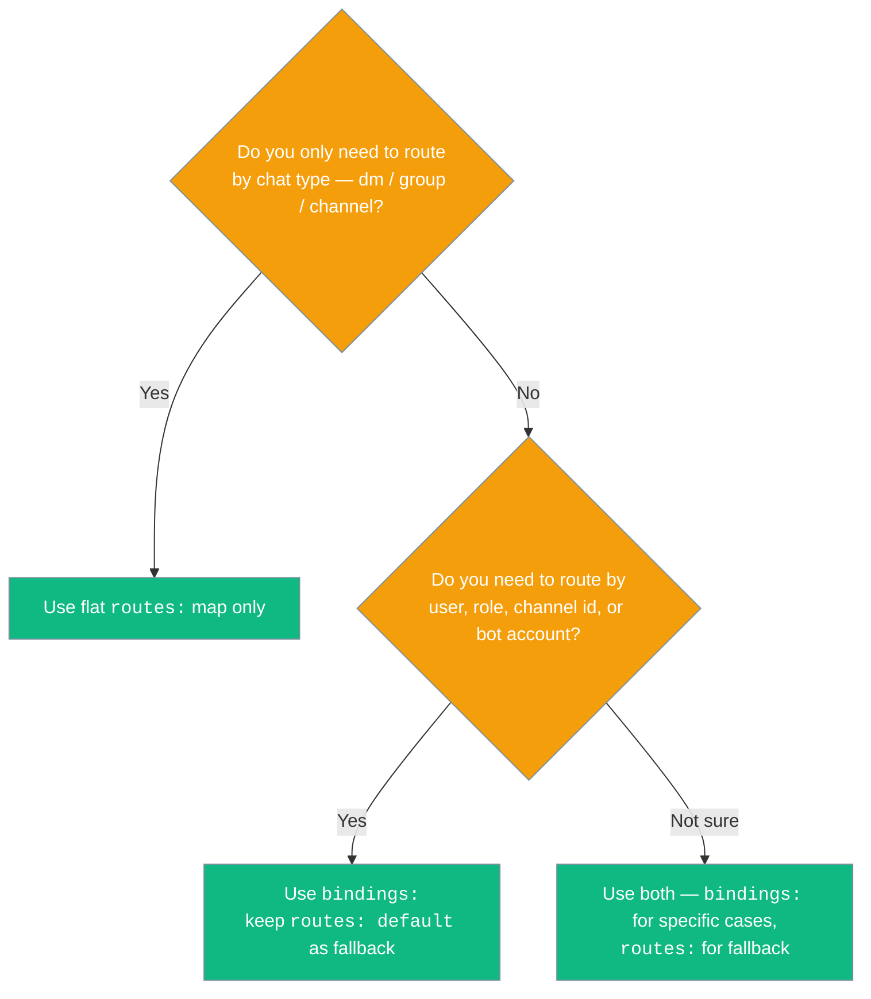

Route bindings let one gateway send the right message to the right agent — by who sent it, what role they have, which channel it landed in, or which bot account received it.



## Quick Start

<Steps>
<Step title="Send everyone to one agent (baseline)">

Start with a single default route — no bindings needed.

```yaml
agents:
  general:
    instructions: "You are a helpful assistant"
    model: gpt-4o-mini

channels:
  telegram:
    token: ${TELEGRAM_BOT_TOKEN}
    routes:
      default: general
```

</Step>

<Step title="Send one VIP user to a dedicated agent">

Add a `bindings:` entry with `peer:` set to the user's Telegram numeric id. The VIP agent handles that user; everyone else still goes to `general`.

```yaml
agents:
  general:
    instructions: "You are a helpful assistant"
    model: gpt-4o-mini
  vip:
    instructions: "You are the VIP concierge."
    model: gpt-4o

channels:
  telegram:
    token: ${TELEGRAM_BOT_TOKEN}
    routes:
      default: general
    bindings:
      - { peer: "12345678", agent: vip }
```

</Step>

<Step title="Mix peer, role, channel, and chat-type">

Stack multiple bindings — the most specific rule wins automatically.

```yaml
channels:
  telegram:
    token: ${TELEGRAM_BOT_TOKEN}
    routes:
      default: general
    bindings:
      - { peer: "12345678", agent: vip }
      - { role: support, agent: support }
      - { channel_id: "-100999", agent: ops }
      - { chat_type: dm, agent: assistant }
```

A user with id `12345678` always gets `vip`. A support-role member who DMs the bot gets `support` (role beats chat type). The `ops` channel routes to the ops agent. All other DMs go to `assistant`. Everything else falls back to `general`.

</Step>

<Step title="Restrict tools by trust tier">

Add `trust:` to any binding to scope the toolset the model sees — strangers get a safe subset, your operator keeps full power.

```yaml
gateway:
  routes:
    - { chat_type: dm, agent: assistant, trust: untrusted }       # safe subset for strangers
    - { peer: "operator-123", agent: assistant, trust: trusted }  # full toolset for the operator
    - { channel_id: "ops", agent: assistant, deny_tools: [shell, delete_file] }
```

See [Gateway Tool Policy](/docs/features/gateway-tool-policy) for the full security reference.

</Step>
</Steps>

---

## How It Works



The gateway resolves the target agent in four deterministic steps:

| Step | What the gateway does |
|------|----------------------|
| 1 | Extracts `peer`, `roles`, `channel_id`, `account`, `chat_type` from the inbound message |
| 2 | Tries every `bindings:` rule, keeps only the ones that match |
| 3 | Sorts surviving matches: higher `priority` wins, then higher specificity, then declaration order |
| 4 | If no binding matches, falls back to `routes[chat_type]`, then `routes["default"]`, then the literal agent id `"default"` |

---

## Routes vs Bindings



---

## Configuration Options

Each entry in the `bindings:` list is a `RouteBinding`:

| Field | Type | Default | Description |
|-------|------|---------|-------------|
| `agent` | `str` | _required_ | Agent id to route to when this binding matches |
| `chat_type` | `Optional[str]` | `None` | `"dm"` \| `"group"` \| `"channel"` |
| `peer` | `Optional[str]` | `None` | Sender/user id (most specific) |
| `role` | `Optional[str]` | `None` | Role / guild-role membership of the sender |
| `channel_id` | `Optional[str]` | `None` | Specific chat/channel id |
| `account` | `Optional[str]` | `None` | Receiving bot account (multi-account channels) |
| `priority` | `int` | `0` | Higher wins; ties broken by specificity then declaration order |
| `trust` | `Optional[str]` | `None` | Trust tier — `"untrusted"` \| `"standard"` \| `"trusted"`. `untrusted` applies a conservative deny-list (no shell, no file mutation, no delegation, no self-scheduling). **Unknown values fail closed to `untrusted`**. |
| `allow_tools` | `Optional[List[str]]` | `None` | Only these tool names are exposed on this route. Accepts a YAML scalar or list. |
| `deny_tools` | `Optional[List[str]]` | `None` | Tool names removed before the run on this route. Layers on top of the trust tier's deny-list. Accepts a YAML scalar or list. |

All non-`None` conditions in a binding must match the inbound message for that binding to apply. A binding with no conditions always matches.

**Specificity weights** — when two bindings both match, the one with the higher total specificity wins:

| Field | Specificity weight |
|-------|--------------------|
| `peer` | 16 (most specific) |
| `role` | 8 |
| `channel_id` | 8 |
| `account` | 4 |
| `chat_type` | 2 |

Ties on `(priority, specificity)` are broken by **declaration order** — the first matching binding in your list wins.

---

## Common Patterns

```python
from praisonaiagents import Agent
from praisonaiagents.gateway import RouteBinding, RouteFacts, resolve_route

vip = Agent(name="vip", instructions="You are the VIP concierge.")
general = Agent(name="general", instructions="You are the general assistant.")

bindings = [
    RouteBinding(agent="vip", peer="12345678"),
    RouteBinding(agent="general", chat_type="dm"),
]

facts = RouteFacts(chat_type="dm", peer="12345678")
match = resolve_route(bindings, facts, default_agent="general")

print(match.agent)   # "vip"
print(match.reason)  # "matched binding (priority=0, specificity=16)"
```

**VIP customer gets a dedicated agent**

```yaml
channels:
  telegram:
    token: ${TELEGRAM_BOT_TOKEN}
    routes:
      default: general
    bindings:
      - { peer: "12345678", agent: vip }
```

**Support-role members (Discord) get the support agent; everyone else gets general**

```yaml
channels:
  discord:
    token: ${DISCORD_BOT_TOKEN}
    routes:
      default: general
    bindings:
      - { role: support, agent: support }
```

**Force an override regardless of specificity using `priority`**

```yaml
channels:
  telegram:
    token: ${TELEGRAM_BOT_TOKEN}
    routes:
      default: general
    bindings:
      - { peer: "12345678", agent: vip }
      - { chat_type: dm, agent: incident_responder, priority: 100 }
```

The `incident_responder` binding has `priority: 100` so it wins over the `peer` match for user `12345678`, even though `peer` has higher specificity. Use this for incident-mode overrides.

**Lock down stranger DMs while keeping operator at full power**

```yaml
channels:
  telegram:
    token: ${TELEGRAM_BOT_TOKEN}
    routes:
      default: assistant
    bindings:
      - { chat_type: dm, agent: assistant, trust: untrusted }
      - { peer: "operator-123", agent: assistant, trust: trusted }
```

Strangers who DM the bot never see shell, file-mutation, delegation, or scheduling tools. Your operator (`peer: "operator-123"`) retains the full toolset. See [Gateway Tool Policy](/docs/features/gateway-tool-policy) for the complete security reference.

---

## Best Practices

<AccordionGroup>

<Accordion title="Always declare a default in routes:">
Bindings are evaluated first, but `routes.default` is the safety net when nothing matches. Without it, unmatched messages silently go to an agent named `"default"` — which may not exist.

```yaml
routes:
  default: general   # always include this
bindings:
  - { peer: "12345678", agent: vip }
```
</Accordion>

<Accordion title="Prefer specificity over priority">
Let the resolver pick by specificity — `peer` beats `role` beats `channel_id` beats `account` beats `chat_type`. Reach for `priority` only when you genuinely need to override, such as an incident-mode binding that must win regardless of user identity.
</Accordion>

<Accordion title="Use stable peer and channel ids">
Telegram numeric ids and Discord channel ids are stable. Display names and usernames change. Use the numeric id from the platform — never a username or handle.
</Accordion>

<Accordion title="Keep bindings short and reviewable">
If your list grows past ~10 entries, consider grouping users by role at the platform level and binding on `role` instead of individual `peer` ids. A long list of peer bindings is hard to audit and easy to break.
</Accordion>

</AccordionGroup>

---

## Related

<CardGroup cols={2}>
  <Card title="Bot Message Routing" icon="route" href="/docs/features/bot-routing">
    The simpler chat-type routing surface — route by dm, group, or channel.
  </Card>
  <Card title="Multi-Channel Bots" icon="network-wired" href="/docs/features/multi-channel-bots">
    Run one bot per role on the same platform using multiple channel entries.
  </Card>
  <Card title="Gateway Tool Policy" icon="shield-check" href="/docs/features/gateway-tool-policy">
    Full reference for trust-tiered toolset scoping — keep stranger DMs from running shell on your server.
  </Card>
  <Card title="Approval" icon="shield" href="/docs/features/approval">
    Second line of defence — require human confirmation before risky tools run.
  </Card>
</CardGroup>
