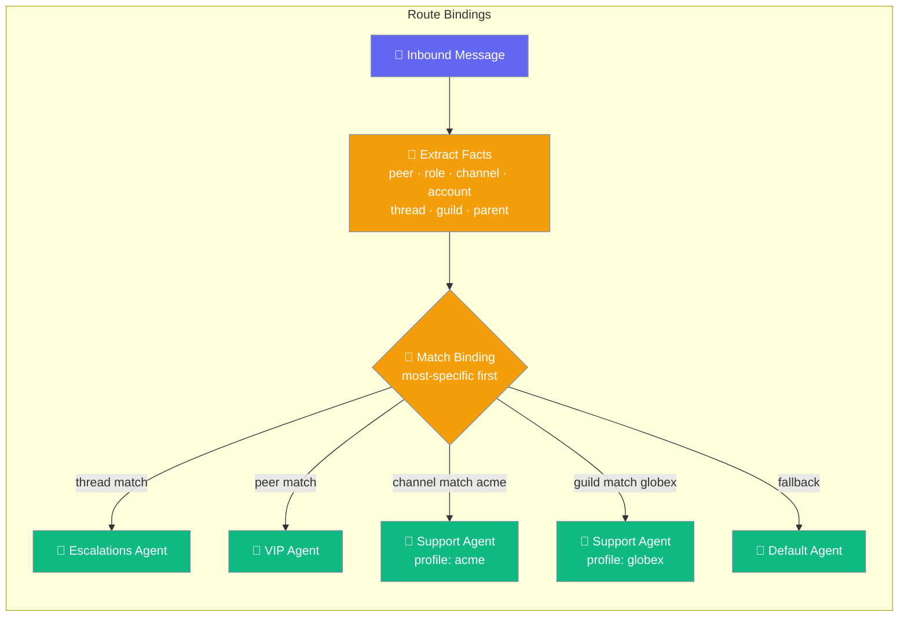
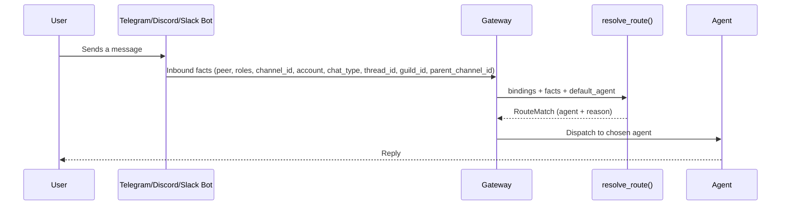
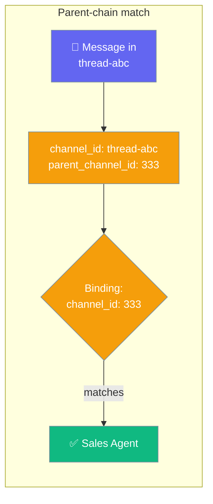
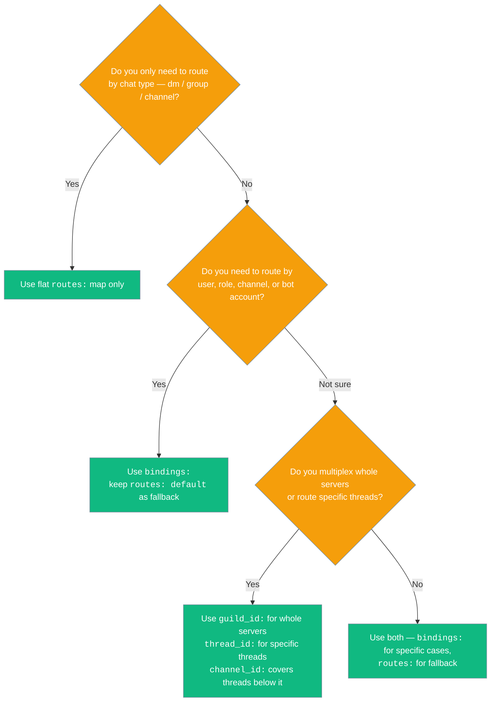
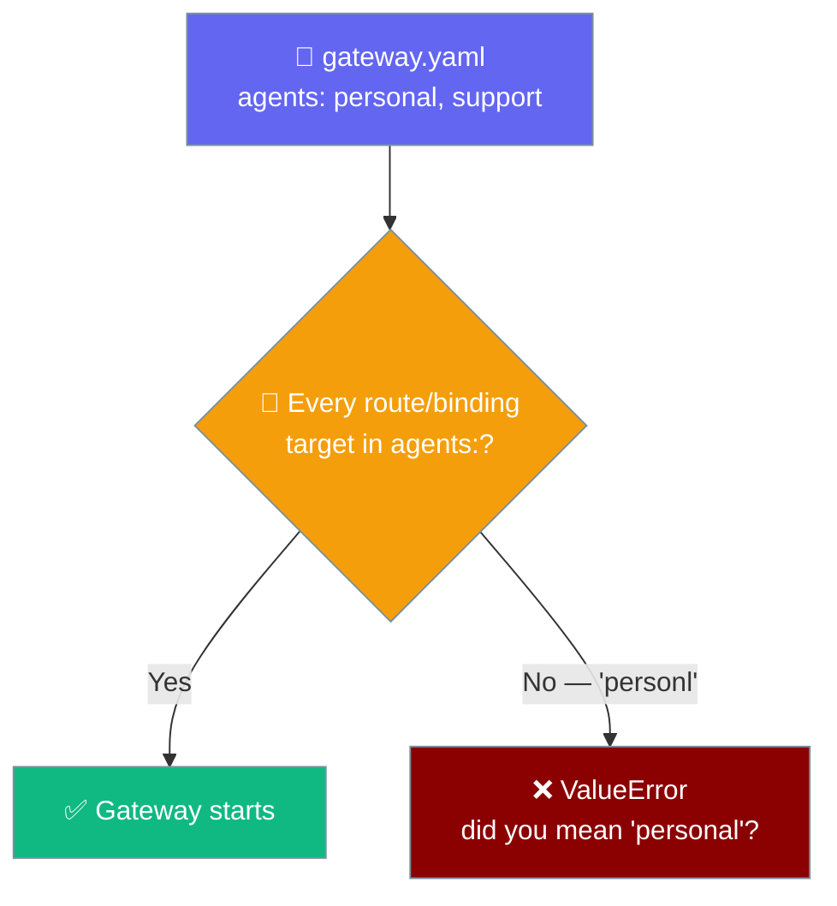

<Note>
The gateway now ships in the `praisonai-bot` package. `praisonai serve gateway` still works exactly as documented here; for a standalone install see [praisonai-bot Migration](/guides/praisonai-bot-migration).
</Note>


```python
from praisonaiagents import Agent

vip_agent = Agent(name="vip-agent", instructions="Handle VIP user requests with priority.")
support_agent = Agent(name="support", instructions="Handle general support queries.")
vip_agent.start("Route messages from user 123 to me, all others to support.")
```

Route bindings let one gateway send the right message to the right agent — by who sent it, what role they have, which channel it landed in, or which bot account received it.

The user messages a channel; route bindings map that channel to the correct agent or workflow.


```mermaid
graph LR
    subgraph "Route Bindings"
        Msg[📩 Inbound Message] --> Facts[🧠 Extract Facts<br/>peer · role · channel · account<br/>thread · guild · parent]
        Facts --> Resolve{🎯 Match Binding<br/>most-specific first}
        Resolve -->|thread match| Escal[🎯 Escalations Agent]
        Resolve -->|peer match| VIP[👑 VIP Agent]
        Resolve -->|channel match acme| Acme[🛟 Support Agent<br/>profile: acme]
        Resolve -->|guild match globex| Globex[🛟 Support Agent<br/>profile: globex]
        Resolve -->|fallback| Default[🤖 Default Agent]
    end

    classDef input fill:#6366F1,stroke:#7C90A0,color:#fff
    classDef process fill:#F59E0B,stroke:#7C90A0,color:#fff
    classDef agent fill:#10B981,stroke:#7C90A0,color:#fff

    class Msg input
    class Facts,Resolve process
    class Escal,VIP,Acme,Globex,Default agent

```

## Quick Start

<Steps>
<Step title="Send everyone to one agent (baseline)">

Start with a single default route — no bindings needed.

```yaml
agents:
  general:
    instructions: "You are a helpful assistant"
    model: gpt-4o-mini

channels:
  telegram:
    token: ${TELEGRAM_BOT_TOKEN}
    routes:
      default: general
```

</Step>

<Step title="Send one VIP user to a dedicated agent">

Add a `bindings:` entry with `peer:` set to the user's Telegram numeric id. The VIP agent handles that user; everyone else still goes to `general`.

```yaml
agents:
  general:
    instructions: "You are a helpful assistant"
    model: gpt-4o-mini
  vip:
    instructions: "You are the VIP concierge."
    model: gpt-4o

channels:
  telegram:
    token: ${TELEGRAM_BOT_TOKEN}
    routes:
      default: general
    bindings:
      - { peer: "12345678", agent: vip }
```

</Step>

<Step title="Mix peer, role, channel, and chat-type">

Stack multiple bindings — the most specific rule wins automatically.

```yaml
channels:
  telegram:
    token: ${TELEGRAM_BOT_TOKEN}
    routes:
      default: general
    bindings:
      - { peer: "12345678", agent: vip }
      - { role: support, agent: support }
      - { channel_id: "-100999", agent: ops }
      - { chat_type: dm, agent: assistant }
```

A user with id `12345678` always gets `vip`. A support-role member who DMs the bot gets `support` (role beats chat type). The `ops` channel routes to the ops agent. All other DMs go to `assistant`. Everything else falls back to `general`.

</Step>

<Step title="Route a whole Discord server to one tenant">

Bind one `guild_id:` and every current and future channel in that server routes to the same agent.

```yaml
channels:
  discord:
    token: ${DISCORD_BOT_TOKEN}
    routes:
      default: general
    bindings:
      - { guild_id: "9001", agent: support, profile: acme }
```

A single rule handles every channel in the guild — no need to list them all, and new channels are covered automatically.

</Step>

<Step title="Send one support thread to a specialist">

Layer a `thread_id:` binding on top of a channel or guild binding — a thread rule beats them both.

```yaml
channels:
  discord:
    token: ${DISCORD_BOT_TOKEN}
    routes:
      default: general
    bindings:
      - { guild_id: "9001", agent: support, profile: acme }
      - { channel_id: "333", agent: sales,  profile: acme }    # also covers threads under 333
      - { thread_id: "77",  agent: escalations, profile: acme } # one thread beats the channel rule
```

A thread rule beats a channel or guild rule — the specialist agent picks up messages in that one thread, everything else falls through.

</Step>

<Step title="Restrict tools by trust tier">

Add `trust:` to any binding to scope the toolset the model sees — strangers get a safe subset, your operator keeps full power.

```yaml
gateway:
  routes:
    - { chat_type: dm, agent: assistant, trust: untrusted }       # safe subset for strangers
    - { peer: "operator-123", agent: assistant, trust: trusted }  # full toolset for the operator
    - { channel_id: "ops", agent: assistant, deny_tools: [shell, delete_file] }
```

See [Gateway Tool Policy](/features/gateway-tool-policy) for the full security reference.

</Step>

<Step title="Isolate tenants with a per-route profile">

Add `profile:` to any binding to enter a per-route memory namespace — the same support agent serves two customers with completely separate conversation histories.

```yaml
channels:
  telegram:
    token: ${TELEGRAM_BOT_TOKEN}
    routes:
      default: general
    bindings:
      - { channel_id: "-100acme",   agent: support, profile: acme   }
      - { channel_id: "-100globex", agent: support, profile: globex }
```

The gateway reads `RouteMatch.profile` and keys the turn's memory/session state off the name, so each tenant's transcript is stored separately (secret-scope and home isolation are follow-ups, not yet live — see [Gateway Tenant Profiles](/features/gateway-tenant-profile)). An unmatched route carries `profile=None` and stays unscoped, so misrouted traffic never leaks into another tenant.

</Step>
</Steps>

---

## How It Works


```mermaid
sequenceDiagram
    participant User
    participant Bot as Telegram/Discord/Slack Bot
    participant Gateway
    participant Resolver as resolve_route()
    participant Agent

    User->>Bot: Sends a message
    Bot->>Gateway: Inbound facts (peer, roles, channel_id, account, chat_type, thread_id, guild_id, parent_channel_id)
    Gateway->>Resolver: bindings + facts + default_agent
    Resolver-->>Gateway: RouteMatch (agent + reason)
    Gateway->>Agent: Dispatch to chosen agent
    Agent-->>User: Reply
```

The gateway resolves the target agent in four deterministic steps:

| Step | What the gateway does |
|------|----------------------|
| 1 | Extracts `peer`, `roles`, `channel_id`, `account`, `chat_type`, `thread_id`, `guild_id`, `parent_channel_id` from the inbound message |
| 2 | Tries every `bindings:` rule, keeps only the ones that match |
| 3 | Sorts surviving matches: higher `priority` wins, then higher specificity, then declaration order |
| 4 | If no binding matches, falls back to `routes[chat_type]`, then `routes["default"]`, then the literal agent id `"default"` |

---

## Parent-chain matching

A `channel_id` condition now matches the channel itself **and** any thread/forum-post whose parent is that channel — one channel rule naturally covers the conversations beneath it.


```mermaid
graph LR
    subgraph "Parent-chain match"
        Msg[📩 Message in<br/>thread-abc] --> Facts[channel_id: thread-abc<br/>parent_channel_id: 333]
        Facts --> Rule{Binding:<br/>channel_id: 333}
        Rule -->|matches| Agent[✅ Sales Agent]
    end

    classDef input fill:#6366F1,stroke:#7C90A0,color:#fff
    classDef process fill:#F59E0B,stroke:#7C90A0,color:#fff
    classDef ok fill:#10B981,stroke:#7C90A0,color:#fff

    class Msg input
    class Facts,Rule process
    class Agent ok
```

If you want a specific thread to escape the parent's route, add a `thread_id:` binding — it beats the channel/guild rule via specificity.

A legacy `channel_id`-only binding still resolves exactly as before — parent-chain only widens what it matches, never narrows.

---

## Routes vs Bindings


```mermaid
graph TD
    Q1{Do you only need to route<br/>by chat type — dm / group / channel?}
    Q1 -->|Yes| Routes[Use flat <code>routes:</code> map only]
    Q1 -->|No| Q2{Do you need to route by<br/>user, role, channel, or bot account?}
    Q2 -->|Yes| Bindings[Use <code>bindings:</code><br/>keep <code>routes: default</code> as fallback]
    Q2 -->|Not sure| Q3{Do you multiplex whole servers<br/>or route specific threads?}
    Q3 -->|Yes| ThreadGuild[Use <code>guild_id:</code> for whole servers<br/><code>thread_id:</code> for specific threads<br/><code>channel_id:</code> covers threads below it]
    Q3 -->|No| Both[Use both — <code>bindings:</code> for specific cases,<br/><code>routes:</code> for fallback]

    classDef question fill:#F59E0B,stroke:#7C90A0,color:#fff
    classDef answer fill:#10B981,stroke:#7C90A0,color:#fff
    class Q1,Q2,Q3 question
    class Routes,Bindings,ThreadGuild,Both answer
```

---

## Configuration Options

Each entry in the `bindings:` list is a `RouteBinding`:

| Field | Type | Default | Description |
|-------|------|---------|-------------|
| `agent` | `str` | _required_ | Agent id to route to when this binding matches |
| `chat_type` | `Optional[str]` | `None` | `"dm"` \| `"group"` \| `"channel"` |
| `peer` | `Optional[str]` | `None` | Sender/user id (most specific) |
| `role` | `Optional[str]` | `None` | Role / guild-role membership of the sender |
| `channel_id` | `Optional[str]` | `None` | Specific chat/channel id. Also matches messages in a thread/forum-post whose parent is this id — a channel-level route naturally covers the threads beneath it. |
| `thread_id` | `Optional[str]` | `None` | Match a specific thread / forum-post id — most specific unit. One triage-spun support thread can route to a specialist agent. |
| `guild_id` | `Optional[str]` | `None` | Match a whole server / workspace id (Discord guild, Slack workspace). One rule covers every current and future channel in the guild. |
| `account` | `Optional[str]` | `None` | Receiving bot account (multi-account channels) |
| `priority` | `int` | `0` | Higher wins; ties broken by specificity then declaration order |
| `trust` | `Optional[str]` | `None` | Trust tier — `"untrusted"` \| `"standard"` \| `"trusted"`. `untrusted` applies a conservative deny-list (no shell, no file mutation, no delegation, no self-scheduling). **Unknown values fail closed to `untrusted`**. |
| `allow_tools` | `Optional[List[str]]` | `None` | Only these tool names are exposed on this route. Accepts a YAML scalar or list. |
| `deny_tools` | `Optional[List[str]]` | `None` | Tool names removed before the run on this route. Layers on top of the trust tier's deny-list. Accepts a YAML scalar or list. |
| `profile` | `Optional[str]` | `None` | Isolated tenant-profile name. Keys the turn's memory/session state per tenant (secret-scope / home are follow-ups, not yet live), so one gateway can safely multiplex tenants' conversation histories. `None` means the route is unscoped — the gateway never falls back to another tenant's profile. Blank/whitespace strings are normalised to `None`. See [Gateway Tenant Profiles](/features/gateway-tenant-profile). |

All non-`None` conditions in a binding must match the inbound message for that binding to apply. A binding with no conditions always matches.

**Specificity weights** — when two bindings both match, the one with the higher total specificity wins:

| Field | Specificity weight |
|-------|--------------------|
| `thread_id` | 32 (most specific) |
| `peer` | 16 |
| `role` | 8 |
| `channel_id` | 8 |
| `guild_id` | 4 |
| `account` | 4 |
| `chat_type` | 2 |

Ties on `(priority, specificity)` are broken by **declaration order** — the first matching binding in your list wins.

<Note>
`thread_id`, `guild_id`, and `parent_channel_id` are all optional and default to `None`. Existing configs resolve exactly as today, and positional `RouteBinding(...)` constructors keep their meaning — the new fields are appended, never inserted mid-list.
</Note>

---

## Fail-Fast Validation

A typo in a `routes:` slot or a `bindings.agent` value is caught the moment the config is loaded — the gateway refuses to start with an error naming the channel, the bad target, and the closest valid agent id.


```mermaid
graph TD
    Cfg[📄 gateway.yaml<br/>agents: personal, support] --> Check{🔎 Every route/binding<br/>target in agents:?}
    Check -->|Yes| Start[✅ Gateway starts]
    Check -->|No — 'personl'| Fail[❌ ValueError<br/>did you mean 'personal'?]

    classDef input fill:#6366F1,stroke:#7C90A0,color:#fff
    classDef gate fill:#F59E0B,stroke:#7C90A0,color:#fff
    classDef ok fill:#10B981,stroke:#7C90A0,color:#fff
    classDef bad fill:#8B0000,stroke:#7C90A0,color:#fff

    class Cfg input
    class Check gate
    class Start ok
    class Fail bad
```

A single mistyped target used to slip through as a `WARNING` and silently serve the wrong agent for the whole deployment. Now it stops the gateway before it starts.

```yaml
agents:
  personal:
    instructions: "Handle DMs from me."
  support:
    instructions: "Handle team support."

channels:
  telegram:
    token: ${TELEGRAM_BOT_TOKEN}
    routes:
      dm: personl      # typo — 'personal' misspelled
      default: support
```

Starting this config fails immediately with the closest-agent hint:

```bash
$ praisonai gateway start --config gateway.yaml
ERROR: Invalid gateway/bot configuration:
channel 'telegram' route 'dm' -> unknown agent 'personl'; did you mean 'personal'? valid agents: personal, support
```

When no agent id is close enough, the hint is dropped but the valid list stays:

```
channel 'telegram' route 'dm' -> unknown agent 'xyz'; valid agents: personal, support
```

A bad `bindings.agent` fails the same way:

```
channel 'telegram' binding -> unknown agent 'personl'; did you mean 'personal'? valid agents: personal, support
```

The check covers the `default` slot, any custom slot (`dm`, `group`, …), `routing:` overrides, and every `bindings.agent`. A **blank** target (`dm: ""`) is rejected too — only omitted slots are skipped.

<Note>
Validation runs **only when `agents:` is declared** (multi-agent configs). Single-bot configs — a top-level `platform` + `token` with no `agents:` map — are unaffected and behave exactly as before.
</Note>

<Tip>
Run `praisonai gateway doctor --config gateway.yaml` to surface the same error before you start — catch the typo in CI or a pre-deploy check. See [Gateway CLI → doctor](/docs/features/gateway-cli#pre-flight-credential-check).
</Tip>

---

## Common Patterns

```python
from praisonaiagents import Agent
from praisonaiagents.gateway import RouteBinding, RouteFacts, resolve_route

vip = Agent(name="vip", instructions="You are the VIP concierge.")
general = Agent(name="general", instructions="You are the general assistant.")

bindings = [
    RouteBinding(agent="vip", peer="12345678"),
    RouteBinding(agent="general", chat_type="dm"),
]

facts = RouteFacts(chat_type="dm", peer="12345678")
match = resolve_route(bindings, facts, default_agent="general")

print(match.agent)   # "vip"
print(match.reason)  # "matched binding (priority=0, specificity=16)"
```

**Multiplex tenants with a per-route profile**

```python
from praisonaiagents import Agent
from praisonaiagents.gateway import RouteBinding, RouteFacts, resolve_route

support = Agent(name="support", instructions="Help the customer.")

bindings = [
    RouteBinding(agent="support", channel_id="slack-acme",   profile="acme"),
    RouteBinding(agent="support", channel_id="slack-globex", profile="globex"),
]

match = resolve_route(bindings, RouteFacts(channel_id="slack-globex"))

print(match.agent)    # "support"
print(match.profile)  # "globex"  ← gateway keys memory off this (secrets: follow-up)
```

An unmatched route resolves to `profile=None` so the wrapper stays unscoped rather than falling back into another tenant's namespace.

**VIP customer gets a dedicated agent**

```yaml
channels:
  telegram:
    token: ${TELEGRAM_BOT_TOKEN}
    routes:
      default: general
    bindings:
      - { peer: "12345678", agent: vip }
```

**Support-role members (Discord) get the support agent; everyone else gets general**

```yaml
channels:
  discord:
    token: ${DISCORD_BOT_TOKEN}
    routes:
      default: general
    bindings:
      - { role: support, agent: support }
```

**Force an override regardless of specificity using `priority`**

```yaml
channels:
  telegram:
    token: ${TELEGRAM_BOT_TOKEN}
    routes:
      default: general
    bindings:
      - { peer: "12345678", agent: vip }
      - { chat_type: dm, agent: incident_responder, priority: 100 }
```

The `incident_responder` binding has `priority: 100` so it wins over the `peer` match for user `12345678`, even though `peer` has higher specificity. Use this for incident-mode overrides.

**Lock down stranger DMs while keeping operator at full power**

```yaml
channels:
  telegram:
    token: ${TELEGRAM_BOT_TOKEN}
    routes:
      default: assistant
    bindings:
      - { chat_type: dm, agent: assistant, trust: untrusted }
      - { peer: "operator-123", agent: assistant, trust: trusted }
```

Strangers who DM the bot never see shell, file-mutation, delegation, or scheduling tools. Your operator (`peer: "operator-123"`) retains the full toolset. See [Gateway Tool Policy](/features/gateway-tool-policy) for the complete security reference.

**Route a whole Discord server to one tenant profile**

```yaml
channels:
  discord-acme:
    platform: discord
    token: ${ACME_DISCORD_TOKEN}
    routes:
      default: general
    bindings:
      - { guild_id: "9001", agent: support, profile: acme }
```

**Escalate one support thread to a specialist agent**

```yaml
channels:
  discord:
    token: ${DISCORD_BOT_TOKEN}
    routes:
      default: general
    bindings:
      - { channel_id: "333", agent: support }
      - { thread_id: "77",  agent: escalations }
```

**A channel route automatically covers its threads**

```yaml
channels:
  discord:
    token: ${DISCORD_BOT_TOKEN}
    routes:
      default: general
    bindings:
      - { channel_id: "sales", agent: sales }   # matches messages in "sales" and every thread under it
```

**Resolve a thread over a whole-server rule in Python**

```python
from praisonaiagents.gateway import RouteBinding, RouteFacts, resolve_route

bindings = [
    RouteBinding(agent="support", guild_id="9001", profile="acme"),
    RouteBinding(agent="escalations", thread_id="77", profile="acme"),
]
facts = RouteFacts(
    chat_type="channel", channel_id="333", thread_id="77",
    guild_id="9001", parent_channel_id="333",
)
match = resolve_route(bindings, facts)
print(match.agent)   # "escalations"  ← thread beats guild
print(match.profile) # "acme"
```

---

## Best Practices

<AccordionGroup>

<Accordion title="Always declare a default in routes:">
Bindings are evaluated first, but `routes.default` is the safety net when nothing matches — always include it. In a multi-agent config (with an `agents:` map), a typo in the default target no longer falls through silently: it fails at load with a clear [Fail-Fast Validation](#fail-fast-validation) error naming the closest valid agent.

```yaml
routes:
  default: general   # always include this — must name an agent in agents:
bindings:
  - { peer: "12345678", agent: vip }
```
</Accordion>

<Accordion title="Prefer specificity over priority">
Let the resolver pick by specificity — `peer` beats `role` beats `channel_id` beats `account` beats `chat_type`. Reach for `priority` only when you genuinely need to override, such as an incident-mode binding that must win regardless of user identity.
</Accordion>

<Accordion title="Use stable peer and channel ids">
Telegram numeric ids and Discord channel ids are stable. Display names and usernames change. Use the numeric id from the platform — never a username or handle.
</Accordion>

<Accordion title="Keep bindings short and reviewable">
If your list grows past ~10 entries, consider grouping users by role at the platform level and binding on `role` instead of individual `peer` ids. A long list of peer bindings is hard to audit and easy to break.
</Accordion>

<Accordion title="Name the isolation scope on the binding, not the agent">
The same agent can serve many customers if each route carries its own `profile`. The gateway reads `RouteMatch.profile` and keys the turn's memory namespace off the name (secret-scope / home remain follow-ups). Leaving `profile` off means the route is unscoped; a fallback match never inherits another tenant's profile, so misrouted traffic can't leak conversation history across customers.
</Accordion>

<Accordion title="Use guild_id for whole-tenant routing">
When each tenant owns a Discord server or Slack workspace, bind on `guild_id:` instead of listing every channel. A newly-created channel in that server automatically inherits the guild's route, and pairing it with `profile:` gives each tenant its own memory namespace. See [Gateway Tenant Profiles](/features/gateway-tenant-profile).
</Accordion>

<Accordion title="Escalate to a thread, not a new channel">
For triage patterns — a general support agent spins up a thread for a hard case — bind the thread id to the specialist agent. The thread rule beats the parent channel's rule automatically, and messages in every other thread still route through the parent.
</Accordion>

</AccordionGroup>

---

## Related

<CardGroup cols={2}>
  <Card title="Bot Message Routing" icon="route" href="/features/bot-routing">
    The simpler chat-type routing surface — route by dm, group, or channel.
  </Card>
  <Card title="Multi-Channel Bots" icon="network-wired" href="/features/multi-channel-bots">
    Run one bot per role on the same platform using multiple channel entries.
  </Card>
  <Card title="Gateway Tool Policy" icon="shield-check" href="/features/gateway-tool-policy">
    Full reference for trust-tiered toolset scoping — keep stranger DMs from running shell on your server.
  </Card>
  <Card title="Approval" icon="shield" href="/features/approval">
    Second line of defence — require human confirmation before risky tools run.
  </Card>
  <Card title="Gateway Tenant Profiles" icon="users-between-lines" href="/features/gateway-tenant-profile">
    Isolate tenants per route with the `profile:` field — a separate memory namespace per tenant.
  </Card>
  <Card title="Gateway CLI" icon="tower-broadcast" href="/features/gateway-cli">
    `praisonai gateway doctor` surfaces route/binding typos before you start.
  </Card>
  <Card title="Gateway Readiness" icon="stethoscope" href="/features/gateway-readiness">
    Pre-flight checklist — route/binding targets resolve to declared agents.
  </Card>
</CardGroup>
