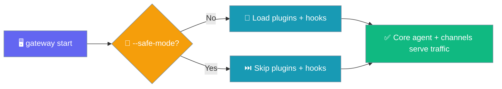
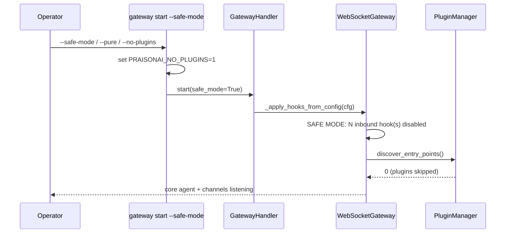
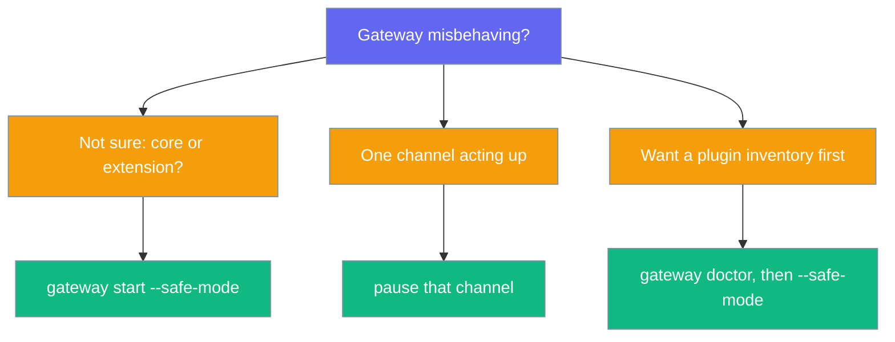

Safe mode boots the gateway with external plugins and inbound YAML hooks disabled so an operator can tell whether a fault is in the core or an extension in one restart.



## Quick Start

<Steps>
<Step title="One restart">

```bash
praisonai gateway start --config gateway.yaml --safe-mode
# → logs: SAFE MODE: N inbound hook(s) disabled; external plugins skipped (PRAISONAI_NO_PLUGINS)
```

</Step>

<Step title="Via env var (crash loops / supervisors)">

```bash
PRAISONAI_NO_PLUGINS=1 praisonai gateway start --config gateway.yaml
```

</Step>
</Steps>

<Warning>
A direct `praisonai gateway restart` **replays** safe mode. To leave safe mode, run a fresh `praisonai gateway start` without the flag.
</Warning>

---

## How It Works

The CLI flag sets `PRAISONAI_NO_PLUGINS=1` for the gateway process and forwards `safe_mode=True` to the handler; the server then skips inbound hook registration and logs the `SAFE MODE:` line before it listens.



The flag has three equivalent names — `--safe-mode`, `--pure`, `--no-plugins` — matching the aliases already used by `praisonai run` / `chat` / `code`. The env var `PRAISONAI_NO_PLUGINS=1` is equivalent and useful where editing CLI args is awkward.

---

## What Is Suppressed vs. Kept

Safe mode suppresses only extensions — the core agent and your configured channels keep serving traffic.

| Component | Normal mode | Safe mode |
|-----------|-------------|-----------|
| Core agent | On | On |
| Configured channels (incl. entry-point channels) | On | On |
| External plugins (entry-point discovery) | Loaded | **Skipped** |
| Inbound YAML `hooks:` block | Registered | **Skipped (logged)** |
| Forensics / scale-to-zero / crash-loop guard / config reload | On | On (own toggles) |
| `.praisonai/config.yaml` | Unchanged | Unchanged |

<Note>
Safe mode never modifies config files and does not touch built-in gateway features such as forensics, memory-watchdog, scale-to-zero, or config reload — each keeps its own existing toggle.
</Note>

---

## When To Use It

Reach for safe mode first when you cannot tell whether a fault lives in the gateway core or in an extension.



---

## Common Patterns

Bisect a fault — if a safe-mode boot is green, the problem is a plugin or hook; if it is still red, it is the gateway core:

```bash
praisonai gateway start --config gateway.yaml --safe-mode
```

Supervised crash loop — set the env var in the service unit so the next crash-looped restart boots core-only:

```bash
PRAISONAI_NO_PLUGINS=1 praisonai gateway start --config gateway.yaml
```

Pair with the gateway doctor — confirm which plugins would load, then boot safe mode to compare:

```bash
praisonai gateway doctor --config gateway.yaml
praisonai gateway start --config gateway.yaml --safe-mode
```

Exit safe mode with a fresh `start` (not `restart`):

```bash
praisonai gateway start --config gateway.yaml
```

---

## Best Practices

<AccordionGroup>
<Accordion title="Prefer the CLI flag over the env var in bug reports">
The flag's intent is explicit in the command line, so a reproduction is unambiguous.
</Accordion>

<Accordion title="Watch for the SAFE MODE: log line">
That `WARNING` line is the single source of truth that safe mode is active and names how many inbound hooks were disabled.
</Accordion>

<Accordion title="Remember restart stays in safe mode">
`praisonai gateway restart` replays the persisted safe-mode posture — exit with a fresh `gateway start` without the flag.
</Accordion>

<Accordion title="Safe mode is not a security posture">
It is a triage switch, not authorization — use proper channel and token controls to secure the gateway.
</Accordion>
</AccordionGroup>

---

## Related

<CardGroup cols={2}>
  <Card title="Pure Mode" icon="shield-slash" href="/features/pure-mode">
    One-shot plugin suppression on `run` / `chat` / `code`
  </Card>
  <Card title="Gateway Inbound Hooks" icon="webhook" href="/features/gateway-inbound-hooks">
    The inbound HTTP triggers safe mode suppresses
  </Card>
  <Card title="Gateway Troubleshooting" icon="wrench" href="/guides/troubleshoot-gateway">
    Diagnose a misbehaving gateway
  </Card>
  <Card title="Plugins" icon="puzzle-piece" href="/features/plugins">
    Write, load, and configure plugins
  </Card>
</CardGroup>
