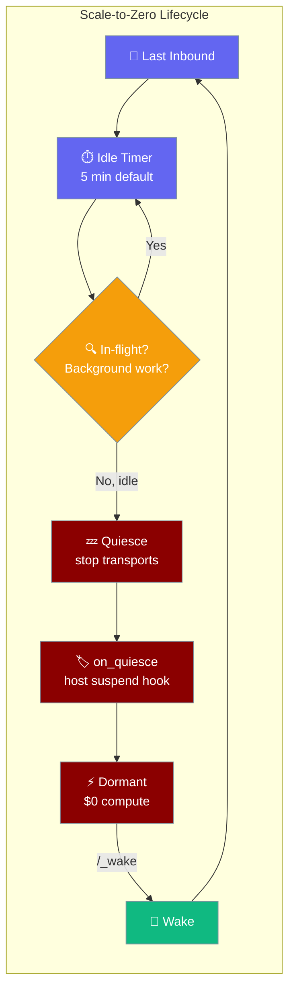
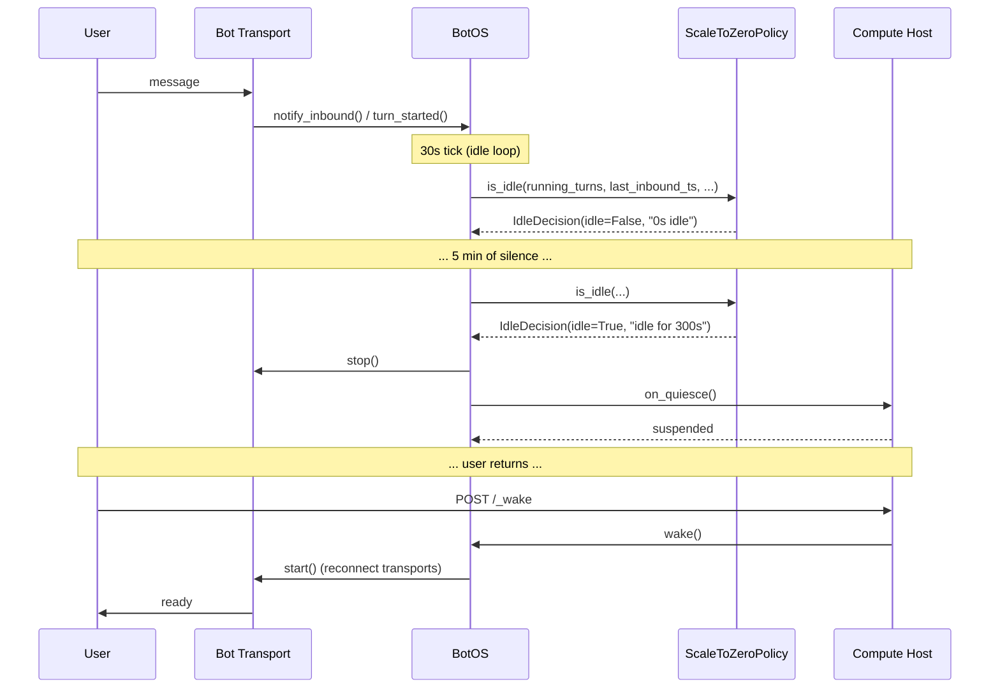

```python
from praisonaiagents import Agent

agent = Agent(name="assistant", instructions="Be helpful.")
# Scale-to-zero idles the runtime until the next user message wakes the agent
agent.start("Anyone there?")
```
A scale-to-zero policy quiesces the gateway and (optionally) suspends the compute host when no turn is in flight and no background work is pending, then wakes on the next inbound message.

The user is idle; the gateway scales workers to zero and wakes them when the next message arrives.



## Quick Start

<Steps>

<Step title="Simplest setup — 5-minute idle timeout">

```python
from praisonaiagents import Agent
from praisonai.bots import BotOS, Bot
from praisonaiagents.gateway import ScaleToZeroPolicy

agent = Agent(name="assistant", instructions="Help users")

botos = BotOS(
    bots=[Bot("telegram", agent=agent)],
    idle_policy=ScaleToZeroPolicy(
        idle_timeout_minutes=5,
        wake_url="https://my-bot.fly.dev/_wake",
    ),
)
botos.run()
```

The gateway now ticks every 30 seconds. After 5 minutes of silence with no turns in flight, it stops transports and calls your `_on_quiesce` hook (if set). The next `POST /_wake` brings it back.

</Step>

<Step title="Tighter timeout for more aggressive savings">

```python
from praisonaiagents import Agent
from praisonai.bots import BotOS, Bot
from praisonaiagents.gateway import ScaleToZeroPolicy

agent = Agent(name="assistant", instructions="Help users")

idle_policy = ScaleToZeroPolicy(
    idle_timeout_minutes=2,
    wake_url="https://my-bot.fly.dev/_wake",
)

botos = BotOS(
    bots=[Bot("telegram", agent=agent)],
    idle_policy=idle_policy,
)
botos.run()
```

</Step>

<Step title="With a compute-host suspend hook (Fly / Modal)">

```python
from praisonaiagents import Agent
from praisonai.bots import BotOS, Bot
from praisonaiagents.gateway import ScaleToZeroPolicy

agent = Agent(name="assistant", instructions="Help users")

policy = ScaleToZeroPolicy(
    idle_timeout_minutes=5,
    wake_url="https://my-bot.fly.dev/_wake",
)

async def suspend_host():
    # Tell Fly Machines / Modal to suspend this VM
    # e.g. call the Fly Machines stop API here
    pass

botos = BotOS(bots=[Bot("telegram", agent=agent)], idle_policy=policy)
botos._on_quiesce = suspend_host  # runs AFTER transports are cleanly down
botos.run()
```

<Note>
`_on_quiesce` is set as an attribute after construction (not a constructor kwarg). Set it before calling `start()` or `run()`. When a public setter is added in a future release, this section will be updated.
</Note>

</Step>

</Steps>

---

## How It Works



**Key behaviours:**

| Behaviour | Detail |
|-----------|--------|
| **Evaluation tick** | Every 30 seconds — lightweight, zero LLM calls |
| **Guard 1 — in-flight turns** | `running_turns > 0` blocks dormancy; a message being processed can never be dropped |
| **Guard 2 — background work** | Any enabled scheduled job keeps the gateway resident |
| **Guard 3 — idle timeout** | `elapsed < idle_timeout_seconds` blocks dormancy |
| **Arm gating** | `should_arm` returns `False` when `wake_url=None` — the policy logs and stays always-on rather than quiescing into an unrecoverable state |
| **Wake idempotency** | `wake()` is a no-op when the gateway is already running |

---

## Configuration Options

### `ScaleToZeroPolicy` constructor

```python
from praisonaiagents.gateway import ScaleToZeroPolicy

policy = ScaleToZeroPolicy(
    idle_timeout_minutes=5.0,
    wake_url="https://my-bot.example.com/_wake",
    enabled=True,
)
```

| Option | Type | Default | Description |
|--------|------|---------|-------------|
| `idle_timeout_minutes` | `float` | `5.0` | Minutes of inbound silence before quiescing. Must be `> 0` — raises `ValueError` on `0` or negative. |
| `wake_url` | `Optional[str]` | `None` | The HTTP endpoint your compute host will POST to wake the gateway. Required to arm — without it the policy refuses to arm and the gateway stays always-on. |
| `enabled` | `bool` | `True` | When `False`, `is_idle` always returns `idle=False` and `should_arm` returns `False`. Useful for env-var-driven kill switches. |

**Properties on the instance:**

| Property | Type | Description |
|----------|------|-------------|
| `idle_timeout_seconds` | `float` | `idle_timeout_minutes * 60` — the value `is_idle` checks against elapsed time. |

### `BotOS` — idle policy field

| Field | Type | Default | Description |
|-------|------|---------|-------------|
| `idle_policy` | `Optional[GatewayIdlePolicyProtocol]` | `None` | When set, BotOS schedules an idle-dormancy loop that ticks every 30 s and quiesces when the policy says so. Default `None` = always-on (unchanged behaviour). |

### `BotOS` runtime activity hooks

| Method | Description |
|--------|-------------|
| `notify_inbound()` | Stamp `_last_inbound_ts`. Optional explicit hook — the idle loop also passively probes session managers. |
| `turn_started()` | Increment in-flight turn counter (blocks dormancy). |
| `turn_finished()` | Decrement in-flight turn counter. |
| `wake()` *(async)* | Idempotent resume — reconnects transports. Call from your wake endpoint handler. |

### Imports

```python
from praisonaiagents.gateway import (
    IdleDecision,
    GatewayIdlePolicyProtocol,
    GatewayIdlePolicy,          # backward-compat alias
    ScaleToZeroPolicy,
)
```

<Note>
These names export from `praisonaiagents.gateway`. Top-level `praisonaiagents` does not re-export them. `BotOS` itself imports from `praisonai.bots`.
</Note>

---

## Common Patterns

### Fly Machines auto-suspend

```python
import httpx
from praisonaiagents import Agent
from praisonai.bots import BotOS, Bot
from praisonaiagents.gateway import ScaleToZeroPolicy

agent = Agent(name="assistant", instructions="Help users")

policy = ScaleToZeroPolicy(
    idle_timeout_minutes=5,
    wake_url="https://my-bot.fly.dev/_wake",
)

async def suspend_fly_machine():
    # Fly Machines: POST /v1/apps/{app}/machines/{machine}/stop
    async with httpx.AsyncClient() as client:
        await client.post(
            "https://api.machines.dev/v1/apps/my-bot/machines/MY_MACHINE_ID/stop",
            headers={"Authorization": f"Bearer {FLY_API_TOKEN}"},
        )

botos = BotOS(bots=[Bot("telegram", agent=agent)], idle_policy=policy)
botos._on_quiesce = suspend_fly_machine

# Your /_wake route must call botos.wake()
botos.run()
```

The `/_wake` route in your web framework calls `await botos.wake()`, which reconnects all transports and the gateway is live again within seconds.

### Env-var kill switch

```python
import os
from praisonaiagents import Agent
from praisonai.bots import BotOS, Bot
from praisonaiagents.gateway import ScaleToZeroPolicy

agent = Agent(name="assistant", instructions="Help users")

policy = ScaleToZeroPolicy(
    enabled=os.getenv("SCALE_TO_ZERO") == "1",
    idle_timeout_minutes=5,
    wake_url=os.getenv("WAKE_URL", ""),
)

botos = BotOS(bots=[Bot("telegram", agent=agent)], idle_policy=policy)
botos.run()
```

Set `SCALE_TO_ZERO=1` in production. In dev, leave it unset — the policy stays disabled and the gateway runs always-on with zero overhead.

### Tighter timeout for prototype bots

```python
from praisonaiagents import Agent
from praisonai.bots import BotOS, Bot
from praisonaiagents.gateway import ScaleToZeroPolicy

agent = Agent(name="demo", instructions="Quick demo bot")

policy = ScaleToZeroPolicy(
    idle_timeout_minutes=1,           # quiesce after 1 min idle
    wake_url="https://demo.example.com/_wake",
)

botos = BotOS(bots=[Bot("telegram", agent=agent)], idle_policy=policy)
botos.run()
```

Use `1` minute for disposable demo bots. Bump to `5+` minutes for production where users expect instant responses.

---

## Best Practices

<AccordionGroup>

<Accordion title="Always set wake_url before deploying">
Without a `wake_url`, `should_arm` returns `False` and the gateway logs `"idle policy not armed (no wake path); staying always-on"`. This is intentional — the policy refuses to quiesce into a state it cannot recover from. Set `wake_url` to the URL your compute host will POST to when a new inbound message arrives.
</Accordion>

<Accordion title="Keep idle_timeout_minutes ≥ 2 for chat bots">
Humans pause between messages in the same conversation — typing, thinking, copy-pasting. A timeout under 2 minutes can spin transports down mid-conversation, adding a cold-start delay the user will feel. Start at 5 minutes for interactive bots and tune down once you have usage data.
</Accordion>

<Accordion title="Wire _on_quiesce after testing your wake path">
Test that `curl -X POST https://your-bot.example.com/_wake` successfully brings the bot back before you wire `_on_quiesce` to actually suspend the host. That way you can recover from a broken suspend hook without needing to redeploy.
</Accordion>

<Accordion title="Don't disable scheduled jobs to force idle">
The policy already blocks dormancy whenever any enabled scheduled job exists. If you want true scale-to-zero, audit `praisonai schedule list` and disable jobs that should not keep the bot resident. Never rely on a long timeout to "outlast" a scheduled job — the job will prevent quiescing for as long as it is enabled.
</Accordion>

</AccordionGroup>

---

## Related

<CardGroup cols={2}>
  <Card title="Gateway Overview" icon="broadcast-tower" href="/docs/features/gateway-overview">
    The gateway architecture this feature layers on top of.
  </Card>
  <Card title="Session Continuity" icon="shield-check" href="/docs/features/gateway-session-continuity">
    Sessions survive the suspend — what makes resume after wake work.
  </Card>
  <Card title="BotOS" icon="server" href="/docs/features/botos">
    The multi-platform orchestrator that hosts the idle policy.
  </Card>
  <Card title="Bot Gateway" icon="plug" href="/docs/features/bot-gateway">
    Run multiple bots from a single gateway server.
  </Card>
</CardGroup>
