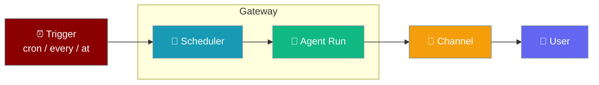
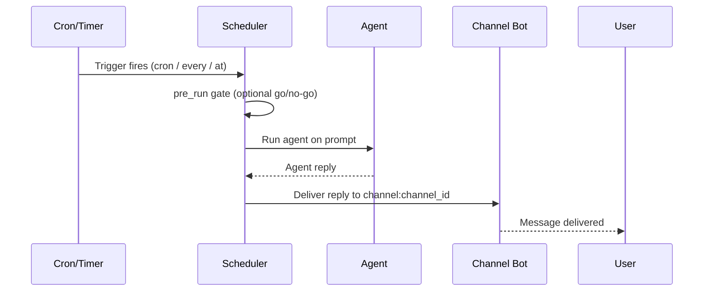
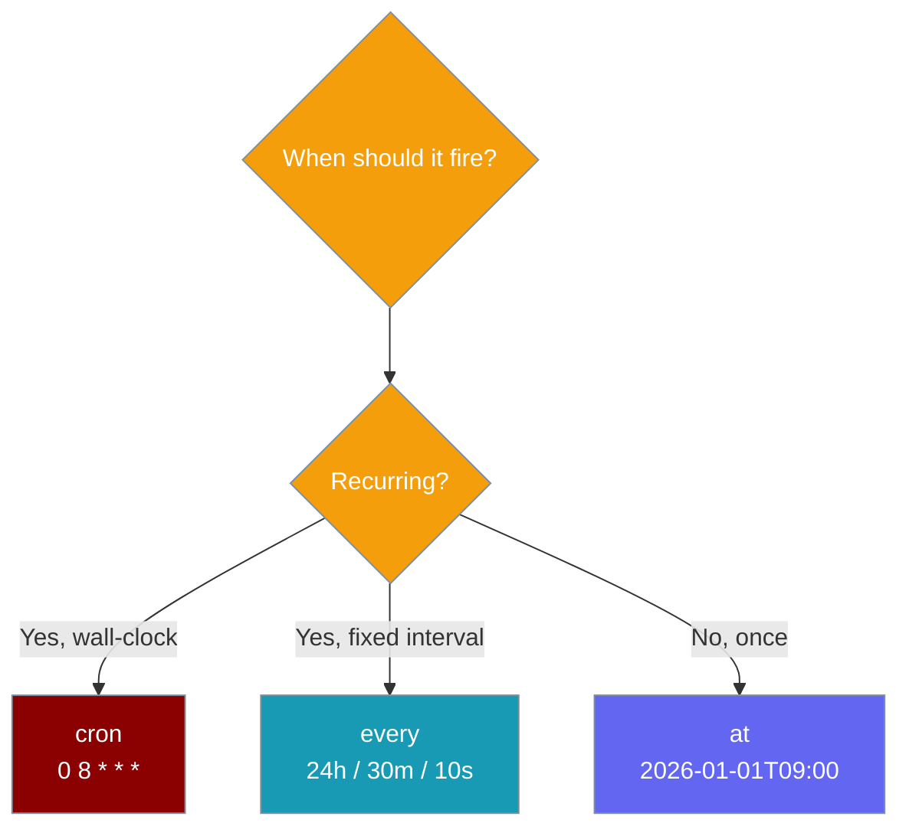

Run any agent on a cron / interval / one-shot and post the reply to a channel — from a few lines of YAML, with no Python.

<Note>
See also: [Gateway Inbound Hooks](/features/gateway-inbound-hooks) — the inbound HTTP trigger counterpart to this outbound scheduled delivery surface.
</Note>



## Quick Start

<Steps>
<Step title="YAML — simplest form">

Create `gateway.yaml` with a single `schedules:` entry:

```yaml
schedules:
  morning-brief:
    agent: personal
    cron: "0 8 * * *"          # or: every: 24h / at: 2026-01-01T09:00
    deliver:
      channel: telegram
      channel_id: ${OWNER_CHAT_ID}
    prompt: "Summarise my calendar and unread priorities for today."
```

Start the gateway — the schedule loads at boot and fires through the shared tick + delivery loop:

```bash
praisonai gateway start --config gateway.yaml
```

</Step>

<Step title="CLI — manage schedules from the terminal">

```bash
praisonai gateway schedule add morning-brief \
  --agent personal \
  --cron "0 8 * * *" \
  --channel telegram \
  --channel-id 12345 \
  --prompt "Summarise my calendar and unread priorities for today."

praisonai gateway schedule list
praisonai gateway schedule remove morning-brief
```

</Step>

<Step title="Agent-centric — wire the agent in Python">

The schedule references an agent by id; define that agent so the gateway can run it on each fire:

```python
from praisonaiagents import Agent

agent = Agent(
    name="personal",
    instructions="Summarise the user's calendar and unread priorities each morning.",
)
```

</Step>
</Steps>

---

## How It Works

The scheduler fires on the trigger, runs the agent, and routes the reply through the same channel-bot send path as inbound hooks.



| Concept | YAML key | CLI flag |
|---------|----------|----------|
| Schedule name | map key | positional `name` |
| Agent to run | `agent` | `--agent` |
| Prompt per fire | `prompt` | `--prompt` |
| Cron trigger | `cron` | `--cron` |
| Interval trigger | `every` | `--every` |
| One-shot trigger | `at` | `--at` |
| Delivery platform | `deliver.channel` | `--channel` |
| Delivery target id | `deliver.channel_id` | `--channel-id` |
| Go/no-go gate | `pre_run` | `--pre-run` |
| Active? | `enabled` | — |

---

## Choosing a Trigger — `cron` vs `every` vs `at`

Exactly one of `cron` / `every` / `at` must be set on each schedule.



| Trigger | Use for | Example |
|---------|---------|---------|
| `cron` | Recurring at wall-clock times | `"0 8 * * *"` (daily 8am) |
| `every` | Fixed interval from last fire | `"24h"`, `"30m"`, `"10s"` |
| `at` | One-shot at a specific timestamp | `"2026-01-01T09:00"` |

---

## Schedule Reference

Every field on a `schedules:` entry.

| Option | Type | Default | Description |
|--------|------|---------|-------------|
| `agent` | `str` | — (required) | Agent id to run on each fire. |
| `prompt` | `str` | — (required) | Prompt the agent runs on each fire. |
| `cron` | `str \| None` | `None` | Cron expression (`"0 8 * * *"`). Exactly one of `cron` / `every` / `at`. |
| `every` | `str \| None` | `None` | Interval (`"24h"`, `"30m"`, `"10s"`, or raw seconds). Exactly one of `cron` / `every` / `at`. |
| `at` | `str \| None` | `None` | One-shot ISO timestamp (`"2026-01-01T09:00"`). Exactly one of `cron` / `every` / `at`. |
| `deliver` | `DeliveryTarget \| None` | `None` | Delivery target — omit for run-only jobs. |
| `pre_run` | `str \| None` | `None` | Optional cheap go/no-go command run before the model turn. `"nothing to do"` skips with no tokens spent and no delivery. |
| `enabled` | `bool` | `True` | Whether the schedule is active. |

Zero triggers raises `schedule requires exactly one of 'cron', 'every' or 'at'`; more than one raises `schedule accepts only one of 'cron', 'every' or 'at'`.

---

## Delivery

`deliver:` reuses the same channel-bot send path as inbound hooks — omit it for a run-only job with no channel post.

| Option | Type | Default | Description |
|--------|------|---------|-------------|
| `channel` | `str` | — (required) | Platform name (`telegram`, `discord`, `slack`, …). |
| `channel_id` | `str` | `""` | Platform chat / channel id. |
| `thread_id` | `str \| None` | `None` | Optional thread id within the channel. |
| `continuable` | `bool` | `True` | One-way notification vs. resumable opener. Default lets a reply in the same chat resume the conversation. |

```yaml
schedules:
  digest:
    agent: personal
    every: 6h
    deliver:
      channel: slack
      channel_id: "#daily"
      continuable: false        # one-way alert, no conversation thread
    prompt: "Post the latest metrics digest."
```

---

## Pre-run Gate

Set `pre_run` to a cheap shell/python command that runs before the model turn — if it outputs `nothing to do`, the run is skipped with no LLM call and no delivery.

```yaml
schedules:
  newsletter:
    agent: writer
    cron: "0 9 * * 1"
    pre_run: "test -f /tmp/newsletter.md"
    deliver:
      channel: telegram
      channel_id: ${OWNER_CHAT_ID}
    prompt: "Draft this week's newsletter from /tmp/newsletter.md."
```

---

## Idempotency & Hot-Reload

Each schedule gets a stable id `cfg-<sha1(gateway-schedule:{name})[:12]>` derived from its YAML key, so re-loading the same config upserts instead of duplicating.

- **Idempotent on stable id** — the SHA1-prefixed id is deterministic from the YAML key; boots and hot-reloads never accumulate duplicates.
- **`last_run_at` is carried forward** on upsert, so an interval or one-shot job is not re-fired after a restart or edit.
- **Removed schedules stop firing** — a schedule deleted from the YAML is pruned on the next reload (only `cfg-` prefixed jobs are ever pruned).
- **Chat-created jobs are untouched** — jobs created in-chat via the agent-callable `schedule` tool carry random ids and are never reconciled.

`GatewayServer._load_declarative_schedules(config)` runs right before the scheduler tick starts and again on every hot-reload, so additions, edits and removals all take effect without a process restart.

---

## Failure Semantics

The gateway loads schedules best-effort so a single bad entry never blocks startup.

- **Malformed entries are skipped, not fatal** — a single bad entry logs `Skipping invalid schedule 'x': ...` and startup continues. A warning also surfaces at load time.
- **Refuses to clobber a broken config** — CLI `add` / `remove` will not overwrite a `gateway.yaml` it could not read as a YAML mapping; the original file is preserved and the command exits `1`.
- **Exit codes** — passing zero or more than one trigger flag, or a missing `--agent` / `--prompt`, exits `1`.

---

## CLI Reference

### `add`

```bash
praisonai gateway schedule add <name> \
  --agent <agent-id> \
  --prompt "..." \
  (--cron "0 8 * * *" | --every 24h | --at 2026-01-01T09:00) \
  [--channel telegram] [--channel-id 12345] \
  [--pre-run "..."] \
  [--config gateway.yaml]
```

| Flag | Required | Description |
|------|----------|-------------|
| `name` (positional) | yes | Schedule name, e.g. `morning-brief`. |
| `--agent` | yes | Agent id to run. |
| `--prompt` | yes | Prompt the agent runs on each fire. |
| `--cron` / `--every` / `--at` | one exactly | Trigger. |
| `--channel` | no | Delivery platform. |
| `--channel-id` | no | Delivery chat/channel id. |
| `--pre-run` | no | Optional shell go/no-go gate. |
| `--config` | no | Path to `gateway.yaml` (default `gateway.yaml`). |

### `list`

```bash
praisonai gateway schedule list [--config gateway.yaml]
```

Prints one line per schedule with agent, trigger, and delivery target:

```
Schedules in gateway.yaml:
  morning-brief  agent=personal cron=0 8 * * *  deliver=telegram:12345
```

### `remove`

```bash
praisonai gateway schedule remove <name> [--config gateway.yaml]
```

---

## Real User-Interaction Flow

> At 8am Telegram chat `${OWNER_CHAT_ID}` gets a summary of the user's calendar and unread priorities. The user can reply in the same chat — because `continuable: true` — and the `personal` agent resumes the conversation.

---

## Common Patterns

### Daily brief to Telegram (cron)

```yaml
schedules:
  morning-brief:
    agent: personal
    cron: "0 8 * * *"
    deliver:
      channel: telegram
      channel_id: ${OWNER_CHAT_ID}
    prompt: "Summarise my calendar and unread priorities for today."
```

### Hourly health-check poll to Slack (every)

```yaml
schedules:
  health-poll:
    agent: ops
    every: 1h
    deliver:
      channel: slack
      channel_id: "#ops"
    prompt: "Check service health and report any anomalies."
```

### One-shot launch reminder (at)

```yaml
schedules:
  launch-reminder:
    agent: personal
    at: "2026-01-01T09:00"
    deliver:
      channel: telegram
      channel_id: ${OWNER_CHAT_ID}
    prompt: "Remind me that the launch checklist is due today."
```

---

## Best Practices

<AccordionGroup>
<Accordion title="Use a pre_run gate for expensive automations">
A cheap `pre_run` command that prints `nothing to do` skips the model turn entirely — no tokens spent and no delivery when there's nothing new.
</Accordion>

<Accordion title="Prefer every for jitter-tolerant polling, cron for wall-clock deliveries">
Use `every` when the exact minute doesn't matter (health polls); use `cron` when the delivery must land at a specific wall-clock time (an 8am brief).
</Accordion>

<Accordion title="Keep schedule names stable">
The stable id derives from the YAML key — renaming a schedule creates a new job and drops the old one's run-state.
</Accordion>

<Accordion title="Set continuable: false for one-way notifications">
A bare alert that shouldn't open a conversation thread should set `continuable: false` so a reply doesn't resume an agent turn.
</Accordion>
</AccordionGroup>

---

## Related

<CardGroup cols={2}>
<Card title="Gateway Inbound Hooks" icon="webhook" href="/features/gateway-inbound-hooks">
  The inbound HTTP trigger counterpart to this outbound scheduled surface.
</Card>
<Card title="Schedule CLI" icon="terminal" href="/cli/schedule">
  The standalone `praisonai schedule` CLI — store poller, tick, and job management.
</Card>
<Card title="Proactive Delivery" icon="paper-plane" href="/features/proactive-delivery">
  Friendly aliases for scheduled delivery.
</Card>
<Card title="Gateway Overview" icon="broadcast-tower" href="/features/gateway-overview">
  Gateway architecture and how channels, agents, and routing connect.
</Card>
<Card title="Scheduled Run Policy" icon="list-check" href="/features/scheduled-run-policy">
  RunPolicy for scheduled jobs.
</Card>
<Card title="Scheduler Multi-Tenant" icon="users" href="/features/scheduler-multi-tenant">
  Per-user isolation for scheduled jobs.
</Card>
</CardGroup>
