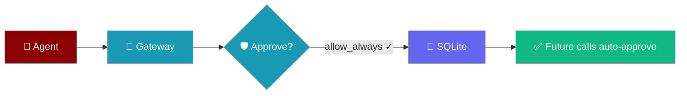
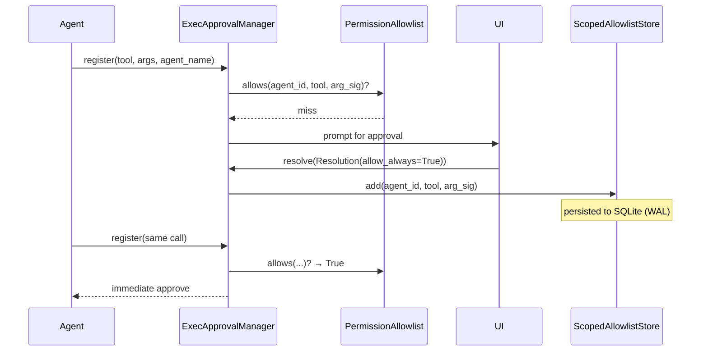
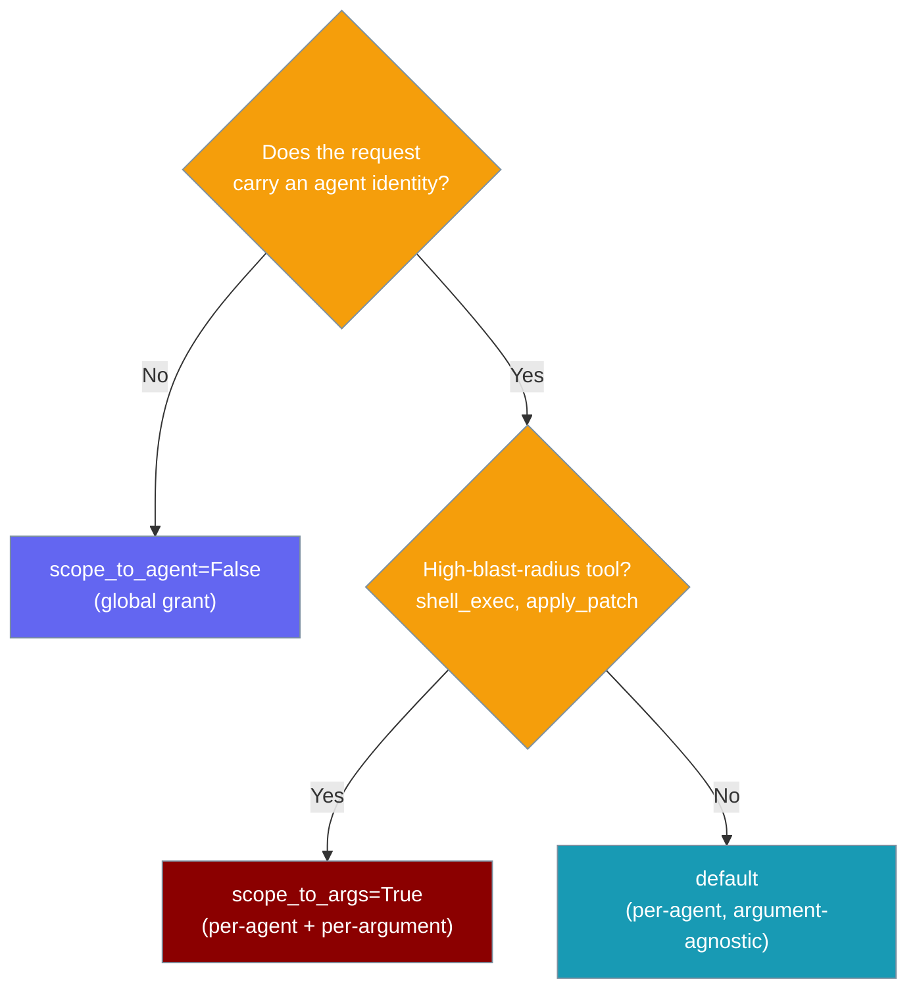

Allow-always grants now persist across gateway restart and default to being scoped to the approving agent.



## Quick Start

<Steps>
<Step title="Enable durable scoped approvals">
Durable, agent-scoped grants are on by default — just launch the gateway. The allow-list opens a SQLite store at `~/.praisonai/state/gateway/approvals.sqlite`.

```python
from praisonai.gateway.exec_approval import ExecApprovalManager

manager = ExecApprovalManager()  # durable=True by default
```
</Step>

<Step title="Grant Once, Auto-Approve Forever (per Agent)">
Resolve a pending request with `allow_always=True`. The grant is scoped to the resolving agent by default — one agent's approval never authorises another.

```python
from praisonai.gateway.exec_approval import ExecApprovalManager, Resolution

manager = ExecApprovalManager()

request_id, future = await manager.register(
    tool_name="shell_exec",
    arguments={"cmd": "ls -la"},
    agent_name="shell-bot",
)

# From your bot / UI handler:
manager.resolve(request_id, Resolution(approved=True, allow_always=True))

# Next identical call from "shell-bot" auto-approves — even after a restart.
```
</Step>

<Step title="Scope even tighter to arguments">
Add `scope_to_args=True` so only subsequent calls with the same argument shape auto-approve; a different argument re-prompts.

```python
from praisonai.gateway.exec_approval import Resolution

manager.resolve(
    request_id,
    Resolution(approved=True, allow_always=True, scope_to_args=True),
)
```
</Step>

<Step title="Grant globally (legacy behaviour)">
Set `scope_to_agent=False` for the pre-#2622 semantic where one approval covers every agent.

```python
from praisonai.gateway.exec_approval import Resolution

manager.resolve(
    request_id,
    Resolution(approved=True, allow_always=True, scope_to_agent=False),
)
```
</Step>
</Steps>

---

## How It Works



A matching grant short-circuits `register` — the future resolves immediately with `approved=True` and no prompt is shown.

---

## Which Scope to Use

Pick the narrowest scope that still saves the operator from re-approving.



---

## The Grant Key

Every grant is stored as `(agent_id, tool_name, arg_signature)`.

| Key part | Type | Meaning |
|---|---|---|
| `agent_id` | `str` | Resolved agent name; sentinel `"*"` means "any agent" |
| `tool_name` | `str` | Registered tool name |
| `arg_signature` | `str` \| `None` | First 32 chars of SHA-256 over `json.dumps(args, sort_keys=True)`; `None` = argument-agnostic |

---

## Resolver Options

`Resolution` carries the resolver's decision and how broadly to persist it.

| Field | Type | Default | Description |
|---|---|---|---|
| `approved` | `bool` | (required) | Whether the request is approved |
| `reason` | `str` | `""` | Human-readable reason |
| `allow_always` | `bool` | `False` | Persist the grant; when `False` the resolution applies only to this one request |
| `scope_to_agent` | `bool` | `True` | Grant is scoped to the requesting agent; set `False` for pre-#2622 global grants |
| `scope_to_args` | `bool` | `False` | Also key the grant on the argument SHA — subsequent calls with different arguments will re-prompt |

---

## Silent-Skip Warning

<Warning>
If a request has **no agent identity** and the resolver keeps the default `scope_to_agent=True`, the grant is **not persisted**. The request still returns approved, but the next identical call re-prompts. The gateway logs:

```
Skipping scoped allow-always grant for tool 'shell_exec': no agent identity
on the request. Set scope_to_agent=False to grant globally.
```

**Fix:** set `scope_to_agent=False` to grant a request that has no agent identity.
</Warning>

---

## Storage Layout

Grants live in one SQLite file — safe to back up, rotate, or delete.

| Aspect | Value |
|---|---|
| Default path | `~/.praisonai/state/gateway/approvals.sqlite` |
| Env override | `PRAISONAI_HOME` (whole state root moves) |
| Programmatic override | `ExecApprovalManager(allowlist_path=...)` |
| Journal mode | WAL |
| Default TTL | 90 days (evicted lazily on read / `list()`) |
| Safe to delete | Yes — next restart re-prompts on the next request |

<Note>
If the store can't be opened (permissions, disk full, corruption) the gateway logs and falls back to in-memory only — grants won't survive restart, but the gateway does not crash.
</Note>

---

## HTTP Endpoint

`GET/POST/DELETE /api/approval/allow-list` manages grants over HTTP. `POST` and `DELETE` accept an optional `agent_id`; `GET` returns a `grants` view alongside the legacy `allow_list`.

<Tabs>
<Tab title="GET">
```bash
curl -H "Authorization: Bearer $TOKEN" \
  http://localhost:8080/api/approval/allow-list
```

```json
{
  "allow_list": ["read_file"],
  "grants": [
    {"agent_id": "shell-bot", "tool_name": "shell_exec", "arg_signature": null, "created_at": 1720000000.0, "approver": "gateway:human"},
    {"agent_id": "*", "tool_name": "read_file", "arg_signature": null, "created_at": 1720000000.0, "approver": "gateway:operator"}
  ]
}
```
</Tab>

<Tab title="POST">
```bash
curl -X POST -H "Authorization: Bearer $TOKEN" \
  -H "Content-Type: application/json" \
  -d '{"tool_name": "shell_exec", "agent_id": "shell-bot"}' \
  http://localhost:8080/api/approval/allow-list
```

`agent_id` omitted → adds a legacy any-agent grant. `agent_id` supplied → adds a scoped grant with `approver="gateway:operator"`. Empty/whitespace `agent_id` returns HTTP 400.
</Tab>

<Tab title="DELETE">
```bash
curl -X DELETE -H "Authorization: Bearer $TOKEN" \
  -H "Content-Type: application/json" \
  -d '{"tool_name": "shell_exec", "agent_id": "shell-bot"}' \
  http://localhost:8080/api/approval/allow-list
```

Returns HTTP 404 if the specific `(agent_id, tool_name)` grant is not found.
</Tab>
</Tabs>

<Note>
Mutations (`POST`/`DELETE`) require `OperatorScope.APPROVALS` and pass the per-IP rate limiter. See [Gateway Operator Scopes](/docs/features/gateway-operator-scopes).
</Note>

---

## Legacy Behaviour Preserved

<AccordionGroup>
<Accordion title="I use allowlist.add('tool_name') directly">
Still works. It creates an any-agent (`agent_id="*"`) grant with an empty argument signature. `"tool" in allowlist`, `allowlist.remove("tool")`, and `allowlist.list()` also keep their original meaning.
</Accordion>

<Accordion title="I POST /api/approval/allow-list without agent_id">
Still works. Omitting `agent_id` creates an any-agent grant, exactly as before.
</Accordion>

<Accordion title="I want the old cross-agent leaky behaviour">
Set `scope_to_agent=False` on the `Resolution`. The grant then applies to every agent.
</Accordion>

<Accordion title="I need to purge everything">
Delete the SQLite file, or call `store.revoke_tool(name)` to drop every grant for one tool across all agents.
</Accordion>
</AccordionGroup>

---

## Best Practices

<AccordionGroup>
<Accordion title="Keep scope_to_agent=True">
One agent's approval should never authorise another. The default scoping prevents accidental cross-agent leakage.
</Accordion>

<Accordion title="Use scope_to_args=True for high-blast-radius tools">
For `shell_exec` or `apply_patch`, add `scope_to_args=True` so the operator's approval only covers the exact command they saw.
</Accordion>

<Accordion title="Rotate or shorten TTL for security-sensitive state">
Rotate the SQLite file periodically, or shorten the window via `ScopedAllowlistStore(ttl_seconds=...)`.
</Accordion>

<Accordion title="Watch the silent-skip log line">
"Skipping scoped allow-always grant" means a resolver is sending `scope_to_agent=True` on a request with no agent identity — the grant was not persisted.
</Accordion>
</AccordionGroup>

<Note>
This is defence-in-depth, not a security boundary: a resolver that can approve requests can still choose `scope_to_agent=False`. The default scoping prevents *accidental* cross-agent leakage.
</Note>

---

## Related

<CardGroup cols={2}>
<Card title="Gateway" icon="server" href="/docs/features/gateway">
  Gateway overview and deployment
</Card>
<Card title="Approval Backends" icon="plug" href="/docs/features/approval-backends">
  How approval requests are routed
</Card>
<Card title="Gateway Operator Scopes" icon="user-lock" href="/docs/features/gateway-operator-scopes">
  Authorisation for admin endpoints
</Card>
<Card title="Durable Approvals" icon="database" href="/docs/features/durable-approvals">
  Restart-safe bot pending-approval queue
</Card>
</CardGroup>
