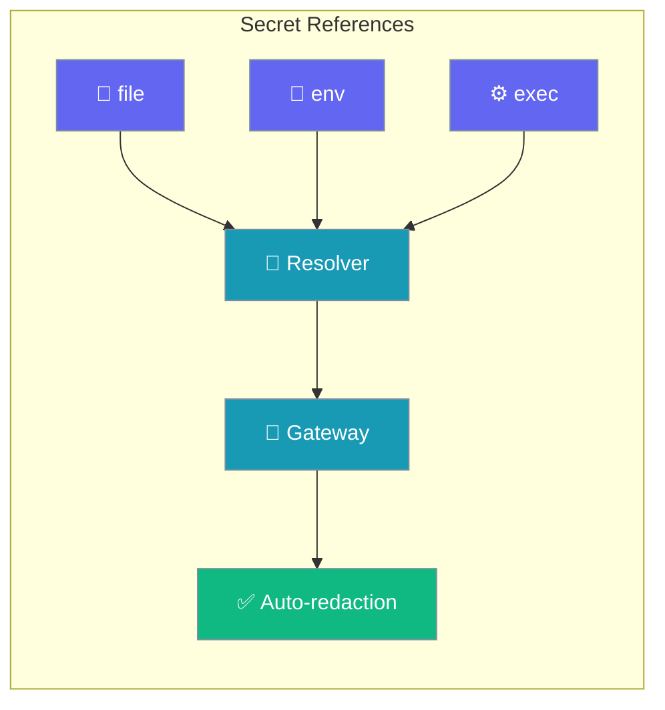
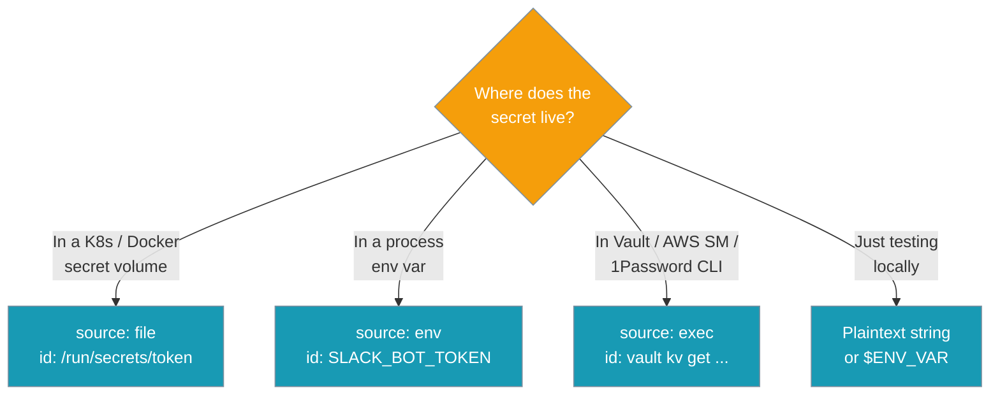
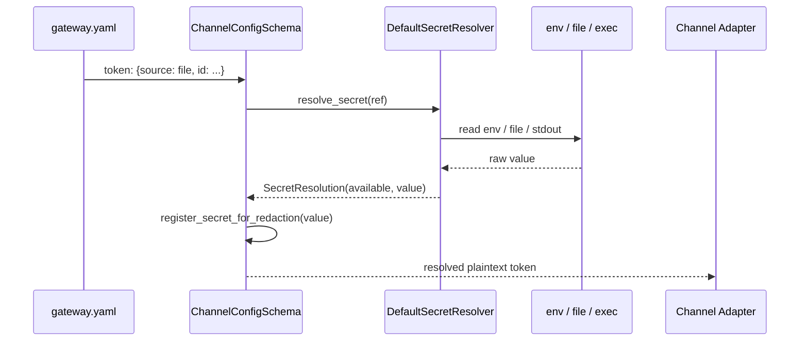

Gateway credentials load from a mounted file, an environment variable, or a secret-manager command — no plaintext token in YAML and no process-wide env var required.



The `token`, `app_token`, and `verify_token` fields accept a `{ source, id }` reference in addition to plaintext and `${ENV}`. The reference form is additive — existing configs keep working.

## Quick Start

<Steps>
<Step title="Agent connects through the gateway">
```python
from praisonaiagents import Agent

agent = Agent(name="Ops Agent", instructions="Reply to messages", gateway=True)
agent.start()
```
</Step>

<Step title="From a secret file">
Read a mounted Docker or Kubernetes secret — never inherited by child processes.

```yaml
# gateway.yaml
channels:
  telegram:
    platform: telegram
    token: { source: file, id: /run/secrets/telegram_token }
```
</Step>

<Step title="From an environment variable">
Structural equivalent of `${SLACK_BOT_TOKEN}`.

```yaml
channels:
  slack:
    platform: slack
    token: { source: env, id: SLACK_BOT_TOKEN }
    app_token: { source: env, id: SLACK_APP_TOKEN }
```
</Step>

<Step title="From a secret manager">
Run a CLI whose stdout is the secret (Vault, AWS, GCP, 1Password, `pass`).

```yaml
channels:
  discord:
    platform: discord
    token:
      source: exec
      id: "vault kv get -field=token secret/discord"
```
</Step>
</Steps>

---

## Which source do I choose?

Pick the source that matches where the secret already lives.



---

## How It Works

The schema validator resolves each reference at load time, hands the plaintext value to the adapter, and registers it for log redaction.



| Source | `id` means | Resolved by |
|--------|-----------|-------------|
| `file` | A file path (e.g. `/run/secrets/token`) | Reads and strips the file contents |
| `env` | An environment variable name | Reads and strips the env var |
| `exec` | A command line | Runs it; stdout (stripped) is the secret |

A resolved secret **string** always wins over a raw `{source, id}` reference in the runtime merge, so adapters never receive an unresolved reference.

---

## Reference Form

A credential field accepts a plaintext string, a `${ENV}` shorthand, or the reference form below.

```yaml
token: { source: file, id: /run/secrets/telegram_token, provider: custom }
```

| Key | Type | Required | Description |
|-----|------|----------|-------------|
| `source` | `str` | Yes | One of `env`, `file`, `exec` (or a custom registered source) |
| `id` | `str` | Yes | Env var name, file path, or command line — interpreted per `source` |
| `provider` | `str` | No | Free-form hint routed to a custom resolver (e.g. `vault`) |

<Note>
Plaintext strings and `${ENV_VAR}` continue to work exactly as before. The `{source, id}` reference form is purely **additive** — you never have to migrate an existing `gateway.yaml`.
</Note>

---

## Availability States

`praisonai gateway doctor` reports each field's availability **without printing its value**, so operators can validate secret wiring before start-up.

| State | Meaning |
|-------|---------|
| `available` | Resolved successfully (env set, file present and non-empty) |
| `configured-but-unavailable` | Configured but cannot resolve (empty file, unreadable, empty env var) |
| `configured` | An `exec` reference — configured, but not executed at probe time |
| `missing` | Not set (env var unset, file not found) |

Human-friendly output:

```bash
$ praisonai gateway doctor --config gateway.yaml
Credential availability (values never shown):
telegram     token         ✓  available
slack        token         ✓  available
slack        app_token     ✗  configured-but-unavailable
discord      token         ✓  configured    # exec source, not executed
```

Machine-readable JSON:

```bash
$ praisonai gateway doctor --config gateway.yaml --json
{
  "probes": { ... },
  "secrets": {
    "telegram": {"token": "available"},
    "slack":    {"token": "available", "app_token": "configured-but-unavailable"},
    "discord":  {"token": "configured"}
  }
}
```

`exec`-sourced credentials report as `configured` **without** running the command — the probe resolves it exactly once, so one-shot / rate-limited / rotating secret CLIs are never invoked twice.

---

## Log Redaction

Every resolved secret is registered so it is scrubbed from logs and tracebacks.

```python
from praisonaiagents.secrets import resolve_secret, redact_secrets

result = resolve_secret({"source": "env", "id": "SLACK_BOT_TOKEN"})
print(redact_secrets(f"connecting with {result.value}"))
# connecting with [REDACTED]
```

<Note>
Values shorter than 4 characters (`_MIN_REDACT_LEN = 4`) are not registered — this avoids over-redacting ordinary text.
</Note>

---

## Custom Resolvers

Register a resolver to add a source (Vault, AWS Secrets Manager, GCP Secret Manager, 1Password, `pass`).

```python
from praisonaiagents.secrets import (
    SecretRef,
    SecretResolution,
    SecretResolver,
    register_resolver,
)


class VaultResolver(SecretResolver):
    def resolve(self, ref: SecretRef) -> SecretResolution:
        # Look up ref.id in Vault; never raise on unavailable — return a
        # SecretResolution instead.
        return SecretResolution("available", value="resolved-secret")


register_resolver("vault", VaultResolver())

# Now this works in gateway.yaml:
# token: { source: vault, id: "secret/data/slack#token" }
```

<Warning>
A resolver **must not raise** on a merely unavailable secret. Return a `SecretResolution` with status `configured-but-unavailable` or `missing` so `gateway doctor` can report it cleanly.
</Warning>

---

## Backward Compatibility

Plaintext and `${ENV}` keep working; the reference form is purely additive.

```yaml
channels:
  whatsapp:
    platform: whatsapp
    phone_number_id: "1234567890"
    verify_token: { source: file, id: /run/secrets/wa_verify }
    # Plaintext and ${ENV_VAR} still work.
    token: "${WHATSAPP_API_TOKEN}"
```

---

## Full Example

```yaml
# gateway.yaml — all three sources in one config
agents:
  assistant:
    instructions: "You are a helpful support agent."
    model: gpt-4o-mini

channels:
  telegram:
    platform: telegram
    # Mounted Docker / Kubernetes secret file (never inherited by child processes).
    token: { source: file, id: /run/secrets/telegram_token }

  slack:
    platform: slack
    # Structural env reference — equivalent to the old "${SLACK_BOT_TOKEN}".
    token:     { source: env,  id: SLACK_BOT_TOKEN }
    # Secret manager (Vault / AWS / GCP / 1Password / pass). Stdout is the secret.
    app_token: { source: exec, id: "vault read -field=token secret/slack" }

  whatsapp:
    platform: whatsapp
    phone_number_id: "1234567890"
    verify_token: { source: file, id: /run/secrets/wa_verify }
    # Plaintext and ${ENV_VAR} still work as before.
    token: "${WHATSAPP_API_TOKEN}"
```

Validate the wiring before shipping:

```bash
praisonai gateway doctor --config gateway.yaml
```

---

## Best Practices

<AccordionGroup>
  <Accordion title="Prefer file for Docker and Kubernetes secrets">
    A mounted secret file (`/run/secrets/...`) is never inherited by child processes, unlike a process-wide env var. Use `{ source: file, id: ... }` for container deployments.
  </Accordion>
  <Accordion title="Prefer exec for secret managers with rotating credentials">
    Vault, AWS Secrets Manager, and GCP Secret Manager issue short-lived, rotating tokens. `{ source: exec, id: "..." }` resolves the current value at start-up instead of pinning a stale one.
  </Accordion>
  <Accordion title="Keep ${ENV} for local development only">
    `${ENV}` and `{ source: env, id: ... }` are convenient for local runs, but the value is visible to every child process. Move to `file` or `exec` for production.
  </Accordion>
  <Accordion title="Run gateway doctor before shipping">
    `praisonai gateway doctor` validates every field and prints the availability table without revealing any value — a safe pre-flight check for CI and deploy scripts.
  </Accordion>
</AccordionGroup>

---

## Related

<CardGroup cols={2}>
  <Card title="Gateway CLI" icon="terminal" href="/docs/features/gateway-cli">
    `gateway doctor` and `gateway status` CLI reference.
  </Card>
  <Card title="Gateway" icon="tower-broadcast" href="/docs/features/gateway">
    Gateway overview and quick start.
  </Card>
  <Card title="Gateway Credential Rotation" icon="arrows-rotate" href="/docs/features/gateway-credential-rotation">
    Rotating the gateway's own auth token.
  </Card>
  <Card title="Standalone Bot YAML" icon="file-code" href="/docs/features/standalone-bot-yaml">
    Single-bot YAML configuration and pre-flight checks.
  </Card>
</CardGroup>
