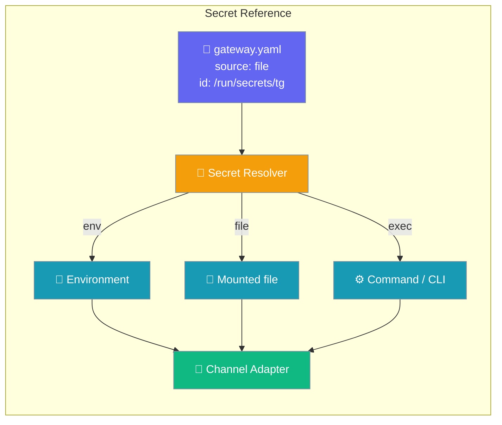
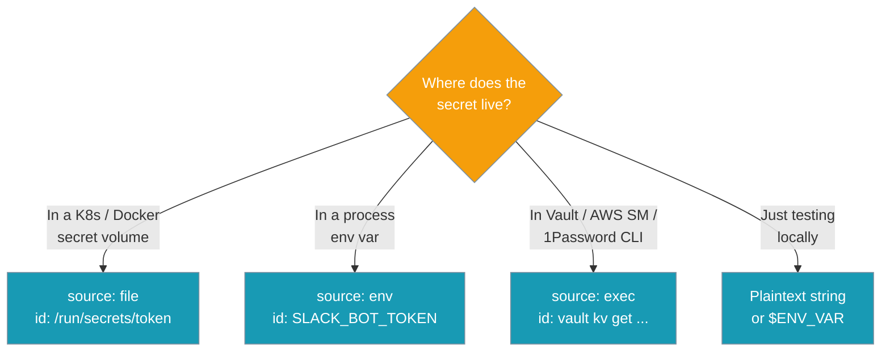
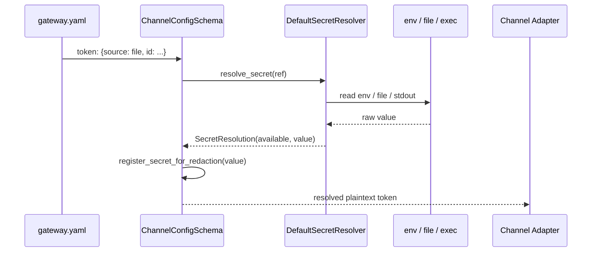

Gateway credentials can point to a secret instead of holding one — resolve `token`, `app_token`, and `verify_token` from an env var, a mounted file, or a secret-manager command at start-up.



An agent connects through the gateway; its channel credentials are resolved from a secret source rather than sitting in the config file.

## Quick Start

<Steps>
<Step title="Agent connects through the gateway">
```python
from praisonaiagents import Agent

agent = Agent(name="Ops Agent", instructions="Reply to messages", gateway=True)
agent.start()
```
</Step>

<Step title="Point the channel token at a mounted secret file">
No plaintext in YAML:

```yaml
# gateway.yaml
channels:
  telegram:
    platform: telegram
    token:
      source: file
      id: /run/secrets/telegram_token
```
</Step>

<Step title="Or an environment variable">
```yaml
channels:
  slack:
    platform: slack
    token:
      source: env
      id: SLACK_BOT_TOKEN
    app_token:
      source: env
      id: SLACK_APP_TOKEN
```
</Step>

<Step title="Or a secret-manager CLI">
Opt-in — the command's stdout is the secret:

```yaml
channels:
  discord:
    platform: discord
    token:
      source: exec
      id: "vault kv get -field=token secret/discord"
```
</Step>
</Steps>

---

## Which source do I choose?

Pick the source that matches where the secret already lives.



---

## How It Works

The schema resolves each reference once at load time, hands the plaintext to the adapter, and registers the value for log redaction.



A resolved secret **string** always wins over a raw `{source, id}` reference in the runtime merge, so adapters never receive an unresolved reference.

---

## Reference-form Contract

A credential field accepts a plaintext string, a `${ENV}` shorthand, or the reference form below.

| Field | Type | Required | Notes |
|-------|------|----------|-------|
| `source` | `str` | ✅ | One of `env`, `file`, `exec`. Custom sources allowed via `register_resolver`. |
| `id` | `str` | ✅ | Env var name, absolute file path, or shell command line (parsed with `shlex.split`). |
| `provider` | `str` | ❌ | Free-form hint for custom resolvers (e.g. `vault`, `aws-sm`). |

Availability values reported by `gateway doctor`:

| Status | Meaning |
|--------|---------|
| `available` | Resolver returned a non-empty value. |
| `configured-but-unavailable` | Reference is present but points at an empty/unreadable target. |
| `configured` | `exec`-sourced reference — recognised without executing (avoids double-exec of rotating CLIs). |
| `missing` | Field empty or env var / file not present. |

<Note>
Plaintext strings and `${ENV_VAR}` continue to work exactly as before. The `{source, id}` reference form is purely **additive** — you never have to migrate an existing `gateway.yaml`.
</Note>

---

## Gateway Doctor

`praisonai gateway doctor` reports each credential's availability without ever printing its value.

Human-friendly:

```bash
$ praisonai gateway doctor --config gateway.yaml
Credential availability (values never shown):
telegram     token         ✓  available
slack        token         ✓  available
slack        app_token     ✗  configured-but-unavailable
discord      token         ✓  configured    # exec source, not executed

✓ telegram   @ops_bot
✗ slack      Invalid auth token
✓ discord    @ops
```

Machine-readable — a single JSON document parseable with `json.loads`:

```bash
$ praisonai gateway doctor --config gateway.yaml --json
{
  "probes": { ... },
  "secrets": {
    "telegram": {"token": "available"},
    "slack":    {"token": "available", "app_token": "configured-but-unavailable"},
    "discord":  {"token": "configured"}
  }
}
```

`exec`-sourced credentials report as `configured` **without** running the command — the probe resolves it exactly once, so one-shot / rate-limited / rotating secret CLIs are never invoked twice.

---

## Log Redaction

Every resolved secret is registered with the process-wide redaction registry so it can be scrubbed from tracebacks and log lines with `redact_secrets(text)`. Trivially short values (< 4 chars) are ignored to avoid over-redacting ordinary text. Reference-form values never appear in logs; only the locator (env var name / file path) does.

```python
from praisonaiagents.secrets import redact_secrets

print(redact_secrets("token=abc123super-secret"))   # -> "token=[REDACTED]"
```

---

## Custom Resolvers

Register a resolver for a source such as Vault, then reference it by `provider`.

<AccordionGroup>
<Accordion title="Register a Vault resolver">
```python
from praisonaiagents.secrets import (
    register_resolver,
    SecretRef,
    SecretResolution,
    AVAILABLE,
)

class VaultResolver:
    def resolve(self, ref: SecretRef) -> SecretResolution:
        value = my_vault_client.read(ref.id)
        return SecretResolution(AVAILABLE, value=value) if value else SecretResolution("missing")

register_resolver("vault", VaultResolver())
```
</Accordion>

<Accordion title="Point a channel at the custom resolver">
```yaml
channels:
  telegram:
    platform: telegram
    token:
      source: exec              # or a custom source, if you also register it
      provider: vault           # picks the VaultResolver above
      id: "secret/telegram/token"
```
</Accordion>
</AccordionGroup>

---

## Best Practices

<AccordionGroup>
<Accordion title="Prefer file in Kubernetes / Docker">
Mount a secret at `/run/secrets/…`; nothing ever hits an env var.
</Accordion>

<Accordion title="Use exec for rotating secrets">
The doctor recognises the reference as `configured` without executing, so one-shot / rate-limited CLIs are safe.
</Accordion>

<Accordion title="Never mix plaintext and reference form in the same field">
Pick one per credential; the resolved reference always wins in the runtime merge.
</Accordion>

<Accordion title="Run gateway doctor in CI">
The `--json` output is a single document, easy to assert against.
</Accordion>
</AccordionGroup>

---

## Related

<CardGroup cols={2}>
<Card title="Credential Rotation" icon="key" href="/docs/features/gateway-credential-rotation">
  Rotating the gateway's own auth token
</Card>
<Card title="Hot Reload" icon="arrows-rotate" href="/docs/features/gateway-hot-reload">
  Reload on `gateway.yaml` change
</Card>
<Card title="Gateway" icon="tower-broadcast" href="/docs/features/gateway">
  Gateway overview
</Card>
<Card title="Gateway CLI" icon="terminal" href="/docs/features/gateway-cli">
  `gateway doctor` and `gateway status` CLI
</Card>
</CardGroup>
