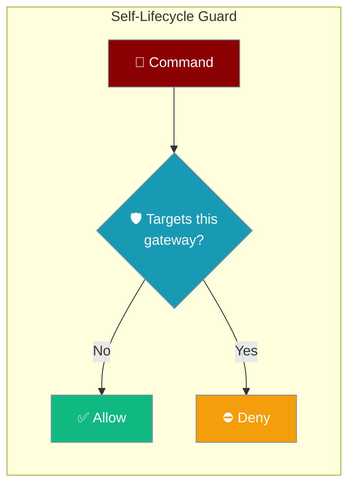
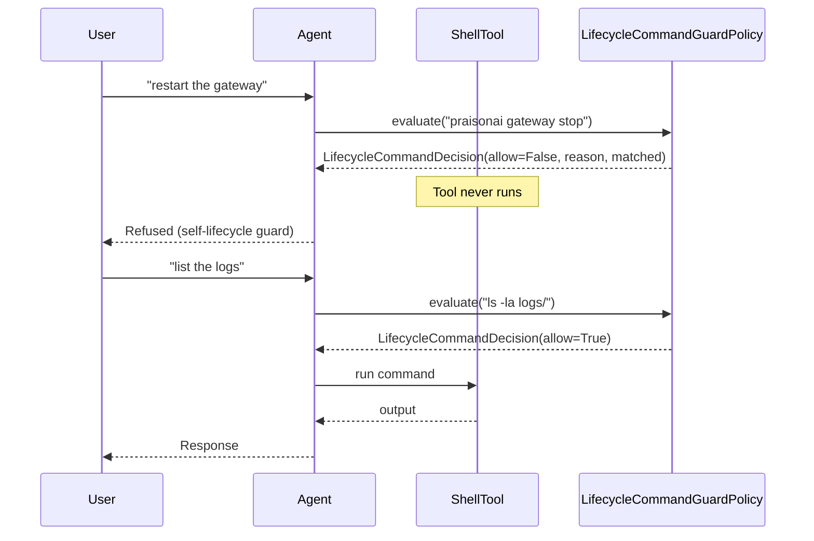

Self-lifecycle guard blocks a running gateway's agent from shutting itself down.



An agent with a shell tool can be tricked into running `praisonai gateway stop` or `pkill -f praisonai`, taking down the very process it runs in (self-DoS). The guard inspects the command structurally and refuses self-destructive commands before they run — while leaving ordinary commands, and ordinary English, untouched.

## Quick Start

<Steps>
<Step title="Simple Usage">

The guard is on by default. Benign commands pass; a self-stop is refused.

```python
from praisonaiagents.gateway import LifecycleCommandGuardPolicy

guard = LifecycleCommandGuardPolicy()

print(guard.evaluate("ls -la").allow)                 # True
print(guard.evaluate("praisonai gateway stop").allow) # False
```

</Step>

<Step title="With Configuration">

Name a renamed CLI with `process_names` and fail closed with `default_allow=False`.

```python
from praisonaiagents.gateway import LifecycleCommandGuardPolicy

guard = LifecycleCommandGuardPolicy(process_names=["mybot"], default_allow=False)

print(guard.evaluate("ls -la").allow)             # True
print(guard.evaluate("mybot gateway stop").allow) # False
```

</Step>
</Steps>

---

## How It Works

The guard is consulted before a shell/CLI tool executes and before a scheduled job is registered. A denied command returns a `LifecycleCommandDecision` instead of running.



Matching is **command-anchored** — structural token inspection over every `;` / `&&` / `||` / pipe / newline segment, not prose. Three rules trip a deny:

| Rule | Form | Example denied |
|------|------|----------------|
| CLI self-control | `<cli> gateway <verb>` (adjacent) | `praisonai gateway stop` |
| Process kill | `pkill` / `kill` / `killall` naming the gateway | `pkill -f praisonai` |
| Service manager | `systemctl` / `launchctl` / `service` / `sc` `stop`/`restart`/… on our unit | `systemctl stop praisonai-gateway` |

**Whole-component matching** means `praisonai-gateway` (real unit) matches, but `api-gateway`, `kong-gateway`, and `my-praisonaibot` do not. Rule 1 requires **adjacency**: the CLI token must sit immediately before `gateway`, followed by a lifecycle verb — so `praisonai gateway status --stop-on-idle` is allowed. Leading `sudo` / `env` / `nohup` / `exec` prefixes are stripped and path-qualified executables (`/usr/bin/pkill`) are normalised to their base before matching.

---

## Configuration Options

`LifecycleCommandGuardPolicy` is the config-driven default, referenced by `gateway.lifecycle_guard` in `gateway.yaml` and by `BotOS(..., lifecycle_policy=...)`.

| Parameter | Type | Default | Description |
|-----------|------|---------|-------------|
| `enabled` | `bool` | `True` | Guard is on by default; `False` disables it entirely. |
| `process_names` | `Optional[List[str]]` | `None` (→ `["praisonai"]`) | Whole-component identity tokens that name *this* gateway. |
| `default_allow` | `bool` | `True` | Fail posture. `True` = fail-open on parse error; `False` = fail-closed for strict hosted gateways. |

`evaluate()` returns a `LifecycleCommandDecision` — a frozen dataclass with `allow` (`bool`), `reason` (`str`, populated on denial), and `matched` (`str`, the offending fragment for the audit log). The pure decision contract is `LifecycleCommandPolicyProtocol` (runtime-checkable); `LifecycleCommandPolicy` is a backward-compat alias for it.

<Card title="Gateway API Reference" icon="code" href="/docs/sdk/reference">
  Full SDK reference for the gateway policy family
</Card>

---

## Common Patterns

### Default guard — benign commands pass

The on-by-default case: ordinary commands run untouched, and prose mentioning "stop the gateway" is never tripped.

```python
from praisonaiagents.gateway import LifecycleCommandGuardPolicy

guard = LifecycleCommandGuardPolicy()

print(guard.evaluate("systemctl stop nginx").allow)                        # True
print(guard.evaluate("echo 'please stop the gateway from spamming'").allow) # True
```

### Opt out

Disable the guard for an operator who legitimately wants an agent to manage the process.

```python
from praisonaiagents.gateway import LifecycleCommandGuardPolicy

guard = LifecycleCommandGuardPolicy(enabled=False)

print(guard.evaluate("praisonai gateway stop").allow)  # True
```

### Strict / fail-closed

For hosted gateways where a parse error must not default to allow.

```python
from praisonaiagents.gateway import LifecycleCommandGuardPolicy

guard = LifecycleCommandGuardPolicy(default_allow=False)

print(guard.evaluate("pkill -f praisonai").allow)  # False
```

---

## Best Practices

<AccordionGroup>

<Accordion title="Keep the guard on for hosted / long-running gateways">
The default `enabled=True` protects the process from self-DoS. Leave it on for any gateway that must stay up, especially under an external supervisor where a self-stop can become a respawn flap.
</Accordion>

<Accordion title="Set process_names when you rename the CLI or run several gateways">
The default identity token is `praisonai`. If you fork the CLI (`mybot gateway stop`) or run multiple project gateways side by side, pass `process_names=["mybot"]` so kill, service, and CLI rules all cover the right process.
</Accordion>

<Accordion title="Use default_allow=False in strict deployments">
Fail-open is the safe default for local use. In a hosted gateway, set `default_allow=False` so an internal parse error refuses the command rather than letting it through.
</Accordion>

<Accordion title="The guard complements approval, it does not replace it">
Approval decides *whether* an agent may run a tool; the lifecycle guard is a lower-level structural check on the command string. Pair it with approval and tool policy for defence in depth.
</Accordion>

</AccordionGroup>

---

## Related

<CardGroup cols={2}>
<Card title="Gateway Code-Skew Guard" icon="fingerprint" href="/features/gateway-code-skew-guard">
  Refuse hot operations after an in-place code update
</Card>
<Card title="Gateway Tool Policy" icon="wrench" href="/features/gateway-tool-policy">
  Control which tools an agent may run through the gateway
</Card>
<Card title="Guardrails" icon="shield" href="/features/guardrails">
  Validate and constrain agent inputs and outputs
</Card>
<Card title="Gateway Scoped Approvals" icon="circle-check" href="/features/gateway-scoped-approvals">
  Require approval for sensitive gateway operations
</Card>
</CardGroup>
