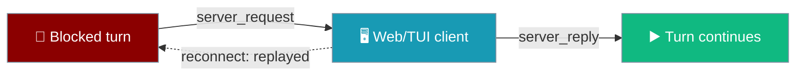
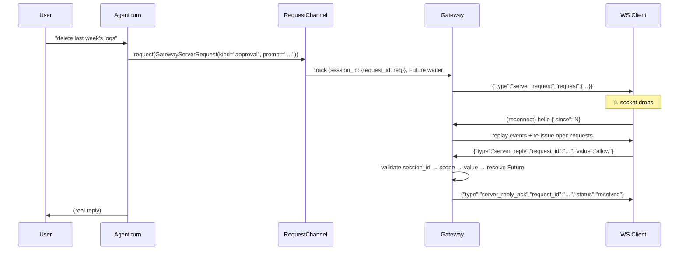

A blocked HITL turn asks any connected gateway client for an approval, a choice, or free-text input — and the request survives every reconnect until the client answers or the turn times out.



<Note>
The gateway ships in the `praisonai-bot` package. `praisonai serve gateway` works exactly as documented here; for a standalone install see [praisonai-bot Migration](/guides/praisonai-bot-migration). No operator action is required to opt in beyond running the gateway.
</Note>

## Quick Start

<Steps>

<Step title="Run an agent that blocks on approval">

An agent that already elicits approval gets this path automatically once a running gateway binds the request channel — no extra flags.

```python
from praisonaiagents import Agent

agent = Agent(name="assistant", instructions="Ask before deleting anything.", approval=True)
# When this agent turn runs under a running gateway and blocks on approval,
# the connected client sees an approval prompt automatically.
agent.start("Clean up old logs.")
```

</Step>

<Step title="Handle the frame from a client">

The client receives a `server_request` when a turn blocks and posts back a `server_reply` with the answer.

```python
import json

async def on_frame(raw, ws):
    msg = json.loads(raw)
    if msg["type"] == "server_request":
        req = msg["request"]
        # render req["prompt"] (and req["options"] for a "choice")
        await ws.send(json.dumps({
            "type": "server_reply",
            "request_id": req["request_id"],
            "value": "allow",
        }))
```

</Step>

<Step title="Survive a reconnect">

Restart the client mid-prompt. On the next `hello` (or legacy `join`), the gateway re-issues every still-open request after replaying events, so the prompt re-renders on the new socket.

```python
async def on_frame(raw, ws):
    msg = json.loads(raw)
    if msg["type"] == "server_request":
        render(msg["request"])          # idempotent — keyed on request_id
    elif msg["type"] == "server_reply_ack":
        clear(msg["request_id"])        # {"status": "resolved" | "unknown_request"}
```

</Step>

<Step title="Timeout fallback">

A request defaults to a `120.0s` timeout. On timeout the waiting turn receives `None`, the open request is cleared, and the elicitation code decides the fallback — typically deny/default.

```python
reply = await channel.request(req, timeout_s=120.0)
if reply is None:
    decision = "deny"   # timeout → treat as a decline path
```

</Step>

</Steps>

---

## How It Works

A turn blocks, the gateway tracks the open request, delivers a frame, and resolves the waiting future when the correlated reply arrives — even across a mid-prompt reconnect.



The core reaches the channel through a task-local slot: `get_request_channel()` returns the bound implementation (or `None` in CLI/one-shot, falling back to the existing elicitation path). The gateway registers the channel with `register_request_channel(...)` at the start of a turn and restores the previous slot with `clear_request_channel(token)` — the same pattern as the outbound messenger and conversation requester.

---

## Wire Frames

Copy these frames verbatim — integrators code straight against them.

**Server → client** — delivered when a turn blocks, and re-issued on reconnect:

```json
{"type": "server_request",
 "request": {
   "request_id": "req-1",
   "kind": "approval",
   "prompt": "Deploy to prod?",
   "options": ["prod-eu", "prod-us"],
   "session_id": "sess-…"
 }}
```

`kind` is one of `"approval"`, `"choice"`, `"input"`. `options` is present only when `kind == "choice"`.

**Client → server** — the correlated answer:

```json
{"type": "server_reply", "request_id": "req-1", "value": "allow"}
```

**Server → client** — correlation ack (always sent; never leaks another session's request kind):

```json
{"type": "server_reply_ack", "request_id": "req-1", "status": "resolved"}
{"type": "server_reply_ack", "request_id": "req-1", "status": "unknown_request"}
```

An `unknown_request` ack is a safe no-op: an unknown or already-answered id acks without leaking state.

**Server → client** — structured error frames, each carrying a `code`:

```json
{"type": "error", "code": "session_mismatch",   "message": "server_reply for a request not owned by this session"}
{"type": "error", "code": "insufficient_scope", "message": "insufficient scope", "required_scope": "approvals"}
{"type": "error", "code": "invalid_value",      "message": "server_reply value not permitted for this request"}
```

---

## Request Kinds and Value Contract

Three request kinds map to three value contracts, validated at the handler.

| `kind` | Meaning |
|---|---|
| `approval` | Allow or deny a blocked action |
| `choice` | Pick one of the offered `options` |
| `input` | Provide free-text input |

| `kind` | Accepted `value` |
|---|---|
| `approval` | exactly `"allow"` or `"deny"` |
| `choice` | one of `options` (any string when `options` is absent) |
| `input` | any string |

An unrelated value is rejected with `{"code": "invalid_value"}` and the request stays open.

---

## Reconnect Replay

Still-open requests are re-issued whenever a client resumes, which is the whole reason this channel exists.

Replay runs at the end of **both** the `hello` (protocol v2+ resume with `since`) and legacy `join` handlers, right after event replay. Only entries still present in the session's open-request set are re-sent, so an already-answered or timed-out request is never re-issued. The `join` path also rebinds the session's preferred delivery target (`session._client_id = client_id`) so the joining client actually receives the next `server_request` — without this rebind, a new request after `join` would be routed to the stale client. This puts `join` on parity with `hello` for this feature.

---

## Security Model

<Note>
Every `server_reply` passes three checks, in order: **ownership → scope → value**.
</Note>

### Session ownership

Only a client bound to the request's own `session_id` may answer it. A WRITE client in another session that guesses a `request_id` is rejected with `{"code": "session_mismatch"}` — the victim turn stays open.

### Scopes

`server_reply` classifies as `write` in the central registry. The handler **escalates to `approvals` when the request's `kind == "approval"`** (parity with `approvals.resolve`). Choice and input still require `write`. A WRITE-only client can answer choice/input but gets `{"code": "insufficient_scope", "required_scope": "approvals"}` for an approval. See [Gateway Operator Scopes](/features/gateway-operator-scopes).

### Value contract

The reply value is enforced per the table above; an invalid value is rejected with `{"code": "invalid_value"}` and the request stays open.

---

## Timeout

`request()` defaults to a `timeout_s` of `120.0`. On timeout it returns `None` and clears the open-request entry, so a later reconnect does **not** re-issue a timed-out prompt. The blocked turn's elicitation code interprets `None` as its fallback — typically deny/default.

---

## Backward Compatibility

Unbound (CLI / one-shot) behaviour is unchanged — `get_request_channel()` returns `None` and existing elicitation paths run as before. The `praisonai-bot` import of the two core shapes is guarded, so it keeps working against an older core. There is no new user-authored surface, no new `Agent` parameter, and no new dependency.

---

## Building a Client

The minimum a client needs: receive a `server_request`, render the prompt, post back a `server_reply`, and clear on the ack — keyed idempotently on `request_id`.

<Tabs>

<Tab title="Python">

```python
import asyncio, json
import websockets

async def client(url):
    async with websockets.connect(url) as ws:
        async for raw in ws:
            msg = json.loads(raw)
            if msg["type"] == "server_request":
                req = msg["request"]
                # render idempotently, keyed on req["request_id"]
                if req["kind"] == "approval":
                    value = "allow"            # or "deny"
                elif req["kind"] == "choice":
                    value = req["options"][0]  # one of the offered options
                else:
                    value = "some text"        # input
                await ws.send(json.dumps({
                    "type": "server_reply",
                    "request_id": req["request_id"],
                    "value": value,
                }))
            elif msg["type"] == "server_reply_ack":
                # {"status": "resolved"} or {"status": "unknown_request"}
                pass

asyncio.run(client("ws://localhost:8765/ws"))
```

</Tab>

<Tab title="JavaScript">

```javascript
const ws = new WebSocket("ws://localhost:8765/ws");

ws.onmessage = (event) => {
  const msg = JSON.parse(event.data);
  if (msg.type === "server_request") {
    const req = msg.request;
    // render idempotently, keyed on req.request_id
    let value;
    if (req.kind === "approval") value = "allow";        // or "deny"
    else if (req.kind === "choice") value = req.options[0];
    else value = "some text";                            // input
    ws.send(JSON.stringify({
      type: "server_reply",
      request_id: req.request_id,
      value,
    }));
  } else if (msg.type === "server_reply_ack") {
    // msg.status is "resolved" or "unknown_request"
  }
};
```

</Tab>

</Tabs>

---

## Best Practices

<AccordionGroup>

<Accordion title="Set a sensible timeout_s">
The default `120s` is safe for a human-in-the-loop web UI. Interactive shells that expect a fast answer may want a shorter timeout so a blocked turn does not sit idle.
</Accordion>

<Accordion title="Re-render on server_request at any time">
A reconnect can re-issue a prompt the user has already seen. Render idempotently, keyed on `request_id`, so a replayed request updates the existing prompt instead of duplicating it.
</Accordion>

<Accordion title="Grant APPROVALS to any role that answers approvals">
A WRITE-only client can answer choice and input but gets `insufficient_scope` for approval prompts. Size tokens so any role that resolves approvals over the transport holds the `approvals` scope.
</Accordion>

<Accordion title="Never guess a request_id">
The ownership check rejects cross-session replies with `session_mismatch`. Treat an `unknown_request` ack as a signal that client state has drifted, not as a retry cue.
</Accordion>

<Accordion title="Interpret None from request() as a decline path">
The timeout returns `None` and clears the request. Do not retry the same `request_id` after that — start a fresh turn if the action is still needed.
</Accordion>

</AccordionGroup>

---

## Related

<CardGroup cols={2}>

<Card title="Gateway Session Continuity" icon="arrows-rotate" href="/features/gateway-session-continuity">
How event replay and this open-request replay compose on `hello` / `join`.
</Card>

<Card title="Gateway Frame Codec" icon="shield-check" href="/features/gateway-frame-codec">
The inbound frame codec that decodes `server_reply`.
</Card>

<Card title="Approval Protocol" icon="shield-check" href="/features/approval-protocol">
The elicitation surface the blocked turn calls into.
</Card>

<Card title="Gateway Operator Scopes" icon="key" href="/features/gateway-operator-scopes">
Where `server_reply` sits in the scope table, and the approval escalation.
</Card>

<Card title="Interactive Approval" icon="terminal" href="/features/interactive-approval">
The terminal-side sibling capability.
</Card>

<Card title="Gateway Scoped Approvals" icon="user-lock" href="/features/gateway-scoped-approvals">
Durable allow-always grants that compose with an approval-kind reply.
</Card>

</CardGroup>
