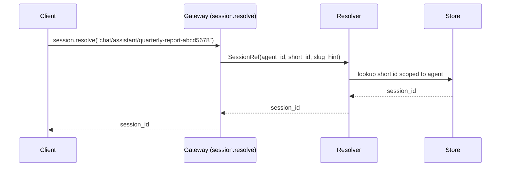
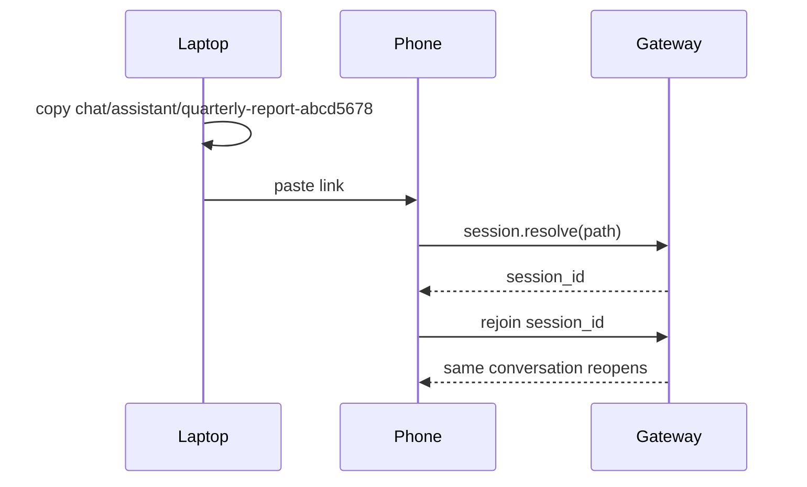
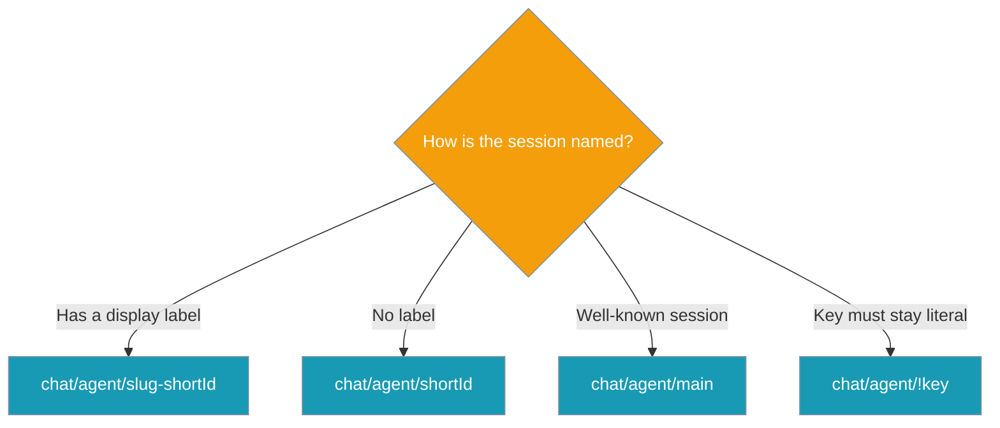

Every Gateway session gets a stable, shareable address like `chat/<agentId>/<slug>-<shortId>` so a link works across reconnects and never leaks the raw UUID.



```mermaid
graph LR
    Key[🔑 session key] --> Build[🔧 build_session_path]
    Build --> URL[🔗 shareable URL]
    URL --> Parse[🧩 parse_session_path]
    Parse --> Ref[📇 SessionRef]
    Ref --> Resolver[🔍 resolver]
    Resolver --> Id[✅ session id]

    classDef input fill:#8B0000,stroke:#7C90A0,color:#fff
    classDef process fill:#189AB4,stroke:#7C90A0,color:#fff
    classDef config fill:#6366F1,stroke:#7C90A0,color:#fff
    classDef output fill:#10B981,stroke:#7C90A0,color:#fff

    class Key input
    class Build,Parse,Resolver process
    class URL,Ref config
    class Id output
```

## Quick Start

<Steps>
<Step title="Build a shareable URL">
Turn a runtime session key into a stable URL segment.

```python
from praisonaiagents import Agent
from praisonaiagents.gateway import build_session_path

agent = Agent(name="assistant", instructions="Be helpful.")
agent.start("Kick off a session")

url = build_session_path(
    agent_id="assistant",
    session_key="agent:assistant:a3f9c2e1-7b04-4c8e-9f21-1234abcd5678",
    display_name="Quarterly report",
)
# -> "chat/assistant/quarterly-report-abcd5678"
```
</Step>

<Step title="Parse a path back into a SessionRef">
Recover the reference a resolver looks up.

```python
from praisonaiagents.gateway import parse_session_path

ref = parse_session_path("chat/assistant/quarterly-report-abcd5678")
# SessionRef(agent_id="assistant", short_id="abcd5678", slug_hint="quarterly-report")
```
</Step>
</Steps>

---

## How It Works

A client sends a friendly path; the gateway's `session.resolve` maps it back to a concrete session id.



| URL segment | `SessionRef` field | What the resolver uses |
|---|---|---|
| `<agentId>` | `agent_id` | Scopes the lookup — short ids only unique per agent |
| `<shortId>` | `short_id` | Primary key the resolver matches against |
| `<slug>` | `slug_hint` | Human label hint; also carries a reserved-name sentinel |
| `!<key>` | `literal_key` | Exact key from the escape hatch |

---

## User interaction flow

A user copies a chat URL from their laptop and pastes it on their phone. The mobile client calls `session.resolve` with the friendly path; the gateway returns the concrete session id and the same conversation reopens — no raw UUID ever changed hands.



---

## The four addressing forms

Pick the form that matches how much the URL should reveal.



| Form | When it appears |
|---|---|
| `chat/<agent>/<slug>-<shortId>` | Default — a session with a display name |
| `chat/<agent>/<shortId>` | No display name to slug |
| `chat/<agent>/main` (`global` / `default` / `root`) | Reserved sentinel — a well-known named session |
| `chat/<agent>/!<percent-encoded-key>` | Literal-key escape hatch for file-like keys |

---

## Configuration Options

These are pure functions and constants — no config class.

| Function / field | Parameter | Type | Default | Description |
|---|---|---|---|---|
| `build_session_path` | `agent_id` | `str` | — | Agent id (scopes short-id uniqueness) |
| `build_session_path` | `session_key` | `str` | — | Opaque runtime key (usually contains a UUID tail) |
| `build_session_path` | `display_name` | `Optional[str]` | `None` | Human label used to derive the slug |
| `build_session_path` | `namespace` | `str` | `"chat"` | Leading namespace segment |
| `slugify` | `display_name` | `Optional[str]` | — | Human label to slugify |
| `slugify` | `max_len` | `int` | `48` | Max slug length before truncation |
| `derive_short_id` | `session_key` | `str` | — | Key whose terminating hex run is shortened |
| `parse_session_path` | `path` | `str` | — | Path to parse into a `SessionRef` |
| `SessionRef` | `agent_id` | `str` | — | Scopes short-id lookup |
| `SessionRef` | `short_id` | `Optional[str]` | `None` | Short id the resolver looks up |
| `SessionRef` | `slug_hint` | `Optional[str]` | `None` | Slug/label hint; also carries a reserved-name sentinel |
| `SessionRef` | `literal_key` | `Optional[str]` | `None` | Exact key from the `!`-escape hatch |
| constant | `SHORT_ID_LEN` | `int` | `8` | Length of derived short ids |
| constant | `RESERVED_NAMES` | `frozenset[str]` | `{"main","global","default","root"}` | Sentinel final segments |

All seven symbols import from one place:

```python
from praisonaiagents.gateway import (
    SessionRef,
    build_session_path,
    parse_session_path,
    derive_short_id,
    slugify,
    RESERVED_NAMES,
    SHORT_ID_LEN,
)
```

---

## Common Patterns

**Dashboard deep-link** — build a shareable URL from an agent plus its session key.

```python
from praisonaiagents.gateway import build_session_path

link = build_session_path(
    agent_id="assistant",
    session_key="agent:assistant:a3f9c2e1-7b04-4c8e-9f21-1234abcd5678",
    display_name="Quarterly report",
)
# -> "chat/assistant/quarterly-report-abcd5678"
```

**Cross-device reconnect** — parse an incoming path, then ask the gateway to resolve it.

```python
from praisonaiagents.gateway import parse_session_path

ref = parse_session_path("chat/assistant/quarterly-report-abcd5678")
# Hand ref to session.resolve; the concrete resolver handler is a wrapper follow-up.
```

**File-like key round-trip** — keys that look like assets survive losslessly via the escape hatch.

```python
from praisonaiagents.gateway import build_session_path, parse_session_path

path = build_session_path("bot", "report.js")
# -> "chat/bot/!report.js"
ref = parse_session_path(path)
# SessionRef(agent_id="bot", literal_key="report.js")
```

---

## Best Practices

<AccordionGroup>
<Accordion title="Prefer short-id + slug over the literal escape hatch">
The `!<key>` form exposes the whole key in the URL. Let `build_session_path` derive a short id whenever the key has a UUID tail so the raw key stays hidden.
</Accordion>

<Accordion title="Keep short ids per-agent">
Short ids only need to be unique within one agent's namespace — `agent_id` scopes the lookup, and a resolver disambiguates the rare clash.
</Accordion>

<Accordion title="Treat main / global / default / root as named sessions">
Reserved sentinels are friendly named sessions, not short-id lookups. A resolver maps them to a well-known session such as the agent's `main` conversation.
</Accordion>

<Accordion title="Never rebuild an agent_id by concatenation">
Always percent-escape via `build_session_path` and let `parse_session_path` decode. An id containing `/` (e.g. `team/assistant`) round-trips correctly only when it goes through the grammar.
</Accordion>
</AccordionGroup>

<Note>
This ships the pure grammar plus the `session.resolve` method contract (scope: `read`). The concrete store-backed resolver, the `praisonai gateway session resolve/url` CLI, and dashboard URL building are wrapper follow-ups — not part of this change.
</Note>

---

## Related

<CardGroup cols={2}>
<Card title="Session Portability" icon="download" href="/features/gateway-session-portability">
  Back up, migrate, and restore gateway sessions
</Card>
<Card title="Session Sharing" icon="users" href="/features/gateway-session-sharing">
  Multi-observer read-only and co-driven sessions
</Card>
<Card title="Operator Scopes" icon="shield-check" href="/features/gateway-operator-scopes">
  Least-privilege RBAC — where `session.resolve` sits
</Card>
<Card title="Session Protocol" icon="messages" href="/features/session-protocol">
  The pluggable store contract behind sessions
</Card>
</CardGroup>
