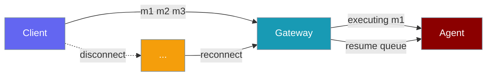
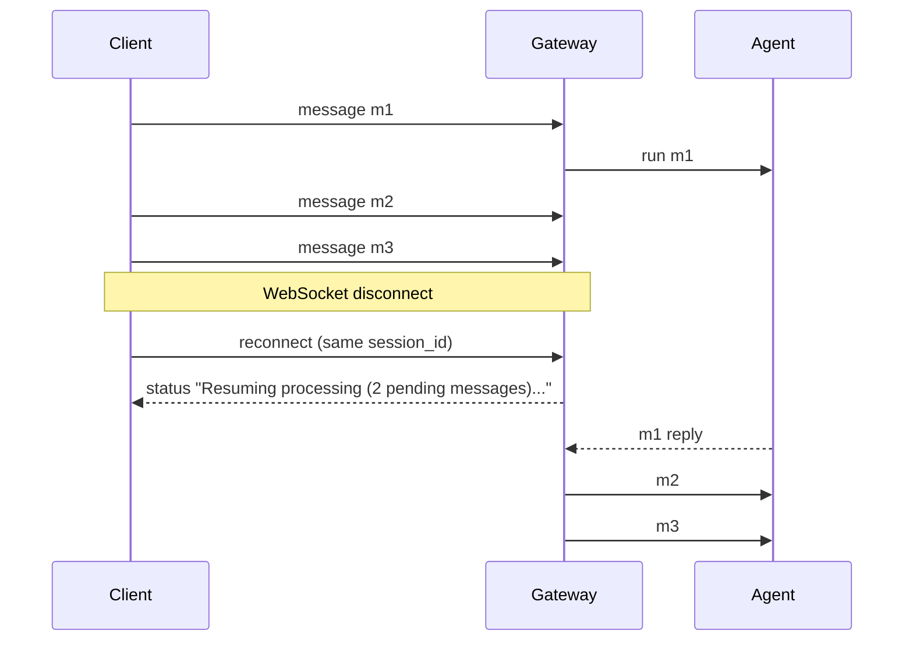

Gateway sessions preserve pending messages and in-flight executions across disconnects, restarts, and graceful shutdowns.



## Quick Start

<Steps>

<Step title="Start gateway with an agent">

```python
from praisonaiagents import Agent

agent = Agent(
    name="assistant",
    instructions="Answer user messages in order.",
)
```

```bash
praisonai gateway start --config gateway.yaml
```

</Step>

<Step title="Graceful shutdown with drain">

```python
import asyncio
from praisonai.gateway.server import WebSocketGateway

async def shutdown_gateway(gateway: WebSocketGateway):
    await gateway.stop(drain_timeout=10.0)  # wait up to 10 s for in-flight turns

asyncio.run(shutdown_gateway(gateway))
```

</Step>

</Steps>

---

## How It Works



When a client reconnects, the gateway checks whether the session has queued inbox messages or an in-flight execution. If so, it sends a `status` frame, marks the session as executing **before** spawning the queue task (preventing duplicate workers), and processes pending messages in FIFO order.

---

## Graceful Drain on Shutdown

`WebSocketGateway.stop()` calls `_drain_active_sessions` before closing WebSocket clients. The gateway waits up to `drain_timeout` seconds (default **10.0**) for sessions that are executing or have a non-empty inbox.

| Phase | Behaviour |
|-------|-----------|
| **Within timeout** | Sessions that finish are persisted via the configured session store |
| **After timeout** | Remaining sessions are force-persisted with pending work; a `SESSION_END` event is emitted |

Force-closed `SESSION_END` payload:

```json
{
  "session_id": "...",
  "reason": "Force-closed during shutdown after timeout",
  "had_pending_work": true,
  "was_executing": true
}
```

Configure a `_session_store` so drained sessions survive restarts. Without one, force-closed sessions are only logged.

---

## Reconnect and Auto-Resume

On resume, clients receive:

```json
{
  "type": "status",
  "message": "Resuming processing (2 pending messages)..."
}
```

The gateway sets `mark_executing(True)` before launching `asyncio.create_task(_run_session_queue(...))`, so a race between reconnect and shutdown cannot spawn duplicate queue processors.

---

## Persisted Shape

Gateway session snapshots now include pending work:

```json
{
  "session_id": "...",
  "messages": [],
  "events": [],
  "event_cursor": 42,
  "pending_inbox": ["queued message 1", "queued message 2"],
  "is_executing": true
}
```

The inbox is snapshotted non-destructively: items are drained into a list and put back so live processing is unaffected.

---

## Configuration

| Option | Type | Default | Description |
|--------|------|---------|-------------|
| `drain_timeout` | `float` | `10.0` | Seconds to wait for in-flight sessions during `WebSocketGateway.stop()` before force-persisting |

---

## Common Patterns

<Tabs>
<Tab title="Reconnect with resume">

```python
import asyncio
import json
import websockets

async def reconnect(session_id: str, since: int):
    async with websockets.connect("ws://127.0.0.1:8765") as ws:
        await ws.send(json.dumps({
            "type": "join",
            "agent_id": "assistant",
            "session_id": session_id,
            "since": since,
        }))
        msg = json.loads(await ws.recv())
        if msg.get("type") == "status":
            print(msg["message"])

asyncio.run(reconnect("your-session-id", 0))
```

</Tab>
<Tab title="Graceful drain on shutdown">

```python
import asyncio
from praisonai.gateway.server import WebSocketGateway

async def main():
    gateway = WebSocketGateway(port=8765)
    await gateway.start()
    await gateway.stop(drain_timeout=30.0)

asyncio.run(main())
```

</Tab>
</Tabs>

---

## Best Practices

<AccordionGroup>

<Accordion title="Tune drain_timeout for redeploys">
Set `drain_timeout` to at least your longest expected agent turn so clean shutdowns finish naturally before force-persist.
</Accordion>

<Accordion title="Configure a session store">
Without persistence, drained sessions cannot be resumed after restart — only logged.
</Accordion>

<Accordion title="Monitor SESSION_END events">
Listen for `had_pending_work: true` or `was_executing: true` in audit or observability hooks to detect force-closed sessions.
</Accordion>

<Accordion title="Test reconnect under load">
Send messages faster than the agent processes them, then drop the WebSocket — pending messages should resume in order on reconnect.
</Accordion>

</AccordionGroup>

---

## Related

<CardGroup cols={2}>
  <Card title="Gateway" icon="tower-broadcast" href="/docs/features/gateway">
    WebSocket control plane overview
  </Card>
  <Card title="Session Persistence" icon="database" href="/docs/features/gateway-session-persistence">
    Persistent sessions and event replay
  </Card>
  <Card title="Error Handling" icon="shield-check" href="/docs/features/gateway-error-handling">
    Reconnect and error recovery
  </Card>
  <Card title="Session Protocol" icon="messages" href="/docs/features/session-protocol">
    Session message format
  </Card>
</CardGroup>
